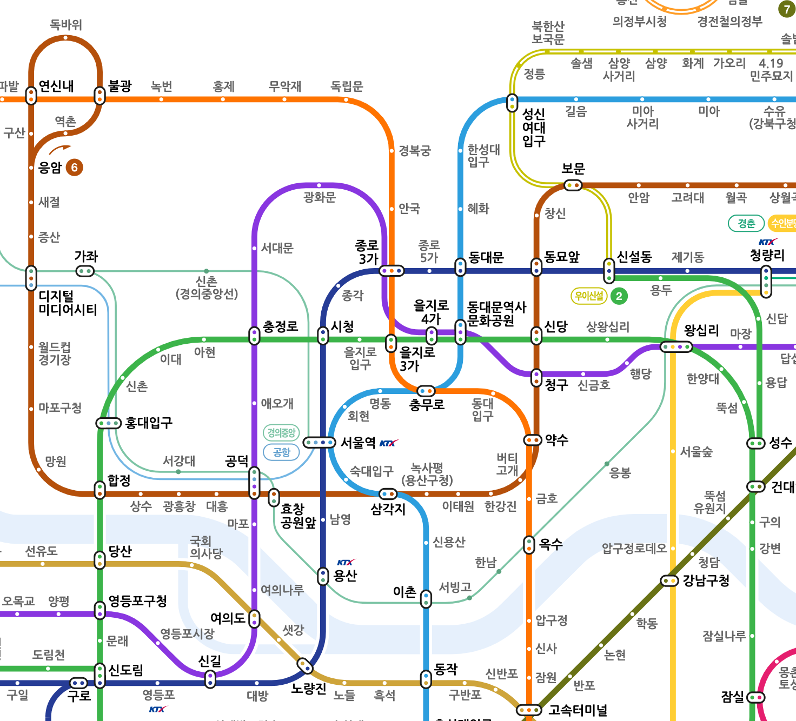

# Abstraction

## 정의

어떤 양상, 세부사항, 구조를 좀 더 명확하게 이해하기 위해 특정 절차나 물체를 의도적으로 생략하거나 감춤으로써 **핵심만 표현하는 행위**를 말한다.

## 방식

**단순화**: 불필요한 세부사항을 버린다.

단, 불필요한 세부사항은 현재의 "**목적**"에 따라 다르게 정의된다.

## 지하철 노선도를 추상화해보자

일반적인 지하철 승객을 위한, 1908년 출판된 첫 번째 런던 지하철 노선도다:


위의 런던 지하철 노선도는 실제 역의 위치와 척도, 지형 정보를 기반으로 사실적으로 묘사되었다. 이 노선도가 꽤 괜찮아보일 수도 있다. 하지만 지하철 노선도의 **목적**을 생각해보자. 지하철 승객를 위한 노선도의 목적은 '쉽게 지하철의 동선을 파악하기 위함'일 것이다. 목적을 달성하는데 위치와 척도가 반드시 필요한가? 지형 정보는? 언뜻 보면 필요한 요소 같지만, 목적에만 집중하면 불필요한 세부사항으로 볼 수도 있다.

- 지하철 노선도의 목적은 무엇인가?
    - 쉽게 지하철의 동선을 파악하기 위함
- 노선도에서 꼭 필요한 정보는 무엇인가?
    - 역 이름
    - 역 사이의 관계

이제 2021년의 서울 지하철 노선도를 보자:



불필요한 정보를 최대한 배제하고 역과 역의 관계를 위주로 표현하고 있다. 일반 승객 관점에서 좋은 추상화가 되었다고 볼 수 있다.

다시 한번 리뷰하자. Abstraction이란 **목적에 맞게** 자신이 원하는 특성만 취하고 필요없는 부분을 제외하여 **핵심만 표현**하는 행위를 말한다.

## DIP (Dependency Inversion Principle)

DIP의 정의는 다음과 같다:

1. High level 모듈은 low level 모듈에 의존해서는 안된다. 둘 다 추상화에 의존해야 한다.
2. 추상화는 세부사항에 의존해서는 안된다. 세부사항이 추상화에 의존해야 한다.

DIP는 결합도를 낮추는 것이 핵심이다. 예제로 알아보자.


```python
# low-level component
class XMLHttpService(XMLHttpRequestService):
    pass

# high-level component
class Http:
    def __init__(self, xml_http_service: XMLHttpService):
        self.xml_http_service = xml_http_service

    def get(self, url: str, options: Dict):
        self.xml_http_service.request(url, "GET")

    def post(self, url: str, options: Dict):
        self.xml_http_service.request(url, "POST")
```

- 이 디자인은 DIP의 1번 특징을 위반한다. high-level 모듈이 low-level 모듈에 의존하고 있기 때문이다.
- 위의 코드는 Http 연결 서비스(low level module)를 다른 구현으로 변경하기 어렵다.

`XMLHttpService` 클래스라는 세부사항 대신 추상화에 의존하도록 코드를 변경해보자.

목적에 맞게 적절한 추상화를 생각하자. 여기서는 다음과 같이 추상화하겠다.

```python
# abstraction
class AbstractRequest(Protocol):
    def request(self, url: str, options: Dict):
        ...
```

이제 DIP를 활용해보자. High level 모듈과 low level 모듈 모두 추상화에 의존하도록 코드를 변경한다:

```python
class Http:
    def __init__(self, request: AbstractRequest):
        self.http_service = request

    def get(self, url: str, options: Dict):
        self.http_service.request(url, "GET")

    def post(self, url, options: Dict):
        self.http_service.request(url, "POST")

"""
이제 Http connection service 의 타입에 관계없이 쉽게 네트워크에 연결할 수 있다.
XMLHttpService 클래스를 Connection 인터페이스 기반으로 다시 구현해보자.
"""

class XMLHttpService(AbstractRequest):
    xhr = XMLHttpRequest()

    def request(self, url: str, options: Dict):
        self.xhr.open()
        self.xhr.send()

class NodeHttpService(AbstractRequest):
    def request(self, url: str, options: Dict):
        # 다양한 구현 1

class MockHttpService(AbstractRequest):
    def request(self, url: str, options: Dict):
        # 다양한 구현 2
```