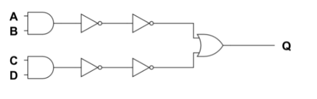
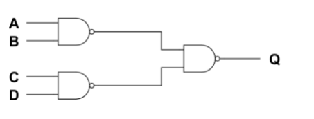

# 전자 회로의 조합 논리

## 머리말
우리는 1장에서 컴퓨터가 비트라고 부르는 2진 상자를 내부 언어로 사용한다는 사실을 배웠다. 
2장에서는 비트를 사용하지 않는 **초기 계산 장치**를 살펴봄으로써 왜 비트가 오늘날 사용하는 기술에 어울리는지를 배울것이다. 

조합논리(불리언 대수)를 구현하는 하드웨어에 대해 알아본다.

## 디지털 컴퓨터의 사례

톱니바퀴를 사용
- 안티키테라 : 천문학계산에 사용됨(기원전 100년경)
- 화기 제어 컴퓨터 : 삼각함수와 미적분 계상(2차 세계대전)

톱니바퀴 사용x = 기계식 컴퓨터
- 계산자 : 로그를 응용한 계산(1600년대)

### 아날로그와 디지털의 차이
아날로그 : 연속적인것 
    연속 : 체중, 거리, 시간과 같은 변수를 원칙적으로 무한히 작은 단위로 측정이 가능하며 모든 실수값을 취할 수 있다. 수치사이에 틈이 없다. 
    ex) 부채비율, 시장 점유율, 무게, 온도, 부피 

아날로그컴퓨터 특징 : 연속적인물리량, 온도, 전류, 전압, 증폭회로(그래프), **정밀도 낮음, 연산속도 빠름**

디지털 : 이산적인것 
    이산: 변수가 취할 수 없는 값의 수가 유한한 경우. 정수로 표시된 것 
    ex) 특정가구의 자녀의 수, 일정기간 동안 교통사고 발생건수 

디지컬컴퓨터 특징 : 순자문자, 논리회로 사칙연산, **정밀도 높음, 프로그램 필요, 연속속도 느림**

### 아날로그 세계에서 디지털 만들기
전이 함수 : 상태와 상태 사이의 천이로 표현되는 이산시스템에서 상태값의 천이를 정의하는 함수.

기본적으로 우리의 세계는 아날로그 신호로 존재하는데 이 **아날로그 신호는 외부노이즈, 처리 속도, 대역폭 제한, 보관 등 여러 문제가 있다**.  따라서 이런 문제를 해결하고자 디지털 신호처리를 사용한다.  현대에 들어서 수많은 디지털 신호가 존재한다.  이 신호는 곧 정보이다.  수많은 정보 중에 내가 필요로하는 정보를 얻기 위해 **우리는 유용한 정보를 추출, 강화, 저장, 전달하기 위해 디지털신호처리**를 사용한다.

### 10진 숫자 대신 비트를 사용하는 이유
컴퓨터는 **손가락**이 없다! 
비트를 사용하면 **효율**이 좋다. 
-> 손가락을 비트 표현하는 것으로 사용하면 1000개가 넘는 숫자를 셀수있다.  

## 전기 이론 가이드
- 도체 : 금속과 같이 비저항이 작아 전기가 잘통하는 물질
- 부도체(절연체) : 비저항이 커서 전기가 잘 통하지 않는 물질 but 부도체의 온도가 높아지면 전기저항이 감소  **왜 why 원자에서 전자들이 분리되기 때문에 이동이 자유로워진다.**
- 반도체 : 전류가 잘 흐르는 정도가 도체와 부도체의 중간정도인 물질

전기는 능동적으로 움직이기 않기 때문에 **압력(전압(voltage))**의 의해  움직임  
-> 전압의 측정 단위 : 볼트(V)  
전기 흐름의 양 : 전류(currnet = I) 
-> 단위 : 암페어(A)  
도체의 크기가 작으면 전압이 쌔도 전류는 적게 가는 것과 같이 전기의 양을 제어하는 것을 **저항(Resistance = R)**이라고한다. 
-> 단위 : 옴(Ω) 

#### 옴의 법칙
I = V/R 
= 전기회로에 흐르는 전류는 전압에 비례하고, 저항에 반비례한다.

### 정리
 

 

 - 전기회로 : 전원과 부하 및 전휴가 흐르는 통로인 도선(전원에서 출발하여 다시 전원으로 돌와오게 구성해야함)
 - 전원 : 기전력을 가지고 있어 전류를 흘리는 원동력이 되는 것. ex)전지
 - 부하 : 전원에서 전기를 공급받아 어떤 일을 하는 기계나 기구. ex) 전구

- 전류 : 전자의 이동(흐름) 기호는 I, 단위는 [A]
- 전압 : 회로 내에 전류가 흐르기 위해서 필요한 전기적인 압력 기호는 V, 단위는 볼트[V]
- 저항 : 전기회로에 전류가 흐를 때 전류의 흐름을 방해하는 작용. 기호는 R, 단위는 옴[Ω]

- 직렬접속 : 각각의 저항을 일렬로 접속하는 것
- 병렬접속 : 2개 이상의 저항의 양 끝을 각각 한곳에서 접속하는  접속법
- 직병렬접속 : 직렬접속과 병렬접속을 조합한 것

- 스위치 : 전류의 흐름 유/무를 제어해주는 장치

## 비트를 처리하기 위한 하드웨어
비트를 처리하는 하드웨어 역사적 순서대로 나열 
뒤로 갈수록 **회로는 더 작아지고 더 저렴해지고 에러지를 더 효율적으로 사용함**

### 릴레이
 

ON, OFF가 있는 '스위치'인데 **자동**임 
릴레이는 내부에 '전자석'(코일)을 포함하고 있다. 이 **전자석은 전류가 통하게되면 자석이 되는 성질**을 가지고 있다. 
때문에 전원을 공급하게되면 릴레이 내부에 전자석이 자석이되어 옆에 있던 철편을 끌어당겨 스위치가 ON이 되는 것이다. 

### 진공관
높은 진공 속에서 금속을 가열할 때 방출되는 전자를 전기장으로 제어하여 정류, 증폭 등의 특성을 얻을 수 있는 유리관

### 트랜지스터
규소나 게르마늄으로 만들어진 p형 반도체와 n형 반도체를 세겹으로 접합하여 만든 전회로 구성요소. 
**신호를 증폭이나 변환시켜 전기에너지를 변환**시키는 농동소자

### 집적 회로
특정 기능을 수행하는 전기 회로와 반도체 소자를 하나의 칩으로 모아 구성한 것 
기존 트랜지스터를 사용하는 것보다 **비용 및 크기가 감소**하였다.

## 논리 게이트
**불 대수(AND, OR, NOT, XOR 등)를 물리적 장치에 구현한 것**

 

위 표에서 **NOT논리**가 중요하다. 
NOT논리에서 동그라미는 **거짓**을 의미하고 세모는 **버퍼**를 의미한다. 버퍼는 단지 입력을 출력으로 전달만 한다. 

NOT논리는 동그라미와 세모가 같이 있으므로 다른 논리 게이트와 독립적으로 사용가능하다. 

현업에서 AND게이트, OR게이트보다 NAND게이트, NOR게이트가 더 많이 사용된다. 
**왜 WHY** 
NAND게이트와 NOR게이트는 NOT를 포함하고 있기 때문에 AND, OR게이트보다 표현범위가 넓고, 집적도가 높기 때문에 같은 공간에 많은 소자들을 설계할 수 있기 때문이다.

#### NAND게이트를 예시로 설명

NAND게이트는 AND게이트 출력부분에 NOT가 붙어있는 것과 동일하다.

드 모르간의 법칙에 의해 Q = (AB)' = A' + B'가 성립한다.
| A | B | (AB)' | A'+B' |
|---|---|-------|-------|
| 0 | 0 | 1     | 1     |
| 0 | 1 | 1     | 1     |
| 1 | 0 | 1     | 1     |
| 1 | 1 | 0     | 0     |

고로 위 NAND와 A' OR B'가 같다는 것을 알수있다.

이 원리를 이용하여 함수 Q를 NAND게이트로 변환해보겠습니다.

#### Q = AB + CD를 변환하는 과정

함수 Q를 AND게이트와 OR게이트로 구현하였다.

AND게이트 출력부분에 NOT게이트를 2개씩 추가하였다. NOT, NOT은 출력에 영향을 주지 않는다.

우측에 있던 NOT게이트를 출력단으로 이동시키면서 OR게이트가 AND게이트로 변환됨

그리고 AND게이트와 NOT게이트를 합쳐 NAND게이트로 바꿔주면 해당 함수를 NAND게이트로만 완성시켰다.

이로써 NAND만 있으면 OR, AND, NOT으로 표현할 수 있는 모든 논리를 표현가능하다는 것을 알 수 있다.

## 참고 문헌

[아날로그 신호와 디지털신호](https://wpaud16.tistory.com/5)

[전기회로](http://a24s.com/data/jeongbotongsinhakseub/jungi/jungi_2/jungi2-1.html)

[논리게이트](https://e-funny.tistory.com/11)
        

