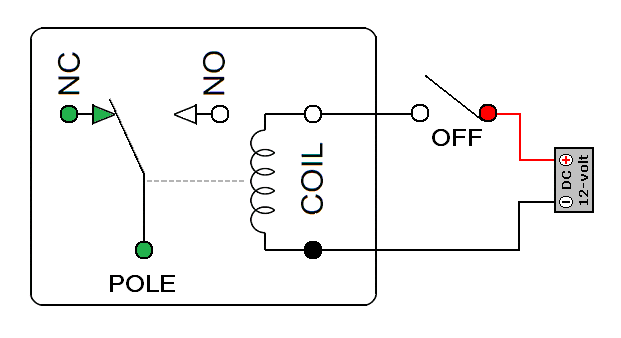

# 전자 회로의 조합 논리

## 들어가며

비트에 대해 논의한 내용은 추상적이다.

비트 연산 중 불리언 대수를 구현하는 하드웨어[^hardware]를 알아보자.

[^hardware]: 비트에 대해 동작하는 장치를 포함한 모든 물리적인 장치

## 아날로그와 디지털

아날로그와 디지털의 차이는 다음과 같다.

|          |  특징  |           뜻           |   예시    |
| :------- | :----: | :--------------------: | :-------: |
| 아날로그 | 연속적 | 실수를 표현할 수 있다. |  계산자   |
| 디지털   | 이산적 | 정수만 표현할 수 있다. | 사람의 손 |

다음은 계산자 사진예시 이고, 아날로그 계산의 정밀도 문제를 기술하겠다.

<center></center>

계산자를 보면 알 수 있듯이 눈금을 통해 `1.1`은 측정할 수 있되 `1.05`는 측정할 수 있을까?

이를 측정하려면 물리적으로 계산자를 키워야하며 현대사회에 비유하자면 이러한 계산자를 사용하는 컴퓨터를 키우기엔 비용이 어마어마하다. 

우리는 크기가 작고 비용도 적은 컴퓨터가 필요하다.

### 하드웨어 크기의 중요성

**컴퓨터에서 모든 것을 작게 만들면 더 높은 성능을 달성한다.**

이말은 CPU를 왕복하는데에 이동하는 전자의 속도는 물리적인 한계가 있어서 이 왕복 시간을 최소화하여 빠른 계산을 뽑아내는 것이다.

### 아날로그의 문제점

문제점은 *"물체가 너무 작아지면 서로 간섭하기 아주 쉬워진다." 「하이젠베르크*」의 원리이다.

즉, 계산자가 너무 작아지면 잡음이 많아져서 정확하게 값을 읽기 어려워진다. 
> 잡음의 예시로는 흔들림, 방사(ray), 원자의 운동이 해당된다.

이러한 잡음이 사람의 손(이산적 장치)에는 영향이 없다. 손가락으로 숫자를 세는 행위가 판정 기준이 되기 때문이다.

그러면, 계산자에도 판정 기준을 도입하면 어떻게 되나?

계산자가 특정 위치에서 멈추게하는 장치를 추가한다고 보면 되겠다.

### 아날로그를 디지털로

특정 위치를 얼만큼 세밀하게 기준잡느냐에 따라 아날로그 형태와 유사하겠지만, 그래도 손실은 존재한다.

<center></center>

이 작업을 하는 과정에서 2진수가 적합하다.

함수에서 판정 기준이 적기 때문이다. 판정 기준이 적을 수록 이를 구현한 하드웨어를 만드는 비용 또한 적어진다.

## 비트를 처리하기 위한 하드웨어

### 릴레이

릴레이는 자동으로 on/off 할 수 있게끔 해주는 전자부품이다.

릴레이는 내부에 전자석을 포함하고 있다. 전자석은 전기가 흘렀을 때 자성이 생긴다. 전기가 흐르지 않으면 자성도 사라지는데 이 성질을 이용한다.

릴레이의 장점은 NOT 연산을 포함한 완전한 불리언 연산을 사용할 수 있다. 
> NOT, OR, AND, XOR

이를 활용해, A회로의 출력을 B회로의 입력으로 구동하여 컴퓨터에 필요한 복잡한 논리를 만들 수 있다.

<center></center>

문제는 릴레이의 단점 중에 전자석의 전원을 갑자기 끄면 초고압이 발생한다는 사실과 이 현상이 일어나는 부분이 마모된다.

때문에 릴레이와 같은 일을 하지만 전자석이 들어 있지 않은 부품을 찾게 되었다.

### 진공관

진공관은 릴레이의 단점과 비슷하게 마모되는 현상은 해결하지 못했지만, 연산을 좌우하는 움직이는 부분이 없어 릴레이보다 훨씬 빠른 장점을 가진 전자부품이다.

### 트랜지스터

🙄 발전 역사 꼭 필요한가? 논리 게이트와 연결 짓는 부분만 추려낼 수 있는가?

## 논리 게이트

...

## (번외) 불리언 연산 코딩 문제 리뷰

1. 주어진 배열에서 빠진 요소 구하기

```javascript
// +++ my solution
var missingNumber = function(nums) {
  nums.sort((a, b) => a - b);    
  
  for(let i = 0; i < nums.length; i++){
      if(nums[i] !== i)
          return i;
  }    
  
  return nums.length;
};
```
위 코드는 정렬을 하는 비용이 든다. 

`XOR`는 이를 해결하는데, 이에 앞서 `XOR`의 성질을 알아보자.

`a ^ b ^ b = a` 처럼 동일한 숫자와 `XOR` 연산을 수행하면 동일한 숫자들이 제거되는데, 이를 활용한다.

```javascript
// +++ use xor solution
var missingNumber = function(nums) {    
  let xor = 0;
  
  for (let i = 0; i < nums.length; i++) {
    xor = xor ^ i ^ nums[i];
  }

  return xor ^ i;
};
```

<hr/>

## 참고 문헌

[계산자 사진자료](https://homoscience.kr/3372/) -- 과학하는 인간

[ADC 사진자료](http://itnovice1.blogspot.com/2019/09/blog-post_31.html) -- IT 내맘대로 끄적끄적

[릴레이 사진자료](https://blog.naver.com/PostView.nhn?isHttpsRedirect=true&blogId=roboholic84&logNo=220460268471&parentCategoryNo=7&categoryNo=&viewDate=&isShowPopularPosts=true&from=search) -- DIY 메카솔루션 오픈랩

[All about Bitwise Operations [Beginner-Intermediate]](https://leetcode.com/discuss/general-discussion/1073221/All-about-Bitwise-Operations-Beginner-Intermediate) -- Yashjain
