# 전자 회로의 조합 논리
- [전자 회로의 조합 논리](#전자-회로의-조합-논리)
  - [들어가며](#들어가며)
  - [아날로그와 디지털](#아날로그와-디지털)
    - [하드웨어 크기의 중요성](#하드웨어-크기의-중요성)
    - [아날로그의 문제점](#아날로그의-문제점)
    - [아날로그를 디지털로](#아날로그를-디지털로)
  - [조합 논리](#조합-논리)
  - [대표적인 조합 논리 회로](#대표적인-조합-논리-회로)
    - [반가산기와 전가산기](#반가산기와-전가산기)
    - [디코더와 인코더](#디코더와-인코더)
    - [멀티플렉서와 디멀티플렉서](#멀티플렉서와-디멀티플렉서)
  - [(번외) 비트 연산 코딩 문제 리뷰](#번외-비트-연산-코딩-문제-리뷰)
  - [참고 문헌](#참고-문헌)

## 들어가며

비트에 대해 논의한 내용은 추상적이다.

비트 연산을 구현하는 하드웨어[^hardware]를 알아보자.

[^hardware]: 비트에 대해 동작하는 장치를 포함한 모든 물리적인 장치

## 아날로그와 디지털

아날로그와 디지털의 차이는 다음과 같다.

|          |  특징  |           뜻           |   예시    |
| :------- | :----: | :--------------------: | :-------: |
| 아날로그 | 연속적 | 실수를 표현할 수 있다. |  계산자   |
| 디지털   | 이산적 | 정수만 표현할 수 있다. | 사람의 손 |

다음은 계산자 사진예시 이고, 아날로그 계산의 정밀도 문제를 기술하겠다.

  

계산자를 보면 알 수 있듯이 눈금을 통해 `1.1`은 측정할 수 있되 `1.05`는 측정할 수 있을까?

이를 측정하려면 물리적으로 계산자를 키워야하며 현대사회에 비유하자면 이러한 계산자를 사용하는 컴퓨터를 키우기엔 비용이 어마어마하다. 

우리는 크기가 작고 비용도 적은 컴퓨터가 필요하다.

### 하드웨어 크기의 중요성

**컴퓨터에서 모든 것을 작게 만들면 더 높은 성능을 달성한다.**

이말은 CPU를 왕복하는데에 이동하는 전자의 속도는 물리적인 한계가 있어서 이 왕복 시간을 최소화하여 빠른 계산을 뽑아내는 것이다.

### 아날로그의 문제점

문제점은 *"물체가 너무 작아지면 서로 간섭하기 아주 쉬워진다." 「하이젠베르크*」의 원리이다.

즉, 계산자가 너무 작아지면 잡음이 많아져서 정확하게 값을 읽기 어려워진다. 
> 잡음의 예시로는 흔들림, 방사(ray), 원자의 운동이 해당된다.

이러한 잡음이 사람의 손(이산적 장치)에는 영향이 없다. 손가락으로 숫자를 세는 행위가 판정 기준이 되기 때문이다.

그러면, 계산자에도 판정 기준을 도입하면 어떻게 되나?

계산자가 특정 위치에서 멈추게하는 장치를 추가한다고 보면 되겠다.

### 아날로그를 디지털로

특정 위치를 얼만큼 세밀하게 기준잡느냐에 따라 아날로그 형태와 유사하겠지만, 그래도 손실은 존재한다.

  

이 작업을 하는 과정에서 2진수가 적합하다.

함수에서 판정 기준이 적기 때문이다. 판정 기준이 적을 수록 이를 구현한 하드웨어를 만드는 비용 또한 적어진다.

## 조합 논리

조합 논리란, 특정 시점의 출력 값이 그 시점의 입력 값에 의해서만 결정되는 논리 이다. 

특징으로, 내부 상태가 없어서 입력만 보면 어떤 값이 나올지 알수 있다. 이를 보안한 논리인 순차 논리는 다음 주차때 알아보자.

조합 논리를 포함한 논리 연산을 수행하는 회로를 논리 게이트라고 한다.

여기서 `AND`와 `OR` 게이트보다 `NAND`와 `NOR` 게이트가 효율적이라고 한다.

그 이유는 `NAND` 또는 `NOR`만 있으면 `OR, AND, NOT`을 모두 표현할 수 있기 때문이고 `NAND`를 통해 이를 알아보자.

    NAND는 OR의 두 입력을 반전 시킨 것과 같다.

    NAND의 출력에 인버터를 연결하면 AND가 된다.

위 논리 게이트는 가독성을 위해 사용하였고, 증명은 아래 진리표를 확인해보자.

|   A   |   B   | (NOT A) OR (NOT B) | A NAND B | NOT(A AND B) |
| :---: | :---: | :----------------: | :------: | :----------: |
|   0   |   0   |         1          |    1     |      1       |
|   0   |   1   |         1          |    1     |      1       |
|   1   |   0   |         1          |    1     |      1       |
|   1   |   1   |         0          |    0     |      0       |

## 대표적인 조합 논리 회로

해당 목차를 통해 논리를 영리하게 조작할 수록 성능을 얼마나 많이 향상하는 지를 알아보자.

### 반가산기와 전가산기

두 비트를 더한 값은 각 비트의 `XOR`이고, 올림은 두 비트의 `AND`라는 2진수 덧셈 연산의 특징이 있다.

|   A   |   B   | A + B | A XOR B | A AND B |
| :---: | :---: | :---: | :-----: | :-----: |
|   0   |   0   |  00   |    0    |    0    |
|   0   |   1   |  01   |    1    |    0    |
|   1   |   0   |  10   |    1    |    0    |
|   1   |   1   |  11   |    0    |    1    |

이를 구현한 것이 `반가산기`이다.

단, 반가산기는 2비트 이상의 2진수 덧셈 연산을 수행할 수 없다. 

`전가산기`는 2비트 이상의 2진수 덧셈 연산을 수행할 수 있다.

또한, 전가산기를 확장하면 2비트 이상의 가산기를 설계할 수 있다.

`리플 자리올림 가산기`와 `올림 예측 가산기` 예로 들 수 있다.

`리플 자리올림 가산기`는 비트 개수에 따라 연산에 걸리는 시간이 늘어난다.

`올림 예측 가산기`에서는 올림을 계산하는 시간이 비트 개수에 따라 달라지지 않게 되어, 덧셈 연산에 걸리는 시간이 고정이라고 한다. 

단, 비트 개수에 따라 게이트 수가 늘어나 전력 소모가 발생되는데 이는 계산 속도와 전력 소모 사이의 어쩔 수 없는 트레이드 오프 관계 (장단점) 라고 한다.

### 디코더와 인코더

단자는 아래 그림에서 $x_1$, $y_2$가 해당되며, 값은 2진수이다.

디코더는 출력 단자 중 단 하나만 1이고 나머지는 0을 출력한다.

디코더는 비트 패턴을 해독하데 유용하다.

디코더의 입력 값이 `10`이면 출력 단자 $y_2$를 1로 활성화한다.

인코더는 입력 단자가 다수 이지만, 단 하나만 1이다.

인코더의 입력 값이 `0010`이면 출력 값은 이에 대응하는 비트패턴인 `01`이다.

### 멀티플렉서와 디멀티플렉서

멀티플렉서는 다수의 입력 단자 중 조건에 맞는 하나를 선택하여 단일 출력 단자로 연결한다.

`s`는 선택 신호이다. `s = 0` 이면 y = $x_0$이고, s = 1이면 y = $x_1$와 연결된다.

디멀티플렉서는 하나의 입력 단자를 다수의 출력 단자로 연결한다.

선택 신호 $s_0$와 $s_1$의 값이 `00`이면 $y_0$, `01`이면 $y_1$와 연결된다.

## (번외) [비트 연산 코딩 문제 리뷰](Bitwise.md)

## 참고 문헌

[계산자 사진자료](https://homoscience.kr/3372/) -- 과학하는 인간

[ADC 사진자료](http://itnovice1.blogspot.com/2019/09/blog-post_31.html) -- IT 내맘대로 끄적끄적

[조합논리회로 - NAND, NOR 게이트 변환](https://e-funny.tistory.com/11) -- EBOO
