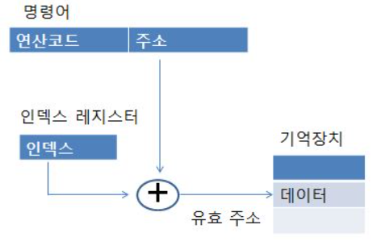
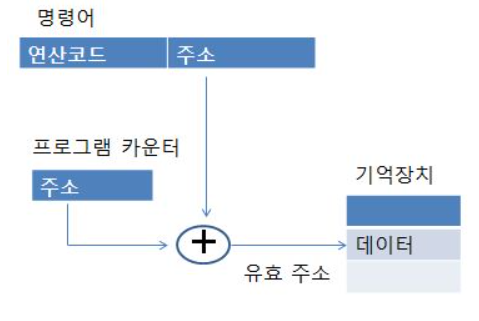

# 컴퓨터 아키텍처와 운영체제
- 컴퓨터는 어떻게 프로그램과 메모리를 조직적을 관리할까

### 컴퓨터 아키텍처란?
일련의 소프트웨어 및 하드웨어 기술  표준이 상호 작용하는 컴퓨터 시스템 또는 플랫폼을 형상하는 방법을 자세히 설명하는 사양이다.
=> 컴퓨터의 여러 구성요소를 배치하는 방법

## 기본적인 구조 요소들

### 프로세스 코어 = CPU
- CPU = ALU(Arithmetic/Logic Unit) + 레지스터 + 실행 장치

멀티프로세서 : 하나의 프로세서가 아닌 여러 개의 프로세서가 서로 협력적으로 일을 처리하는 것
멀티 코어  : 프로세스 코어가 여러개 인것

### 마이크로프로세서와 마이크로컴퓨터
마이크로프로세서 : 메모리와 I/O가 프로세서 코어와 분리되어 있는것
-> 큰 시스템의 부품
마이크로 컴퓨터 : 메모리와 I/O가 프로세서 코어와 같은 패키지에 들어 있는 것
-> 식기세척기

## 프로시저, 서브루틴, 함수
프로시저, 서브루틴, 함수를 쓰는 이유 -> 재사용하기 위해(메모리 절약, 반복된 코드작성x)

함수가 포함된 코드는 어떻게 작동할까?
-> 코드가 실행중에 함수를 호출하면 함수로 가싸다가 다시 원래 자리로 돌아올 방법이 필요함
-> 어디서 함수로 들어갔는지를 기억해야한다. 이 위치가 **프로그램 카운터**

- 함수 호출 흐름
  함수실행 -> 반환주소 계산(프로그램카운터 + 명령어) -> 주소값 저장 -> 함수호출 -> 반환 주소

## 스택

## 인터럽트
인터럽트(interrupt)란 마이크로프로세서(CPU)가 프로그램을 실행하고 있을 때, 입출력 하드웨어 등의 장치에 예외상황이 발생하여 처리가 필요할 경우에 마이크로프로세서에게 알려 처리할 수 있도록 하는 것을 말한다.

### 폴링
폴링(polling)이란 하나의 장치(또는 프로그램)가 충돌 회피 또는 동기화 처리 등을 목적으로 다른 장치(또는 프로그램)의 상태를 주기적으로 검사하여 일정한 조건을 만족할 때 송수신 등의 자료처리를 하는 방식을 말한다.

## 상대 주소지정
운영체제(OR, Operating System) : 컴퓨터 시스템의 자원들을 효율적으로 관리하며, 사용자가 컴퓨터를 편리하고, 효과적으로 사용할 수 있도록 환경을 제공하는 여러 프로그램의 모임이다. 운영체제는 컴퓨터 사용자와 컴퓨터 하드웨어 간의 인터페이스로서 동작하는 시스템 소프트웨어의 일종으로, 다른 응용프로그램이 유용한 작업을 할 수 있도록 환경을 제공한다.

### 절대주소지정
절대 주소지정은 명령어 주소가 특정 메모리 주소를 가르킨다는 의미이다.
따라서 1000번지에서 실행되게 만든 프로그램을 2000번지에서 읽어 들이면 실행 x
-> 위와 같은 문제를 해결하기 위해 **인덱스 레지스터**를 추가하였다. 인덱스 레지스터 + 명령어 주소 값으로 계산하여 유효주소로 사용한다.

유효주소 : 기억장치에서 데이터가 실제로 위치하는 공간

 

### 상대 주소 지정
절대 주소 지정의 또다른 해결방법
명령어가 들어있는 주소를 0부터 시작하지 않고, 명령어의 주소를 기준으로 하는 상대적인 주소로 시작한다.
주로 프로그램 카운터 + 명령어 주소 값으로 계산하여 유효주소로 사용한다.

 

