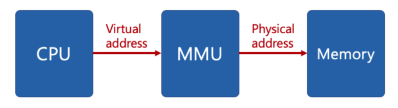

# 컴퓨터 아키텍처와 운영체제
**운영체제(OR, Operating System)** : 컴퓨터 시스템의 자원들을 효율적으로 관리하며, 사용자가 컴퓨터를 편리하고, 효과적으로 사용할 수 있도록 환경을 제공하는 여러 프로그램의 모임이다. 
 운영체제는 컴퓨터 사용자와 컴퓨터 하드웨어 간의 인터페이스로서 동작하는 시스템 소프트웨어의 일종으로, 다른 응용프로그램이 유용한 작업을 할 수 있도록 환경을 제공한다.

### 컴퓨터 아키텍처란?
일련의 소프트웨어 및 하드웨어 기술  표준이 상호 작용하는 컴퓨터 시스템 또는 플랫폼을 형상하는 방법을 자세히 설명하는 사양이다. 
=> **컴퓨터의 여러 구성요소를 배치하는 방법**

## 기본적인 구조 요소들

### 프로세스 코어 = CPU
- CPU = **ALU(Arithmetic/Logic Unit) + 레지스터 + 실행 장치**

멀티프로세서 : 하나의 프로세서가 아닌 **여러 개의 프로세서가 서로 협력적으로 일을 처리**하는 것 
멀티 코어  : **프로세스 코어가 여러개 인것**

### 마이크로프로세서와 마이크로컴퓨터
마이크로프로세서 : 메모리와 I/O가 프로세서 코어와 **분리**되어 있는것 
-> 큰 시스템의 부품 
마이크로 컴퓨터 : 메모리와 I/O가 프로세서 코어와 **같은 패키지**에 들어 있는 것 
-> 식기세척기 

## 프로시저, 서브루틴, 함수
프로시저, 서브루틴, 함수를 쓰는 이유  
-> **재사용하기 위해(메모리 절약, 반복된 코드작성x)** 

함수가 포함된 코드는 어떻게 작동할까? 
-> 코드가 실행중에 함수를 호출하면 함수로 가싸다가 다시 원래 자리로 돌아올 방법이 필요함 
-> 어디서 함수로 들어갔는지를 기억해야한다. 
이 위치가 **프로그램 카운터** 

**함수 호출 흐름** 
함수실행 -> 반환주소 계산(프로그램카운터 + 명령어)  
-> 주소값 저장 -> 함수호출 -> 반환 주소

# 예외처리

## 인터럽트
**인터럽트(interrupt)**란 마이크로프로세서(CPU)가 프로그램을 실행하고 있을 때, 입출력 하드웨어 등의 장치에 **예외상황이 발생하여 처리가 필요할 경우**에 마이크로프로세서에게 알려 처리할 수 있도록 하는 것을 말한다.

### 폴링
폴링(polling)이란 하나의 장치(또는 프로그램)가 충돌 회피 또는 동기화 처리 등을 목적으로 다른 장치(또는 프로그램)의 **상태를 주기적으로 검사**하여 일정한 조건을 만족할 때 송수신 등의 자료처리를 하는 방식을 말한다.

# 메모리주소 지정방식

## 절대주소지정
절대 주소지정은 **명령어 주소가 특정 메모리 주소를 가르킨다는 의미**이다.  
따라서 1000번지에서 실행되게 만든 프로그램을 2000번지에서 읽어 들이면 실행 x  
-> 위와 같은 문제를 해결하기 위해 **인덱스 레지스터**를 추가하였다. 
**인덱스 레지스터 + 명령어 주소 값**으로 계산하여 유효주소로 사용한다.  

유효주소 : 기억장치에서 데이터가 실제로 위치하는 공간  

 

## 상대 주소 지정
절대 주소 지정의 또다른 해결방법  
명령어가 들어있는 주소를 0부터 시작하지 않고, 명령어의 주소를 기준으로 하는 **상대적인 주소로 시작**한다.  
주로 **프로그램 카운터 + 명령어 주소 값**으로 계산하여 유효주소로 사용한다.  

 

# 메모리 주소 구조

## 메모리 관리장치
**메모리 관리장치**(Memory management unit) : CPU코어 안에 탑재되어 **가상 주소를 물리적 메모리 주소로 변환해주는 장치**

 

### MMU 구성
MMU는 가상 메모리 주소를 두부분으로 나눔  
주소의 하위(LSB) : 물리적 주소 범위  
주소의 상위(MSB) : 페이지 테이블이라는 RAM 영역을 통해 주소를 변환  

MMU는 **TLB라는 캐시**를 저장하고 있다. 가상주소가 물리 주소로 변환되어야할 때, TLB에서 우선 검색된다.  
해당 되는 주소가 있으면 (TLB hit) 물리주소가 리턴되고 메모리에 접근한다.  
하지만, TLB에서 해당되는 주소가 없을 경우 (TLB miss) 페이지테이블에서 맵핑이 존재하는지 찾는다.  
존재할 경우에 (page table hit) 이 값은 다시 TLB에 쓰이고 그 주소를 갖고 물리 주소로 변환 후, 메모리에 접근한다.
페이지 테이블에서도 찾지 못할 경우에는 disk에서 찾게 되고 그 값을 다시 page table에 쓰이고 TLB에 쓰이고 물리주소로 변환 후 메모리에 접근한다.  
다시 정리하면, **가상 주소를 갖고 물리 주소에 접근할 때 TLB -> page table -> disk 순으로 접근**한다고 생각하면 된다.  
TLB는 processor 안에 있으며 page table에 경우 주로 메모리에 있으나 운영체제마다 다르다.  

 

### TLB와 page table의 차이
- 스피드
TLB는 최근 사용된 페이지를 저장하고 있는 cache이고 지역성과 시간성의 원리에 따라 TLB에서 참조된 페이지들은 곧 다시 사용될 가능성이 높다.  
반면 페이지 테이블 그자체는 거대하기 때문에 필요한 페이지의 주소를 찾는데 오래걸린다.  

## 가상 메모리
가상 메모리는 컴퓨터가 사용하는 **메모리 관리 테크닉**이다.  
실제 메모리를 추상화하여 가상 메모리에 올림으로써 프로세스들이 연속된 물리적 메모리 공간처럼 여기게 만들 수 있을 뿐만 아니라 실제메모리보다 많은 크기의 메모리도 운용이 가능하다.  

### 가상 메모리 기능
- 주기억장치의 효율적인 관리
- 메모리 관리의 단순화
- 메모리 용량 및 안정성 보장

## 메모리 계층과 성능

속도 : CPU >> 메모리  
CPU의 속도는 빠른데 메모리가 느려서 CPU가 메모리를 기다린다? 
이문제를 해결하기 위해 **캐시**가 등장하였다.

## 참고 문헌

[메모리 관리장치 관련 문헌](https://about-myeong.tistory.com/35)

[가상메모리 관련 문헌](https://velog.io/@gndan4/OS-%EA%B0%80%EC%83%81-%EB%A9%94%EB%AA%A8%EB%A6%AC)