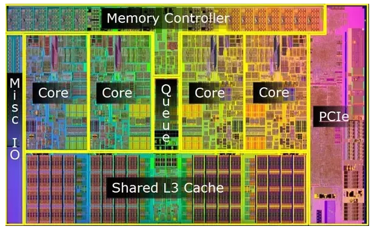
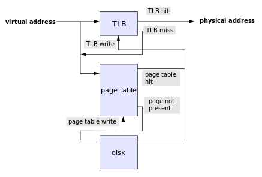

# 컴퓨터 아키텍처와 운영체제
**운영체제(OR, Operating System)** : 컴퓨터 시스템의 자원들을 효율적으로 관리하며, 사용자가 컴퓨터를 편리하고, 효과적으로 사용할 수 있도록 환경을 제공하는 여러 프로그램의 모임이다. 
운영체제는 컴퓨터 사용자와 컴퓨터 하드웨어 간의 인터페이스로서 동작하는 시스템 소프트웨어의 일종으로, 다른 응용프로그램이 유용한 작업을 할 수 있도록 환경을 제공한다.

### 컴퓨터 아키텍처란?
일련의 소프트웨어 및 하드웨어 기술  표준이 상호 작용하는 컴퓨터 시스템 또는 플랫폼을 형상하는 방법을 자세히 설명하는 사양이다. 
=> **컴퓨터의 여러 구성요소를 배치하는 방법**

## 기본적인 구조 요소들

### 컴퓨터 구조
 

- CPU : 중앙처리장치. 데이터를 처리하는 역학
- Memory : 데이터를 저장하는 기능 수행
- I/O : 컴퓨터와 외부장치 사이에 데이터를 교환하는 기능 수행
- System Bus : 위의 모든 컴퓨터 시스템 구성요소들을 연결하는 데이터 전송을 수행

### 컴퓨터 기능
- Data Processing : 데이터 연산
- Data Storage : 데이터 저장
- Data Movement : 데이터 통신, 이동
- Control : 제어(명령수행, 리소스 관리 등)

## CPU 구성

 

### 1.CPU(Central Processing Unit, 중앙처리장치)
컴퓨터의 구성 단위 중 **기억, 해석, 연산, 제어**라는 4대 기능을 종합하는 것  
-> 용도에 따라 MPU, MCU로 분류 

- **MPU(Micro Processor Unit)** : 각종 전자 부품과 반도체칩을 하나의 작은 칩으로 내장한 형태. 일반적인 PC/워크스테이션에서 사용되는 CPU의 한 종류
- **MCU(Micro Controller Unit)** : 일정한 용량의 기억장치, 입출력제어회로 등을 단일 칩에 모두 내장한 것. 1개의 소자로 완전한 1개의 컴퓨터로서의 기능을 갖추고 있음

 

### 2.프로세서(Processor)
프로세서는 컴퓨터 운영을 위해 기본적인 명령어들을 처리하고 반응하기 위한 **논리회로**
 
프로세서는 CPU보다 조금 더 큰 범위이긴하나 요즘은 **프로세서를 CPU라고 부르는 추세**이다.(프로세서 >= CPU)

### Core(코어)

 

각종 연산을 하는 **CPU의 핵심요소** 
코어가 1개면 싱글코어, 2개면 듀얼코어, 4개면 쿼드코어라고 하며, 
**코어 수가 많을 수록 병렬 처리 효율이 늘어남** 

### 마이크로프로세서와 마이크로컴퓨터
마이크로프로세서 : 메모리와 I/O가 프로세서 코어와 **분리**되어 있는것 
-> 큰 시스템의 부품 
마이크로 컴퓨터 : 메모리와 I/O가 프로세서 코어와 **같은 패키지**에 들어 있는 것 
-> 식기세척기 

## 프로시저, 서브루틴, 함수
프로시저, 서브루틴, 함수를 쓰는 이유  
-> **재사용하기 위해(메모리 절약, 반복된 코드작성x)** 

함수가 포함된 코드는 어떻게 작동할까? 
-> 코드가 실행중에 함수를 호출하면 함수로 가싸다가 다시 원래 자리로 돌아올 방법이 필요함 
-> 어디서 함수로 들어갔는지를 기억해야한다. 
이 위치가 **프로그램 카운터** 

**함수 호출 흐름** 
함수실행 -> 반환주소 계산(프로그램카운터 + 명령어)  
-> 주소값 저장 -> 함수호출 -> 반환 주소

# 예외처리

## 인터럽트
**인터럽트(interrupt)**란 마이크로프로세서(CPU)가 프로그램을 실행하고 있을 때, 입출력 하드웨어 등의 장치에 **예외상황이 발생하여 처리가 필요할 경우**에 마이크로프로세서에게 알려 처리할 수 있도록 하는 것을 말한다.

 

### 인터럽트의 종류
- Program : 오버플로우, 0으로 나눈다던가, 문법적인 에러 등과 같은 조건일때 발생
- Timer : 타이머에 의해 발생. 의도적인 인터럽트
- I/O : I/O 컨트롤러에 의해 발생. 요청 혹은 에러 상황일 때 발생
- Hardware failure : 하드웨어적 결함

### 인터럽트 처리과정

1. 인터럽트 발생
2. 프로그램 중단 및 상태보관(PC값, 레지스터 저장)
3. 인터럽트 처리와 수행
4. 프로그램 상태 복구 및 재실행

## 폴링
폴링(polling)이란 하나의 장치(또는 프로그램)가 충돌 회피 또는 동기화 처리 등을 목적으로 다른 장치(또는 프로그램)의 **상태를 주기적으로 검사**하여 일정한 조건을 만족할 때 송수신 등의 자료처리를 하는 방식을 말한다.

# 메모리주소 지정방식

## 절대주소지정
절대 주소지정은 **명령어 주소가 특정 메모리 주소를 가르킨다는 의미**이다.  
따라서 1000번지에서 실행되게 만든 프로그램을 2000번지에서 읽어 들이면 실행 x  
-> 위와 같은 문제를 해결하기 위해 **인덱스 레지스터**를 추가하였다. 
**인덱스 레지스터 + 명령어 주소 값**으로 계산하여 유효주소로 사용한다.  

유효주소 : 기억장치에서 데이터가 실제로 위치하는 공간  

 

## 상대 주소 지정
절대 주소 지정의 또다른 해결방법  
명령어가 들어있는 주소를 0부터 시작하지 않고, 명령어의 주소를 기준으로 하는 **상대적인 주소로 시작**한다.  
주로 **프로그램 카운터 + 명령어 주소 값**으로 계산하여 유효주소로 사용한다.  

 

# 메모리 주소 구조

## 메모리 관리장치
**메모리 관리장치**(Memory management unit) : CPU코어 안에 탑재되어 **가상 주소를 물리적 메모리 주소로 변환해주는 장치**

 

### MMU 구성
MMU는 가상 메모리 주소를 두부분으로 나눔  
주소의 하위(LSB) : 물리적 주소 범위  
주소의 상위(MSB) : 페이지 테이블이라는 RAM 영역을 통해 주소를 변환  

MMU는 **TLB라는 캐시**를 저장하고 있다. 가상주소가 물리 주소로 변환되어야할 때, TLB에서 우선 검색된다.  
해당 되는 주소가 있으면 (TLB hit) 물리주소가 리턴되고 메모리에 접근한다.  
하지만, TLB에서 해당되는 주소가 없을 경우 (TLB miss) 페이지테이블에서 맵핑이 존재하는지 찾는다.  
존재할 경우에 (page table hit) 이 값은 다시 TLB에 쓰이고 그 주소를 갖고 물리 주소로 변환 후, 메모리에 접근한다.
페이지 테이블에서도 찾지 못할 경우에는 disk에서 찾게 되고 그 값을 다시 page table에 쓰이고 TLB에 쓰이고 물리주소로 변환 후 메모리에 접근한다.  
다시 정리하면, **가상 주소를 갖고 물리 주소에 접근할 때 TLB -> page table -> disk 순으로 접근**한다고 생각하면 된다.  
TLB는 processor 안에 있으며 page table에 경우 주로 메모리에 있으나 운영체제마다 다르다.  

 

### TLB와 page table의 차이
- 스피드
TLB는 최근 사용된 페이지를 저장하고 있는 **cache**이고 지역성과 시간성의 원리에 따라 TLB에서 참조된 페이지들은 곧 다시 사용될 가능성이 높다.  
반면 페이지 테이블 그자체는 거대하기 때문에 필요한 페이지의 주소를 찾는데 오래걸린다.  

## 가상 메모리
가상 메모리는 컴퓨터가 사용하는 **메모리 관리 테크닉**이다.  
실제 메모리를 추상화하여 가상 메모리에 올림으로써 프로세스들이 연속된 물리적 메모리 공간처럼 여기게 만들 수 있을 뿐만 아니라 실제메모리보다 많은 크기의 메모리도 운용이 가능하다.  

### 가상 메모리 기능
- 주기억장치의 효율적인 관리
- 메모리 관리의 단순화
- 메모리 용량 및 안정성 보장

## 메모리 계층과 성능

 

**메모리 계층 구조** : 메모리를 필요에 따라 여러가지 종류로 나누어둠을 의미 
이때 필요의 대부분의 경우는 **CPU의 메모리가 더 빨리 접근하기 위함** 

- 레지스터와 캐시는 CPU 내부에 존재한다. 매우 빠르게 접근
- 메모리는 CPU 외부에 존재. 레지스터와 캐시보다 느리게 접근 할 수 밖에 없다.
- 하드 디스크는 CPU에 직접 접근 못함. CPU가 하드 디크스에 접근하기 위해서는 하드 디스크의 데이터를 메모리로 이동시키고, 메모리에서 접근해야한다.

### 메모리 계층의 필요성
- 비용적인 측면 : 메모리구조의 상층에 속할 수록 더 비쌈
- 자주 쓰이는 데이터는 계속 쓰인다(참조의 지역성) : 자주 쓰는 데이터는 계속 자주 쓰고, 자주 쓰이지 않는 데이터는 계속 자주 쓰이지 않음. 이를 이용하여 운영체제나 CPU는 분기예측 회로를 통해 자주 쓰이는 데이터, 또는 자주 쓰일 것 같은 데이터를 메모리에서 캐시로 읽어옴
- 속도적인 측면 : CPU와 가까이 있을수록 가장 빠르게 접근 가능함

## 메모리 종류

### 1. 레지스터
컴퓨터의 프로세서(CPU) 내에서 자료를 보관하는 아주 빠른 기억 장소이다. 
-> 일반적으로 현재 계산을 수행중인 값을 저장하는데 사용 

### 2. 캐시
**캐시는 메인 메모리에서 가장 자주 사용되는 데이터**를 갖고 있는, 크기는 작지만 빠른 메모리이다. 
 자주 사용되는 데이터를 작지만 속도가 빠른 캐시메모리에 복사해 두어 메모리 접근 시간을 아낀다. 
 

프로세서는 메인 메모리를 읽거나 쓰고자 할 때, 먼저 그 주소에 해당하는 데이터가 캐시에 존재하는지 살핀다.  만약 캐시에 있으면 **캐시 적중**  없으면 **캐시 실패**

### 3. 메인 메모리(주기억장치)
**CPU에서 직접 접근이 가능한 메모리.** 
-> 대표적으로 RAM, ROM이 존재 

- RAM(Random Access Memory, 임의접근 기억장치) : 사용자가 자유롭게 읽고 쓰고 지울 수 있는 기억장치. 컴퓨터가 켜져있는 동안 내내 이 기억장치에 저장된다. 하지만 꺼지면 기억된 내용이 다 사라짐(휘발성)

 

- ROM(Read Only Memory) : 기억된 내용을 읽기만 가능한 메모리. 컴퓨터가 꺼져도 내용이 지워지지않음(비휘발성)

 

- Flash Memory : 전기적으로 데이터를 지우고 다시 기록할 수 있는 비휘발성 컴퓨터 저장장치. ROM의 업그레이드? -> USB 메모리, microSD 카드로 사용

### 4. 보조기억장치

 

**CPU에 직접 접근이 불가능한 메모리.** 
접근하려면 디바이스 드라이버와 시스템 콜을 통하여 보조기억장치의 데이터를 주기억장치로 로드한 뒤 읽어야 한다. 
-> SSD, HDD, CD, 자가테이프, 광디스크 등이 존재

## 참고 문헌

[컴퓨터구조 관련 문헌](https://velog.io/@ckstn0777/%EC%BB%B4%ED%93%A8%ED%84%B0%EA%B5%AC%EC%A1%B0-%EC%BB%B4%ED%93%A8%ED%84%B0-%EA%B5%AC%EC%A1%B0%EC%99%80-%EA%B8%B0%EB%8A%A5-CPU)

[메모리 관리장치 관련 문헌](https://about-myeong.tistory.com/35)

[가상메모리 관련 문헌](https://velog.io/@gndan4/OS-%EA%B0%80%EC%83%81-%EB%A9%94%EB%AA%A8%EB%A6%AC)

[메모리 계층구조 관련 문헌](https://velog.io/@ckstn0777/%EC%BB%B4%ED%93%A8%ED%84%B0%EA%B5%AC%EC%A1%B0-75yk3fno)

