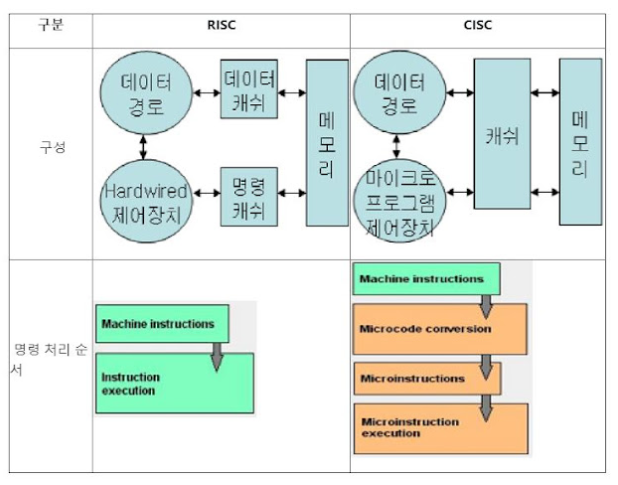

# 머리말
위 내용은 3장의 메모리 조직과 주소지정-임의 접근 메모리와 
4장 RISC, CISC 명령어 집합을 정리해논 내용이다. 

## 메모리 조직과 주소지정
### 임의 접근 메모리(random access memory)
임의 접근 메모리=RAM, 즉 RAM을 사용하면 메모리 위치 중 원하는 곳은 어디든 원하는 순서로 쓰거나 읽을 수 있다. 
RAM은 **휘발성 메모리**이기 때문에 영구적이지 않음 
**전원을 끄면 모든 메모리 소멸** 

#### 정적램(Static RAM)
**플리플롭(Flip-flop, F/F)으로 작동하는 방식** 
플리플롭 : 순차 회로의 기본 요소로, 1비트의 정보를 보관 및 유지할 수 있는 회로이다. 전기 신호가 지속적으로 공급되어야만 정보를 유지할 수 있다. 
가만히 냅두면 내용이 소멸, 변화하지 않는 안정적인 메모리 

주로 임베디드 컴퓨터에서 사용되며 일반적인 data, 변수, stack 저장용으로 사용 

#### 동적램 (Dynamic RAM)
**축전기(Capacitor, CAP)로 작동하는 방식** 
축전기 : 전기를 일시적으로 저장하는 소자, 축전기를 전지나 외부 에너지 공급장치에 연결하여 전기를 저장하는 것을 **충전**이라고함 
축전기에 저장되는 전하가 회로를 통해 빠져나가 저장된 전하량이 줄어드는 현상을 **방전**이라고함 

축전기의 특징은 시간이 지나면 스스로 방전이 된다. 즉 시간이 흐름에 따라 자연적으로 메모리가 변화하는 것을 의미함 

대량의 데이터를 저장할 수 있으므로 program 저장용, data, 변수 저장용으로 대형 컴퓨터에 사용됨 

### 정리
|   | SRAM | DRAM |
|---|------|------|
| 구조적 특징 |  플리플롭  |  커패시터    |
| 속도 | 빠르다    | 느리다   |
| 용량 | 적다    | 크다    |
| 가격 | 비싸다    | 저렴하다    |

## RISC와 CISC

### 개념
- CPU(중앙처리장치)를 설계하는 방식이다.
- CPU가 작동하려면 프로그램이 있어야 하고 명령어를 주입해서 설계한다.
   - 명령어가 H/W 적인 방식을 RISC라고 한다.
   - 명형어가 S/W 적인 방식을 CISC하고 한다.

### RISC(Reduced Instruction Set Computer)
- 간단하고 적은 종류의 명령어와 주소 지정 모드를 사용함
- 고정 길이 명령어 형식
- CISC에 비해 명령어 수가 적다.
- 하드와이어드(H/W) 제어 방식
- 명령어가 하드웨어적이므로 호환성이 낮다.
- 명령어의 길이가 정해져 있으므로 속도가 빠름
- 복잡한 처리는 소프트웨어에게 맡겨 속도 빠름
- 고성능의 워크스테이션이나 그래픽용 컴퓨터에서 주로 사용

### CISC(Complex Instruction Set Computer)
- 복잡하고 많은 종류의 명령어와 주소 지정 모드를 사용함
- 가변 길이 명령어 형식
- 많은 명령어를 가지고 있어 설계가 어렵다.
- 마이크로 프로그래밍(S/W) 제어 방식
- 명령어가 S/W적이므로 호환성이 좋다.
- 명령어를 해석 후 명령어 실행
- 컴파일 과정이 쉽고, 호환성이 좋지만 속도가 느림
- intel 사의 CPU에 주로 사용된다.(개인용 컴퓨터)

### 정리

|   | RISC | CISC |
|---|------|------|
| 명령어의 수 |   적다  | 많다    |
| 레지스터 | 많다   | 적다    |
| 처리속도 | 빠르다    | 느리다    |
| 설계(내부구조) | 단순    | 복잡    |
| 전력소모  |  적다    |   많다   |

## 참고 문헌

[RAM관련 참고문헌](https://m.blog.naver.com/ycpiglet/221984934010)

[RISC/CISC 참고문헌](https://velog.io/@kjw2298/CISC-RISC-%EA%B0%9C%EB%85%90-%EB%B0%8F-%EC%B0%A8%EC%9D%B4)