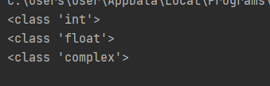
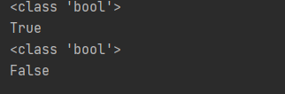
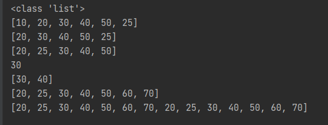
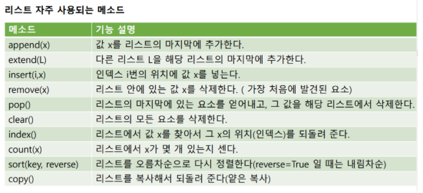
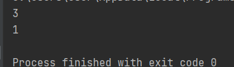
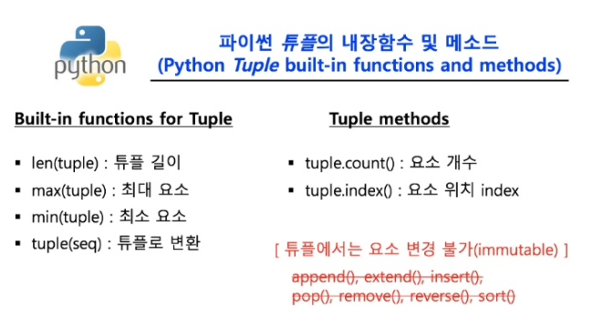
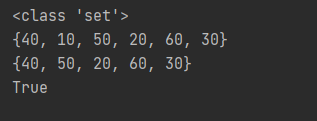
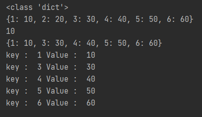

# 파이썬 코테 대비 총정리

## 목차
## 1. 자료형
## 2. 자료구조
## 3. 알고리즘

# 자료형
## 파이썬 자료형의 특징
**변수를 선언할 때, 자료형을 명시적으로 선언하지 않는다.** <br/>
왜 why? **동적 타입 언어**이기 때문에<br/>

자료형 없이 변수의 값을 대입하면 알아서 자료형이 지정된다.<br/>
동적타입 언어에서는 **컴파일 시가 아닌, 런타임(실행시간) 시에 변수의 형이 결정**된다.<br/>

### 동적타입 언어의 장단점
장점 : 유연하고 빠르게 코딩이 가능하다.<br/>
단점 : 실행시켜 보기 전에는 자료형에서 비롯되는 오류를 검출하기 어렵다.<br/>

# 자료형 분류
- 수치 자료형 : int, float, complex
- 불 자료형 : bool
- 군집 자료형 : str, list, tuple, set, dictionary

## 수치 자료형
```python3
    i = 1000
    f = 999.999
    c = 21 + 3j

    print(type(i))
    print(type(f))
    print(type(c))
```



결과를 확인해보면 <br/>
int는 1,100 등의 정수형<br/>
float는 999.999, 3.14, 314e-2 등의 지수형<br/>
complex는 21 + 3j 등과 같은 복소수(실수부,허수부)<br/>
를 알수 있다.<br/>

## 불 자료형
boolean 값을 저장하기 위한 자료형

```python3
    isAlpha = True
    isBeta = False

    print(type(isAlpha))
    print(isAlpha)
    print(type(isBeta))
    print(isBeta)
```



True/False 값을 저장하기 위한 자료형

## 군집 자료형
### str
문자열을 위한 자료형<br/>
**순서가 있고(인덱스 기반 접근 가능), 중복이 가능하며, 수정이 불가능한(Immutable)한 특성**을 가진다.

```python3
    s1 = "Hello, Python1"
    s2 = 'Hello' + 'Python2'

    print(type(s1))
    print(len(s1))
    print(s1[2]) #s1의 2번째 인덱스값 출력
    print(s1[2:5]) # s1의 2이상 5미만 인덱스 값 출력

    print(type(s2))
    print(len(s2))
    print(s2[2]) #s2의 2번째 인덱스값 출력
    print(s2[9:11]) # s2의 9이상 11미만 인덱스 값 출력

    #s2[2] = a #에러 값 수정 불가능
```


### list
list는 여러 값을 넣기 위한 자료형<br/>
**순서가 있고(인덱스 기반 접근 가능), 중복이 가능하며, 수정이 가능한 특성**을 가진다.

```python3
    L = [10,20,30,40,50]

    print(type(L))

    L.append(25) #25를 추가
    print(L)

    L.remove(10) #10 제거
    print(L)

    L.sort() # 정렬, 기본값은 오름차순 정렬 reverse옵션 True는 내림차순
    print(L)

    print(L[2])
    print(L[2:4])

    L = L + [60,70]
    print(L)
    
    L = L*2
    print(L)
```



list의 관련된 메서드들은 다양하다.



**메소드는 정리한다고 되는 것이 아니다 많이 코딩을 해보면서 익혀야한다.**

## tuple
**tuple 자료형은 변경이 불가능한 list 자료형**이라고 생각하면 쉽다.<br/>
**순서가 있고(인덱스 기반 접근 가능), 중복이 가능하며, 수정이 불가능(Immutable)한 특성**을 가진다.

```python3
    t = (10,20,30,40,50,10,10)

    print(t.count(10)) #값 10의 갯수
    print(t.index(20)) #값 20의 인덱스
```



- 장점 :  **속도가 빠르다**
- 파이썬 native 함수 내부에서 주로 사용됨



## set
set 자료형은 수학의 집합과 비슷한 개념이다.<br/>
**순서가 없고, 중복이 불가능하며, 수정이 가능한 특성**을 가진다.

```python3
    s = {10,20,30,40,50}
    print(type(s))

    s.add(60)
    print(s)

    s.remove(10)
    print(s)

    print(20 in s)
```


## dictonary
**순서가 없고, 중복이 불가능하며, 수정이 가능한 특성**을 가진다.

```python3
    d = {1:10,2:20,3:30,4:40,5:50}
    print(type(d))
    
    d[6] = 60 # key = 6, value = 60인 값 append
    print(d)
    
    print(d[1])
    
    del d[2]
    print(d)
    
    for k, value in d.items():
        print("key : ",k,"Value : ",value)
```



dictionary자료형은 **key:value형태**의 값들로 구성된다.

dictionary 자료형은 **key의 중복이 불가능**하고 **value의 중복은 가능**하다.


## 군집자료형 정리

|       | 순서 | 중복 |  변경 |
|-------|------|------|---|
| str   | O    | O    | X |
| list  | O    | O    | O |
| tuple | O    | O    | X |
| set   | X    | X    | O |
| dict  | X    | X    | O |


