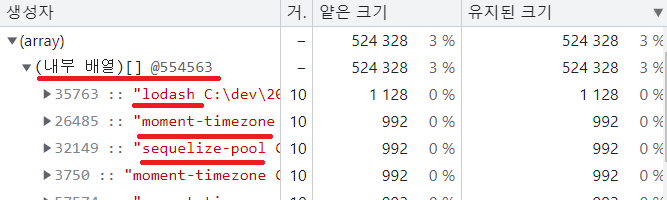
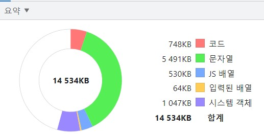
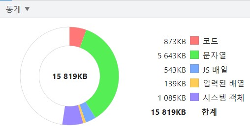

# 메모리 사용과 관리

- [메모리 사용과 관리](#메모리-사용과-관리)
  - [들어가며](#들어가며)
  - [메모리](#메모리)
  - [CPU](#cpu)
    - [제어 장치](#제어-장치)
  - [함수](#함수)
    - [주소 지정 모드](#주소-지정-모드)
    - [함수 호출 흐름](#함수-호출-흐름)
  - [v8](#v8)
    - [메모리 사용](#메모리-사용)
    - [메모리 관리](#메모리-관리)
  - [참고문헌](#참고문헌)

## 들어가며

5장의 개요인 메모리 구조 개선을 보고, 「컴퓨터 아키텍처와 운영체제」라는 주제 안의 메모리가 메인 주제라고 생각하였다.

먼저, 4장 「컴퓨터 내부 구조」에서 메모리 부분 부터 짚고 넘어가자.

## 메모리

메모리는 집이 빈틈없이 늘어선 거리와 같다.

모든 집은 **크기가 똑같고**,

모든 집에는 **정해진 개수만큼 비트를 저장할 수 있는 방**이 있다.

각 집에는 **주소가 부여**되고,

집에는 폰 노이만 컴퓨터 아키텍처를 따른다면, **데이터** 또는 **명령어**가 상주한다.

필자의 노트북 실제 메모리(5.92GB)를 예시로 설명하겠다.

5.92GB는 `5.92 x 1,024 x 1,024 x 1,024` = `6,356,551,598Byte` 이다. 

각 집에는 `0부터 6,356,551,597`까지 바이트 주소가 붙어 있다.


각 주소가 바이트여서 바이트 단위로만 데이터를 읽어야 한다는 뜻은 아니다.

필자의 노트북은 64비트 컴퓨터이므로 메모리를 8바이트로 읽을 수 있는데, 


이를 통해 알 수 있는 것은 

- 1바이트의 주소와 8바이트의 주소를 지정하는 방식이 다르다는 것과

- 8바이트의 주소로 읽을 때는 각 바이트가 정렬을 유지해야 한다는 점이다.

또한, 하나 짚고 넘어가야하는 것은

- 실제 메모리에서 가용할 수 있는 주소 범위가 있고, 
  > `5.92GB`까지 **가용**한다.
- 식별이 얼마만큼 가능하느냐의 주소 범위가 있다.
  > 64비트 컴퓨터는 하위 48비트만 사용해서 `256TB`만큼의 주소를 **식별**할 수 있다.

이와 같이 64비트 컴퓨터에서 식별 할만한 주소는 많은데 빈 주소는 많다. 이 빈 주소에 I/O 장치 주소를 할당할 수 있게 되었다.

이로 인해 같은 버스 안에 메모리와 I/O를 공유할 수 있게 되었다.


따라서, 식별 가능한 주소 범위는 레지스터(CPU내 기억 장치) + 메모리 + 보조 기억 장치를 충분히 아울른다 판단한다.

<details>
<summary>🤔 여기서 다음 주차를 위해 사전 지식을 짚고 갈 부분이 있다.</summary>

<div markdown="1">

메모리 버스와 I/O 버스의 데이터 전송 과정을 비교해볼 것이다.

일단, 데이터 전송 과정은 아래와 같은 흐름이 필요하다.

|                  송신지                  |                             수신지                              |
| :--------------------------------------: | :-------------------------------------------------------------: |
|       데이터를 버스 라인에 올린다.       |                                                                 |
|                                          |                 데이터가 안정화되도록 기다린다.                 |
| 데이터가 안정되었음을 수신자에게 알린다. |                                                                 |
|                                          | 안정된 데이터를 수신한 후, 송신자에 데이터를 수신했음을 알린다. |
|     수신지의 데이터 수신을 확인한다.     |                                                                 |
| 데이터 신호를 제거한 후 수신지에 알린다. |                                                                 |
|                                          |                 데이터 신호의 제거를 확인한다.                  |
|       다음 데이터 전송을 준비한다.       |                                                                 |

이 흐름을 메모리 버스와 I/O 버스는 다르게 처리한다.

**메모리 버스는 동기식으로 처리한다.**

공통된 클록을 사용하는데, 위에 흐름이 모두 클록 속도에 맞춰져있다. 


때문에, 
  1. 빠른 데이터 전송을 기대할 수 있으며,
  2. 공통된 속도에 맞춰져있으니 위 흐름을 따르되, 
  송신지 또는 수신지의 데이터 적재 여부와 같은 상태를 저장해 놓을 공간의 비용이 필요없다.

반면에, 이 속도는 버스를 사용하는 제일 느린 장치에 맞춰줘야한다.

**I/O 버스는 비동기식으로 처리한다.**

I/O 버스는 다양한 장치를 아울러서, 짧은 버스에서 긴 버스까지 가변적이다.

각 버스 간 누굴 CPU로 보낼지에 대한 중재역할은 `입출력 제어기`가 하는데, 이 과정은 6장의 내용이니 이번 주차에는 설명을 제외하겠다.

I/O 버스도 가변적인 버스마다 클록과 같이 타임아웃시키는 매커니즘이 있다. 하나의 I/O 장치의 작업이 버스를 선점하면 안되기 때문이다.

각 버스마다 가변적이니 이를 사이클이라고 한다.


사진에서 점선간의 구간이 사이클이다.

신호에서 올라가는 구간을 상승 에지, 내려가는 구간을 하강 에지라고 한다.

  1. 데이터 송신신호의 상승 에지는 유효한 데이터가 존재한다는 것을 수신지에게 알린다.
  2. 데이터 수신신호의 상승 에지는 수신지가 데이터를 수신했음을 송신지에 알린다.
  3. 데이터 송신신호의 하강 에지는 수신지의 2번 신호를 송신지가 보았음을 수신지에 알린다.
  4. 데이터 수신신호의 하강 에지는 다음 사이클을 수행해도 됨을 나타낸다.

</div>
</details>


## CPU

앞서 메모리와 I/O는 데이터를 서로 전달할 능력이 없다.

CPU른 계산하는 부품의 개입이 필요하다.

CPU-메모리와 관련된 부분만 알아보자.

### 제어 장치

제어 장치는 메모리의 읽기 또는 쓰기 연산을 수행하는 명령을 내린다. 

1. `메모리의 정해진 장소에서 명령어와 피연산자들을 가져와서`

2. `ALU에게 어떤 연산을 수행할 지 알려주고`, 

3. `결과를 메모리에 돌려준다`.

각 과정마다 하나의 **명령어**이고, 제어 장치는 프로그램 카운터(PC)를 사용해 명령어를 찾는다.

<details>
<summary>다음은 1번 명령어의 실행 과정이다. 예시 사진과 함께 참고하자.</summary>

<div markdown="1">

1. 코드가 실행되면 코드의 행 별로 메모리에 저장된다.
   
2. PC는 현재 실행 중인 코드의 행 번호 1이 저장되고, 이 번호는 제어장치에 전송된다.
   
3. 행 번호와 일치한 메모리 주소 1의 데이터에서 명령어를 가져온다.
   
4. IR에는 `LOAD mem(100), register 0;`의 LOAD가 탑재된다.
   
5. 제어장치가 IR에 있는 명령을 해석하여 메모리에 있는 데이터를 가져오라는 제어 신호를 보낸다.
   
6. MAR에는 100이 저장되고, 메모리 관리자는 메모리의 100번지에 저장된 데이터를 MBR로 가져온다.
   
7. 제어장치는 MBR에 저장된 값을 레지스터 0에 옮긴다.

</div>
</details>

<br/>



<details>
<summary><b>🤔 여기서 의문점이 발생하였다.</b></summary>

<h4>앞선 메모리 목차와 다르게 버스가 왜 세갈래로 나누어 지는가?</h4>

<div markdown="1">

앞서, `메모리 / 메인보드 / IO 버스`는 **어디 전용 버스**의 분류이며,

각 버스 안에는 **어떤 걸 전달하는 버스(전용 버스)** 로 분류된다. 

즉, 앞선 메모리 목차의 예시 사진들의 버스는 추상화해둔 것이고, 사실 3개의 전용 버스가 있는것이다.

8바이트 버스를 예시로 들었는데, 3개의 전용 버스가 8바이트 버스를 양분하는 것이 아니다. 각자 8바이트 버스임을 알아야한다.

여담으로, 8바이트 버스 하나에서 각 전용 버스의 수행능력을 공유하는 다중화 버스도 있지만,
  1. 제어장치에서 시분할 방식을 사용하기에 성능이 떨어지고,
  2. 공유 → 병목 현상으로 이어진다고 한다.

이 정도만 짚고 넘어가자.

</div>
</details>

<br/>

명령어를 읽어온 뒤에는 다음 명령어를 코드의 다음 행에서 가져올 수 있도록 카운터를 증가한다.

단순한 원시적 데이터가 아닌 참조형 데이터인 함수를 사용하는 경우는 어떨까?

함수 호출 시에는 카운터를 증가시키지 않고, 분기 처리로 이곳 저곳 돌아다닐 수 있다.

그러면, 함수를 호출한 곳으로 다시 돌아올 위치를 기억해둘 필요가 있다.

## 함수

함수 호출 흐름을 이해하기 위해 주소 지정 모드를 간단히 익혀보자.

### 주소 지정 모드

다음은 메모리 예시이다.

    +--------+-----+-------+-----+-------+
    |  주소  | ... |   12  | ... | 4,321 |
    +--------+-----+-------+-----+-------+
    | 데이터 |  -  | 4,321 |  -  |  345  |
    +--------+-----+-------+-----+-------+

`12`라는 메모리 주소를 피연산자로 하는 `LOAD 명령코드`를 갖춘 명령어를 실행한다고 했을 때,

`즉시 주소 지정` 방식은 `12`를 누산기에 넣고,

`직접 주소 지정` 방식은 `4,321`을 누산기에 넣고,

`간접 주소 지정` 방식은 `345`를 누산기에 넣는다.

누산기는 CPU 내부에 데이터를 저장하는 기억장치이다.

### 함수 호출 흐름 

재귀 함수를 사용하는 상황을 알아보자.

```javascript
function subdivide(x, y, size){
  if(size !== 1){
    half = size / 2;
    subdivide(x, y, half);    
  }else{
    ...
  }
}
  
subdivide(0, 0, 8);
```

[재귀 함수 호출 흐름](https://slides.com/kimyongki/deck-8d4df2/embed)은 링크에서 슬라이드로 확인해보자.

함수에서 돌아오는 주소를 저장하는 `EBP 레지스터`가 스택 자료구조라고 한다.

자바스크립트 언어 입장에서 메모리 공간에서 어떻게 점유되는지 시각적으로 알아보자.

## v8

### 메모리 사용

[v8 메모리 사용](https://slides.com/kimyongki/deck/embed)

> 깃헙 마크다운에는 `iframe`을 지원하지 않아 위 링크로 들어가서 확인해주세요.

여담으로, 스택은 운영 체제에 관리되지만, 힙은 운영 체제에 의해 관리되지 않는다.

힙은 v8 엔진의 가비지 컬렉터(`orinoco`)에 의해 관리된다.

### 메모리 관리

**가비지 컬렉터**는 참조 없는 객체들이 사용하는 힙 메모리를 비워서 새로운 객체를 생성하기 위한 공간을 만듬으로써 관리한다.

**참조 없는 객체**는 스택 메모리로부터 참조되지 않는 객체를 말한다.

이렇듯 참조 없는 객체들은 자동으로 `orinoco`가 없애주지만, 우리가 참조를 해재 하지 않은 객체가 있다면, 수동으로 관리를 해주어야할 것이다.

위 재귀 함수 예제는 힙 메모리를 사용하는 부분이 많이 없어, 프로젝트 단위의 예시와 메모리 분석 툴을 통해 알아보겠다.

「웹 시스템 설계 및 개발Ⅱ」수업에서 진행했던 노드 기반 프로젝트와 노드 크롬 디버거를 사용하여,

앱을 가동하면서 어떤 부분이 관리가 안되는지 알아보자.

<table border="0">
 <tr>
    <td colspan="2"><b>앱 가동 흐름</b></td>
 </tr>
 <tr>
    <td colspan="2">
      
    </td>
 </tr>
 <tr>
  <td colspan="2">
    파란색 바가 회색으로 바뀌지 않았다면, 관리되지 않은 대상이다.
  </td>
 </tr>

 <tr>
    <td colspan="2"><b>힙 메모리를 쌓이게 하는 대상 확인</b></td>
 </tr>
 <tr>
    <td colspan="2">
      
    </td>
 </tr>
 <tr>
  <td colspan="2">
    해당 라이브러리는 sequelize(sql과 연동하는 외부 라이브러리)과 의존관계를 맺는 여러 외부 라이브러리들이며, 
    <br/>
    이를 통해 외부 라이브러리에도 메모리 누수는 존재하다는 것이었다.
  </td>
 </tr>
</table>

번외로, 노드 크롬 디버거에는 더 가독성 좋게 차트로 캡쳐하는 기능이 있는데, 

이 기능은 전반적인 앱 가동상태에서는 `orinoco`가 수집하기 전에 캡쳐하기 매우 힘들고, 코드를 넣고 뺄때의 상황에서 필요한 기능이였다.

아래는 이미 `orinoco`가 수집해간 상태라 큰 차이가 없음을 보여준다.

 <table border="0">
 <tr>
    <td><b>앱 가동 초기</b></td>
    <td><b>어느정도 앱 가동 후</b></td>
 </tr>
 <tr>
    <td>
      
    </td>
    <td>
      
    </td>    
 </tr>
</table>

<hr/>

## 참고문헌

[64비트 시스템](https://eine.tistory.com/entry/64비트-32비트-CPU와-운영체제-에-대하여) -- 아인스트라세의 SW 블로그

[V8 Memory usage(Stack & Heap)](https://speakerdeck.com/deepu105/v8-memory-usage-stack-and-heap?slide=14) -- Deepu K Sasidharan

[Visualizing memory management in V8 Engine)](https://ui.toast.com/weekly-pick/ko_20200228) -- Deepu K Sasidharan

[「컴퓨터 아키텍처: 컴퓨터 구조 및 동작 원리」](http://www.yes24.com/Product/Goods/14148792) -- 우종정

[「쉽게 배우는 운영체제」](http://www.yes24.com/Product/Goods/62054527) -- 조성호

[Nodejs 메모리 누수 확인](https://ajh322.tistory.com/243) -- IT 잡동사니

[The Secrets of Memory Leaks in JavaScript You Don’t Know](https://ui.toast.com/weekly-pick/ko_20210611) -- bytefish

[ERP 참고문헌](https://welcome-young.tistory.com/61) -- 0da