# 컴퓨터 아키텍처와 운영체제

- [컴퓨터 아키텍처와 운영체제](#컴퓨터-아키텍처와-운영체제)
  - [들어가며](#들어가며)
  - [메모리](#메모리)
  - [CPU](#cpu)
    - [제어 장치](#제어-장치)
    - [메모리 읽기 연산](#메모리-읽기-연산)
    - [메모리 쓰기 연산](#메모리-쓰기-연산)
  - [함수](#함수)
    - [주소 지정 모드](#주소-지정-모드)
    - [함수 호출 흐름](#함수-호출-흐름)
  - [참고문헌](#참고문헌)

## 들어가며

메모리와 관련한 구조 개선을 다뤄보자.

먼저, 4장 「컴퓨터 내부 구조」에서 메모리 부분만 짚고 넘어가자.

## 메모리

메모리는 집이 빈틈없이 늘어선 거리와 같다.

모든 집은 **크기가 똑같고**,

모든 집에는 **정해진 개수만큼 비트를 저장할 수 있는 방**이 있다.

각 집에는 **주소가 부여**되고,

집에는 폰 노이만 컴퓨터 아키텍처를 따른다면, **데이터** 또는 **명령어**가 상주한다.

필자의 노트북 실제 메모리(5.92GB)를 예시로 설명하겠다.

5.92GiB는 `5.92 x 1,024 x 1,024 x 1,024` = `6,356,551,598Byte` 이다. 

각 집에는 `0부터 6,356,551,597`까지 바이트 주소가 붙어 있다.



각 주소가 바이트여서 바이트 단위로만 데이터를 읽어야 한다는 뜻은 아니다.

필자의 노트북은 64비트 컴퓨터이므로 메모리를 8바이트로 읽을 수 있는데, 


이를 통해 알 수 있는 것은 

- 1바이트의 주소와 8바이트의 주소를 지정하는 방식이 다르다는 것과

- 8바이트의 주소로 읽을 때는 각 바이트가 정렬을 유지해야 한다는 점이다.

또한, 하나 집고 넘어가야하는 것은

- 실제 메모리에서 가용할 수 있는 주소 범위가 있고, 
  > `5.92GB`까지 **가용**한다.
- 식별이 얼마만큼 가능하느냐의 주소 범위가 있다.
  > 64비트 컴퓨터는 하위 48비트만 사용해서 `256TB`를 **식별**한다.

이와 같이 64비트 컴퓨터에서 식별 할만한 주소는 많은데 빈 주소가 많아졌다. 이 빈 주소에 I/O 장치를 할당할 수 있게 되었다.

이로 인해 같은 버스 안에 메모리와 I/O를 공유할 수 있게 되었다.



따라서, 식별 가능한 주소 범위는 레지스터(CPU내 기억 장치) + 메모리 + 보조 기억 장치를 충분히 아울른다 판단한다.

이 주소들 간에 각 계층에서 필요한 I/O 장치를 참조하는 주소를 가지고 있다고 보면 될것 같다.

## CPU

계산을 처리하는 컴퓨터 부품이다. 앞서 메모리와 I/O는 CPU를 지원하는 역할이다.

CPU-메모리와 관련된 부분만 알아보자.

### 제어 장치

제어 장치는 `메모리의 정해진 장소에서 명령코드와 피연산자들을 가져와서`

`ALU에게 어떤 연산을 수행할 지 알려주고`, `결과를 메모리에 돌려준다`.

각 과정마다 하나의 **명령어**이고, 제어 장치는 프로그램 카운터(PC)를 사용해 명령어를 찾는다.

PC는 메모리 주소가 들어 있어, PC가 가리키는 메모리 주소에서 명령어를 읽어온다.

         +--------+---+---+---+-----+
         |  주소  | 0 | 1 | 2 | ... |
         +--------+---+---+---+-----+  메모리
         | 데이터 | - | - | - |  -  |
         +--------+---+---+---+-----+
                    ↑
    +-------------+---+
    | 메모리 주소 | 0 |                PC
    +-------------+---+


명령어를 읽어온 뒤에는 다음 명령어를 메모리의 다음 위치에서 가져올 수 있도록 카운터를 증가한다.

🙄 64비트 명령어 3주소 vs 1주소 구성 비교를 해야하나?

### 메모리 읽기 연산

### 메모리 쓰기 연산

<hr/>

## 함수

함수 호출 흐름을 이해하기 위해 주소 지정 모드를 간단히 익혀보자.

### 주소 지정 모드

다음은 메모리 예시이다.

    +--------+-----+-------+-----+-------+
    |  주소  | ... |   12  | ... | 4,321 |
    +--------+-----+-------+-----+-------+
    | 데이터 |  -  | 4,321 |  -  |  345  |
    +--------+-----+-------+-----+-------+

`12`라는 메모리 주소를 피연산자로 하는 `load 명령코드`를 실행한다고 했을 때,

`즉시 주소 지정` 방식은 `12`를 누산기에 넣고,
`직접 주소 지정` 방식은 `4,321`을 누산기에 넣고,
`간접 주소 지정` 방식은 `345`를 누산기에 넣는다.

누산기는 CPU 내부에 데이터를 저장하는 기억장치이다.

🙄 누산기를 사용하게 된 이유를 실행 장치 목차와 엮어야하나?

### 함수 호출 흐름 

```javascript
function cube(x) {
  return (x * x * x);
}
```

<details>
<summary>함수 호출 흐름은 다음과 같다.</summary>

<div markdown="1">

| 주소  | 데이터 | 명령어 | 피연산자 |                     설명                     |
| :---: | :----: | :----: | :------: | :------------------------------------------: |
|  100  |   -    |  pca   |    -     |   PC가 가리키는 주소를 누산기에 복사한다.    |
|  101  |   -    |  add   |    5     |       함수에서 돌아올 주소를 계산한다        |
|  102  |   -    | store  |   200    |       돌아올 주소를 메모리에 저장한다.       |
|  103  |   -    |  load  |    3     | 세제곱을 계산할 함수 인자를 누산기에 넣는다. |
|  104  |   -    |  bra   |   300    |            cube 함수를 호출한다.             |
|  105  |   -    |   -    |    -     |    함수에서 돌아온 뒤에 실행될 부분이다.     |
|  ...  |   -    |   -    |    -     |                      -                       |
|  200  |  105   |   -    |    -     |          함수에서 돌아올 주소이다.           |
|  ...  |   -    |   -    |    -     |                      -                       |
|  300  |   -    |   -    |    -     |           cube 함수 시작부분이다.            |
|  ...  |   -    |   -    |    -     |     cube 함수 안의 나머지 명령어들이다.      |
|  310  |   -    |  bra   |   200    |          저장했던 주소로 돌아간다.           |

</div>
</details>

<br/>

재귀 함수를 사용하는 상황에서는 함수에서 돌아오는 주소를 스택 자료구조에 저장한다고 한다.

메모리 안에 스택 공간이 있다고 알고 있다. 자바스크립트 언어의 메모리 공간을 시각적으로 알아보자.

[v8 메모리 사용](https://slides.com/kimyongki/deck/embed)

> 깃헙 마크다운에는 `iframe`을 지원하지 않아 위 링크로 들어가서 확인해주세요.

<details>
<summary>재귀 함수 호출 흐름은 다음과 같다.</summary>

<div markdown="1">

| 주소  | 데이터 | 명령어 | 피연산자 |                      설명                      |
| :---: | :----: | :----: | :------: | :--------------------------------------------: |
|  100  |   -    |  pca   |    -     |    PC가 가리키는 주소를 누산기에 복사한다.     |
|  101  |   -    |  add   |    5     | (ⅰ) subdivide 함수에서 돌아올 주소를 계산한다  |
|  102  |   -    | store  |   500    |        돌아올 주소를 메모리에 저장한다.        |
|  103  |   -    |  load  |    8     |          함수 인자를 누산기에 넣는다.          |
|  104  |   -    |  bra   |   200    |         (ⅰ) subdivide 함수를 호출한다.         |
|  105  |   -    |   -    |    -     |   (ⅰ) 함수에서 돌아온 뒤에 실행될 부분이다.    |
|  ...  |   -    |   -    |    -     |                       -                        |
|  200  |   -    |   -    |    -     |        (ⅰ) subdivide 함수 시작부분이다.        |
|  201  |   -    |  add   |    6     | (ⅱ) subdivide 함수에서 돌아올 주소를 계산한다. |
|  202  |   -    | store  |   501    |        돌아올 주소를 메모리에 저장한다.        |
|  203  |   -    |  load  |    4     |          함수 인자를 누산기에 넣는다.          |
|  204  |   -    |   -    |   300    |         (ⅱ) subdivide 함수를 호출한다.         |
|  205  |   -    |   -    |    -     |   (ⅱ) 함수에서 돌아온 뒤에 실행될 부분이다.    |
|  ...  |   -    |   -    |    -     |                       -                        |
|  210  |   -    |  bra   |   500    |           저장했던 주소로 돌아간다.            |
|  ...  |   -    |   -    |    -     |                       -                        |
|  300  |   -    |   -    |    -     |        (ⅱ) subdivide 함수 시작부분이다.        |
|  ...  |   -    |   -    |    -     |  (ⅱ) subdivide 함수 안의 나머지 명령어들이다.  |
|  310  |   -    |  bra   |   501    |           저장했던 주소로 돌아간다.            |
|  ...  |   -    |   -    |    -     |                       -                        |
|  500  |  105   |   -    |    -     |    (ⅰ) subdivide 함수에서 돌아올 주소이다.     |
|  501  |  205   |   -    |    -     |    (ⅱ) subdivide 함수에서 돌아올 주소이다.     |

</div>
</details>

<br/>

여담으로, v8 엔진에서 스택은 운영 체제에 관리되지만, 힙은 운영 체제에 의해 관리되지 않는다.

**v8 메모리 관리**에 대해서는 다음 주차때 개인 발표하겠다.

<hr/>

## 참고문헌

[64비트 시스템](https://eine.tistory.com/entry/64비트-32비트-CPU와-운영체제-에-대하여) -- 아인스트라세의 SW 블로그

[V8 Memory usage(Stack & Heap)](https://speakerdeck.com/deepu105/v8-memory-usage-stack-and-heap?slide=14) -- Deepu K Sasidharan