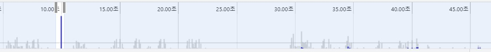

# 메모리 사용과 관리

- [메모리 사용과 관리](#메모리-사용과-관리)
  - [들어가며](#들어가며)
  - [메모리](#메모리)
  - [CPU](#cpu)
    - [제어 장치](#제어-장치)
  - [함수](#함수)
    - [주소 지정 모드](#주소-지정-모드)
    - [함수 호출 흐름](#함수-호출-흐름)
  - [v8](#v8)
    - [메모리 사용](#메모리-사용)
    - [메모리 관리](#메모리-관리)
  - [참고문헌](#참고문헌)

## 들어가며

5장의 개요인 메모리 구조 개선을 보고, 「컴퓨터 아키텍처와 운영체제」라는 주제 안의 메모리가 메인 주제라고 생각하였다.

먼저, 4장 「컴퓨터 내부 구조」에서 메모리 부분 부터 짚고 넘어가자.

## 메모리

메모리는 집이 빈틈없이 늘어선 거리와 같다.

모든 집은 **크기가 똑같고**,

모든 집에는 **정해진 개수만큼 비트를 저장할 수 있는 방**이 있다.

각 집에는 **주소가 부여**되고,

집에는 폰 노이만 컴퓨터 아키텍처를 따른다면, **데이터** 또는 **명령어**가 상주한다.

필자의 노트북 실제 메모리(5.92GB)를 예시로 설명하겠다.

5.92GiB는 `5.92 x 1,024 x 1,024 x 1,024` = `6,356,551,598Byte` 이다. 

각 집에는 `0부터 6,356,551,597`까지 바이트 주소가 붙어 있다.



각 주소가 바이트여서 바이트 단위로만 데이터를 읽어야 한다는 뜻은 아니다.

필자의 노트북은 64비트 컴퓨터이므로 메모리를 8바이트로 읽을 수 있는데, 


이를 통해 알 수 있는 것은 

- 1바이트의 주소와 8바이트의 주소를 지정하는 방식이 다르다는 것과

- 8바이트의 주소로 읽을 때는 각 바이트가 정렬을 유지해야 한다는 점이다.

또한, 하나 집고 넘어가야하는 것은

- 실제 메모리에서 가용할 수 있는 주소 범위가 있고, 
  > `5.92GB`까지 **가용**한다.
- 식별이 얼마만큼 가능하느냐의 주소 범위가 있다.
  > 64비트 컴퓨터는 하위 48비트만 사용해서 `256TB`만큼의 주소를 **식별**할 수 있다.

이와 같이 64비트 컴퓨터에서 식별 할만한 주소는 많은데 빈 주소는 많다. 이 빈 주소에 I/O 장치를 할당할 수 있게 되었다.

이로 인해 같은 버스 안에 메모리와 I/O를 공유할 수 있게 되었다.


따라서, 식별 가능한 주소 범위는 레지스터(CPU내 기억 장치) + 메모리 + 보조 기억 장치를 충분히 아울른다 판단한다.

이 주소들 간에 각 계층에서 필요한 I/O 장치를 참조하는 주소를 가지고 있다고 보면 될것 같다.

## CPU

계산을 처리하는 컴퓨터 부품이다. 앞서 메모리와 I/O는 CPU를 지원하는 역할이다.

CPU-메모리와 관련된 부분만 알아보자.

### 제어 장치

제어 장치는 메모리의 읽기 또는 쓰기 연산을 수행하는 명령을 내린다. 

1. `메모리의 정해진 장소에서 명령어와 피연산자들을 가져와서`

2. `ALU에게 어떤 연산을 수행할 지 알려주고`, 

3. `결과를 메모리에 돌려준다`.

각 과정마다 하나의 **명령어**이고, 제어 장치는 프로그램 카운터(PC)를 사용해 명령어를 찾는다.

<details>
<summary>다음은 1번 명령어의 실행 과정이다.</summary>

<div markdown="1">

1. 코드가 실행되면 코드의 행 별로 메모리에 저장된다.
   
2. PC는 현재 실행 중인 코드의 행 번호 1이 저장되고, 이 번호는 제어장치에 전송된다.
   
3. 행 번호와 일치한 메모리 주소 1의 데이터에서 명령어를 가져온다.
   
4. IR에는 `LOAD mem(100), register 0;`의 LOAD가 탑재된다.
   
5. 제어장치가 IR에 있는 명령을 해석하여 메모리에 있는 데이터를 가져오라는 제어 신호를 보낸다.
   
6. MAR에는 100이 저장되고, 메모리 관리자는 메모리의 100번지에 저장된 데이터를 MBR로 가져온다.
   
7. 제어장치는 MBR에 저장된 값을 레지스터 0에 옮긴다.

</div>
</details>

<br/>



명령어를 읽어온 뒤에는 다음 명령어를 코드의 다음 행에서 가져올 수 있도록 카운터를 증가한다.

단순한 원시적 데이터가 아닌 참조형 데이터인 함수를 사용하는 경우는 어떨까?

함수 호출 시에는 카운터를 증가시키지 않고, 분기 처리로 이곳 저곳 돌아다닐 수 있다.

그러면, 함수를 호출한 곳으로 다시 돌아올 위치를 기억해둘 필요가 있다.

## 함수

함수 호출 흐름을 이해하기 위해 주소 지정 모드를 간단히 익혀보자.

### 주소 지정 모드

다음은 메모리 예시이다.

    +--------+-----+-------+-----+-------+
    |  주소  | ... |   12  | ... | 4,321 |
    +--------+-----+-------+-----+-------+
    | 데이터 |  -  | 4,321 |  -  |  345  |
    +--------+-----+-------+-----+-------+

`12`라는 메모리 주소를 피연산자로 하는 `LOAD 명령코드`를 갖춘 명령어를 실행한다고 했을 때,

`즉시 주소 지정` 방식은 `12`를 누산기에 넣고,

`직접 주소 지정` 방식은 `4,321`을 누산기에 넣고,

`간접 주소 지정` 방식은 `345`를 누산기에 넣는다.

누산기는 CPU 내부에 데이터를 저장하는 기억장치이다.

### 함수 호출 흐름 

```javascript
function cube(x) {
  return (x * x * x);
}
```

<details>
<summary>함수 호출 흐름은 다음과 같다.</summary>

<div markdown="1">

| 주소  | 데이터 | 명령어 | 피연산자 |                     설명                     |
| :---: | :----: | :----: | :------: | :------------------------------------------: |
|  100  |   -    |  pca   |    -     |   PC가 가리키는 주소를 누산기에 복사한다.    |
|  101  |   -    |  add   |    5     |       함수에서 돌아올 주소를 계산한다        |
|  102  |   -    | store  |   200    |       돌아올 주소를 메모리에 저장한다.       |
|  103  |   -    |  load  |    3     | 세제곱을 계산할 함수 인자를 누산기에 넣는다. |
|  104  |   -    |  bra   |   300    |            cube 함수를 호출한다.             |
|  105  |   -    |   -    |    -     |    함수에서 돌아온 뒤에 실행될 부분이다.     |
|  ...  |   -    |   -    |    -     |                      -                       |
|  200  |  105   |   -    |    -     |          함수에서 돌아올 주소이다.           |
|  ...  |   -    |   -    |    -     |                      -                       |
|  300  |   -    |   -    |    -     |           cube 함수 시작부분이다.            |
|  ...  |   -    |   -    |    -     |     cube 함수 안의 나머지 명령어들이다.      |
|  310  |   -    |  bra   |   200    |          저장했던 주소로 돌아간다.           |

</div>
</details>

<br/>

재귀 함수를 사용하는 상황에선 어떨까?

<details>
<summary>재귀 함수 호출 흐름은 다음과 같다.</summary>

<div markdown="1">

| 주소  | 데이터 | 명령어 | 피연산자 |                      설명                      |
| :---: | :----: | :----: | :------: | :--------------------------------------------: |
|  100  |   -    |  pca   |    -     |    PC가 가리키는 주소를 누산기에 복사한다.     |
|  101  |   -    |  add   |    5     | (ⅰ) subdivide 함수에서 돌아올 주소를 계산한다  |
|  102  |   -    | store  |   500    |        돌아올 주소를 메모리에 저장한다.        |
|  103  |   -    |  load  |    8     |          함수 인자를 누산기에 넣는다.          |
|  104  |   -    |  bra   |   200    |         (ⅰ) subdivide 함수를 호출한다.         |
|  105  |   -    |   -    |    -     |   (ⅰ) 함수에서 돌아온 뒤에 실행될 부분이다.    |
|  ...  |   -    |   -    |    -     |                       -                        |
|  200  |   -    |   -    |    -     |        (ⅰ) subdivide 함수 시작부분이다.        |
|  201  |   -    |  add   |    6     | (ⅱ) subdivide 함수에서 돌아올 주소를 계산한다. |
|  202  |   -    | store  |   501    |        돌아올 주소를 메모리에 저장한다.        |
|  203  |   -    |  load  |    4     |          함수 인자를 누산기에 넣는다.          |
|  204  |   -    |   -    |   300    |         (ⅱ) subdivide 함수를 호출한다.         |
|  205  |   -    |   -    |    -     |   (ⅱ) 함수에서 돌아온 뒤에 실행될 부분이다.    |
|  ...  |   -    |   -    |    -     |                       -                        |
|  210  |   -    |  bra   |   500    |           저장했던 주소로 돌아간다.            |
|  ...  |   -    |   -    |    -     |                       -                        |
|  300  |   -    |   -    |    -     |        (ⅱ) subdivide 함수 시작부분이다.        |
|  ...  |   -    |   -    |    -     |  (ⅱ) subdivide 함수 안의 나머지 명령어들이다.  |
|  310  |   -    |  bra   |   501    |           저장했던 주소로 돌아간다.            |
|  ...  |   -    |   -    |    -     |                       -                        |
|  500  |  105   |   -    |    -     |    (ⅰ) subdivide 함수에서 돌아올 주소이다.     |
|  501  |  205   |   -    |    -     |    (ⅱ) subdivide 함수에서 돌아올 주소이다.     |

</div>
</details>

<br/>

함수에서 돌아오는 주소를 스택 자료구조에 저장한다고 한다.

재귀 함수 호출 흐름 안에 `500, 501...`번지가 메모리 안의 별도의 스택 공간이지 않을까 싶다.

자바스크립트 언어의 메모리 공간을 통해 시각적으로 알아보자.

## v8

### 메모리 사용

[v8 메모리 사용](https://slides.com/kimyongki/deck/embed)

> 깃헙 마크다운에는 `iframe`을 지원하지 않아 위 링크로 들어가서 확인해주세요.

여담으로, 스택은 운영 체제에 관리되지만, 힙은 운영 체제에 의해 관리되지 않는다.

힙은 v8 엔진의 가비지 컬렉터(`orinoco`)에 의해 관리된다.

### 메모리 관리

**가비지 컬렉터**는 참조 없는 객체들이 사용하는 힙 메모리를 비워서 새로운 객체를 생성하기 위한 공간을 만듬으로써 관리한다.

**참조 없는 객체**는 스택 메모리로부터 참조되지 않는 객체를 말한다.

이렇듯 참조 없는 객체들은 자동으로 `orinoco`가 없애주지만, 우리가 참조를 해재 하지 않은 객체가 있다면, 수동으로 관리를 해주어야할 것이다.

위 재귀 함수 예제는 힙 메모리를 사용하는 부분이 많이 없어, 프로젝트 단위의 예시와 메모리 분석 툴을 통해 알아보겠다.

「웹 시스템 설계 및 개발Ⅱ」수업에서 진행했던 노드 기반 프로젝트와 노드 크롬 디버거를 사용하여,

앱을 가동하면서 어떤 부분이 관리가 안되는지 알아보자.

<table border="0">
 <tr>
    <td colspan="2"><b>앱 가동 흐름</b></td>
 </tr>
 <tr>
    <td colspan="2">
      
    </td>
 </tr>
 <tr>
  <td colspan="2">
    파란색 바가 회색으로 바뀌지 않았다면, 관리되지 않은 대상이다.
  </td>
 </tr>

 <tr>
    <td colspan="2"><b>힙 메모리를 쌓이게 하는 대상 확인</b></td>
 </tr>
 <tr>
    <td colspan="2">
      
    </td>
 </tr>
 <tr>
  <td colspan="2">
    해당 라이브러리는 sequelize(sql과 연동하는 외부 라이브러리)과 의존관계를 맺는 여러 외부 라이브러리들이며, 
    <br/>
    이를 통해 외부 라이브러리에도 메모리 누수는 존재하다는 것이었다.
  </td>
 </tr>
</table>

번외로, 노드 크롬 디버거에는 더 가독성 좋게 차트로 캡쳐하는 기능이 있는데, 

이 기능은 전반적인 앱 가동상태에서는 `orinoco`가 수집하기 전에 캡쳐하기 매우 힘들고, 코드를 넣고 뺄때의 상황에서 필요한 기능이였다.

아래는 이미 `orinoco`가 수집해간 상태라 큰 차이가 없음을 보여준다.

 <table border="0">
 <tr>
    <td><b>앱 가동 초기</b></td>
    <td><b>어느정도 앱 가동 후</b></td>
 </tr>
 <tr>
    <td>
      
    </td>
    <td>
      
    </td>    
 </tr>
</table>

<hr/>

## 참고문헌

[64비트 시스템](https://eine.tistory.com/entry/64비트-32비트-CPU와-운영체제-에-대하여) -- 아인스트라세의 SW 블로그

[V8 Memory usage(Stack & Heap)](https://speakerdeck.com/deepu105/v8-memory-usage-stack-and-heap?slide=14) -- Deepu K Sasidharan

[Visualizing memory management in V8 Engine)](https://ui.toast.com/weekly-pick/ko_20200228) -- Deepu K Sasidharan

[「컴퓨터 아키텍처: 컴퓨터 구조 및 동작 원리」](http://www.yes24.com/Product/Goods/14148792) -- 우종정

[「쉽게 배우는 운영체제」](http://www.yes24.com/Product/Goods/62054527) -- 조성호

[Nodejs 메모리 누수 확인](https://ajh322.tistory.com/243) -- IT 잡동사니

[The Secrets of Memory Leaks in JavaScript You Don’t Know](https://ui.toast.com/weekly-pick/ko_20210611) -- bytefish