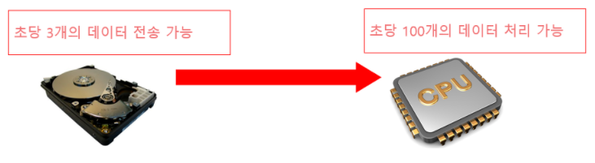
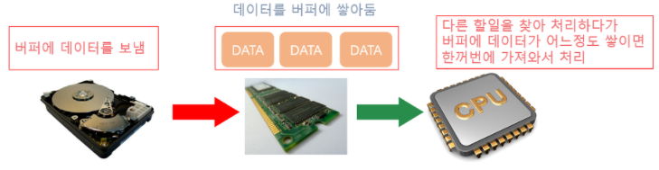
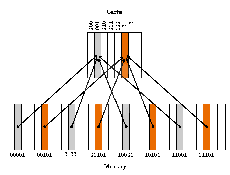

# 버퍼와 캐시

# 버퍼
## 버퍼란?
버퍼는 데이터를 한 곳에서 다른 한 곳으로 전송하는 동안 일시적으로 그 데이터를 보관하는 **메모리의 영역**이다.
정확히 말하면 A와 B가 서로 입출력을 수행하는데에 있어서 **속도차이를 극복하기 위해 사용하는 임시 저장 공간**

## 버퍼링(buffering)
버퍼를 활용하는 방식 또는 버퍼를 채우는 동작
다른 말로 '큐(Queue)'라고도 표현

## 동영상 스트리밍 서비스에서의 버퍼

우리가 버퍼를 가장 쉽게 접할 수 있는 곳은 유튜브같은 동영상 스트리밍 사이트이다.
스트리밍 사이트에서 실시간으로 동영상을 보게 되면 보통 **동영상이 진행되는 부분(빨간색)**과 서버로부터 **동영상을 내려받은 부분(밝은 회색)** 그리고 앞으로 다운로드가 남은 부분을 본 적이 있을 것이다.

여기서 저 밝은 회색부분이 **버퍼**라고 볼 수있다.
동영상 데이터가 내려 받아지는 속도에 비해 우리가 동영상을 1초씩 진행되며 보는 속도에는 차이가 있다.
만약 우리가 동영상을 보는 속도(빨간색)와 데이터를 내려받는 속도(밝은 회색)가 같다면 동영상 재생시간이 50분짜리 동영상이라면 50분 동안 데이터를 내려받아야한다.

BUT! 이는 비효율적이므로 버퍼라는 임시 저장 공간을 두고 동영상 데이터를 버퍼에 최대한 빠른 시간 안에 내려받아 저장해 둡니다.
동영상 시청자는 동영상을 보는 동안 어드덧 동영상이 버퍼에 모두 다운로우 되어 있을 것이다.

또 영상을 보다보면 멈추는 겨우가 있을 것이다. 우리가 버퍼링이라고 부르는 현상인데 이것은 동영상을 버퍼에 다운로드 하는 속도가 동영상을 시청하는 속도를 따라가지 못해 빨간 부분이 회색 부분을 따라잡게 됐고 동영상이 멈추는 것이다.

## 입출력에서 사용되는 버퍼
프로그래밍이나 운영체제에서 사용하는 버퍼는 거의 대부분 **CPU**와 **보조기억 장치** 사이에서 사용되는 임시 저장 공간을 의미한다.

CPU는 기술의 발전함에 따라 1초에 수십억 bit 그 이상의 데이터를 처리할 수 있다.

그러나 보조기억장치의 경우 데이터를 주고 받는데에 많은 시간이 필요하다. 물리적인 HDD(하드디스크)의 경우 빨라도 초당 100mb ~ 300mb
처리가능하다.

- 처리속도 : CPU >>>>>>>>> 보조기억장치

간단히 설명하면 CPU는 1초에 100개의 데이터를 처리할 수 있지만 정착 처리할 데이터를 가지고 있는 보조기억 장치는 데이터를 1초에 세개 밖에 보내주지 못하는 것이다. CPU입장에서는 아무리 일을 열심히 하고 싶어도 데이터를 보내주지 않기 때문에 능력에 비해 97개 만큼 효율성을 읽게 된다.

이 문제를 해결하기 위해 버퍼를 사용한다. 버퍼는 CPU 내부에 있는 캐시메모리 보다는 느리지만 보조 기억장치보다 훨씬 빠른 주기억장치(RAM)을 이용한다. 보조기억장치는 주기억장치의 버퍼로 마련해둔 공간의 데이터를 열심히 보내 쌓아 둔다. CPU는 처리가 빠르므로 밀려있는 다른일을 처리한 후 시간이 남을 때 가끔 버퍼를 확인하여 데이터가 쌓였는지 확인하고 모두 쌓였다면 가져다 한번에 처리한다.

그 덕분에 CPU는 100퍼센트 효율로 연산이 가능한다.

### 언제 버퍼를 사용해야할까
아래 참고문헌의 스택오버플로우를 참고하자

버퍼 I/O가 없으면 각 읽기 또는 쓰기 요청이 기본 OS에서 직접 처리됨을 의미한다. 이건 각각의 그러한 요청이 종종 디스크 엑세스, 네트워크 활동 또는 상대적으로 비용이 많이 드는 기타 작업을 트리거하기 때문에 프로그램을 훨씬 덜 효율적으로 만들 수 있다. 이런 종류의 오버헤드를 줄이기 위해 자바 플랫폼은 버터링된 I/O 스트림을 구현한다. 버퍼링된 입력 스트림은 버퍼로 알려진 메모리 영역에서 데이터를 읽는다.

[JAVA 문자스트림, 버퍼스트림](https://yooniron.tistory.com/19)
[JAVA 예제](https://onlyfor-me-blog.tistory.com/368)

- JAVA에서 스트림 공부후 다시 다시 정리할 것...

### 버퍼의 장점
1. 문자를 묶어서 한 번에 전달하므로 전송시간이 적게 걸려 성능이 향상된다.
2. 사용자가 문자를 잘못 입력했을 경우 수정할 수 있다.

# 캐시
## 캐시란?
도입 개념은 버퍼와 매우 유사
**입출력 처리 속도 지연을 방지하는 것은 버퍼와 유사하나 여기에 추가로 연산 처리속도를 극대화하기 위해 도입된 개념**

ex)
- CPU코어와 메모리 사이의 병목 현상완화
- 웹 브라우저 캐시 파일은, 하드디스크와 웹페이지 사이의 병목현상을 완화

**듀얼 코어 프로세서의 캐시 메모리**
각 코어마다 등록 된 L1캐시 메모리를 가지고, 두 코어가 공유하는 L2 캐시 메모리가 내장됨

- L1 : CPU 내부에 존재
- L2 : CPU와 RAM 사이에 존재
- L3 : 보통 메인보드에 존재

### 디스크 캐시
주기억장치(RAM)와 보조기억장치(하드디스크) 사이에 존재하는 캐시

## 캐시 메모리 작동원리
- 시간 지역성 : for 나 while 같은 반복문에 사용하는 조건 변수처럼 한번 참조된 데이터는 잠시후 또 참조될 가능이 높음
- 공간 지역성 : A[0],A[1]과 같은 연속 접근 시, 참조된 데이터 근처에 있는 데이터가 잠시후 또 사용될 가능성이 높음

캐시에 데이터를 저장할 때는, 이러한 참조 지역성(공간)을 최대한 활용하기 위해 해당 데이터뿐만 아니라, 옆 주소의 데이터도 같이 가져와 미래에 쓰일 것을 대비한다.

CPU가 요청한 데이터가 있으면 'Cache Hit',
없어서 DRAM에서 가져오면 'Cache Miss' 

### 캐시 미스의 경우
1. Cold miss : 해당 메모리 주소를 처음 불러서 나는 미스
2. Conflict miss : 캐시 메모리에 A와 B 데이터를 저장해야 하는데, A와 B가 같은 캐시 메모리 주소에 할당되어 있어서 나는 미스 ex) 항상 핸드폰과 열쇠를 오른쪽 주머니에 넣고 다니는데, 잠깐 친구가 준 물건을 받느라 손에 들고 있던 핸드폰을 가방에 넣었음. 그 이후 핸드폰을 찾으려 오른쪽 주머니에서 찾는데 없는 상황
3. Capacity miss : 캐시 메모리의 공간이 부족해서 나는 미스

캐시의 크기를 키우면 해결된다.
BUT 캐시 접근 속도가 느려지고 파워를 많이 먹는 단점이 생긴다.

## 캐시 동작 방식
- Direct Mapped Cache

가장 기본적인 구조로, DRAM의 여러 주소가 캐시 메모리의 한 주소에 대응되는 다대일 방식

현재 그림에서는 메모리 공간이 32개(00000~11111)이고, 캐시 메모리 공간은 8개(000~111)인 상황

ex) 00000, 01000, 10000, 11000인 메모리 주소는 000 캐시 메모리 주소에 맵핑

이때 000이 '인덱스 필드', 인덱스 제외한 앞의 나머지(00, 01, 10, 11)를 '태그 필드'라고 한다.

이처럼 캐시메모리는 인덱스 필드 + 태그 필드 + 데이터 필드로 구성된다.

간단하고 빠른 장점이 있지만, Conflict Miss가 발생하는 것이 단점이다. 위 사진처럼 같은 색깔의 데이터를 동시에 사용해야 할 때 발생한다.

### JAVA에서 캐시
[java에서 캐싱](https://tecoble.techcourse.co.kr/post/2020-06-24-caching-instance/)
해당 링크 아래 Lotto문제를 읽어보자

## 캐시 서버(Cache Server)란?
**캐시 서버**는 인터넷 서비스 속도를 높이기 위해 사용자와 가까운 곳에 데이터를 임시 저장하여 빠르게 제공해주는 **프록시 서버**를 의미한다. 이미지나 동영상과 같은 무거운 데이터들은 반복적으로 사용되면서 변경되기 어려운 경우가 많다. 이러한 데이터들을 캐시서버에 넣어 놓으면 사용자들이 빠르게 데이터를 받아 볼 수 있다.

예를 들면, 만약 내가 사용하는 유튜브 서비스의 서버가 한국내가 아닌 외국에 있을 경우, 외국과의 통신에 필요한 시간은 국내 서버보다 매우 오래 걸린다. 이 경우 국내에 캐시 서버를 설치하여 데이터를 빠르게 전달하여 서비스 속도를 원활하게 제공할 수 있어야한다. 이러한 캐시 서버를 이용하여 해외로 가야하는 트래픽을 국가 내부에서 사용되게 할 수 있고, 이는 해외 회선 사용료 절감에 도움을 준다.

## ++스풀
버퍼와 유사한 용어로 스풀(spool)이 있다. 스풀은 CPU와 입출력장치가 독립적으로 동작하도록 고안된 소프트웨어적인 버퍼로, 대표적으로 **프린터 스풀러** 가 있다. 스풀러는 인쇄할 내용을 순차적으로 출력하는 소프트웨어로, 출력 명령을 내린 프로그램과 **독립적**으로 동작한다.

우리가 인쇄기를 통해 인쇄를 한다고 가정해보자. 만약 스풀러가 존재하지 않는다면 모든 출력이 끝날때까지 다른 행동을 하지 못한다(한글,워드프로세스 등등) 그러나 스풀러를 사용하게 되면 인쇄할 내용을 하드디스크의 스풀러 공간에 저장하고 다른 작업을 할 수가 있다. 즉, 각 작업이 독립적으로 진행되는 것이다.

스풀러는 일종의 버퍼이지만 기존의 버퍼와 다른 점이 있다. 버퍼의 경우에는 어떤 프로그램이 사용하든 버퍼가 가득 차야지 이동이 시작된다. 즉, 하나의 버퍼를 여러 프로그램들이 공유하는 것이다. 그러나 스풀러는 **한 인쇄물이 완료될 때까지 다른 인쇄물이 끼어들 수 없다.** 즉, 프로그램들 간에 배타적이다.

# 참고문헌

[버퍼를 왜 써야 할까](https://stackoverflow.com/questions/22436289/when-to-use-buffer-and-what-for)

[버퍼의 장점](https://tcpschool.com/cpp/cpp_io_streamBuffer)

[java에서 캐싱](https://tecoble.techcourse.co.kr/post/2020-06-24-caching-instance/)