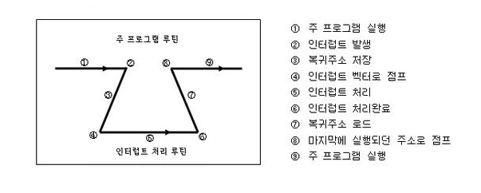
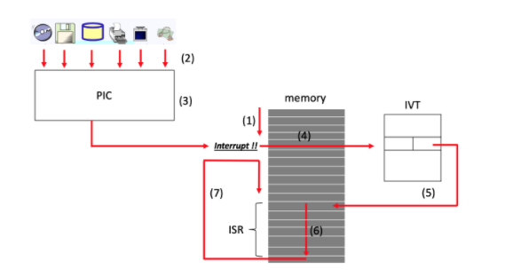

# 인터럽트

## 인터럽트란?
프로그램을 실행하는 도중에 예기치 않은 상황이 발생할 경우 현재 실행 중인 작업을 즉시 중단하고, 발생된 상황에 대한 우선 처리가 필요함을 CPU에게 알리는 것

지금 수행중인 일보다 더 중요한 일(ex. 입출력, 우선순위연산)이 발생하면 그 일을 먼저 처리하고 나서 하던 일을 계속해야한다.

외부/내부 인터럽트는 **CPU의 하드웨어 신호에 의해 발생**<br/>
소프트웨어 인터럽트는 **명령어의 수행에 의해 발생**

- 외부 입터럽트<br/>
    입출력 장치, 타이밍 장치, 정원 등 외부적 요인으로 발생<br/>
    `전원 이상, 기계 착오, 외부 신호, 입출력`

- 내부 입터럽트<br/>
    Trap이라고 부르며, 잘못된 명령이나 데이터를 사용할 때 발생<br/>
    `0으로 나누기가 발생, 오버플로우, 명령어를 잘못 사용한 경우(Excption)`

- 소프트웨어 인터럽트<br/>
    프로그램 처리 중 명령의 요청에 의해 발생한 것(SVC 인터럽트)<br/>
    `사용자가 프로그램을 실행시킬 때 발생
    소프트웨어 이용 중에 다른 프로그램을 실행시키면 시분할 처리를 위해 자원할당 동작이 수행된다.`

### 개념의 일반화
선생님(CPU)가 강의를 하고 있다. 이때 한 학생이 선생님의 말을 끊는다.<br/>
"저 질문이 있습니다!"<br/>
바로 이 학생이 한 행동이 **인터럽트**라고 한다.<br/>

선생님은 학생의 질문을 먼저 처리하고, 다시 원래 했던 강의로 돌아가 강의를 할 것이다.<br/>

## 주요 인터럽트 예시

1. 0으로 나누는 코드 실행시

```
#include <stdio.h>

int main()
{
	printf("Hello World!\n");
    int data;
    int divider = 0;
    data = 1 / divider; // 이 부분에서 인터럽트 발생
    return 0;
}
```

2. 타이머 인터럽트<br/>
일정시간(아주 짧은 시간)마다 하드웨어로부터 인터럽트를 운영체제에 알려주는 방식, **선점형 스케쥴러**를 위해 필요(시분할)<br/>

3. 입출력 입터럽트<br/>
프린터/키보드/마우스/저장매체/ 등에서 운영체제에 알리는 방식<br/>


## 인터럽트 처리 과정

 

  


입터럽트 방식은 하드웨어로 지원을 받아야하는 제약이 있지만, 폴링에 비해 신속하게 대응하는 것이 가능하다. 따라서 **실시간 대응**이 필요한 때는 필수적인 기능이다.


## 인터럽트 우선 순위
 

### 인터럽트 우선순위 체제의 목적
우선순위 인터럽트 체제의 목적은 CPU에 연결되어 있는 여러 장치에서 **동시에 하나 이상의 인터럽트가 발생하였을때** 먼저 서비스할 장치를 결정하기 위해서이다.

### 소프트웨어적인 인터럽트 우선순위 판별 방법 : Polling
소프트웨어적인 방법은 인터럽트 발생 시 높은 우선순위의 인터럽트 자원부터 인터럽트 요청 플래그를 검사하여, 우선순위가 가장 높은 인터럽트 자원을 찾아내 루틴을 수행하는 방식

- 많은 인터럽트가 있을 경우, 모두 조사하는데 시간이 걸려 처리속도가 느림
- 회로가 간단함
- 융통성이 있음
- 별도의 하드웨어가 필요없어 경제적

### 하드웨어적인 인터럽트 우선순위 판별 방법 : Vectored Interrupt
CPU와 인터럽트를 요청할 수 있는 장치 사이에 장치 번호에 해당하는 버스를 직렬이나 병렬로 연결하여 요청 장치의 번호를 CPU에게 알리느 방식

- 인터럽트 벡터란, 인터럽트를 발생한 장치가 프로세서에게 분기할 곳에 대한 정보를 제공하는 것
- 장치 판별을 위한 별도의 프로그램 루틴이 없어 응답 속도가 빠름
- 회로 복잡
- 융통성이 없다.
- 추가적인 하드웨어가 필요하므로 비경제적

#### 직렬(Serial) 우선순위 부여 방식 = 데이지체인(Daisy-chain)
- 인터럽트가 발생하는 모든 장치를 한 개의 회선에 직렬로 연결
- 우선순위가 높은 장치를 선두에 위치시키고 나머지를 우선순위에 따라 차례로 연결
- 호스트에 가까운 쪽에 높은 우선권을 두는 경우가 많음

#### 병렬(Parallel) 우선순위 부여 방식
- 인터럽트가 발생하는 각 장치를 개별적인 회선으로 연결
- Mask Register의 비트 위치에 따라 우선순위 결정
- Mask Register는 우선순위가 높은 것이 서비스를 받고 있을때, 우선순위 낮은 것을 비활성화 할 수 있다.
- 우선순위가 높은 인터럽트는 낮은 인터럽트가 처리되는 중에도 우선적으로 처리됨

## 정리
인터럽트는 **발생시기를 예측하기 힘든 경우에 컨트롤러가 가장 빠르게 대응할 수 있는 방법이다.**


|       | H/W | S/W |
|-------|------|------|
| 속도   | 빠름  | 느림    |
| 회로  | 복잡    | 간단    |
| 융통성 | 없음    | 있음    |
| 경제적   | 비경제적    | 경제적    |


## 참고문헌

[인터럽트 개념](https://github.com/gyoogle/tech-interview-for-developer/blob/master/Computer%20Science/Operating%20System/Interrupt.md)

[인터럽트 처리과정](https://whatisthenext.tistory.com/147)

[인터럽트 우선순위](https://devkim93.tistory.com/entry/%EC%9D%B8%ED%84%B0%EB%9F%BD%ED%8A%B8-%EC%9A%B4%EC%84%A0%EC%88%9C%EC%9C%84Priority-%EC%B2%B4%EC%A0%9C)