# 네트워크

## OSI 7계층

 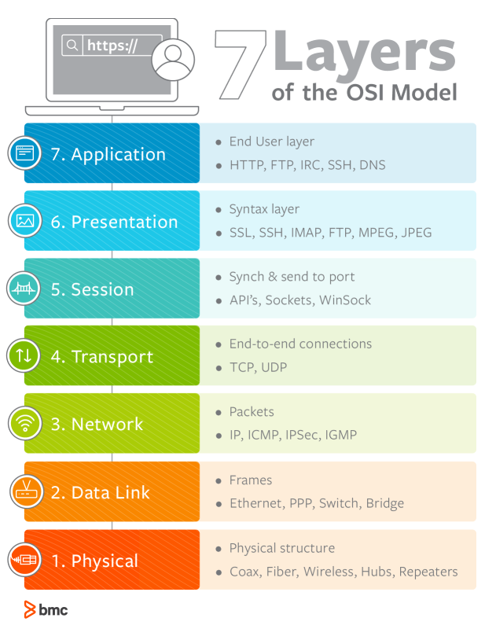

**7계층은 왜 나눌까?** 
`통신이 일어나는 과정을 단계별로 알 수 있고, 특정한 곳에서 이상이 생시면 그 단계만 수정할 수 있기 때문이다.`

### 물리계층(Physical)
 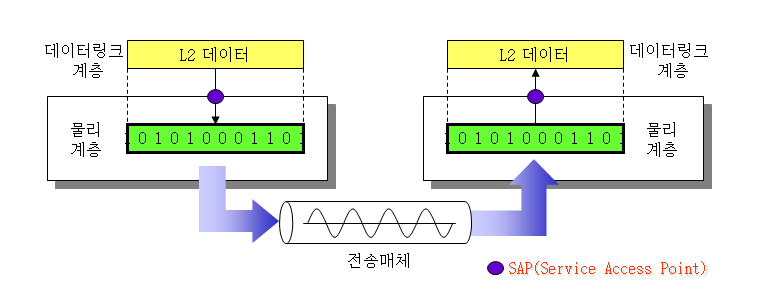

> 리피터, 케이블, 허브 등

단지 데이터 전기적인 신호로 변환해서 주고 받는 기능을 진행하는 공간
즉, **데이터를 전송하는 역할만 진행한다.**
- 데이터 전송 단위 : 비트 스트림

### 데이터 링크계층(Data Link)
 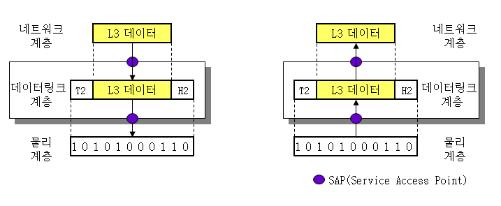

> 브릿지, 스위치 등

물리계층으로 송수신되는 정보를 관리하여 안전하게 전달되도록 도와주는 역할 
Mac 주소를 통해 통신한다. 프레임에 Mac 주소를 부여하고 에러검출, 재전송, 흐름 제어를 진행한다. 
- 데이터 전송 단위 : 프레임

### 네트워크(Network)
 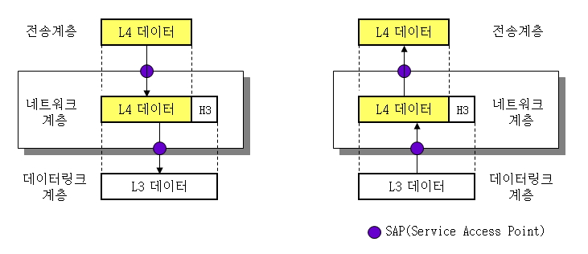

> 라우터, IP

데이터를 목적지까지 가장 안전하고 빠르게 전달하는 기능을 담당한다. 
라우터를 통해 이동할 경로를 선택하여 IP주소를 지정하고, 해당 경로에 따라 패킷을 전달해준다. 
라우팅, 흐름 제어, 오류 제어, 세그먼테이션 등을 수행한다. 
- 데이터 전송 단위 : 패킷

### 전송계층(Transport)
 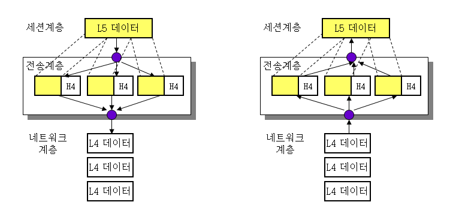

> TCP, UDP

TCP와 UDP 프로토콜을 통해 통신을 활성화한다. 포트를 열어두고, 프로그램들이 전송을 할 수 있도록 제공해준다. 
- TCP : 신뢰성, 연결지향적
- UDP : 비신뢰성, 비연결성, 실시간

- 데이터 전송 단위 : 세그먼트

### 세션계층(Session)
 

> API, Socket

데이터가 통신하기 위한 논리적 연결을 담당한다. TCP/IP 세션을 만들고 없애는 책임을 지니고 있다.
- 데이터 전송 단위 : 데이터/메시지

### 표현계층(Presentation)
 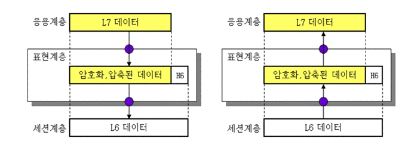

> JPEG, MPEG 등

데이터 표현에 대한 독립성을 제공하고 암호화하는 역할을 담당한다. 
파일 인코딩, 명령어를 포장, 압축, 암호화한다. 
- 데이터 전송 단위 : 데이터/메시지

### 응용계층(Application)
 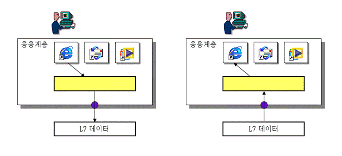

> HTTP, FTP, DNS 등

최종 목적지로, 응용 프로세스와 직접 관계하여 일반적인 응용 서비스를 수행한다. 
사용자 인터페이스, 전자우편, 데이터베이스 관리 등의 서비스를 제공한다. 
- 데이터 전송 단위 : 데이터/메시지

## TCP
여기서 부터는 TCP에 관련하여 정리할 것이다.

### Transport Layer VS Networt Layer
- Transport Layer : `Application 프로세스`들 간의 `논리적인 통신`을 제공
- Network Layer : `host`간의 `논리적인 통신`을 제공
    - 데이터의 전달 경로를 설정하는 역할

### TCP VS UDP
- UDP와 TCP는 각각 별도의 포트 주소공간을 관리하므로 같은 포트 번호를 사용해도 무방하다. 즉, **두 프로토콜에서 동일한 포트 번호를 할당해도 서로 다른 포트로 간주한다.**

#### TCP와 UDP의 공통점
- 포트 번호를 이용하여 주소를 지정
- 데이터 오류 검사를 위한 체크섬 존재

#### TCP와 UDP의 차이점
|       | TCP |  UDP |
|-------|------|------|
| 연결방식   |   연결형서비스  | 비 연결형 서비스    |
| 패킷 교환 방식  | 가상 회선 방식    | 데이터그램 방식   |
| 전송 순서 | 전송 순서 보장    | 전송 순서가 바뀔 수 있음    |
| 수신 여부 확인   | 수신 여부를 확인함    | 수신 여부를 확인하지 않음    |
| 통신 방식     |  1:1 통신만 가능    |  1:1 / 1:N / N:N 통신 모두 가능    |
| 신뢰성      |  높음    |  낮음    |
| 속도      | 느림     |  빠름    |

### 3-Way Handshake와 4-Way Handshake
> 연결을 성립하고 해제하는 과정을 말함

#### 3-Way Handshake
- TCP 통신을 이용하여 데이터를 전송하기 위해 네트워크 **연결을 설정(Connection Establish)** 하는 과정
- 양쪽 모두 데이터를 전송할 준비가 되었다는 것을 보장하고, 실제로 데이터 전달이 시작하기 전에 한 쪽이 다른 쪽이 준비되었다는 것을 알 수 있도록 한다.
- 즉, TCP/IP 프로토콜을 이용해서 통신을 하는 응용 프로그램이 데이터를 전송하기 전에 먼저 전확한 전송을 보장하기 위해 상대방 컴퓨터와 사전에 세션을 수립하는 과정을 의미한다.

- 3-Way Handshake 메커니즘 : PAR(Positive Acknowledgement with Re-transmission)을 통해 신뢰적인 통신을 제공한다. -> **PAR을 사용하는 기기는 ack을 받을 때까지 데이터 유닛을 재전송한다.**

 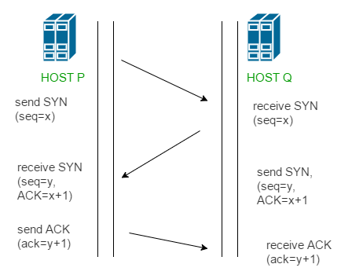

- SYN : 연결요청, 세션을 설정하는데 사용되며 초기에 시퀀스 번호를 보냄
- ACK : 보낸 시퀀스 번호에 TCP 계층에서의 길이 또는 양을 더한 것과 같은 같을 ACK을 포함하여 전송

1. 클라이언트가 서버에게 SYN 패킷을 보냄 (sequence : x)
2. 서버가 SYN(x)을 받고, 클라이언트로 받았다는 신호인 ACK와 SYN 패킷을 보냄 (sequence : y, ACK : x+1)
3. 클라이언트는 서버의 응답은 ACK(x+1)와 SYN(y) 패킷을 받고, ACK(y+1)를 서버로 보냄

이렇게 3번의 통신이 완료되면 연결 성립!!!!

#### 4 way handshake
연결 성립 후, 모든 통신이 끝났다면 해제를 해야한다.

 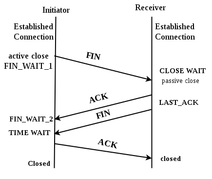

 - FIN : 세션을 종료시키는데 사용되며, 더 이상 보낸 데이터가 없음을 나타낸다.
- 포트(PORT) 상태 정보
    - CLOSED : 포트가 닫힌 상태
    - LISTEN : 포트가 열린 상태로 연결 요청을 대기중
    - ESTABLISHED: 포트 연결 상태
    - TIME_WAIT : 의도치 않는 에러로 인해 연결이 데드락으로 빠지는 것을 방지

 1. 클라이언트는 서버에게 연결을 종료한다는 FIN 플래그를 보낸다.
 2. 서버는 FIN을 받고, 확인했다는 ACK를 클라이언트에게 보낸다.(이때 모든 데이터를 보내기 위해 CLOSE_WAIT상태가 된다)
 3. 데이터를 모두 보냈다면, 연결이 종료되었다는 FIN 플래그를 클라이언트에게 보낸다.
 4. 클라이언트는 FIN을 받고, 확인했다는 ACK를 서버에게 보낸다.(아직 서버로 부터 받지 못한 데이터가 있을 수 있으므로 TIME_WAIT을 통해 기다린다.)
 - 서버는 ACK를 받은 이후 소켓을 닫는다.(Closed)
 - TIME_WAIT 시간이 끝나면 클라이언트도 닫는다.(Closed)

이렇게 4번의 통신이 완료되면 연결 해제!!

### TCP 관련 Q&A
Q. TCP의 연결 설정 과정(3단계)과 연결 종료 과정(4단계)이 단계가 차이나는 이유? 
A. Client가 데이터 전송을 마쳤다고 하더라도 Server는 아직 보낼 데이터가 남아있을 수 있기 때문에 일단 FIN에 대한 ACK만 보내고, 데이터를 모두 전송한 후에 자신도 FIN 메시지를 보내기 때문이다. 
[관련 Reference](https://ddooooki.tistory.com/21)

## 통신의 역사
**회선 교환(Circuit Switching) -> 패킷 교환(Packet Switching)**

### 회선 통신
> 통신하고자하는 두 호스트가 데이터를 전송하기 전에 미리 데이터 이동 경로를 하나 설정해 두는 방식 
따라서 미리 설정해둔 경로는 두 호스트만을 위한 전용 경로가 되고, 이 경로는 통해 처음부터 끝까지 모든 데이터가 왔다 갔다 함

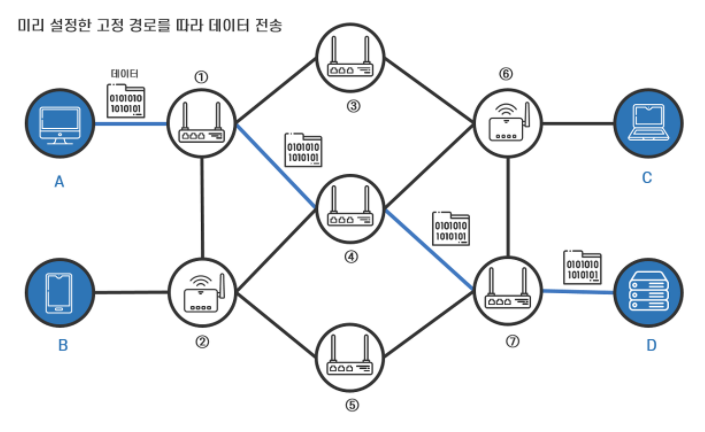

위 사진으로 예를 들면 A와 D가 통신하기 위해 설정한 경로인 **1-4-7**을 따라서 모든 데이터가 이동

#### 회선 통신의 단점
- 통신은 데이터를 전송하는 시점의 트래픽, 혼잡도 등의 요인에 따라 효율이 달라지게 되는데 이동경로를 단정지어버렸기 때문에 효율적이지 못한 경우가 발생함
- 이미 설정된 이동 경로는 할당 해제될 때까지 다른 호스트들이 사용할 수 없다.
- 단절에 매우 취약

### 패킷 통신
> 미리 이동 경로를 정하지 않고 **패킷(Pactet)이라는 작은 단위**로 나누어 다중 노드로 구성된 네트워크를 통해 전송하는 개념이다. 전송될 데이터는 네트워크를 통해 전송되기 전에 **패킷으로 쪼개어지고**, 각 패킷에는 **고유 번호가 지정**되어 있어서 네트워크를 거쳐 최종 **수신지에 도착했을 때에 번호를 순서대로 결합되어 원래 데이터로 완성되는 방식**

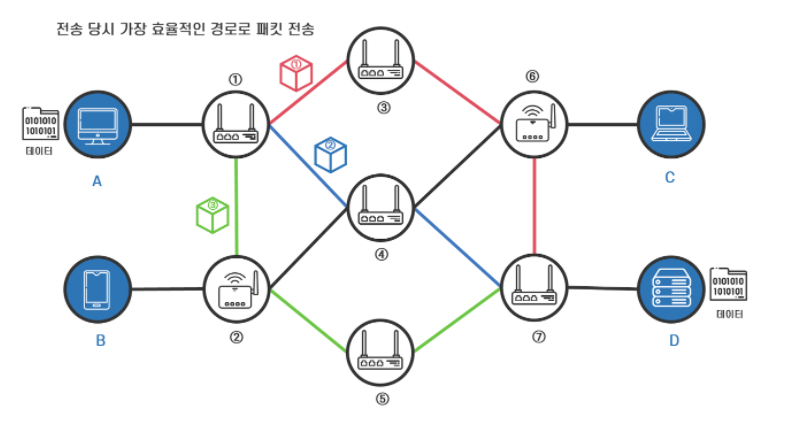

#### 라우터
**패킷을 수신한 중간 노드가 패킷의 최종 목적지(수신지)를 확인**하고, **목적지까지 가는 다양한 경로 중 딱 그 상황에서 가장 최적이라고 판단되는 경로를 따라 패킷을 이동시키는 '라우팅'** 해줘야한다. 이러한 라우팅을 수행하는 중간 노드가 **'라우터'**이다.

#### 캡슐화
데이터를 송신하는 **호스트에서는 해당 네트워크가 사용하는 프로토콜을 기반으로 데이터를 작은 단위로 분할**하고, 분할된 데이터들 각각의 앞에 **패킷 번호, 송신지 및 수신지 정보** 등 다양한 정보를 담은 **패킷 헤더**를 붙여 최종적으로 **'패킷'**이라는 형태로 변환하여 데이터를 전송하게 된다. **데이터를 잘게 쪼개어져 패킷이라는 단위로 변환되는 과정을 '캡슐화'**라고 한다.

#### 회선 통신의 단점을 극복한 패킷 통신
패킷 통신 방식을 사용하면, **중간 노드 각각에서 다른 노드로 이동할 때마다 최적의 경로를 통해 이동하기 때문에 전송 효율이 매우 높고**, 노드들 간의 **경로**를 **어느 한 패킷이 독점하는 것이 아닌 공유하는 형태이기 때문에 회선 교환방식보다 훨씬 효율적**이다.

### 패킷 통신 일반화
택배 보낼때 **운송장을 붙이는 행위도 캡슐화의 일종**이라고 볼 수 있다. 
해당 **택배의 최종 목적지 정보(주소)** 가 담겨 있기 때문이다. 
그리고 중간중간 거치는 **택배 물류 Hub**의 경우에는 네트워크를 이루는 **라우터**라고 할 수 있다. 
왜냐하면 각 Hub에서는 **가장 빠른 경로로 택배를 운송하기 위해 적절한 트럭에 상차시키는 행위(간선 상차)**를 하기 때문이다. 이 행위가 라우팅이다.

## 패킷 통신 규약 중 하나, TCP/IP
TCP/IP는 TCP 프로토콜과 IP프로토콜을 아울러 지칭하는 용어이다.
- TCP 프로토콜 : 신뢰성 있고, 무결성을 보장하는 연결을 통해 데이터를 안전하게 전달해주는 전송프로토콜
- IP 프로토콜 : 패킷들을 가장 효율적인 방법으로 최종 목적지로 전송하기 위해 필요한 프로토콜

> **TCP/IP 프로토콜을 따르는 네트워크 통신**이라면, 송신 호스트에서 전솔할 데이터를 **TCP/IP 4계층이라는 계층 구조에 따라 순차적으로 캡슐화를 하여 네트워크 전송**을 하게 된다. 그리고 **데이터를 수신하는 호스트**에서도 이 계층 구조에 따라 캡슐화된 패킷을 **역순으로 포장을 뜯어가며 원래 데이터를 확인**해볼 수 있게 되는 것이다.

## TCP/IP 4계층
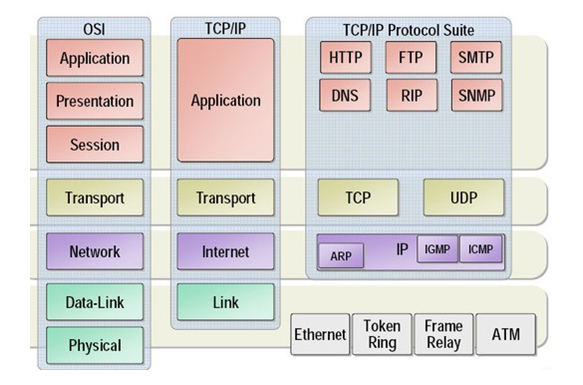

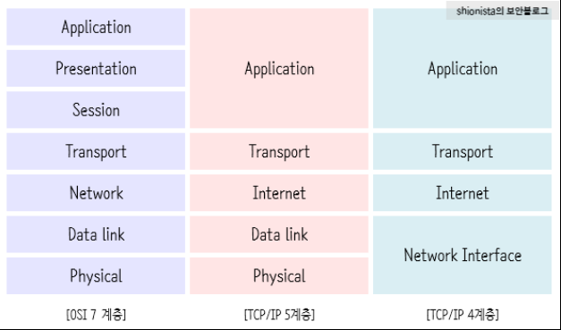

> Network Interface 계층 = Data Link 계층 + Physical 계층 

> 그냥 좀더 자세히 나누면 5계층이고 아님 4계층이다.ㅋㅋ.ㅋ.

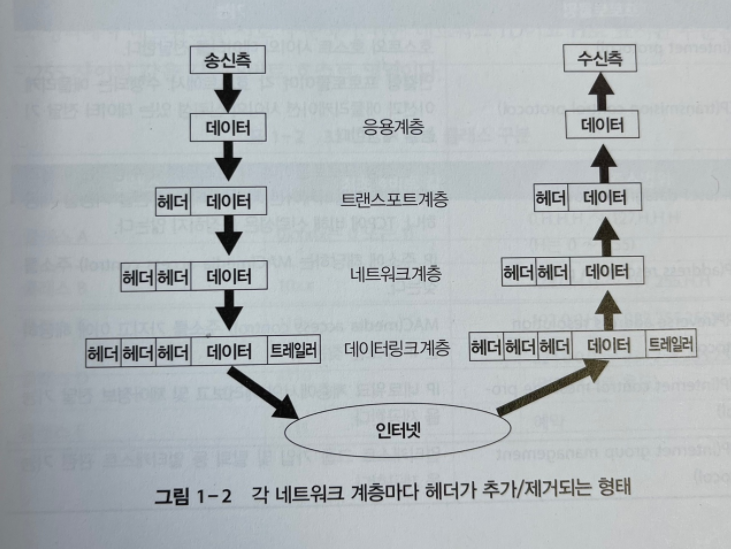

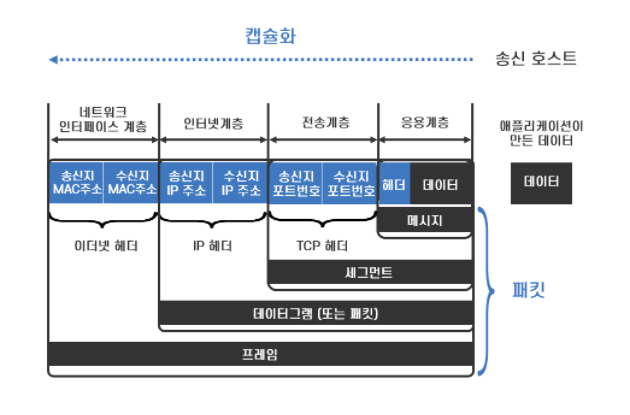

응용 계층에서 발생한 데이터가 송신 될때 각 네트워크 계층 마다 헤더가 추가되고 목적지로 도착하면 다시 각 계층 마다 헤더가 제거됨

> 응용 계층 : 어플리케이션 헤더 
  전송 계층 : TCP 헤더 송신지 포트번호 + 수신지 포트번호) 
  인터넷 계층 : IP 헤더 (송신지 IP 주소 + 수신지 IP 주소) 
  네트워크 인터페이스 계층 : 이더넷 헤더 (송신지 MAC 주소 + 수신지 MAC주소) + 트레일러(에러체크를 위한 32비트 CRC코드) 

### TCP/IP의 일반화
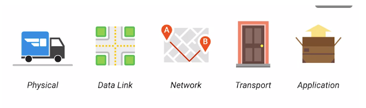

택배가 배달 오는 상황으로 이해 가능하다. 
물리계층은 배달 트럭과 도로이다. 
데이터 링크 계층은 한 교차로에서 다른 교차로로 어떻게 이동하는지에 방법이다. 
네트워크계층은 주소 A에서 주소 B로 가기 위해 어떤 도로를 타야하는지 알려준다. 
전송 계층은 배달 기사가 소포가 도착했다고 문을 두드린다. 
어플리케이션 계층은 내용물이다. 

## 피드백

### 프로세스, 스레드

Q : 스택을 스레드마다 독립적으로 할당하는 이유 
A : 스택은 함수 호출 시 전달되는 인자, 되돌아갈 주소값 및 함수 내에서 선언하는 변수 등을 저장하기 위해 사용되는 메모리 공간이므로 스택 메모리 공간이 독립적이라는 것은 독립적인 함수 호출이 가능하다는 것이고 이는 독립적인 실행 흐름이 추가되는 것이다. 
**따라서 스레드의 정의에 따라 독립적인 실행 흐름을 추가하기 위한 최소조건으로 독립된 스택을 할당한다.** 

Q : PC Register를 스레드마다 독립적으로 할당하는 이유 
A : PC값은 스레드가 명령어의 어디까지 수행하였는지를 나타나게 된다. 스레드는 CPU를 할당 받았다가 스케줄러에 의해 다시 선점당한다. 그렇기 때문에 명령어가 연속적으로 수행되지 못하고 어느 부분까지 수행했는지 기억할 필요가 있다. 이러한 상황을 해결하기 위해 독립적으로 할당 

Q : 멀티 프로세스 대신 멀티 스레드를 사용하는 이유 
    쉽게 말해, 프로그램을 여러 개 키는 것보다 하나의 프로그램 안에서 여러 작업을 해결하는 것 
A : 자원의 효율성 증대(시스템 콜이 줄어들어 자원을 효율적으로 관리 가능, 스레드는 프로세스 내의 메모리를 공유하기 때문에 독립적인 프로세스와 달리 스레드 간 데이터를 주고 받는 것이 간단해지기 때문에 자원소모 down) 
    처리 비용 감소 및 응답 시간 단축(스레드는 Stack 영역을 제외한 모든 메모리를 공유하기 때문에 프로세스 간의 전환속도보다 스레드간의 전환속도가 빠름)

++ 주의할 점 
동기화 문제 : 스레드 간의 자원 공유는 전역 변수(데이터 세그먼트)를 이용하므로 함께 사용할 때 충돌이 발생할 수 있다.

> 멀티 스레드 vs 멀티 프로세스 
> 멀티 스레드는 멀티 프로세스보다 적은 메모리 공간을 차지하고 문맥 전환이 빠르다는 장점이 있지만,  오류로 인해 하나의 스레드가 종료되면 전체 스레드가 종료될 수 있다는 점과 동기화문제가 있다.

### http, https
> HTTP vs HTTPS 
> HTTP는 암호화가 추가되지 않았기 때문에 보안에 취약하고, HTTPS는 안전하게 데이터를 주고 받을 수 잇다. 
> 하지만 HTTPS를 이용하면 암호화/복호화의 과정이 필요하기 때무에 HTTP보다 속도다 느리다. 
> HTTPS는 인증서를 발급하고 유지하기 위한 추가 비용이 발생한다. 

Q : 언제 HTTP를 쓰고 HTTPS를 쓸까? 
A : 개인정보와 같은 민감한 데이터를 주고 받아야 한다면 HTTPS를 이용, 단순한 정보 조회 등만을 처리한다면 HTTP 

HTTP버전별 차이 나중에 한번 제대로 정리할 것 
걍 버전이 증가할 수록 더 좋아진다.(body 데이터가 문자열에서 이진데이터로 바뀐다던가, 헤더를 잘 압축했다던가 등) 
상위 버전을 쓸려면 제공해주는 쪽과 사용하는 쪽다 상위 버전이여야한다. 아닐 경우 더 낮은 버전을 이용함 

### DNS
Q : 너가 만약 www.naver.com을 입력하면 일어나는 일 
A : 1. 사용자 www.naver.com입력 
    2. 도메인 네임을 DNS 서버에서 검색 
    3. DNS 서버에서 해당 도메인 네임에 해당하는 IP주소를 찾아 사용자가 입력한 URL정보와 함께 전달 
    4. 브라우저는 HTTP 프로토콜을 사용하여 요청 메시지를 생성 
    5. HTTP 요청 메시지는 TCP/IP 프로토콜을 사용하여 서버로 전송 
    6. 서버는 response 메시지를 생성하여 다시 브라우저에게 전송 
    7. 브라우저는 response를 받아 파싱하여 화면에 렌더링 

## 참고 문헌

[OSI 7 Layer](https://github.com/gyoogle/tech-interview-for-developer/blob/master/Computer%20Science/Network/OSI%207%20%EA%B3%84%EC%B8%B5.md)

[TCP/IP 역사](https://velog.io/@haero_kim/%EB%AC%BC-%ED%9D%90%EB%A5%B4%EB%93%AF-%EC%9D%BD%EC%96%B4%EB%B3%B4%EB%8A%94-TCPIP)

[TCP/IP 4 Layer](https://velog.io/@sunil1369/TCPIP-%EA%B8%B0%EC%B4%88%EC%99%80-JAVAC%EC%9D%84-%ED%99%9C%EC%9A%A9%ED%95%9C-%EB%84%A4%ED%8A%B8%EC%9B%8C%ED%81%AC-%ED%94%84%EB%A1%9C%EA%B7%B8%EB%9E%98%EB%B0%8D-1%EC%9E%A5)

[Handshake](https://velog.io/@averycode/%EB%84%A4%ED%8A%B8%EC%9B%8C%ED%81%AC-TCPUDP%EC%99%80-3-Way-Handshake4-Way-Handshake)

