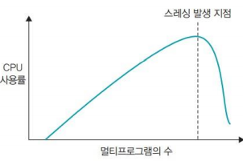

# 입출력과 네트워킹

- [입출력과 네트워킹](#입출력과-네트워킹)
  - [들어가며](#들어가며)
  - [인터럽트](#인터럽트)
  - [네트워킹](#네트워킹)
    - [네트워크 서비스를 사용하는 시나리오](#네트워크-서비스를-사용하는-시나리오)
  - [스레싱](#스레싱)
  - [참고문헌](#참고문헌)

## 들어가며

해당 챕터의 내용에서 키워드를 선별해서 스터디하였다.

키워드에 대한 스터디 방법은 지난 스터디때 같이 공유한바 있다. 이를 접목 시켜보겠다.

## 인터럽트

**정의**
  
    CPU와 I/O 장치 사이 속도 차이를 극복하기 위해, I/O 관리자를 두어 별도로 관리하는 방식이다.

특이사항으로 1번 과정에는 실행중인 프로세스가 중단되지 않고, 3번 과정에서는 중단되어 인터럽트 번호와 1대1 연결된 핸들러를 실행한다.
  
**지난 스터디 내용 보완**
  
지난 스터디 내용에서 I/O 버스는 다양한 장치를 아울러서 짧은 버스(이하 고속 입출력)도 있고 긴 버스(저속 입출력)도 있다고 하였다. 

데이터 전송 시, 누구를 메모리 버스로 올릴지에 대한 선택은 I/O 관리자 안에 **채널 선택기**가 진행한다.

    t가 타임라인 단위라면

    t1에서 고속 입출력으로 10번 받고, t2에는 저속 입출력으로 1번 받고
    t3에는 저속 입출력으로 1번 받고, t4에는 고속 입출력으로 10번 받고

    이런식으로 전송 속도별로 데이터를 조절해서 전송한다고 생각한다.

**개념의 일반화**

    본부와 지부가 있다면, 본부의 관리 부담을 지부에 분담하는 방식이 떠올랐다. 
    인터럽트라는 긴급 상황만 본부는 지부로부터 보고 받는다.

**자료형**

동시에 완료된 I/O 정보와 처리 방법을 담기 위해, 벡터 자료형을 사용한다.

    벡터는 동적 배열이다.

자료형에 관련한 트레이드 오프를 알아보는게 좋을 것 같다.

|        용이성        | 벡터  |
| :------------------: | :---: |
| 가변적으로 크기 변경 |   O   |
|    중간 삽입/삭제    |   X   |
|      순차 접근       |   O   |
|      랜덤 접근       |   O   |

**트레이드 오프**
  
인터럽트 처리 중에 또 다른 인터럽트가 발생하는 경우로 알아보겠다.

상황은 2가지이다.

ⅰ. 또 다른 인터럽트가 동일한 우선순위라면,

    또 다른 인터럽트를 허용하지 않는다.

ⅱ. 또 다른 인터럽트가 중요도가 높거나 낮다면,

    중요도에 따라 높은 중요도의 인터럽트를 먼저 처리한다는 장점과
    아사현상이라는 단점을 발견할 수 있겠다.

## 네트워킹

해당 키워드는 시나리오를 통해 알아보겠다.

### 네트워크 서비스를 사용하는 시나리오

슬라이드에 들어가기 전 상황은 이렇다.

1. 사용자는 웹 브라우저에 도메인을 입력한다.
2. 웹 브라우저는 `웹 서버 호스트(이하 서버)`로 사용자의 요청을 보내고 싶다.
    DNS에게 서버에 대한 IP주소를 요청한다.
3. IP주소를 받은 `웹 브라우저(이하 사용자)`는 주소를 사용하여 웹 서버에 접속한 후, 문서 루트에 있는 정보를 HTTP 요청한다.

이 3번 내용부터 [슬라이드](https://slides.com/kimyongki/deck-170a33/embed)로 확인해보자.

## 스레싱

**정의**
    
    하드디스크의 많아진 I/O로 잦은 페이지 부재로 작업이 거의 멈춰버린 상태이다.

**개념의 일반화**

    보관 창고(디스크의 스왑 영역)에서 재료(프로그램)를 도마(메모리)로 가져오거나 
    도마의 재료를 보관 창고로 옮기는 작업이 너무 많아져서 
    요리사(CPU)가 요리를 하지 못하는 경우이다.
  
**트레이드 오프**

    메모리를 늘려 스레싱 발생 지점을 늦출 수 있다는 장점과
    어느 순간부터 이 지점은 메모리를 계속 늘려도 성능은 좋아지지 않는다는 단점을 발견 할 수 있다.

## 참고문헌

[네트워크 서비스를 사용하는 시나리오](https://www.topcit.or.kr/upload/edubox/essence/ess_ko_03/index.html) -- TOPCIT

[인터럽트](https://zangzangs.tistory.com/106) -- 장장스

[벡터](https://jhnyang.tistory.com/230) -- 양햄찌

[「쉽게 배우는 운영체제」](http://www.yes24.com/Product/Goods/62054527) -- 조성호