# 입출력과 네트워킹

- [입출력과 네트워킹](#입출력과-네트워킹)
  - [들어가며](#들어가며)
  - [인터럽트](#인터럽트)
  - [네트워킹](#네트워킹)
    - [네트워크 서비스를 사용하는 시나리오](#네트워크-서비스를-사용하는-시나리오)
  - [스레싱](#스레싱)
  - [참고문헌](#참고문헌)

## 들어가며

해당 챕터의 내용에서 키워드를 선별해서 스터디하였다.

키워드에 대한 스터디 방법은 지난 스터디때 같이 공유한바 있다. 이를 접목 시켜보겠다.

먼저, 지난 주차에서 누락된 설명인 입출력 제어기에서 중재하는 부분을 설명하겠다.

## 인터럽트

**정의**
  
    CPU와 I/O 장치 사이 속도 차이를 극복하기 위해, I/O 관리자를 두어 별도로 관리하는 방식이다.

**개념의 일반화**

    ...

**자료형**

동시에 완료된 I/O 정보와 처리 방법을 담기 위해, 벡터 자료형을 사용한다.

    벡터는 동적 배열이다.

자료형에 관련한 트레이드 오프를 알아보는 것도 좋을 것 같다.

|        용이성        | 벡터  |
| :------------------: | :---: |
| 가변적으로 크기 변경 |   O   |
|    중간 삽입/삭제    |   X   |
|      순차 접근       |   O   |
|    foseja wjqrms     |   O   |

**트레이드 오프**
  
인터럽트 처리 중에 또 다른 인터럽트가 발생하는 경우를 알아보겠다.

상황은 2가지이다.

ⅰ. 또 다른 인터럽트가 동일한 우선순위라면,

    또 다른 인터럽트를 허용하지 않는다.

ⅱ. 또 다른 인터럽트가 중요도가 높거나 낮다면,

    중요도에 따라 높은 중요도의 인터럽트를 먼저 처리한다. 아사현상이라는 단점을 발견할 수 있겠다.

## 네트워킹

또 다른 키워드로 해당 키워드는 시나리오를 통해 알아보겠다.

### 네트워크 서비스를 사용하는 시나리오

슬라이드에 들어가기 전 상황은 이렇다.

1. 사용자는 웹 브라우저에 도메인을 입력한다.
2. 웹 브라우저는 웹 서버 호스트(이하 서버)로 사용자의 요청을 보내고 싶다.
    DNS에게 서버에 대한 IP주소를 요청한다.
3. IP주소를 받은 웹 브라우저(이하 사용자)는 주소를 사용하여 웹 서버에 접속한 후, 문서 루트에 있는 정보를 HTTP 요청한다.

이 3번 내용부터 [슬라이드](https://slides.com/kimyongki/deck-170a33/embed)로 확인해보자.

## 스레싱

**정의**
    
    하드디스크의 많아진 I/O로 잦은 페이지 부재로 작업이 거의 멈춰버린 상태이다.

**개념의 일반화**

    ...

**자료형**
  
**트레이드 오프**

## 참고문헌

[네트워크 서비스를 사용하는 시나리오](https://www.topcit.or.kr/upload/edubox/essence/ess_ko_03/index.html) -- TOPCIT

[인터럽트](https://zangzangs.tistory.com/106) -- 장장스

[벡터](https://jhnyang.tistory.com/230) -- 양햄찌

[「쉽게 배우는 운영체제」](http://www.yes24.com/Product/Goods/62054527) -- 조성호