# 파이썬 코테 대비 총정리

## 목차
## 1. 파이썬이란?
## 2. 자료형
## 3. 자료구조


# 파이썬이란?
## 인터프리터 언어 파이썬
> 장점 :<br/>
> 컴파일과정 없이 바로 실행하기 때문에 수정, 디버깅에 유리하다. 즉 **개발속도에 유리**<br/>
> 각 플랫폼에 지원하는 인터프리터만 있다면 실행 가능하기 때문에 **플랫폼에 독립적**이다.<br/>

> 단점 : <br/>
> 빌드 되어 있는 컴파일 언어 프로그램보다 **실행시간이 느리다.**<br/>
> 코드를 열면 다 보이기 때문에 **보안에 취약**하다.<br/>

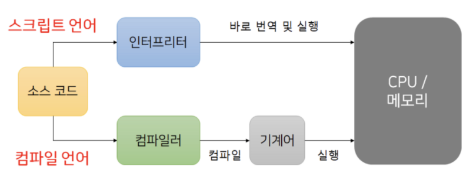

## 파이썬 자료형의 특징
**변수를 선언할 때, 자료형을 명시적으로 선언하지 않는다.** <br/>
왜 why? **동적 타입 언어**이기 때문에<br/>

자료형 없이 변수의 값을 대입하면 알아서 자료형이 지정된다.<br/>
동적타입 언어에서는 **컴파일 시가 아닌, 런타임(실행시간) 시에 변수의 형이 결정**된다.<br/>

### 동적타입 언어의 장단점
장점 : 유연하고 빠르게 코딩이 가능하다.<br/>
단점 : 실행시켜 보기 전에는 자료형에서 비롯되는 오류를 검출하기 어렵다.<br/>

# 자료형
- 수치 자료형 : int, float, complex
- 불 자료형 : bool
- 군집 자료형 : str, list, tuple, set, dictionary

## 수치 자료형
```python3
    i = 1000
    f = 999.999
    c = 21 + 3j
    print(type(i))
    print(type(f))
    print(type(c))
```

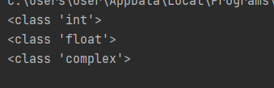

결과를 확인해보면 <br/>
int는 1,100 등의 정수형<br/>
float는 999.999, 3.14, 314e-2 등의 지수형<br/>
complex는 21 + 3j 등과 같은 복소수(실수부,허수부)<br/>
를 알수 있다.<br/>

## 불 자료형
boolean 값을 저장하기 위한 자료형

```python3
    isAlpha = True
    isBeta = False
    print(type(isAlpha))
    print(isAlpha)
    print(type(isBeta))
    print(isBeta)
```

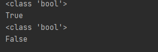

True/False 값을 저장하기 위한 자료형

## 군집 자료형
### str
문자열을 위한 자료형<br/>
**순서가 있고(인덱스 기반 접근 가능), 중복이 가능하며, 수정이 불가능한(Immutable)한 특성**을 가진다.
시퀀스 타입 <- 인덱스를 직접적으로 참조할 수 있다.
immutable(불변)


```python3
    s1 = "Hello, Python1"
    s2 = 'Hello' + 'Python2'
    print(type(s1))
    print(len(s1))
    print(s1[2]) #s1의 2번째 인덱스값 출력
    print(s1[2:5]) # s1의 2이상 5미만 인덱스 값 출력
    print(type(s2))
    print(len(s2))
    print(s2[2]) #s2의 2번째 인덱스값 출력
    print(s2[9:11]) # s2의 9이상 11미만 인덱스 값 출력
    #s2[2] = a #에러 값 수정 불가능
```

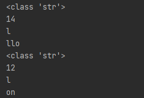

### list
list는 여러 값을 넣기 위한 자료형<br/>
**순서가 있고(인덱스 기반 접근 가능), 중복이 가능하며, 수정이 가능한 특성**을 가진다.

```python3
    L = [10,20,30,40,50]
    print(type(L))
    L.append(25) #25를 추가
    print(L)
    L.remove(10) #10 제거
    print(L)
    L.sort() # 정렬, 기본값은 오름차순 정렬 reverse옵션 True는 내림차순
    print(L)
    print(L[2])
    print(L[2:4])
    L = L + [60,70]
    print(L)
    
    L = L*2
    print(L)
```

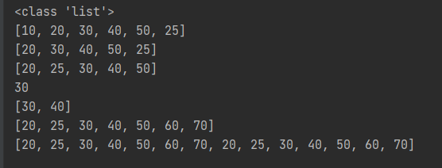

list의 관련된 메서드들은 다양하다.

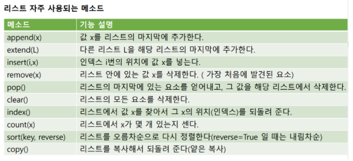

**메소드는 정리한다고 되는 것이 아니다 많이 코딩을 해보면서 익혀야한다.**

## tuple
**tuple 자료형은 변경이 불가능한 list 자료형**이라고 생각하면 쉽다.<br/>
**순서가 있고(인덱스 기반 접근 가능), 중복이 가능하며, 수정이 불가능(Immutable)한 특성**을 가진다.

```python3
    t = (10,20,30,40,50,10,10)
    print(t.count(10)) #값 10의 갯수
    print(t.index(20)) #값 20의 인덱스
```

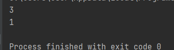

- 장점 :  **속도가 빠르다**
- 파이썬 native 함수 내부에서 주로 사용됨

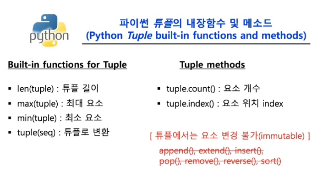

## set
set 자료형은 수학의 집합과 비슷한 개념이다.<br/>
**순서가 없고, 중복이 불가능하며, 수정이 가능한 특성**을 가진다.

```python3
    s = {10,20,30,40,50}
    print(type(s))
    s.add(60)
    print(s)
    s.remove(10)
    print(s)
    print(20 in s)
```
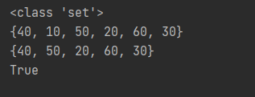

## dictonary
**순서가 없고, 중복이 불가능하며, 수정이 가능한 특성**을 가진다.

```python3
    d = {1:10,2:20,3:30,4:40,5:50}
    print(type(d))
    
    d[6] = 60 # key = 6, value = 60인 값 append
    print(d)
    
    print(d[1])
    
    del d[2]
    print(d)
    
    for k, value in d.items():
        print("key : ",k,"Value : ",value)
```

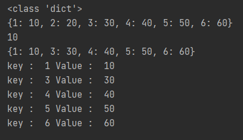

dictionary자료형은 **key:value형태**의 값들로 구성된다.

dictionary 자료형은 **key의 중복이 불가능**하고 **value의 중복은 가능**하다.


## 군집자료형 정리

|       | 인덱스 기반접근 여부 | immutable  |
|-------|------|---|
| str   | O    | X |
| list  | O    | O |
| tuple | O    | X |
| set   | X    | O |
| dict  | X    | O |


# 자료구조
## 자료구조란?
- 자료(data)를 담기 위한 저장공간과 연산을 통칭
- 자료구조  = 저장공간(memory) + 연산(읽기, 쓰기, 삽입, 삭제, 탐색)
- ex) 변수, 배열, 리스트

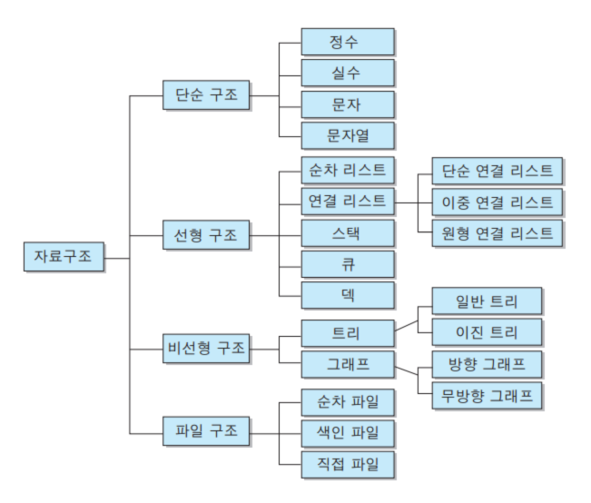

## 알고리즘이란?
- 자료를 입력받아 유한한 횟수의 연산들을 이용해 원하는 결과를 출력하는 것
- ex) 100개의 정수를 리스트 A에 담는다, 오름차순 정렬

> 자료구조와 알고리즘은 항상 같이 가는 바늘과 실 같은 존재

## 순차적(선형) 자료구조
### 1. array, list
- **index로 임의로 원소**에 접근 가능
- 연산자 []로 접근할 수 있다. 빅오 : O(1)
- 삽입(append, insert)
- 삭제(pop, remove)

> append와 pop은 O(1)이지만 insert와 remove는 O(n)

### 2. stack, queue, dequeue
- 제한된 접근(삽입 삭제)만 허용
- 다 내장되어 있어서 불러서 사용하면 됨

#### stack
- **LIFO(Last in First OUT)**
- 자루처럼 먼저 넣은 것이 밑에 있고, 꺼낼 때 나중에 넣은, 가장 위의 것이 나온다.
- push : 삽입. 아래에서부터 차곡차곡 삽입됨
- pop : 삭제.  맨 위 값(가장 나중에 들어온 값)에서부터 삭제
- 동적 배열을 사용해 구현해야한다.

```python3
class Stack:
    def __init__(self):
        self.items = [] #데이터 저장을 위한 리스트 준비

    def push(self, val):
        self.items.append(val)

    def pop(self): #가장 위에 있는 값을 반환. pop와 달리 삭제를 수행하지 않는다.
        try: #pop시전
            return self.items.pop()
        except IndexError: #indexError발생
            print("Stack is empty")

    def top(self):
        try:
            return self.items[-1]
        except IndexError:
            print("Stack is empty")

    def __len__(self): #len() 호출하면 stack의 item 수 반환
        return len(self.items)
```

사용 예시
```python3
S = Stack()
S.push(10)
S.push(2)
print(S.pop())#2
print(S.top())#10
print(len(S)) #1 -> 이렇게 호출하면 파이썬은 S.__len__()을 호출함
```

> 연산의 수행시간
- push : O(1)
- pop : O(1)
- top : O(1)
- len : O(1) -> 리스트에서 개수를 항상 알고 있기 때문에 값만 리턴


#### queue
- **FIFO(First In First Out)**
- 선착순(가장 먼저 온 사람이 가장 먼저 서비스를 받는다.)
- 삽입은 아래서부터 쌓임
- 삭제 역시 아래의 값(가장 먼저 들어온 값)부터 수행
- 링크드 리스트를 사용해 구현해야한다. -> 배열을 사용하게 되면 가장 앞에 있는 값을 없애면 인덱스를 다 옮겨주어야하므로 비 효율적이다.


```python3
class Queue:
    def __init__(self):
        self.items = []
        self.front_index = 0
    def enqueue(self,val): #삽입
        self.items.append(val)
    def dequeue(self): #삭제
        if self.front_index ==len(self.items): # 현재 dequeue할 수 있는 값이 없다.
            print("Queue is empty")
            return None
        else:
            x = self.items[self.front_index]
            self.front_index +=1
            return x
```

사용 예시
```python3
Q = Queue()
Q.enqueue(5)
Q.enqueue(-2)
Q.dequeue() #5
Q.enqueue(10)
Q.dequeue() #-2
```

> 연산의 수행시간
- enqueue : O(1)
- dequeue : O(1)

#### dequeue
- stack + queue
- 삽입은 **양옆**으로 수행 가능(append,appendleft)
- 삭제 역시 **양옆**으로 수행 가능(pop, popleft)
- 양 방향 연결리스트를 사용해 구현하여야한다. =
- 파이썬에서 큐는 무조건 dequeue를 사용해여함

> 연산의 수행시간
- Append : O(1)
- Appendleft : O(1)
- Pop : O(1)
- Popleft : O(1)


### 3. linked list(연결 리스트)
- 파이썬의 list는 배열과 유사. linked list와는 다르다.
- 값이 연속된 공간이 아닌 메모리 공간에 독립적으로 저장됨
- 다음 값이 저장된 주소를 갖고 있다.(link)
- 각각의 값은 **자기자신의 값과 함께 다음 값의 주소**를 갖고 있다.
- 마지막 요소는 다음 값의 주소 대신 `NUll`(Python에서는 None)을 갖고 있다.
- **index로 접근 x**
- n번째 값을 가져오고 싶다면 **첫번째부터 순차적으로 조회**해야함

#### 한 방향 연결 리스트 vs 양방향 연결 리스트
- **한 방향** : 링크가 한쪽 방향으로만 연결되어 있으므로, 한 방향으로만 갈 수 있고 반대 방향으로는 갈 수 없다.
- **양 방햔** : 양쪽 방향으로 링크가 있어서 노드의 양쪽 방향으로 모두 이동 가능

#### 노드 연결 구현해보기

```python3
class Node:
    def __init__(self, key= None):
        self.key = key
        self.next = None
    def __str__(self):
        return str(self.key) #print(v.key) 대신 print(v)로 쓸 수 있
```

사용 예시
```python3
a = Node(3)
b = Node(9)
c = Node(-1)

a.next = b
b.next = c
```

#### 한방향 연결 리스트

```python3
class Node:
    def __init__(self, key= None):
        self.key = key
        self.next = None
    def __str__(self):
        return str(self.key) #print(v.key) 대신 print(v)로 쓸 수 있


class SingleLinkedList:
    def __init__(self):
        self.head = None
        self.size = 0
    def __len__(self):
        return self.size
    def pushFront(self,key):
        new_node = Node(key)
        new_node.next = self.head
        self.head = new_node
        self.size += 1

    def pushBack(self,key):
        v = Node(key)
        if len(self) == 0:
            self.head = v
        else:
            tail = self.head
            while tail.next != None:
                tail = tail.next
            tail.next = v
        self.size += 1

    def popFront(self):
        if len(self) == 0:
            return None
        else:
            x = self.head
            key = x.key
            self.head = x.next
        self.size -= 1
        del x
        return key

    def popBack(self):
        if len(self) == 0:
            return None
        else:  # running techinque
            prev, tail = None, self.head
            while tail.next != None:
                prev = tail
                tail = tail.next
            if len(self) == 1:
                self.head = None
            else:
                prev.next = tail.next  # None
                key = tail.key
                del tail
                self.size -= 1
                return key
    def search(self, key):
        # key 값의 노드를 리턴, 없으면 None 리턴
        v = self.head
        while v.next != None:
            if v.key == key:
                return v
            v = v.next
        return None  # or return v (== None)

```

사용 예시

```python3
L = SingleLinkedList()
L.pushFront(-1) # [-1]->0
L.pushFront(9)  # [9]->[-1]->0
L.pushFront(3)  # [3]->[9]->[-1]->0
L.pushFront(5)  # [5]->[3]->[9]->[-1]->0
L.pushBack(4)  # [5]->[3]->[9]->[-1]->[4]->0
L.popFront()   # [3]->[9]->[-1]->[4]->0
L.popBack()    # [3]->[9]->[-1]->0 
```

> 연산의 수행시간
- pushFront : O(1)
- popFront : O(1)
- pushBack : O(n)
- PopBack : O(n)
- search : O(n)

#### 양방향 연결리스트

한방향 연결리스트의 단점 : 한쪽으로만 연결이 되어 있기 때문에 테일 노드에 대한 조작을 하고 싶을 때 직전의 노드(previous node)를 알고 있어야한다. 그래서 O(n)의 연산 시간을 사용한다.<br/>

위 문제를 해결하기 위해 양방향 연결리스트 등장<br/>

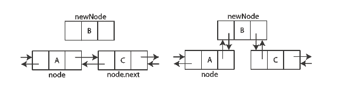

```python3
class Node:
    def __init__(self, key= None):
        self.key = key
        self.next = None
        self.previous = None


class DoublyLinkedList:
    def __init__(self):
        self.head = Node('head')

    def find(self, item):
        cur_node = self.head
        while cur_node.key != item:
            cur_node = cur_node.next
        return cur_node

    def insert(self,item,new):
        new_node = Node(new)
        cur_node = self.find(item)
        new_node.next = cur_node.next
        cur_node.next = new_node
        new_node.previous = cur_node

    def show(self):
        cur_node = self.head
        while cur_node.next is not None:
            print(cur_node.key, end=' -> ')
            cur_node = cur_node.next
        print(cur_node.key)

    def remove(self,item):
        cur_node = self.find(item)
        cur_node.previous.next = cur_node.next
        cur_node.previous = None

        if cur_node.next is not None:
            cur_node.next.previous = cur_node.previous
            cur_node.next =None

    def find_last(self):
        cur_node = self.head
        while cur_node.next is not None:
            cur_node = cur_node.next
        return cur_node

    def show_reverse(self):
        cur_node = self.find_last()
        while cur_node.previous is not None:
            print(cur_node.key, end=' <- ')
            cur_node = cur_node.previous
        print(cur_node.key)
```

사용예시
```python3
D = DoublyLinkedList()
D.insert('head','1')
D.insert('1','2')
D.insert('2','3')
D.insert('3','4')
D.show() #head -> 1 -> 2 -> 3 -> 4
D.remove('4')
D.show() #head -> 1 -> 2 -> 3
print(D.find_last().key) #3
D.show_reverse() #3 <- 2 <- 1 <- head
```

> 연산의 수행시간
- find : O(n)
- insert : O(1)
- remove : O(1)
- find_last : O(n)

### 해시 테이블(hash table)
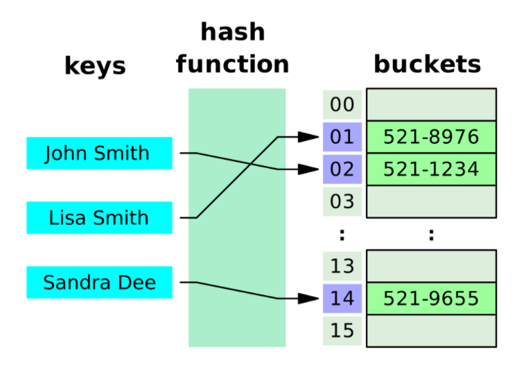
- 해시 테이블 : 키(Key)에 데이터(Value)를 저장하는 데이터 구조
- Key를 통해 데이터를 바로 받아올 수 있음 -> **속도가 획기적으로 빨라짐**
- 파이썬 딕셔너리(Dictionary) 타입이 해시 테이블의 예 - Key를 가지고 바로 데이터(Value)를 꺼냄
- 보통 배열로 미리 Hash Table 사이즈만큼 생성 후 사용(공간과 탐색 시간을 맞바꾸는 기법)
- 파이썬에서는 해쉬를 별도로 구현할 필요 없음. **왜 Why?** 딕셔너리 타입을 사용하면 되기 때문에 //무조건적이지 않으므로 다시 정리

#### 해시 테이블 용어
- 해시 : 임의 값을 **고정 길이로 변환**하는 것
- 해시 테이블 : 키값의 연산에 의해 **직접 접근이 가능한 데이터 구조**
- 해싱 함수 : Key에 대해 산술 연산을 이용해 **데이터 위치를 찾을 수 있는 함수**
- 해시 값 또는 해시 주소 : Key를 해싱 함수로 연산해서 해시 값을 알아내고, 이를 기반으로 해시 테이블에서 해당 **Key에 대한 데이터 위치를 일관성 있게 찾을 수 있음**
- 슬롯 : 한 개의 데이터를 저장할 수 있는 공간
- 저장할 데이터에 대해 Key를 추출할 수 있는 별도 함수도 존재할 수 있음

#### 해시 테이블 장단점
- 장점
  - 데이터 저장/읽기 속도가 빠름(검색 속도가 빠름)
  - 해시는 키에 대한 데이터가 있는지(중복) 확인이 쉽다.
- 단점
  - 일반적으로 저장공간이 좀 더 많이 필요
  - 여러 키에 해당하는 주소가 동일한 경우, 충돌을 해결하기 위해 별로의 자료구조가 필요함
- 주요 용도
  - 검색이 많이 필요한 경우
  - 저장, 삭제, 읽기가 빈번한 경우
- 시간 복잡도
  - 해시 충돌이 없는 경우 : O(1)
  - 해시 충돌이 있는 경우 : O(n)

#### 해시 충돌 해결
- Open hashing(개방 해시) : 충돌이 발생한 데이터에 대해서는 해시테이블 밖에 추가적인 데이터공간에 저장하는 방법 -> **channing 기법**
- Linear Probing(폐쇄 해시) : 해시 테이블의 빈 공간에 저장하는 방법

> 해결 알고리즘에 대해서는 다시한번 정리하자!

## 비선형 자료구조
- 트리 : 부모 노드와 N개의 자식 노드로 구성된 자료 구조이며, 자식 노드도 재귀적으로 (서브)트리 형태로 구성된다.
    - 이진트리 : 자식 노드는 오직 2개만 가지는 트리
    - 힙 : 부모가 자식보다 항상 크거나 혹은 작은 Rule를 가지는 이진 트리
- 그래프 : 트리 구조와 비슷하지만, 순환 구조를 가진다. 즉, 어떤 노드를 시작으로 다시 시작한 노드로 돌아올 수 있다.

> 비선형은 다음에 다시 한번 날자고 정리하자!

## 참고 문헌

[파이썬 자료형 참고문헌](https://artist-developer.tistory.com/22)

[파이썬 자료구조 참고문헌](https://github.com/paikwiki/data-structure-with-python)

[해시 관련 참고문헌](https://davinci-ai.tistory.com/19)
