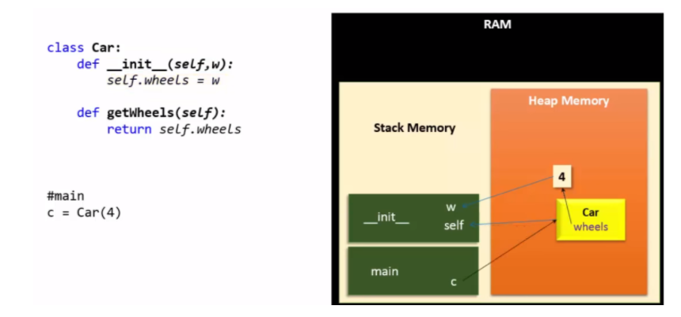

# 파이썬 공부
## 목차
## 클래스
## 메모리

# 클래스
## 클래스
- 클래스는 프로그램이 실행되었을 때 생성되는 객체가 어떤 멤버 변수와 메서드를 갖는 지 정의해둔 것

- 개념
  - 객체를 만들 내기 위한 설계도 혹은 틀
  - 연관되어 있는 변수와 메서드의 집합

## 객체
- 객체는 멤버 변수(데이터)와 멤버 메서드(함수)로 구성

- 개념
  - 소프트웨어 세계에 구현할 대상
  - 클래스에 선언된 모양 그대로 생성된 실체
- 특징
  - 클래스의 인스턴스라고도 불림
  - 객체는 모든 인스턴스를 대표하는 포괄적인 의미를 갖는다.
  - oop의 관점에서 클래스의 타입으로 선언되었을 때 '객체'라고 부른다.

## 인스턴스
- 인스턴스는 클래스 정의로부터 생성된 것을 인스턴스하고 한다.

- 개념
  - 설계도(클래스)를 바탕으로 소프트웨어 세계에 구현된 구체적인 실체
  - 즉, 객체를 소프트웨어에 실체화 하면 그것을 '인스턴스'라고 함
  - 실체화된 인스턴스는 메모리에 할당됨
- 특징
  - 인스턴스는 객체에 포함된다고 볼 수 있다.
  - oop의 관점에서 객체가 메모리에 할당되어 실제 사용될 때 '인스턴스'라고 부름

## 클래스 vs 객체 vs 인스턴스
### 클래스 vs 객체
- 클래스는 '설계도', 객체는 '설계도로 구현한 모든 대상'을 의미

### 객체 vs 인스턴스
- 클래스의 타입으로 선언되었을 때 객체라고 부르고, 그 객체가 메모리에 할당되어 실제 사용될 때 인스턴스라고 부른다.
- 객체는 현실세계에 가깝고 인스턴스는 소프트웨어에 가깝다.

## 파이썬 상속
상속이란 부모 클래스(super class)의 모든 속성(데이터, 메서드)을 자식 클래스(sub class)로 물려 줄 수 있는 클래스의 기능 중 하나입니다.
이러한 상속을 사용하는 이유는 각 클래스에서는 클래스마다 특화된 메서드와 데이터를 정의할 수 있고, 클래스마다 동일한 코드가 작성되는 것을 방지하며 부모 클래스에 공통된 속성을 두어 코드의 유지보수가 쉬워지기 때문이다.

```python3
class Person:
    def __init__(self):
        self.name= "홍길동"
        self.age = 25

class Korean(Person):
    pass

p1=Person()
print(p1.name,p1.age)

k1= Korean()
print(k1.name,k1.age)

###########결과
홍길동 25
홍길동 25
```
위 코드는 Korean 클래스가 Person 클래스를 보모 클래스로 가지는 예이다.


```python3
class Person:
    def __init__(self):
        self.name= "홍길동"
        self.age = 25

class Korean(Person):
    def __init__(self):
        super().__init__()
        self.lang="한국어"

p1=Person()
print(p1.name,p1.age)

k1= Korean()
print(k1.name,k1.age,k1.lang)

###########결과
홍길동 25
홍길동 25 한국어
```
Korean 클래스는 부모 클래스인 Person클래스로부터 상속받아(super.__init__()) name과 age를 변수로 갖고 self.lang을 정의해 자기 자신만의 속성을 가짐

### overriding
```python3
class Person:
    def __init__(self):
        self.name= "홍길동"
        self.age = 25

    def say(self):
        pass

class Korean(Person):
    def __init__(self):
        super().__init__()
        self.lang="한국어"

    def say(self):
        print("안녕하세요")


class American(Person):
    def __init__(self):
        super().__init__()
        self.lang = "영어"

    def say(self):
        print("Hello")

p1=Person()
print(p1.name,p1.age)

k1= Korean()
print(k1.name,k1.age,k1.lang)

a1 = American()
print(a1.name,a1.age,a1.lang)

##########결과
홍길동 25
홍길동 25 한국어
홍길동 25 영어
```
부모 클래스가 같은 이름의 메서드를 갖고 있더라도, 자식도 같은 메서드를 갖고 있는 경우 본인의 메서드를 우선적으로 수행함. 이를 오버라이딩이라고 한다.

### 인스턴스 변수 vs 클래스 변수
#### 인스턴스 변수
```python3
class Person:
    li=[]
    def __init__(self,sp):
        self.li.append(sp)

    def disp(self):
        print(Person.li)

p1=Person("우유")
p1.disp()
p2=Person("콜라")
p2.disp()
p3=Person("사이다")
p3.disp()

########## 결과
['우유']
['콜라']
['사이다']
```
위 코드는 인스턴스화의 예시이다. 각각의 인스턴스가 각각 리스트를 갖는다.

#### 클래스 변수
```python3
class Person:
    li=[]
    def __init__(self,sp):
        self.li.append(sp)

    def disp(self):
        print(Person.li)

p1=Person("우유")
p1.disp()
p2=Person("콜라")
p2.disp()
p3=Person("사이다")
p3.disp()

########## 결과
['우유']
['우유', '콜라']
['우유', '콜라', '사이다']
```
클래스 변수는 각각의 객체들이 공유하는 것이다. 하나의 리스트를 가짐


# 메모리
## 파이썬의 메모리 관리
파이썬의 모든 것은 객체입니다. 이것은 동적 메모리 할당이 
파이썬 메모리 관리의 기초라는 것을 의미한다. 객체가 더 이상 필요하지 않으면 pyhton Memory Manager가 자동으로 객체에서 메모리를 회수

C/C++ 또는 자바의 경우 mallov과 같은 함수를 이용해서 동적 할당을 사용할 수 있게 됩니다. 하지만 파이썬은 동적 할당의 기능이 없다. 즉 사용자가 직접 메모리 할당 범위를 조정하지 않는다.

그렇다면 파이썬은 스택 영역만 사용하는 언어인가? 그렇지 않다. 파이썬은 메모리를 관리해주는 특별한 기능이 있다. 바로 위에서 언급했던 Python Memory Manager인데, 이 기능이 포인터를 움직여 힘 영역의 메모리 할당 범위와 내부 버퍼를 조정해준다. Python Memory Manager는 Python/C API를 통해 스토리지를 동적으로 관리한다.


### 메모리 할당 원리


- C언어에서 x=10과 같이 변수를 할당하면 메모리에 해당 값이 바로 저장되지만, 파이썬에서는 10이라는 int object를 만들어 놓고 변수 x가 그것을 가리키는 형태이다. 그리고 y=x라고 하면 x에 의해서 이미 만들어진 10이라는 int object를 y는 그냥 가리키기만 한다. 그럼으로 x와 y는 같은 object를 가르킴
- x=x+1은 11이라는 새로운 int object를 생성. z=10은 int object가 이미 생성 되어 있으니 생성되지 않고 그냥 가리키기만 함

### stack,heap 메모리 할당


- main 함수에서 y=5 (5 int object 생성 및 가리키기)와 f1(y) 함수를 call 한다. f1(y)를 호출하면 stack영역에 f1() 영역이 생성됨
- f1 함수에서 x=x*2로 10 int object를 생성 및 가리키기를 하고 f2(x)를 호출하면 stack영역에 f2() 영역 생성
- f2 함수에서 x=x+1로 11 int object를 생성 및 가리키기를 한다.
- **메소드와 변수는 스택 메모리(초록색 블록)에 작성된다.** 이러한 프레임은 메소드가 리턴될 때마다 자동으로 제거된다.

### 메모리 할당 해제


- 우선 stack의 가장 위에 있는 f2함수가 해제 된다.
- 그 다음 f1함수가 해제되는데 f1함수의 변수 x가 없어짐에 따라 10 int object도 없어진다.(10 int object를 아무도 가리키지 않기 때문). 이것이 바로 **reference counting이 0이 됨에 따라 object가 없어지는 가비지 컬렉터**이다. 파이썬은 레퍼런스 카운팅을 이용해 메모리를 관리한다.
- 마지막으로 main함수의 변수z는 11을 가리킨다.

### Class instance 메모리 관리(Self는 무엇인가)


- main에서 c=Car(4)는 Class instance를 생성하는데 처음에 생성자 함수 __init__이 호출된다. 여기서 self, w 2개를 매개변수로 받는데, 이는 매개변수 즉 지역변수이기 때문에 stack 영역에 생성
- w는 당형히 4인데, self는 무엇일까? 그림에서 보듯 Car instance(object)의 주소(reference) 값이다.즉 모든 class 메소드는 self를 매개변수로 가지는데 self는 자신의 Class instance의 주소값이다. self를 매개변수로 받지 않으면 어떻게 instance 값을 참조할 것인가
- 그리고 self.wheels는 instance의 변수 즉 속성(attribute)이다. 속성은 heap 영역에 할당된다. 왜냐하면 __init__함수가 없어지고 stack 영역이 사라져도 self.wheels는 항상 존재해야하기 때문이다. (생성자 메소드가 종료되어도 변수는 남아 있어야 함)


> 메소드 실행

- c.getWheels()를 실행하면 stack 영역이 만들어 지고 매개변수로 self가 생성된다. self는 instance의 주소 값을 가지고 있는 변수이니 self를 통해 heap영역의 wheels 변수에 접근한다. 접근 값은 4이고 main 함수의 n값은 heap 영역의 4를 가리킨다.
- 변수와 함수가 반환되자마자 죽은 개체는 가비지 수집된다.

### 레퍼런스 카운트
파이썬은 프로그래머가 직접 메모리 관리를 하지않고 레퍼런스 카운트와 가비지 컬렉션에 의해 관리된다.

- 파이썬은 내부적으로 malloc()과 free()를 많이 사용하기 때문에 메모리 누수의 위험이 있다. 이런 이슈가 있기 때문에 파이썬은 메모리를 관리하기 위해 레퍼런스 카운트를 사용
- 레퍼런스 카운트란 파이썬의 모든 객체에 카운트를 포함하고, 이 카운트는 객체가 참조될 때 증가하고, 참조가 삭제될 때 감소시키는 방식으로 작동한다. **이때 카운트가 0이 되면 메모리가 할당 해제됨**

```python3
import sys
 
class RefExam():
  def __init__(self):
    print('create object')
 
a = RefExam()
print(f'count {sys.getrefcount(a)}')
b = a
print(f'count {sys.getrefcount(a)}')
c = a
print(f'count {sys.getrefcount(a)}')
c = 0
print(f'count {sys.getrefcount(a)}')
b = 0
print(f'count {sys.getrefcount(a)}')
 
###########결과
count 2
count 3
count 4
count 3
count 2
```
- 생성 직후 레퍼런스 카운트는 2로 나왔다. 이는 getrefcount()의 파라미터 값으로 임시 참조되기 때문디다.
- b,c에 각각 참조될 때마다 1씩 증가
- b,c가 0을 할당하면 1씩 감소하는 것을 볼 수 있다.
- 레퍼런스 카운트는 메모리 관리에 효율적으로 동작하지만, 카운트만으로 메모리를 관리했을 때 약점이 존재함

#### 레퍼런스 카운트의 약점(순환 참조)
- 순환 참조란 간단하게 컨테이너 객체가 자기 자신을 참조하는 것을 의미한다. 자기 자신이 참조될 때 프로그래머는 할당된 객체를 추적하기 어려워지고, 이때 메모리 누수가 발생 할 수 있다.

```python3
class RefExam():
  def __init__(self):
    print('create object')
    self.me = self
  def __del__(self):
    print(f'destroy {id(self)}')
 
a = RefExam()
a = 0
print('end .....')
 
#########결과
create object
end .....
destroy 2110595412432
```
- `__del__()`은 메모리 할당이 삭제되는 시점에서 실행되는 메서드이다.
- a 변수에 0을 재할당 할때 `__del__()`이 실행되고 'end ...'실행되어야하는데 반대가 되었다.
- 변수 a에 재할당하여도 a.me 속성에 자기 자신을 참조하고 있어 레퍼런스 카운트가 남아있기 때문에 이런현상이 발생한다.
- 이렇게 되면 레퍼런스 카운트가 0에 도달할 수 없고 할당된 메모리를 삭제할 수 없어 메모리 누수가 발생한다.
- 파이썬은 이 문제를 가비지 컬렉션으로 해결한다.

### 가비지 컬렉션
- 레퍼런스 카운트도 가비지 컬렉션이다.
- 순환 참조 이슈를 해결하기 위한 가비지 컬렉션 : Cyclic Garbage Collection

#### Generational Hypothesis
- 가비지 컬렉션은 Generational Hypothesis라는 가설을 기반으로 작동한다.
- 이 가설은 "대부분의 객체는 생성되고 오래 살아남지 못하고 곧바로 버려지는 것"과 "젊은 객체가 오래된 객체를 참조하는 것은 드물다." 이 두가지이다.

#### 세대관리
파이썬은 객체 관리를 위한 영역을 3가지로 나누고 이 영역을 세대(generation)라고함

[세대관리](https://dc7303.github.io/python/2019/08/06/python-memory/)
해당 내용은 아직 이해가 되지 않아 일단 링크를 남겨두고 나중에 다시 참고 할때 읽어보잣ㅎ.ㅎ


## 참고 문헌
[클래스 관련 참고문헌](https://pro-jy.tistory.com/35?category=878142)

[메모리 관련 참고 문헌](https://pro-jy.tistory.com/39?category=878142)