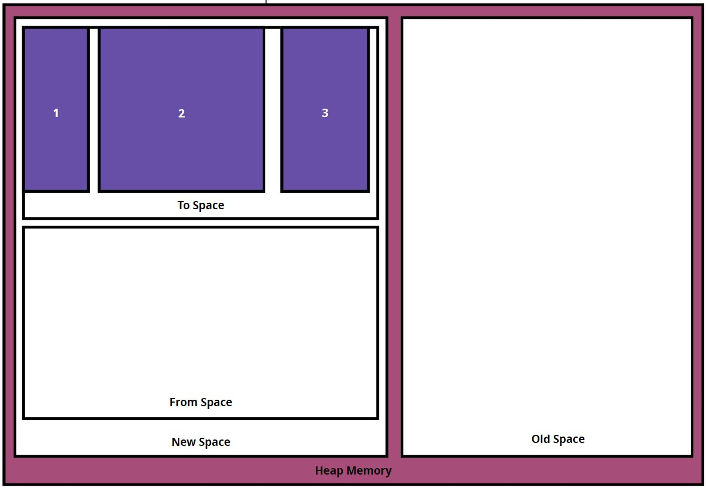

# 데이터 구조와 처리

- [데이터 구조와 처리](#데이터-구조와-처리)
  - [Javascript Native Object](#javascript-native-object)
    - [Classic 해시 테이블](#classic-해시-테이블)
    - [Map의 Deterministic(결정적) 해시 테이블](#map의-deterministic결정적-해시-테이블)
    - [v8엔진의 해시 테이블 최적화](#v8엔진의-해시-테이블-최적화)
    - [Array(Javascript 배열)](#arrayjavascript-배열)
  - [LinkedList(연결리스트) vs Array(일반 배열)](#linkedlist연결리스트-vs-array일반-배열)
    - [연결리스트](#연결리스트)
    - [일반 배열](#일반-배열)
  - [[번외] HashTable vs HashMap](#번외-hashtable-vs-hashmap)
  - [v8엔진의 가비지 컬렉터, Orinoco](#v8엔진의-가비지-컬렉터-orinoco)
    - [마이너 GC](#마이너-gc)
    - [메이저 GC](#메이저-gc)
    - [GC 컨텍스트](#gc-컨텍스트)
  - [참고문헌](#참고문헌)
    - [GC 관련](#gc-관련)
    - [자바스크립트 빌트인 객체 관련](#자바스크립트-빌트인-객체-관련)
    - [자료구조 비교 관련](#자료구조-비교-관련)

## Javascript Native Object

들어가기 앞서 기저 지식을 밟고 진행하자.

1. 시간 복잡도에서 계산 기준은 다음과 같다.

    > a. 평균과 최악이 다른 경우 2개의 Time Complexity 표를 기술하겠다.
    > b. 상수는 제거한다.

2. 공간 복잡도에 영향을 미치는 `변수`, `자료구조`, `함수 호출`, `할당`요소이며, 입력 값은 중요한 부분이 아니다. 
   <br/>

3. Javascript Native Object는 다음과 같다. 초록색에 해당하는 부분을 살펴보겠다.

    

    **Javascript Native Object는 모두 내부적으로 해시 테이블 자료구조이다.**
    <br/>

    다만, 이 해시 테이블을 변형한 자료형들이 있다. 변형이 되지 않는 해시 테이블(이하 `Classic 해시 테이블`) 부터 짚고 넘어가보자.

### Classic 해시 테이블

**정의**

    key에 해시 함수를 적용해 고유한 인덱스(해시 값)를 생성하고, 이 인덱스를 활용해 value 데이터를 저장하는 자료구조이다.

**특징**

    자료구조가 반복할 시 삽입 순서를 유지하지 않는다.

**Time Complexity: 평균**

| Access | Search | Insertion | Deletion |
| :----: | :----: | :-------: | :------: |
|  N/A   |  O(1)  |   O(1)    |   O(1)   |

**Time Complexity: 최악**

| Access | Search | Insertion | Deletion |
| :----: | :----: | :-------: | :------: |
|  N/A   |  O(n)  |   O(n)    |   O(n)   |

🤔 찾아본 예시 사진에서 Access가 N/A라고 나올까? 위키피디아는 O(n)인데

### Map의 Deterministic(결정적) 해시 테이블

**특징**
    
[Classic 해시 테이블](#classic-해시-테이블)과 비교해보자

    Map을 반복하는 동안 삽입 순서를 유지해야한다.

Map의 내부에서 `Deterministic 해시 테이블`이 어떻게 작동하는지 알아보자.

정의된 추상체부터 알아보자. 
  - 타입을 명시해야해서 타입스크립트를 사용하였다.
  - Entry는 단일 연결리스트 자료구조이다.

```typescript
interface Entry{
  key: any;
  value: any;
  chain: number;  // 다음 순서의 Entry 구조체를 나타내는 포인터
}

interface CloseTable{
  hashTable: number[];
  dataTable: Entry[]; // 삽입 순서대로 들어온 Entry 구조체
  nextSlot: number;
  size: number;
}
```

상황은 dataTable는 최대 4개의 size를 가진다. size를 초과하면 `Deterministic 해시 테이블`는 재해싱해야한다.

1. `Deterministic 해시 테이블`에 새 항목이 들어오면, dataTable 배열에 들어오는데, nextSlot 다음의 수를 인덱스로 하는 곳에 삽입된다.

```typescript
table.set(0, 'a');
table.set(1, 'b');
table.set(2, 'c'); // +++ 1번 상황
```

```typescript
const tableInternals = {
  hashTable: [0, 1],
  dataTable: [
    {
      key: 0,
      value: 'a',
      chain: 1
    },
    {
      key: 1,
      value: 'b',
      chain: 2
    },
    {
      key: 2,
      value: 'c',
      chain: -1
    }
  ],
  nextSlot: 3,
  size: 3
}
```

2. `Deterministic 해시 테이블`에 항목을 삭제하면, 키와 값은 undefined가 되지만, 이는 dataTables에 공간은 점유한다.
   
```typescript
table.delete(0); // +++ 2번 상황
```

```typescript
const tableInternals = {
  hashTable: [0, 1],
  dataTable: [
    {
      key: undefined,
      value: undefined,
      chain: 1
    },
    {
    key: 1,
    value: 'b',
    chain: 2
  },
  {
    key: 2,
    value: 'c',
    chain: -1
  }
  ],
  nextSlot: 3,
  size: 2 // +++ new size
}
```

### v8엔진의 해시 테이블 최적화

    ...

### Array(Javascript 배열)

**정의**

[일반 배열](#배열)의 정의와 비교해보자.

    Javascript 배열은 메모리 공간에서 연속적으로 이어져 있지 않을 수 있으며, 타입이 달라도 되는 데이터를 배치한 해시 테이블로 구현된 객체이다.

<details>
<summary>Javascript 배열 내부 확인하기</summary>

```javascript
console.log(Object.getOwnPropertyDescriptors([1, 2, 3]));
/*
{
  '0': { value: 1, writable: true, enumerable: true, configurable: true },
  '1': { value: 2, writable: true, enumerable: true, configurable: true },
  '2': { value: 3, writable: true, enumerable: true, configurable: true },
  length: { value: 3, writable: true, enumerable: false, configurable: false }
}
*/
```
`인덱스`를 `프로퍼티 키`로 갖으며, `배열의 요소`는 `프로퍼티 값`이다.

</details>

## LinkedList(연결리스트) vs Array(일반 배열)

### 연결리스트

**정의**

    메모리 상에 불연속적으로 배치된 자료구조

**Time Complexity**

| Access | Search | Insertion | Deletion |
| :----: | :----: | :-------: | :------: |
|  O(n)  |  O(n)  |   O(1)    |   O(1)   |

**장점**
    
    Fast Insertion, Fast Deletion: 삽입/삭제 시, 다음 노드를 가리키는 주소(포인터)만 바꾸면 된다.
    
    Flexible Size: 이로 인해, 동적 할당을 해도 필요한 메모리 공간만 사용한다.    


**단점**

    Bad Cache Locality: 동적 할당으로 인해 쌓이는 힙 메모리의 데이터 주소가 분산되어 있기 때문이다.

    Slow Access, Slow Search: 검색 시 처음 노드부터 순차 접근해야하기 떄문이다.

### 일반 배열

**정의**

    메모리 상에 연속적이며, 타입이 같은 데이터를 배치한 자료구조

**Time Complexity**

| Access | Search | Insertion | Deletion |
| :----: | :----: | :-------: | :------: |
|  O(1)  |  O(n)  |   O(n)    |   O(n)   |

**장점**    

    Good Cache Locality: 공간 지역성이 좋아 Cache Hit할 가능성이 크다.

    Fast Access: 인덱스로 랜덤 접근이 가능하다.

**단점**

    Slow Insertion, Slow Deletion: 삽입/삭제한 인덱스보다 큰 인덱스를 shift 해야하기 때문이다.

    Fixied Size: 메모리에 최초 할당 시 고정된 메모리를 사용해야 한다.
    
       단, ArrayList(동적 배열)는 배열의 갯수가 많아지면 크기를 2배로 늘리고, 적으면 2배로 줄여 이 한계를 극복한다.

## [번외] HashTable vs HashMap

    ...

<hr/>

## v8엔진의 가비지 컬렉터, Orinoco



### 마이너 GC

마이너 GC는 New Space를 깨끗하게 유지시킨다.

New Space는 크기가 같은 To Space과 From Space로 나뉜다.

객체들은 New Space에 할당되는데, 대부분의 할당은 To Space에서 만들어진다.

또한, 객체에 대한 공간을 예약하려고 할 때마다 증가하는 할당 포인터가 있다.
> 예시사진과 슬라이드에서는 제외됨

할당 포인터가 To Space의 마지막에 도달하면, 마이너 GC가 발생한다.

<details>
<summary>
  아래 과정과 함께 
  <a href="https://slides.com/kimyongki/deck-eed754/embed">슬라이드</a>를
    같이 띄워두고 확인하자.
</summary>

<div markdown="1">
<br/>

1. To Space에 가용 공간이 없는 상태에서, 새 객체를 생성하려할 때, v8은 마이너 GC를 발생시킨다.

2. 마이너 GC는 객체들을 To Space에서 From Space으로 이동시킨다. 이제 모든 객체는 From Space에 있고 To Space은 비워진다.

3. 마이너 GC는 GC 루트부터 From Space까지 객체 그래프를 재귀적으로 순회하면서 메모리 사용을 유지하는 객체들을 찾는다.
   
   <br/>
   
    3-1. 이 객체들은 To Space의 페이지로 이동되고, 할당 포인터는 갱신된다. From Space의 모든 객체들을 찾을 때까지 이 과정이 반복된다.

    3-2. 마지막 객체까지 찾으면 To Space는 자동으로 압축되어 조각화를 줄인다.

    3-3. 이제 From Space에 남아있는 객체는 가비지이므로 마이너 GC는 From Space을 비운다.

   <br/>

4. 새 객체는 To Space 메모리에 할당된다.

5. 다시, To Space에 가용 공간이 없는 상태에서, 새 객체를 생성하려할 때, v8은 두번째 마이너 GC를 발생시킨다.

6. 2-3번의 과정이 다시 반복되는데, 특이사항은 두번째 마이너 GC에도 살아남은 객체는 To Space가 아닌 Old Space로 이동한다.

</div>
</details>

### 메이저 GC

메이저 GC는 Old Space를 깨끗하게 유지시킨다.

<details>
<summary>
  아래 과정과 함께 
  <a href="https://slides.com/kimyongki/deck-15dbf8/embed">슬라이드</a>를
  같이 띄워두고 확인하자.
</summary>

<div markdown="1">
<br/>

1. 마이너 GC 주기를 거치고 Old Space가 거의 다 찾으면 v8이 메이저 GC를 발생한다.
   
2. 메이저 GC는 GC 루트부터 시작해 객체 그래프를 재귀적으로 순회하면서, 메모리 사용을 유지하는 객체들을 찾아 활성 상태로 표시(Marking)한다.
   
   > Marking은 힙 메모리를 방향 그래프로 간주해 깊이 우선 탐색을 수행한다.

3. 메이저 GC가 힙 메모리를 순회하면서 활성 상태로 표시되지 않은 객체들의 메모리 주소를 기록(Sweeping)한다. 이 공간은 이제 사용 가능하다고 표시되며 다른 객체들을 저장하는데 사용될 수 있다.

4. 메이저 GC는 모든 활성 상태의 객체들을 압축(Compacting)하여 조각화를 줄이고 새 객체들에 대한 메모리 할당 성능을 증가시킨다.

</div>
</details>

### GC 컨텍스트

위 목차들을 통해 우리는 의문을 제기할 수 있다.

🤔 *싱글스레드인 v8엔진에서 GC는 메인스레드의 작업을 일시중지 시키지 않을까?*


다음은 여러 방안과 트레이드 오프를 알아보자.

<table style="text-align: left;">
  <tr>
    <th colspan="2">1. GC를 Parallel(병렬)처리
      <p style="float: right;">
        사용대상: 마이너 GC
      </p>
    </th>
  </tr>  
  <tr>
    <td>
      
    </td>
    <td>      
      장점
      <blockquote>GC의 작업을 양분할 수 있다.
      </blockquote>
      단점
      <blockquote>
      a. 일시중지 문제는 해결되지 않았다.<br/>
      b. 스레드 간 동기화 작업이 필요하다.      
      <blockquote>
    </td>
  </tr>  
</table>
      
<table style="text-align: left;">
  <tr>
    <th colspan="2">2. 메인스레드가 GC 작업을 교차하며 처리</th>
  </tr>  
  <tr>
    <td>
      
    </td>
  </tr>  
  <tr>
    <td>
      단점
      <blockquote>    
      <p>a. Javascript 작업도 교차되는데, GC에 의해 변경이 잦은 힙에서 이전 Javascript 작업이 무효화 될 경우가 존재한다.</p>
      <p>b. 일시중지 문제는 해결되지 않으며, 오히려 시간을 더 증가시킨다.</p>
      <blockquote>
    </td>
  </tr>
</table>
  
<table style="text-align: left;">
  <tr>
    <th colspan="2">3. GC의 작업을 온전히 별도의 스레드에서 처리</th>
  </tr>  
  <tr>
    <td>
      
    </td>
  </tr>  
  <tr>
    <td>
      장점
      <blockquote>
      메인 스레드의 Javascript 작업이 자유롭다.
      </blockquote>
      단점
      <blockquote>          
      메인 스레드와 별도의 스레드가 같은 객체를 동시에 읽기/쓰기 경쟁이 이루어진다.
      <blockquote>
    </td>
  </tr>
</table>

<table style="text-align: left;">
  <tr>
    <th colspan="2">4. 메이저 GC
      <p style="float: right;">
        사용대상: 메이저 GC
      </p>
    </th>
  </tr>  
  <tr>
    <td>
      
    </td>
  </tr>
  <tr>
    <td colspan="2">
      <b>사진 설명</b>
      <p>
         1. Javascript 작업 때 별도의 스레드가 Marking 작업을 같이 합니다.
      </p>
      <p>
         2. 별도의 스레드가 Marking 작업을 완료된 시점에 Javascript 작업을 일시 중단하는데, 이때 메인 스레드가 Marking 작업을 최종적으로 빠르게 점검합니다.
      </p>
      <p>
        3. 메인 스레드는 별도의 스레드는 일시 중지 기간동안 함께 Sweeping,  Compacting작업과 할당 포인터(새 객체를 할당할 때 체킹하는 역할)를 업데이트합니다.
      </p>      
    </td>
  </tr>  
  <tr>
    <td>
      장점
      <blockquote>
      <p>a. Compacting 작업을 메인 스레드와 별도의 스레드가 병렬 작업한다.</p>
      <p>b. Sweeping 작업과 Javascript 작업을 동시 작업한다.</p>
      </blockquote>
      단점
      <blockquote>          
      일시중지 문제는 해결되지 않았다.
      <blockquote>
    </td>
  </tr>
</table>

<hr/>

## 참고문헌

### GC 관련
[Visualizing memory management in V8 Engine](https://ui.toast.com/weekly-pick/ko_20200228) -- Deepu K Sasidharan

[V8 Minor GC](https://speakerdeck.com/deepu105/v8-minor-gc) -- Deepu K Sasidharan

[The Orinoco garbage collector](https://v8.dev/blog/trash-talk) -- Peter Marshall

### 자바스크립트 빌트인 객체 관련

[자바스크립트 배열은 배열이 아니다](https://poiemaweb.com/js-array-is-not-arrray) -- Poiemaweb

[자바스크립트의 자료구조](https://velog.io/@blackb0x/자바스크립트의-자료구조) -- Sungmin Park

[해시 테이블 최적화](https://v8.dev/blog/hash-code) -- Sathya Gunasekaran

[ES6 Map and Set Complexity](https://stackoverflow.com/questions/33611509/es6-map-and-set-complexity-v8-implementation) -- Stackoverflow

[Understanding Map Internals](https://itnext.io/v8-deep-dives-understanding-map-internals-45eb94a183df) -- 
Andrey Pechkurov

### 자료구조 비교 관련

[「개발자 인터뷰 팁 그리고 질문 모음과 답변」 레포지토리](https://github.com/yoonje/developer-interview-questions-and-answers/blob/master/Datastructure/README.md) -- yoonje

[캐쉬, 배열, 링크드리스트, 동적배열](https://velog.io/@injoon2019/CS-정리-캐쉬-배열-링크드리스트-동적배열) -- June
