# 데이터 구조와 처리

- [데이터 구조와 처리](#데이터-구조와-처리)
  - [Javascript Native Object](#javascript-native-object)
    - [HashTable](#hashtable)
    - [Javascript Native Object: Map](#javascript-native-object-map)
      - [Deterministic HashTable](#deterministic-hashtable)
    - [Javascript Native Object: Array(Javascript 배열)](#javascript-native-object-arrayjavascript-배열)
      - [Javascript 배열 내부 자료구조의 변형](#javascript-배열-내부-자료구조의-변형)
      - [배열 요소 종류 별 다른 최적화](#배열-요소-종류-별-다른-최적화)
  - [Doubly-Linked List(이중 연결리스트) vs Array(일반 배열)](#doubly-linked-list이중-연결리스트-vs-array일반-배열)
    - [이중 연결리스트](#이중-연결리스트)
    - [일반 배열](#일반-배열)
  - [v8엔진의 가비지 컬렉터, Orinoco](#v8엔진의-가비지-컬렉터-orinoco)
    - [마이너 GC](#마이너-gc)
    - [메이저 GC](#메이저-gc)
    - [GC 컨텍스트](#gc-컨텍스트)
  - [참고문헌](#참고문헌)

## Javascript Native Object

들어가기 앞서 기저 지식을 밟고 진행하자.

1. 시간 복잡도에서 평균과 최악이 다른 경우, 2개의 Time Complexity 표를 기술하겠다.
   <br/>

2. Javascript Native Object는 다음과 같다. 초록색에 해당하는 부분을 살펴보겠다.

    

    **Javascript Native Object는 모두 내부적으로 HashTable 자료구조이다.**
    <br/>

    다만, 이 HashTable 자료구조를 내부적으로 사용하되 변형한 자료형들이 있다. 변형이 되지 않는 HashTable이라는 자료구조부터 짚고 넘어가보자.

### HashTable

**정의**

    key에 해시 함수를 적용해 고유한 인덱스(해시 값)를 생성하고, 이 인덱스를 활용해 value 데이터를 저장하는 자료구조이다.

**특징**

    자료구조를 반복할 시 삽입 순서를 유지하지 않는다.

**Time Complexity: 평균**

| Access | Search | Insertion | Deletion |
| :----: | :----: | :-------: | :------: |
|  N/A   |  O(1)  |   O(1)    |   O(1)   |

**Time Complexity: 최악**

| Access | Search | Insertion | Deletion |
| :----: | :----: | :-------: | :------: |
|  N/A   |  O(n)  |   O(n)    |   O(n)   |


### Javascript Native Object: Map

**특징**
    
[HashTable](#hashtable)과 비교해보자

    Map을 반복할 시 삽입 순서가 유지 되어있다.

#### Deterministic HashTable

Map 내부에서 `Deterministic HashTable`이 어떻게 작동하는지 알아보자.

  - 실제 구현체는 C++[^c++]이지만, 의사코드용으로 타입스크립트 언어를 사용하였다.
  - Entry 인터페이스는 단일 연결리스트 자료구조이다.
  - Entry 인터페이스의 chain 필드는 다음 순서의 Entry를 나타내는 포인터이다.
  - CloseTable 인터페이스의 dataTable 필드는 Entry 타입 배열이며, 삽입 순서대로 들어온다.

[^c++]: 
    실제 구현체이다. 
    코드를 보면 포인터를 사용하는 부분이 의사코드용으로는 이해하기 힘들다. 
    ```
    struct Entry {
      Key key;
      Value value;
      Entry *chain;
    }

    class CloseTable {
        Entry*[] hashTable;
        Entry[] dataTable;
    }
    ```

```typescript
interface Entry{
  key: any;
  value: any;
  chain: number;
}

interface CloseTable{
  hashTable: number[]; 
  dataTable: Entry[];
  nextSlot: number;
  size: number;
}
```
<details>
<summary><code>Deterministic HashTable</code>의 내부 확인하기</summary>
<br/>

**삽입 상황은 이렇다.**
- `L3`에서 해시 충돌이 발생하였다. `Seperate chaining`[^seperateChaining]방법으로 해결한다.
  
  ```typescript  
  // function hashCode(n) { return n % hashTable.length; }

  table.set(0, 'a'); // +++ hashTable index 0 (0 % 2)
  table.set(1, 'b'); // +++ hashTable index 1 (1 % 2)  
  table.set(2, 'c'); // +++ hashTable index 0 (2 % 2)    
  ```
[^seperateChaining]: 같은 주소로 해싱되는 원소를 모두 하나의 연결 리스트에 매달아서 관리한다. 
  원소를 검색할 때 해당 연결 리스트의 원소들을 차례로 지나가면서 탐색한다.

    
- `Deterministic HashTable`에 새 Entry가 들어온다고 하였을 때, dataTable 배열에 들어오는데, nextSlot을 인덱스로 판단하고 삽입한다.
  ```typescript
  const tableInternals = {
    hashTable: [0, 1],
    dataTable: [
      {
        key: 0,
        value: 'a',
        chain: 2
      },
      {
        key: 1,
        value: 'b',
        chain: -1 // +++ hashTable index 0's tail
      },
      {
        key: 2,
        value: 'c',
        chain: -1 // +++ hashTable index 1's tail
      }
    ],
    nextSlot: 3, // +++ next dataTable index
    size: 3
  }
  ```

- 예시 사진으로 확인해보자.

  

**삭제 상황은 이렇다.**

- 
  ```typescript
  table.delete(0); 
  ```

- `Deterministic HashTable`에 Entry를 삭제하면, 키와 값은 undefined가 되지만, 이는 dataTables에 공간은 점유한다. 
  ```typescript
  const tableInternals = {
    hashTable: [0, 1],
    dataTable: [
      {
        key: undefined,
        value: undefined,
        chain: 2
      },
      {
        key: 1,
        value: 'b',
        chain: -1
      },
      {
        key: 2,
        value: 'c',
        chain: -1
      }
    ],
    nextSlot: 3,
    size: 2 // +++ new size
  }
  ```
- 예시 사진으로 확인해보자.
  
  

이를 통해, 공간이 낭비될 수 있다 의문점이 발생하였다.

때문에 애초에 낮은 해시 충돌을 내는 해시 함수를 사용한다.

```c++
inline uint32_t ComputeUnseededHash(uint32_t key) {
  uint32_t hash = key;
  hash = ~hash + (hash << 15);
  hash = hash ^ (hash >> 12);
  hash = hash + (hash << 2);
  hash = hash ^ (hash >> 4);
  hash = hash * 2057;
  hash = hash ^ (hash >> 16);
  return hash & 0x3fffffff;
}
```

</details>
<br/>

<details>
<summary><code>HashTable</code> vs <code>Deterministic HashTable</code>성능 비교</summary>
<br/>
예시 사진에서 사용하는 단어의 뜻은 다음과 같다.

`close table`[^closeTable]은 `Deterministic HashTable`을 의미하고,

`dense_hash_map`과 `open addressing`은 현재로써 일반 `HashTable`을 의미한다고 생각하자.

[^closeTable]: `Deterministic HashTable` 알고리즘을 만든 사람 이름이 Tyler Close여서 이렇게 부르는게 아닌가 싶다.

<table border="0">
 <tr>
    <th colspan="2">MemoryUsage sizing</th>
 </tr>
 <tr>
    <td width="50%">
      
    </td>
    <td>
      <blockquote>
      <p>
        모든 <code>HashTable</code> 기반 자료구조는 현재 할당된 용량이 초과될 시 테이블 크기를 75% 기준에 도달했을 시 2배로 늘리고, 또 줄어들 시 2배로 줄이는 작업이 있다.        
      </p>
      <p>
        이때, 바뀐 용량 만큼 고유한 key도 재해싱해야하는 작업도 따른다. 그림에서 계단식으로 늘어난 지표는 용량이 늘어날 시 재해싱 작업이 이뤄진 부분이다.
      </p>
      <p>
        공식문서에서 나타낸 바로는 <code>Deterministic HashTable</code>은 일반적인 <code>HashTable</code>보다 가상메모리를 더 많이 사용하지만, 물리메모리를 더 적게 사용한다고 한다. 
      </p>
      <p>
        이를 정확히 증명하는 자료는 찾지 못했고, 현재로써는 그림과 같이 계단식의 급진적인 MemoryUsage를 보이지 않았다는 현상만 인지하면 될것 같다.
      </p>
      </blockquote>
    </td>
 </tr>
 <tr>
    <th>Insertion</th>
    <th>Search</th>
 </tr>
 <tr>
    <td>
      
    </td>    
    <td>
      
    </td>    
 </tr>
 <tr>
    <th colspan="2">Search(after Deletion)</th>
 </tr> 
 <tr>
    <td>
      
    </td>    
    <td>
      <blockquote>
      삭제 시에는 모두 큰 차이가 없어, 삭제 후 탐색시 성능 비교를 확인하자.
      </blockquote>
    </td>
 </tr>
</table>

</details>

### Javascript Native Object: Array(Javascript 배열)

**정의**

[일반 배열](#일반-배열)의 정의와 비교해보자.

    Javascript 배열은 메모리 공간에서 연속적으로 이어져 있지 않을 수 있으며, 타입이 달라도 되는 데이터를 배치한 해시 테이블로 구현된 객체이다.

🤔 단, Javascript 배열도 원래는 일반 배열이지만 용량이 커질 수록 내부적으로 임계값을 돌파하다가 해시 테이블로 바뀐다. 이를 확인해보자.

#### Javascript 배열 내부 자료구조의 변형

> 디버깅 환경은 node v16에서 가능하였고, 다음과 같은 명령어로 디버깅 모드로 들어갈 수 있다.
> ```bash 
> node --allow-natives-syntax
> ```

- Javascript 배열은 내부적으로 고정배열이다.
  ```node
  > const arr = [];
  undefined
  > %DebugPrint(arr);
  ...
  - elements: 0x017ae7741309 <FixedArray[0]> [PACKED_SMI_ELEMENTS]
  - length: 0
  ```

- `n` 크기의 배열에 `n + 1`이 이루어지면 V8은 배열에 일부 추가 공간을 할당하여 확장하고, 배열 길이가 줄어들면 축소한다.
  
  ```node
  > arr.push(42);
  > %DebugPrint(arr);
  ...
  - elements: 0x01c00b5880d9 <FixedArray[17]> [PACKED_SMI_ELEMENTS]
  - length: 1
  ```
  배열을 확장할 시 사용되는 공식이다.

      new_capacity = (old_capacity + 50%) + 16

  배열의 축소는 절반 이상의 요소가 작업의 결과로 사용되지 않을 때 발생한다.
  <br/>

- Javascript 배열 내부 요소가 수정될 때 배열 내부의 요소 종류가 바뀐다.
  ```node
  > arr.push('1');
  > %DebugPrint(arr);
  - elements: 0x03a6dd5d7ed1 <FixedArray[17]> [PACKED_ELEMENTS]
  - length: 2
  ```

- 고정배열이 임계값을 초과하면 해시테이블 기반으로 바뀐다.
  ```node
  > arr[32 << 20] = 0;
  > %DebugPrint(arr);
  ...
  - elements: 0x025dc90207d1 <NumberDictionary[16]> [DICTIONARY_ELEMENTS]
  - length: 33554433
  ```
#### 배열 요소 종류 별 다른 최적화

<table>  
  <tr>
    <td width="50%">
      
    </td>
    <td>
      <p>           
      배열 내부 요소가 수정되면 요소 종류가 바뀐다고 하였다.
      요소 종류는 계층이 있는데, 아래 단계로 내려가면 위로 올라갈 수 없다.
      </p>
      <p>
        PACKED를 구멍이 없는 배열
      </p>
      <p>
        HOLEY를 구멍이 있는 배열이라고 하는데, PACKED보다 덜 효율적으로 최적화 된다.
      </p>
      <p>
        HOLEY는 프로토타입 체인을 타고 조회를 하는 종류이기 때문이다.
      </p>
    </td>
  </tr>  
</table>

때문에, 내부 시스템에서 최대한 이점을 얻기 위해 다음과 같이 사용하자.

<details>
<summary>1. 구멍 생성을 방지하자.</summary>
<div markdown="1">
<br/>

  배열 종류가 아래 단계로 내려가면 위로 올라갈 수 없다고 언급하였다.

  때문에, 배열 요소를 알고 있다면, 리터럴로 할당하고

  알지 못한다면, 빈 배열을 만들고 나중에 메서드를 활용해 값을 넣어두자.

</div>
</details>

<details>
<summary>2. 배열의 길이를 초과하여 읽지 말자.</summary>
<div markdown="1">
<br/>
  
  아래 코드에서 배열의 마지막 반복은 배열의 길이를 초과하여 읽고, `undefined`나 `null` 요소를 찾으면 끝난다.

  ```javascript
  for (let i = 0; i < items.length; i++){
    doSomething(item);
  }
  ```
  배열의 길이만큼 읽을 때, 6배의 성능 향상이 나타났다고 한다.

  때문에, 이를 파악하지 않고도 지킬 수 있게 `for-of`나 `forEach` 같은 배열 빌트인 메서드를 사용하자.
  > 둘 다 성능은 비슷하다.

</div>
</details>

<details>
<summary>3. 유사 배열 객체보다 배열을 사용하자.</summary>
<div markdown="1">
<br/>
  
유사 배열 객체는 배열 빌트인 메서드(*cf. forEach*)를 호출할 수 없지만, 제네릭[^generic]으로 호출해서 사용할 수 있다. (*cf. call, apply*)

[^generic]: 데이터 형식에 의존하지 않고, 하나의 값이 여러 다른 데이터 타입들을 가질 수 있는 기술로 재사용성을 높일 수 있다.

```javascript
const arrayLike = {
  '0' : 'a',
  '1' : 'b',
  'length' : 2
};

Array.prototype.forEach.call(arrayLike, (value, index) => {
  ...
})
```

하지만, 유사 배열 객체를 호출하는 것이 느리다고 한다. 

때문에, 실제 배열로 바꾸는 것을 고려해야하며, ES6의 `spread syntax`(*cf. ...args*)가 이 역할을 쉽게 도와준다.

</div>
</details>

<details>
<summary>4. 다형성(call site polymorphism)을 피하자.</summary>
<div markdown="1">
<br/>

  배열 빌트인 메서드는 요소가 같은 배열 요소를 처리할 때 인라인 캐싱이 더 빠르다.

  인라인 캐싱(IC)이란, 우리가 임의의 객체에 조회를 한 번 수행한 다음 객체의 호출 모양을 키로 사용하여 캐시에 이 속성의 경로를 넣는 것이다.
  
  때문에 같은 모양의 객체를 발견하면 조회를 다시 계산하는 것이 아닌 캐시에서 경로를 가져올 수 있다.

      - 같은 배열 요소(단형성)는 항상 캐시에 도달하여 IC가 가장 빠르다.

      - 다른 배열 요소(다형성)는 캐시된 항목에서 선형 검색을 수행한다.

      - 캐시 임계점 초과(megamorphic) 상태는 IC 중에 제일 느리지만 IC 미스보다 낫다.

  아래 코드를 통해 호출 모양을 토대로 캐시 된다는 주석을 확인해보자.

  ```javascript
  function f(o) {
    return o.x
  }

  f({ x: 1 })       // +++ {x: *},       cache
  f({ x: 2 })       // +++ {x: *},       use cached
  f({ x: 3, y: 1 }) // +++ {x: *, y: *}, cache
  f({ x: 4, y: 1 }) // +++ {x: *, y: *}, use cached degree 2
  f({ x: 5, z: 1 }) // +++ {x: *, y: *}, use cached degree 3
  f({ x: 6, a: 1 }) // +++ {x: *, y: *}, use cached degree 4
  f({ x: 7, b: 1 }) // +++               megamorphic → global hash table cache
  ```  

  따라서, 아래 코드에서 each를 호출할 때, 같은 배열 요소여야 호출 모양을 인라인 캐싱한다.

  ```javascript
  const each = (array, callback) => {
    for (let index = 0; index < array.length; ++index) {
      const item = array[index];
      callback(item);
    }
  };
  const doSomething = (item) => console.log(item);

  each(['a', 'b', 'c'], doSomething);
  ```

</div>
</details>

## Doubly-Linked List(이중 연결리스트) vs Array(일반 배열)

### 이중 연결리스트

**정의**

    메모리 상에 불연속적으로 배치된 자료구조

**Time Complexity**

| Access | Search | Insertion | Deletion |
| :----: | :----: | :-------: | :------: |
|  O(n)  |  O(n)  |   O(1)    |   O(1)   |

**장점**
    
    Fast Insertion, Fast Deletion: 삽입/삭제 시, 다음 노드를 가리키는 주소(포인터)만 바꾸면 된다.
    
    Flexible Size: 이로 인해, 동적 할당을 해도 필요한 메모리 공간만 사용한다.    


**단점**

    Bad Cache Locality: 동적 할당으로 인해 쌓이는 힙 메모리의 데이터 주소가 분산되어 있기 때문이다.

    Slow Access, Slow Search: 검색 시 처음 노드부터 순차 접근해야하기 떄문이다.

### 일반 배열

**정의**

    메모리 상에 연속적이며, 타입이 같은 데이터를 배치한 자료구조

**Time Complexity**

| Access | Search | Insertion | Deletion |
| :----: | :----: | :-------: | :------: |
|  O(1)  |  O(n)  |   O(n)    |   O(n)   |

**장점**    

    Good Cache Locality: 공간 지역성이 좋아 Cache Hit할 가능성이 크다.

    Fast Access: 인덱스로 랜덤 접근이 가능하다.

**단점**

    Slow Insertion, Slow Deletion: 삽입/삭제한 인덱스보다 큰 인덱스를 shift 해야하기 때문이다.

    Fixied Size: 메모리에 최초 할당 시 고정된 메모리를 사용해야 한다.
    
       단, ArrayList(동적 배열)는 배열의 갯수가 많아지면 크기를 2배로 늘리고, 적으면 2배로 줄여 이 한계를 극복한다.

<hr/>

## v8엔진의 가비지 컬렉터, Orinoco


### 마이너 GC

마이너 GC는 New Space를 깨끗하게 유지시킨다.

- New Space는 크기가 같은 To Space과 From Space로 나뉜다.

  객체들은 New Space에 할당되는데, 대부분의 할당은 To Space에서 만들어진다.

- 또한, 객체에 대한 공간을 예약하려고 할 때마다 증가하는 할당 포인터가 있다.
  > 예시사진과 슬라이드에서는 제외됨

- 할당 포인터가 To Space의 마지막에 도달하면, 마이너 GC가 발생한다.

<details>
<summary>
  아래 과정과 함께 
  <a href="https://slides.com/kimyongki/deck-eed754/embed">슬라이드</a>를
    같이 띄워두고 확인하자.
</summary>

<div markdown="1">
<br/>

1. To Space에 가용 공간이 없는 상태에서, 새 객체를 생성하려할 때, v8은 마이너 GC를 발생시킨다.
<br/>

2. 마이너 GC는 객체들을 To Space에서 From Space으로 이동시킨다. 이제 모든 객체는 From Space에 있고 To Space은 비워진다.
<br/>

3. 마이너 GC는 GC 루트부터 From Space까지 객체 그래프를 재귀적으로 순회하면서 메모리 사용을 유지하는 객체들을 찾는다.
   <br/>

    3-1. 이 객체들은 To Space의 페이지로 이동되고, 할당 포인터는 갱신된다. From Space의 모든 객체들을 찾을 때까지 이 과정이 반복된다.

    3-2. 마지막 객체까지 찾으면 To Space는 자동으로 압축되어 조각화를 줄인다.

    3-3. 이제 From Space에 남아있는 객체는 가비지이므로 마이너 GC는 From Space을 비운다.
    <br/>

4. 새 객체는 To Space 메모리에 할당된다.
<br/>

5. 다시, To Space에 가용 공간이 없는 상태에서, 새 객체를 생성하려할 때, v8은 두번째 마이너 GC를 발생시킨다.
<br/>

6. 2-3번의 과정이 다시 반복되는데, 특이사항은 두번째 마이너 GC에도 살아남은 객체는 To Space가 아닌 Old Space로 이동한다.

</div>
</details>

### 메이저 GC

메이저 GC는 Old Space를 깨끗하게 유지시킨다.

<details>
<summary>
  아래 과정과 함께 
  <a href="https://slides.com/kimyongki/deck-15dbf8/embed">슬라이드</a>를
  같이 띄워두고 확인하자.
</summary>

<div markdown="1">
<br/>

1. 마이너 GC 주기를 거치고 Old Space가 거의 다 찾으면 v8이 메이저 GC를 발생한다.
<br/>
   
2. 메이저 GC는 GC 루트부터 시작해 객체 그래프를 재귀적으로 순회하면서, 메모리 사용을 유지하는 객체들을 찾아 활성 상태로 표시(Marking)한다.
   
   > Marking은 힙 메모리를 방향 그래프로 간주해 깊이 우선 탐색을 수행한다.

3. 메이저 GC가 힙 메모리를 순회하면서 활성 상태로 표시되지 않은 객체들의 메모리 주소를 기록(Sweeping)한다. 이 공간은 이제 사용 가능하다고 표시되며 다른 객체들을 저장하는데 사용될 수 있다.
<br/>

4. 메이저 GC는 모든 활성 상태의 객체들을 압축(Compacting)하여 조각화를 줄이고 새 객체들에 대한 메모리 할당 성능을 증가시킨다.

</div>
</details>

### GC 컨텍스트

위 목차들을 통해 우리는 의문을 제기할 수 있다.

🤔 *싱글스레드인 v8엔진에서 GC는 메인스레드의 작업을 일시중지 시키지 않을까?*


다음은 여러 방안과 트레이드 오프를 알아보자.

<table style="text-align: left;">
  <tr>
    <th colspan="2">1. GC를 Parallel(병렬)처리
      <p style="float: right;">
        사용대상: 마이너 GC
      </p>
    </th>
  </tr> 
  <tr>
    <td width="50%">
      
    </td>
    <td> 
      <b>장점</b>
      <blockquote>GC의 작업을 양분할 수 있다.
      </blockquote>
      <b>단점</b>
      <blockquote>
      a. 일시중지 문제는 해결되지 않았다.<br/>
      b. 스레드 간 동기화 작업이 필요하다.      
      <blockquote>
    </td>
  </tr>  
</table>
      
<table style="text-align: left;">
  <tr>
    <th colspan="2">2. 메인스레드가 GC 작업을 교차하며 처리</th>
  </tr>  
  <tr>
    <td width="50%">
      
    </td>  
    <td>
      <b>단점</b>
      <blockquote>    
      <p>a. Javascript 작업도 교차되는데, 
      <br/>
      GC에 의해 변경이 잦은 힙에서 이전 Javascript 작업이 무효화 될 경우가 존재한다.</p>
      <p>b. 일시중지 문제는 해결되지 않으며, 오히려 시간을 더 증가시킨다.</p>
      <blockquote>
    </td>
  </tr>
</table>
  
<table style="text-align: left;">
  <tr>
    <th colspan="2">3. GC의 작업을 온전히 별도의 스레드에서 처리</th>
  </tr>  
  <tr>
    <td width="50%">
      
    </td>  
    <td>
      <b>장점</b>
      <blockquote>
      메인 스레드의 Javascript 작업이 자유롭다.
      </blockquote>
      <b>단점</b>
      <blockquote>          
      메인 스레드와 별도의 스레드가 같은 객체를 동시에 읽기/쓰기 경쟁이 이루어진다.
      <blockquote>
    </td>
  </tr>
</table>

<table style="text-align: left;">
  <tr>
    <th colspan="2">4. 메이저 GC
      <p style="float: right;">
        사용대상: 메이저 GC
      </p>
    </th>
  </tr>  
  <tr>
    <td>
      
    </td>
  </tr>
  <tr>
    <td colspan="2">
      <b>사진 설명</b>
      <p>
         1. Javascript 작업 때 별도의 스레드가 Marking 작업을 같이 한다.
      </p>
      <p>
         1. 별도의 스레드가 Marking 작업을 완료된 시점에 Javascript 작업을 일시 중단하는데, 이때 메인 스레드가 Marking 작업을 최종적으로 빠르게 점검한다.
      </p>
      <p>
        1. 메인 스레드는 별도의 스레드는 일시 중지 기간동안 함께 Sweeping, Compacting작업과 할당 포인터(새 객체를 할당할 때 체킹하는 역할)를 업데이트한다.
      </p>      
    </td>
  </tr>  
  <tr>
    <td>
      <b>장점</b>
      <blockquote>
      <p>a. Compacting 작업을 메인 스레드와 별도의 스레드가 병렬 작업한다.</p>
      <p>b. Sweeping 작업과 Javascript 작업을 동시 작업한다.</p>
      </blockquote>
      <b>단점</b>
      <blockquote>          
      일시중지 문제는 해결되지 않았다.
      <blockquote>
    </td>
  </tr>
</table>

<hr/>

## 참고문헌

**GC 관련**

[Visualizing memory management in V8 Engine](https://ui.toast.com/weekly-pick/ko_20200228) -- Deepu K Sasidharan

[V8 Minor GC](https://speakerdeck.com/deepu105/v8-minor-gc) -- Deepu K Sasidharan

[The Orinoco garbage collector](https://v8.dev/blog/trash-talk) -- Peter Marshall

**자바스크립트 빌트인 객체 관련**

[자바스크립트 배열은 배열이 아니다](https://poiemaweb.com/js-array-is-not-arrray) -- Poiemaweb

[자바스크립트 빌트인 객체 다이어그램 예시 사진 참고문헌](https://velog.io/@blackb0x/자바스크립트의-자료구조) -- Sungmin Park

[ES6 Map and Set Complexity](https://stackoverflow.com/questions/33611509/es6-map-and-set-complexity-v8-implementation) -- Stackoverflow

[Understanding Map Internals](https://itnext.io/v8-deep-dives-understanding-map-internals-45eb94a183df) -- Andrey Pechkurov

[Understanding Array Internals](https://itnext.io/v8-deep-dives-understanding-array-internals-5b17d7a28ecc) -- Andrey Pechkurov

[Deterministic HashTables](https://wiki.mozilla.org/User:Jorend/Deterministic_hash_tables) -- Jason Orendorff

[Load Factor and Rehashing](https://www.scaler.com/topics/load-factor-and-rehashing/#what-is-load-factor-in-hashing-) -- Anmol Sehgal

[V8 internals for JavaScript](https://v8.dev/blog/elements-kinds) -- Mathias Bynens

[What's up with monomorphism?](https://mrale.ph/blog/2015/01/11/whats-up-with-monomorphism.html) -- Vyacheslav Egorov

**자료구조 비교 관련**

[「개발자 인터뷰 팁 그리고 질문 모음과 답변」 레포지토리](https://github.com/yoonje/developer-interview-questions-and-answers/blob/master/Datastructure/README.md) -- yoonje

[캐쉬, 배열, 링크드리스트, 동적배열](https://velog.io/@injoon2019/CS-정리-캐쉬-배열-링크드리스트-동적배열) -- June
