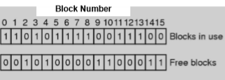

# 파일 시스템

- [파일 시스템](#파일-시스템)
  - [Block](#block)
  - [Inode struct](#inode-struct)
    - [Directory](#directory)
    - [File descriptor](#file-descriptor)
  - [Reading a file from Disk](#reading-a-file-from-disk)
  - [Creating & Writing a File from Disk](#creating--writing-a-file-from-disk)
  - [참고문헌](#참고문헌)

## Block

<table>
<tr>
  <td width="50%">
    
  </td>
  <td>
    

      <code>C</code>의 조각난 모양을 sector라고 한다.
       
      파일 시스템은 이 섹터를 여러 개 모아서 block이라는 단위를 사용한다.
    

    

      OS는 disk를 일정한 크기의 block으로 나누어 저장한다.
    
    
  </td>
</tr>
</table>

각 block은 그 목적에 따라 아래의 4가지로 구분지을 수 있다.

- `Super block`

  file system의 global한 정보들을 담는 block으로 하나의 file system에 1개만 존재한다.
   

- `Allocation structure block`
  <table>
  <tr>
    <td width="50%">
      
    </td>
    <td>
      bitmap의 방법으로 inode struct와 data block의 data에 대해 used/unused 정보가 저장된다.
    </td>
  </tr>
  </table>  
   

- `Key meta data block`

  inode struct의 table이 저장된다.
   

- `User data block`

  실제 data들이 저장된다.
   

<table>
<tr>
  <td width="50%">
    
  </td>
  <td>
    

      2개의 <code>Allocation structure block</code>이 각각 
      <code>inode bitmap</code>, <code>data bitmap</code>으로 운용되고,       
    

    

      최대 80개의 inode struct가 5개의 <code>Key meta data block</code>에 저장되는 경우의 전체 disk 구조이다.      
    

  </td>
</tr>
</table>

## Inode struct

Inode struct에는 file에 대한 meta data가 저장된다. 

file의 size, mode, permission, 소유자, 각종 시각 등이 저장된다.

각 file마다 하나의 Inode struct가 부여된다.

Inode struct에서 가장 중요한 정보는 실제 data가 저장된 `user data block`의 pointer이다. 

file의 크기가 block의 size보다 클 경우에는 여러 block을 사용해야 하기 때문에 data block을 가리키는 여러 pointer 변수들이 Inode struct에 존재하게 된다.

### Directory

Directory는 file의 한 종류이다. 

그렇다면 Directory의 Inode struct는 어떻게 구성되어 있을까? Inode struct의 일반적인 구성과 동일하다. 

Directory의 `data block`에서의 data가 다른데, Directory 하위 항목들에 대한 linked list를 저장된다. 

linked list의 각 node는 Inode number와 name을 구성 요소로 갖는다. 
이때 Inode struct pointer를 직접 저장하지 않고 단순 index 번호만 저장함으로써 공간을 절약한다.

Directory마다 단순 선형 linked list를 운용하게 될 경우 깊은 계층 구조를 갖는 Directory에서 성능이 많이 하락하기 때문에 B-tree와 같은 자료구조를 사용해 성능을 향상시키기도 한다.

### File descriptor

각 process는 고유한 `File descriptor table`을 운용한다. 

그 중 0번은 stdin, 1번은 stdout, 2번은 stderr file로 미리 예약되어 있다. 

File descriptor란 해당 process가 어떤 file을 open했을 때 return되는 값인데, 한 process가 한 file을 여러 번 open할 수도 있다. 

이 때마다 File descriptor는 새로 할당되게 된다. 즉, 같은 file에 대해 다른 File descriptor를 동시에 가질 수도 있는 것이다. 

각 File descriptor는 `open file table`을 가리킨다. 
`open file table`의 각 항목은 status(read/write 등), offset, inode sturct pointer 등을 저장한다. 

    정리하자면, 
    File descriptor table은 process마다 별개로 부여되는 local 구조이고,
    open file table, inode table은 전체 file system에서 하나를 운용하는 global 구조이다.

각 항목이 가리키는 방향은 

<table border="0">
 <tr>
    <td><code>file descriptor table</code></td>
    <td rowspan="2" >→ </td>
    <td><code>open file table</code></td>
    <td rowspan="2" >→ </td>
    <td><code>inode table</code></td>
    <td rowspan="2" >→ </td>
    <td><code>data block</code></td>
 </tr> 
</table>

## Reading a file from Disk

토글 안의 설명 한줄이 예시 사진 테이블의 한 행에 대한 설명이다.

<table>
<tr>
  <th colspan="2">
    /foo/bar 파일을 찾아보자.
  </th>
</tr>
<tr>
  <td width="50%">
    
  </td>
  <td>
    

      
1. root directory (“ / “) read

      <blockquote>
        a. root의 inode struct read
         
          &nbsp;&nbsp;&nbsp;&nbsp;root의 block pointer 획득
         
        b. root의 data block read
         
          &nbsp;&nbsp;&nbsp;&nbsp;root의 하위 항목들에 대한 linked list 획득
      </blockquote>
      

    

    

      
2. foo directory (“ /foo “) read

      <blockquote>
        a. root의 하위 항목들에 대한 linked list에서
         
          &nbsp;&nbsp;&nbsp;&nbsp;이름이 “foo”인 항목의 inode number 획득
         
        b. inode number를 통해 inode table에서의 주소 계산
         
        c. foo의 inode sturct read
         
          &nbsp;&nbsp;&nbsp;&nbsp;foo의 block pointer 획득
         
        d. foo의 data block read
         
          &nbsp;&nbsp;&nbsp;&nbsp;foo의 하위 항목들에 대한 linked list 획득
      </blockquote>
      

    

    

      
3. bar file (“ /foo/bar “) read
      
      <blockquote>
        a. bar의 하위 항목들에 대한 linked list에서 
         
          &nbsp;&nbsp;&nbsp;&nbsp;이름이 “bar”인 항목의 inode number 획득        
         
        b. inode number를 통해 inode table에서의 주소 계산
         
        c. bar의 inode struct read
      </blockquote>
      

    

    

      
4. bar[0] read

      <blockquote>
        a. bar의 inode struct에서
         
          &nbsp;&nbsp;&nbsp;&nbsp;첫번째 data block pointer 획득
         
        b. data block read
         
        c. bar inode struct write
         
          &nbsp;&nbsp;&nbsp;&nbsp;(access time 등 갱신 위함)
      </blockquote>
      

    

    

      
5. bar[1] read

      <blockquote>
        a. bar의 inode struct에서
         
          &nbsp;&nbsp;&nbsp;&nbsp;두번째 data block pointer 획득
         
        b. data block read
         
        c. bar inode struct write
         
          &nbsp;&nbsp;&nbsp;&nbsp;(access time 등 갱신 위함)
      </blockquote>
      

    

    

      
6. bar[2] read

      <blockquote>
        a. bar의 inode struct에서
         
          &nbsp;&nbsp;&nbsp;&nbsp;세번째 data block pointer 획득
         
        b. data block read
         
        c. bar inode struct write
         
          &nbsp;&nbsp;&nbsp;&nbsp;(access time 등 갱신 위함)
      </blockquote>
      

    
    
  </td>
</tr>
</table>

## Creating & Writing a File from Disk

<table>

<tr>
  <th colspan="2">

  </th>
</tr>
<tr>
  <td width="50%">
    
  </td>
  <td>
    

      
1. root directory (“ / “) read

      <blockquote>
        a. root의 inode struct read
         
          &nbsp;&nbsp;&nbsp;&nbsp;root의 block pointer 획득
         
        b. root의 data block read
         
          &nbsp;&nbsp;&nbsp;&nbsp;root의 하위 항목들에 대한 linked list 획득
      </blockquote>
      

    

    

      
2. foo directory (“ /foo “) read

      <blockquote>
        a. root의 하위 항목들에 대한 linked list에서
         
          &nbsp;&nbsp;&nbsp;&nbsp;이름이 “foo”인 항목의 inode number 획득
         
        b. inode number를 통해 inode table에서의 주소 계산
         
        c. foo의 inode sturct read
         
          &nbsp;&nbsp;&nbsp;&nbsp;foo의 block pointer 획득
         
        d. foo의 data block read
         
          &nbsp;&nbsp;&nbsp;&nbsp;foo의 하위 항목들에 대한 linked list 획득
      </blockquote>
      

    
    
    

      
3. bar file (“ /foo/bar “) create
      
      <blockquote>
        a. 현재 사용 중인 inode number을 확인하기 위해
         
          &nbsp;&nbsp;&nbsp;&nbsp;inode bitmap read
         
        b. 미사용 중인 inode number 선택 후 사용 중으로 변경하기 위해
         
          &nbsp;&nbsp;&nbsp;&nbsp;inode bitmap write
         
        c. foo의 하위 항목들에 대한 linked list에 
         
          &nbsp;&nbsp;&nbsp;&nbsp;획득한 inode number와 “bar” 명칭으로 항목 추가하기 위해
         
          &nbsp;&nbsp;&nbsp;&nbsp;bar data block write
         
        d. bar inode struct read
         
          &nbsp;&nbsp;&nbsp;&nbsp;(inode struct 초기화 위함)
         
        e. bar inode struct write
         
          &nbsp;&nbsp;&nbsp;&nbsp;(inode struct 초기화 위함)
         
        f. foo inode struct write
         
          &nbsp;&nbsp;&nbsp;&nbsp;(inode struct 초기화 위함)
      </blockquote>
      

    

    

      
4. bar file (“ /foo/bar “) write

      <blockquote>
        a. write 가능한 여유 있는 data block 존재 여부 확인하기 위해
         
          &nbsp;&nbsp;&nbsp;&nbsp;bar inode struct read
         
        b. 현재 사용 중인 data block number 확인하기 위해
         
          &nbsp;&nbsp;&nbsp;&nbsp;data bitmap read
         
        c. 미사용 중인 data block number 선택 후
         
          &nbsp;&nbsp;&nbsp;&nbsp;사용 중으로 변경하기 위해
         
          &nbsp;&nbsp;&nbsp;&nbsp;data bitmap write
         
        d. bar data block write
         
        e. bar inode write
         
          &nbsp;&nbsp;&nbsp;&nbsp;(access time 등 갱신 위함)
      </blockquote>
      

    
   
  </td>
</tr>

</table>

## 참고문헌

[파일시스템](https://hini7.tistory.com/88) -- 희은w

[파일시스템](https://cpm0722.github.io/operating-system/file-system) -- Hansu Kim