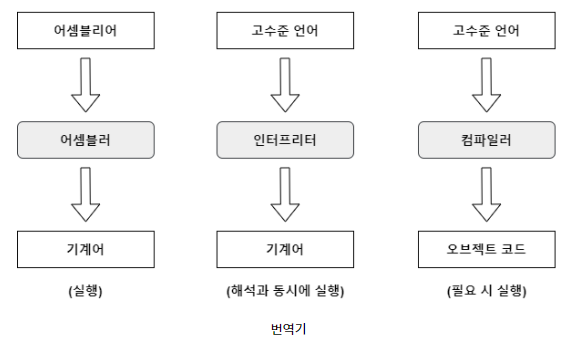
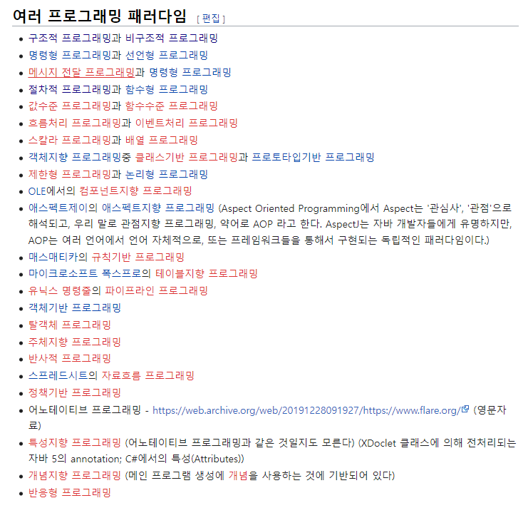

# 프로그래밍 언어 처리
## 목차
## 어셈블리어 vs 컴파일러 vs 인터프리터
## 구조적 프로그래밍 vs 비구조적 프로그래밍

# 어셈블리어 vs 컴파일러 vs 인터프리터
## 프로그래밍 언어와 컴파일 기능
**프로그래밍 언어란 사람과 컴퓨터 사이에 존재하는 일종의 커뮤니케이션 수단이다.**

- 저수준(Low-level) 언어
  - 기계어(Machine Language)
  - 자료 표현의 기본 단위인 비트의 값 0과 1로 그대로 표기하는 언어이다. 컴퓨터 CPU에서 명령을 수행하기 위해 반드시 필요하다. CPU의 종류에 따라 각기 고유한 명령어로 구성되어 있다. 컴퓨터 실행에는 효율적이지만, 사람이 작성하기에는 매우 불편하다.

- 어셈블리언어(Assembly Language)
  - 컴퓨터가 알아들 수 있는 기계어와 1대 1로 대응이 되는 컴퓨터 프로그래밍의 저급 언어이다. 컴퓨터는 0과 1만을 인식할 수 있는데, 이를 사람이 이해하기 쉽게 약간 변형하여 만든 언어가 어셈블리어이다. 기계어와 가장 가깝기 때문에 컴퓨터 구조를 이해하기 용이한 장점이 있지만, 길고 복잡하여 CPU마다 언어가 다르다는 단점이 있다.
  - 어셈블리어로 작성한 프로그램은 **어셈블러**라는 프로그램에 의해서 기계어로 변환

- 고수준(High-level) 언어
  - 명령어가 일상적인 문장과 가까워 코딩이 훨씬 간단하다.(프로그램을 개발하기도 쉽고, 유지보수도 쉽다.)
  - 절차적(Procedural) 언어 : FORTRAN, COBOL, C, PASCAL, BASIC 등이 대표적이다.
  - 최근에는 C++, JAVA 등의 객체지향 언어가 많이 사용됨
  - 어셈블리어는 컴퓨터가 사용하는 기계어에 좀더 가까운 반면, 고급 언어는 사람이 사용하는 자연어 쪽에 더 가까운 언어

## 언어 변역기 프로그램
- 어셈블러(Assembler)
  - **어셈블리어로 작성된 원시 프로그램을 기계어로 된 목적 프로그램으로 어셈블하는 언어 변역프로그램**

- 컴파일러(Compiler)
  - **고급 언어로 작성된 프로그램을 번역해서 기계어로 된 프로그램을 만들어주는 일종의 변역기**
  - 모든 프로그램은 기계어로 변역되어야 프로그램이 실행 가능하다.
  - 오프젝트 코드 형태의 프로그램(*.exe 또는 *.com 파일)은 항상 컴퓨터에서 실행이 가능하다.
  - 빌드 타임 : 프로그래머가 작성한 모든 코드에 대한 기계어를 생성하므로 인터프리터 언어보다 느림
  - 런타임 : 빌드타임에 작성한 기계어를 모두 기계에 보대기 때문에 인터프리터보다 빠름
  - 빌드가 느리고, 한번에 기계어를 생성하기 때문에 기계어가 정적이나 실행이 빠르다.
  - 컴파일러 언어 : PASCAL, C, C++, Kotlin 등

- 인터프리터(Interpreter)
  - **소스프로그램을 한 줄씩 기계어로 해석하여 바로 실행하는 방식**이다. BASIC이 대표적이며, 웹페이지에 많이 사용되는 스크립트 언어가 있다. 장점으로는 개발이나 업데이트가 쉽다.
  - 빌드 타임 : 사실 상 아무것도 하지 않으므로 컴파일러 언어보다 빠름
  - 런타임 : 한줄씩 분석해 기계어로 변환한 뒤 기계로 전송하기 때문에 컴파일 언어보다 느림
  - 실행속도가 느리나 코드 변경시 즉시 실행이 가능하면 테스트에 용이하다.
  - 인터프리터 언어 : BASIC, JavaScript, HTML, Python 등

## Trade-off
|       | 어셈블러언어 | 컴파일러 언어  | 인터프리터 언어  |
|:-----:|------|---|---|
| 동작  |   번역기  | 번역기  | 통역기 |
| 실행속도   |   매우 빠름  | 빠름  | 느림  |
| 난이도  | 매우 어려움 | 인터프리터보다 어려움  | 쉬움  |
| 가독성 | 낮음  | 높음  | 높음  |
| 파일크기 |  작음 | 매우 큼  | 큼  |

# 구조적 프로그래밍 vs 비구조적 프로그래밍
## 프로그래밍 패러다임
구조적 프로그래밍, 비구조적 프로그래밍은 결국 프로그래밍 패러다임의 하나이다. 
패러다임이란 **프로그래밍을 하는 방법**을 말한다. 
언어에 독립적이며 어떤 프로그래밍 구조를 사용할지, 언제 구조를 사용해야 하는지를 결정한다. 즉 프로그래머에게 프로그래밍 관점을 제공한다. 
예를 들어 `객체지향 프로그래밍`은 프로그래머들이 프로그램을 상호작용하는 객체들의 집합으로 볼 수 있게 하는 반면에, `함수형 프로그래밍`은 상태값을 지니지 않은 함수값들의 연속으로 생각할 수 있게 해준다. 

그냥 너~무 많다ㅋ.ㅋ 

## 구조적 프로그래밍
- 절차적 프로그래밍(단순히 순차적인 명령 수행이 아니라 루틴, 서브루틴, 메소드, 함수 등을 이용한 프로그래밍 패러다임)의 하위 개념
-  절차적 프로그래밍은 **반복될 가능성이 있는 모듈을 재사용 가능한 함수**로 나누는데 구조적 프로그래밍은 함수를 기준이 아니라 **모듈을 기준으로 나누는 것**
- GOTO문을 없애거나 GOTO 문에 대한 의존성을 줄여준다.
- ex) Pascal, Ada

## 비구조적 프로그래밍
- **하나의 연속된 덩어리에 모든 코드를 넣는 프로그랭 패러다임**
- GOTO문과 같은 흐름 제어문에 의존해야한다는 단점이 있다.
- 디버그하기가 어렵다.
- ex) 어셈블리어, BASIC

## 정리
비구조적 프로그래밍은 모든 코드를 다 적어버리는 프로그래밍 패러다임이다. 
이러한 패러다임을 해결하기 위해 구조적 프로그래밍이 나왔고 구조적 프로그래밍은 프로그램의 작업을 나누어 필요할 때마다 호출사여 사용하는 것이다.

## 참고문언
[어셈블리어 vs 컴파일러 vs 인터프리터 관련 문헌](https://cozy-dandelion.tistory.com/17)

[프로그래밍 패러다임 관련 문헌](https://ko.wikipedia.org/wiki/%ED%94%84%EB%A1%9C%EA%B7%B8%EB%9E%98%EB%B0%8D_%ED%8C%A8%EB%9F%AC%EB%8B%A4%EC%9E%84)

[구조적, 비구조적 프로그래밍 관련 문헌](https://ko.wikipedia.org/wiki/%EA%B5%AC%EC%A1%B0%EC%A0%81_%ED%94%84%EB%A1%9C%EA%B7%B8%EB%9E%98%EB%B0%8D)
