# 프로그래밍 언어 처리

- [프로그래밍 언어 처리](#프로그래밍-언어-처리)
  - [들어가며](#들어가며)
  - [프로토타입 기반 OOP 언어: Javascript](#프로토타입-기반-oop-언어-javascript)
    - [OOP와 연결성](#oop와-연결성)
    - [클래스 기반과 차이점](#클래스-기반과-차이점)
    - [의미 사용 이론과 Javascript](#의미-사용-이론과-javascript)
    - [Javascript 프로토타입](#javascript-프로토타입)
  - [인터프리터 언어: Javascript](#인터프리터-언어-javascript)
    - [Javascript 엔진](#javascript-엔진)
    - [추상 구문 트리(AST)](#추상-구문-트리ast)
  - [참고 문헌](#참고-문헌)

## 들어가며

교재를 통해 스터디 해볼 내용은 다음과 같다 판단하였다.
- `정규표현식`이 있고, 알고리즘 스터디 1주차에서 경험해볼 수 있다.
- `내가 사용하는 주 언어는 어떠한 언어인지`에 대해 조사를 해볼 수 있다.

## 프로토타입 기반 OOP 언어: Javascript

### OOP와 연결성

Javascirpt 언어가 OOP임은 가족 유사성 이론을 근거하기 때문이다.

    "인간은 사물을 분류할 때 자연스럽게 가장 유사성 높은 것 순서대로 등급을 매긴다.

    이렇게 분류했을 때 가장 높은 등급을 가진 녀석이 원형(프로토타입)이다." -- 로쉬

<table>
  <tr>
    <td width="50%" >
      
    </td>
    <td>
      <code>
        <p>
        i.e.  참새, 타조의 속성을 생각해볼때
        </p>
        <p>
                참새: 2점(2개의 날개, 비행여부)
                <br/>
                타조: 1점(2개의 날개)
        </p>
        <p>
              프로토타입 기반으로 서술하면
              <br/>
              참새는 가장 전형적인 새이고,
              <br/>
              타조는 가장 비전형적인 새이다.
        </p>
      </code>
    </td>
  </tr>
</table>

OOP의 특징은 상속을 활용한 확장이다.

클래스가 없는 Javascript에서 **확장의 행위는**

프로토타입을 복사하고, **인스턴스 수준에서 메소드와 변수를 추가하는 방식**을 통해 새로운 객체를 생성한다.

- 예시 코드로 이해를 돕자.

  ```js
  function 참새(){
      this.날개갯수 = 2;
      this.비행 = true;
  }
  const 참새1 = new 참새();

  function 타조(){
    this.긴다리 = true;
  }
  타조.prototype = 참새1;
  const 타조1 = new 타조();

  console.log(
    "타조1 날개 : ", 타조1.날개갯수, // 2
    "비행: ", 타조1.비행             // true 
    ); 

  // +++ OOP's extension
  타조1.비행 = false;
  console.log(
    "비행 :", 타조1.비행            // false
    );
  ```  

- 도식화해보면 다음과 같다.
  <table>
    <tr>
      <td width="50%">
        
      </td>
      <td>
        <p>
          <code>비행</code>이라는 <code>참새</code>와 <code>타조</code>의 같은 속성을 
          <br/>        
          <code>타조</code>에서 변경해도,
          <br/>
          <code>참새</code>는 영향을 받지 않았다.
        </p>
        <p>
          OOP의 상속을 잘 활용한다고 볼 수 있다.
        </p>
      </td>
    </tr>
  </table>


### 클래스 기반과 차이점

클래스 기반에는 속성에 따라 분류한다.
> 이때, 분류(Classification)라는 단어의 뜻 자체가 속성을 도출하는뜻이다. 
> 
> 다만, 글의 맥락을 이해하기 위해선 분류라는 매커니즘이 클래스와 프로토타입은 다르게 한다로 서술하였다.

속성에 따른 분류란

    속성이 동일한 경우 그 그룹은 같은 범주에 속한다.

      cf. 돌고래의 속성이 동일한 경우를 찾다보니 어류가 아닌 포유류 범주에 들었다.

프로토타입에 따른 분류 개념은 속성에 따른 분류 개념을 아래와 같이 반박한다.

    "속성의 관점에서 정의하기 어려운 분류가 있다." -- 비트겐슈타인

      cf. 예술을 속성의 관점으로 논할 수 없다.

프로토타입 기반이 따르는 분류 개념은 의미 사용 이론을 근거 한다.

      "「진정한 본래의 의미」란 존재하지 않고, 「상황과 맥락」에 의해서 결정된다. -- 비트겐슈타인"

      c.f. 아이는 참새를 새의 범주로 속하지만, 타조를 새의 범주로 속하지 못할 수 있다.
           아이가 생각할 때 타조는 매우 비전형적이기 떄문이다.

           다만, 조류학자가 생각할때 참새와 타조는 명확히 새의 범주에 속한다.


### 의미 사용 이론과 Javascript
    
의미 사용 이론

    분류는 맥락에 의해서 결정된다.

<details>
<summary>의미 사용 이론을 Javascript에 적용한 예시 A</summary>
<br/>

    변수의 의미는 실행 문맥(Execution Context)에서 결정된다.

`Execution Context`의 특징은

    Execution Context 내의 범위의 모든 선언을 참고(Hoisting)해서 맥락을 정의한다.
    
    Execution Context 생성 시, 변수의 의미가 통하는 곳(Lexical Scope)이 별도로 정의된다.

- 코드로 확인해보자.

  ```js
  var name = 'Kai';

  init();

  function init() {
      var name = "Steve";

      function displayName() {  
        console.log(name);      
      }

      displayName();
  }
  ```
- 다음은, 코드를 로드하여 전역 `Execution Context` 생성 시 코드의 변화이다.
  `Lexical Scope`는 `name`과 `init`이다.

  ```js
  var name;
  var init = function init() {
    var name = "Steve";

    function displayName() {  
      console.log(name); 
    }

    displayName();
  }

  name = 'Kai';
  ```

- 다음은, `init` 함수를 호출해서 `init`의 `Execution Context` 생성 시 코드의 변화이다.
  `Lexical Scope`는 `name`과 `displayName`이다.

  ```js
  var name;
  var init = function init() {
    var name;
    var displayName = function displayName() {  
      console.log(name); 
    }
    
    name = "Steve";

    displayName();
  }

  name = 'Kai';
  ```

이를 통해 전역 또는 `init`의 `Execution Context` 마다

`name`이란 단어가 존재 했지만, 각자 맥락이 다름을 발견할 수 있었다.

</details>
<br/>

<details>
<summary>의미 사용 이론을 Javascript에 적용한 예시 B</summary>
<br/>

앞선 목차에 아이와 조류학자에 따라 맥락이 달라졌다.

즉, 단어의 의미는 단어를 받아들이는 대상에 따라서 달라진다.

Javascript로 서술하면,

    this라는 단어가 정의된 메서드를 

    어떤 Execution Context가 받아들이고 사용(invoke)했는지에 따라 맥락이 달라진다.

다음은 이해를 돕는 코드 예시이다.

```js
var someValue = 'hello';

function outerFunc() {
    console.log(this.someValue);
    this.innerFunc();
}
const obj = {
    someValue : 'world',
    outerFunc,
    innerFunc : function() {
        console.log("innerFunc's this : ", this);
    }
}
obj.outerFunc();  /*
                      world
                      obj

                      +++ invoke by obj
                  */ 
outerFunc();      /*
                      hellow
                      error!

                      +++ invoke by global
                  */ 
```

</details>

### Javascript 프로토타입

먼저 인지해야할 2가지 주체가 있다.

`함수 객체`는 객체를 만들어내기 위한 추상적 주체이고,

`프로토타입 객체`는 추상적 주체의 분신으로, 
추상적 주체의 인스턴스가 만들어질 때, 복제해서 가져올 프로퍼티들을 참고하는 실질적 주체이다.  

- 아래 코드를 예시로 프로토타입 구조를 확인해보겠다.

  ```js
  function foo() {};

  var bar = new foo();
  console.log(bar);
  ```
- 결과값을 확인해보자.

  ```node
  foo {}
    [[Prototype]]: Object
      constructor: ƒ foo()
        ...
        prototype: 
          [[Prototype]]: Object
            constructor: ƒ Object()
              ...
              prototype: ...
  ```

- 결과값을 도식화해보자.

  

<br/>


🤔 왜 이런 분리된 주체의 구조를 사용해야 했나?

일단, 알고 있는 내용에서 사견을 말해보겠다.

인스턴스 생성시, `함수 객체`의 영향은 받지 않는다.

```js
function foo() {};
foo.value = 100;

var bar = new foo();
console.log(bar.value); // +++ undefined
```

인스턴스 생성시, `프로토타입 객체` 영향을 받아 프로퍼티를 상속받는다.

```js
function foo() {};
foo.prototype.protoValue = 100;

var bar = new foo();
console.log(bar.protoValue); // +++ 100
```

즉, 첫번째 예시는 `함수 객체`에 프로퍼티를 동적으로 추가시키는 행위인데, 

두번째 예시처럼 인스턴스가 자신의 프로퍼티가 없어 상위 객체의 프로퍼티에 접근하는 행위와 구분하기 위해서 

분리된 주체를 사용했다고 생각한다.

🤔 인스턴스가 메모리로 오는 시점에 특이사항이 있다.

프로토타입 객체의 프로퍼티를 인스턴스에서 **접근**만 한다면, 
확인하여 참조만 하지만,

프로토타입 객체의 프로퍼티를 인스턴스에서 **연산**을 하려고 하는 경우,
인스턴스에 메모리가 주어지고, 연산된 결과값을 메모리에 저장한다.

## 인터프리터 언어: Javascript

다음은 Javascript의 구동원리를 도식화한 것이다.


1. 개발자가 Javascript 코드를 작성한다.
2. Javascript 엔진 내부의 인터프리터[^인터프리터]는 가상머신이 이해할 수 있는 바이트 코드로 변환한다.
    
        cf.
          Javascript 엔진 v8
          Javascript 엔진 v8으로 빌드된 Javascript 런타임 노드
            사견으로, Javascript 런타임이 인터프리터라고 생각한다.

[^인터프리터]: 코드를 한 줄 한 줄 읽어내려가며 한 줄씩 중간 단계의 바이트 코드로 변환한다.

3. 가상머신은 바이트 코드를 CPU가 이해할 수 있는 기계어로 변환한다.

4. CPU는 가상머신이 만들어낸 기계어를 수행한다.

### Javascript 엔진

Javascript 엔진 부분을 좀 더 살펴보자.


1. 엔진이 실행할 Javascript 파일을 받는다.
2. Javascript 코드를 분석하여 토큰(의미를 갖는 최소 단위)으로 분해한다.
3. Parser가 분해한 토큰들을 분석하여, 문법적으로 의미를 갖는 트리 자료구조(AST)로 만든다.    
4. 인터프리터가 AST를 읽고 바이트 코드로 변환한다.
5. AST를 읽는 과정에서 Profiler가 최적화 할 수 있는 코드를 JIT[^JIT] 컴파일러에게 전달한다.
    > 주로 반복해서 실행되는 코드 블록을 컴파일 한다.
   
[^JIT]: 코드를 우선 인터프리터 방식으로 실행하고 필요할 때 컴파일 하는 방법

즉, Javascript 엔진은 인터프리터 방식과 컴파일 방식을 함께 사용하여 최적화된 성능을 구현하고, 엔진마다 세부 사항이 다르다.

### 추상 구문 트리(AST)

**정의**

    소스 코드를 AST라는 자료 구조에 일반 텍스트로 구문 분석하는 것이다.

**이점**

    - 소스 코드를 구조적으로 제시하고,

    - 컴파일러가 프로그램과 언어의 적절한 사용을 검증하기 위한 역할을 한다.

다음은 구문 분석 과정이다.

1. Javascript 코드가 다음과 같다면
    ```js
    function foo() {
      function bar(x) {
          return x + 10;
      }

      function baz(x, y) {
          return x + y;
      }

      console.log(baz(100, 200));
    }
    ```
2. Parser는 다음과 같은 AST를 만드는데,
    

   - 기본적으로 Lazy Parser가 아직 인터프리터가 읽을 필요 없는 부분은 제외한다.
      

   - `즉시 실행 함수` 같은 부분이 Eager Parser가 구문 분석한다.
  <br/>
3. Lazy Parser는 앞선 목차의 4번 과정을 
   Eager Parser는 앞선 목차의 3번 과정으로 이어진다고 판단한다.

<hr/>

## 참고 문헌

[프로토타입](http://insanehong.kr/post/javascript-prototype/) -- Insanehong

[프로토타입](https://jsdev.kr/t/javascript-prototype/2853) -- 자바스크립트 개발자 포럼

[자바스크립트는 왜 프로토타입을 선택했을까](자바스크립트는-왜-프로토타입을-선택했을까-997f985adb42) -- Sungmook Lim

[자바스크립트, 인터프리터 언어일까?](https://oowgnoj.dev/review/advanced-js-1) -- oowgnoj

[AST](https://blog.sessionstack.com/how-javascript-works-parsing-abstract-syntax-trees-asts-5-tips-on-how-to-minimize-parse-time-abfcf7e8a0c8) -- Lachezar Nickolov

[자바스크립트 작동 방식](https://curryyou.tistory.com/237) -- 카레유
