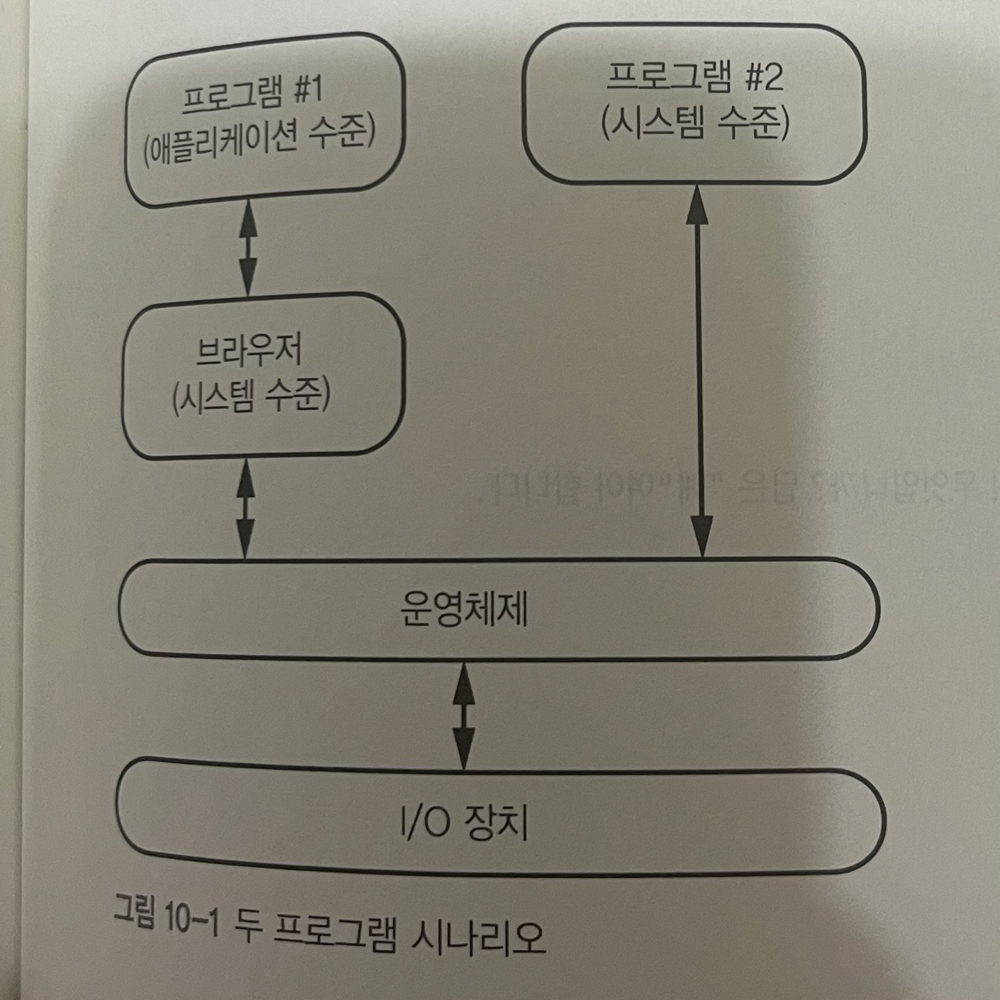
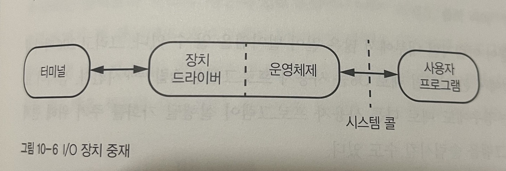
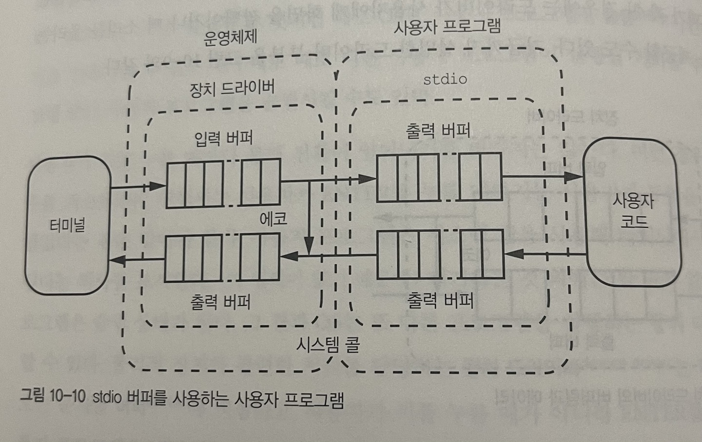

# 어플리케이션 프로그래밍 & 시스템 프로그래밍

## 목차
- 애플리케이션 프로그래밍과 시스템 프로그래밍 간단 비교
- 시스템 프로그래밍
  - 터미널
  - 문맥전환
    - 운영체제의 문맥전환
    - 사용자 프로그램의 문맥전환(표준I/O)

# 애플리케이션 프로그래밍과 시스템 프로그래밍 간단 비교

- 애플리케이션 프로그래밍 : html, javascript, 등
- 시스템 프로그래밍 : c, java, 등

애플리케이션 프로그래밍 언어들은 **브라우저**라는 소프트웨어로만 구성된 고수준 가상머신을 사용하여 운영체제에 접근하는 언어이고, 
시스템 프로그래밍 언어들은 **언어내에 내장되어 있는 가상머신**을 이용하여 운영체제로 접근하는 언어이다.

# 시스템 프로그래밍
## 터미널
시스템 프로그래밍 언어(C)는 컴파일 언어이기 때문에 인터프리터 언어 처럼 소스코드를 **실행**할 수 없다. 
소스코드를 실행하기 위해 컴파일을 거친 코드를 터미널에 타이핑해 기계어 파일을 생생해야한다.(이를 빌드라고 부름) 

[c파일 터미널로 실행하기](https://dojang.io/mod/page/view.php?id=696) 
위 링크와 같이 타이핑하여 파일을 실행한다. 

터미널에서 프로그램을 바로 실행시키는 것처럼 보이지만 

**아니다!** 터미널 또한 I/O 장치 이므로 중간에서 운영체제가 중재를 한다. 

## 문맥전환
운영체제는 한번에 여러 `프로그램을 실행`(프로세스)할 수 있다. 
하지만 컴퓨터는 레지스터 집합(CPU)이 하나 이므로 하나의 프로그램(프로세스)을 교체할 때마다 레지스터들을 저장하고 복구해야 한다. 
이때 저장하고 복구해야 하는 내용(CPU 레지스터, MMU 레지스터, I/O 상태 등)을 **프로세스 문맥**이라고 하고 바꾸는 것을 **context switching(문맥전환)**이라고 한다. 

### 운영체제의 문맥전환
장치 드라이버 : 물리적 장치와 관련된 처리 담당(운영체제 내부에 존재) 
버퍼 : 버퍼는 데이터를 한 곳에서 다른 한 곳으로 전송하는 동안 일시적으로 그 데이터를 보관하는 **메모리의 영역**이다.(FIFO구조) 

- 문맥전환은 많이 일어나면 좋지 않다.
- 근데 키보드 자판 하나 누르는 것도 사실 문맥전환이 일어나야한다.
- 하지만 이렇게 하다가는 컴퓨터를 사용할 수 없다. 그래서 OS는 **문맥전환을 최소화**하기 위해 사용자 프로그램을 **슬립**시켜놓고 ENTER 버튼이 눌렸을 경우에만 사용자 프로그램을 깨운다.
- ENTER 이전에 타이핑된 문자들은 **버퍼**에 저장해둔다.

### 사용자 프로그램의 문맥전환(표준I/O)

stdio 라이브러리 : 사용자 프로그램내에서 **버퍼입력 지원** 

터미널에서의 타이핑도 있지만 사용자프로그램내에서도 타이핑을 할 수 있으므로 똑같이 버퍼를 활용해 문맥전환을 막는다. 

