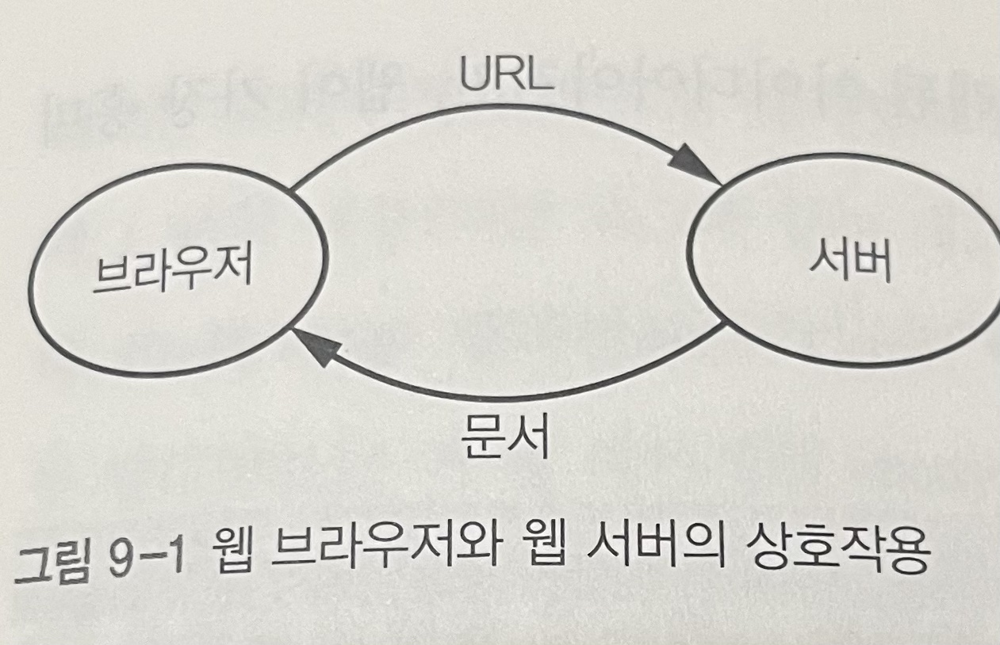
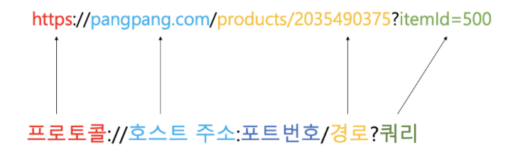
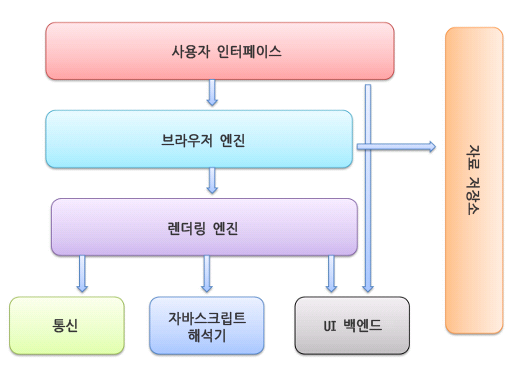
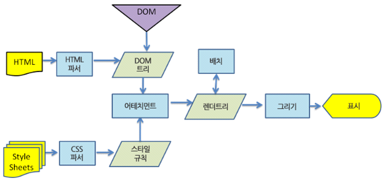

# 웹브라우저

## 목차
- 웹 브라우저 + 웹 표준문서
- 마크업 언어
  - HTML, XML
  - DOM(깊이 우선 순회)
- CSS와 HTML의 관계
- XML과 HTML의 관계
- 자바스크립트
- jQuery 자바스크립트 비교
- SVG 비교 위 두개랑
- HTML -> HTML5로 추가된것
- JSON
- 브라우저 블록도

# 웹 브라우저
## 브라우저란?
> 브라우저란 기본적으로 월드 와이드 웹 흔히 이터넷 주소창에 (www) 달리는 월드 와이드 웹에서 정보를 검색 및 탐색하기 위한 소프트웨어이다.
> ex) 익스플로어, 크롬, 파이어폭스, 사파리 등

## 브라우저 역할
1. 사용자가 선택한 자원을 서버에 요청, 브라우저에 표시
> 여기서 자원은 html문서, pdf, image 등
> 자원의 주소를 URL에 의해 정해진다.

### URL(균일 자원 위치 지정자)

- 프로토콜(스킴) : 네트워크 통신 규격을 의미
  - http 프로토콜 등
- 호스트주소 : 통신하려는 서버 = 도메인 네임 or ip주소
- 포트번호 : 컴퓨터에서 실행되고 있는 수많은 프로세스들의 주소
  - HTTP -> 80, HTTPS -> 443 등
- 경로 : 서버 프로그램 내에 짜인 로직으로 가는 영역
- 쿼리 : URL에서 추가적인 데이터를 표현할 경우 사용

## 브라우저 기본 구조

**사용자 인터페이스**
주소 표시출, 이전/다음 버튼, 북마크 등 사용자가 활용하는 서비스들(요청한 페이지를 보여주는 창을 제외한 나머지)

**브라우저 엔진**
사용자 인터페이스와 렌더링 엔진 사이의 동작 제어

**렌더링 엔진**
요청한 콘텐츠 표시(html 요청이 들어오면? -> html, css 파싱해서 화면에 표시)

**통신**
http요청과 같은 네트워크 호출에 사용(플랫폼의 독립적인 인터페이스로 구성되어었음)

**UI 백엔드**
플랫폼에서 명시하지 않은 일반적 인터페이스, 콤보 박스 창같은 기본적 장치를 그림

**자바스크립트 해석기**
자바스크립트 코드를 해석하고 실행

**자료 저장소**
쿠키 등 모든 종류의 자원을 하드 디스크에 저장하는 계층

# 마크업 언어
## 마크업 언어란?
태그 등을 이용하여 문서나 데이터의 구조를 명기하는 언어의 한가지
> 태그 : 문서의 구조를 표현하는 역할
> ex) HTML, XML 등

## HTML
- Hypertext Markup Language의 약자
- **웹 페이지 및 응용 프로그램의 구조를 만들기 위한** 표준 마크업 언어이다. 
- 웹 브라우저가 이미지, 텍스트, 하이퍼 링크 등과 같은 페이지 요소를 표시하는 방법을 정의한다.

## XML
- Extensible Makeup Language의 약자
- 사람과 기계가 읽은 수 있는 형식으로 **문서를 인코딩하기 위한 규칙 집합을 정의**하는 마크업 언어
- **플랫폼이 독립적인** 마크업 언어
- 데이터베이스, 프로그램 및 응용 프로그램, 모바일 응용프로그램 등에서 **다른 플랫폼간에 데이터를 교환**하기 위해 사용된다.

## HTML vs XML
**정의**
- `HTML`은 **웹 페이지 및 응용 프로그램의 구조**를 만들기 위한 표준 마크업 언어이다.
- `XML`은 사람과 기계가 읽을 수 있는 형식으로 **문서를 인코딩하기 위한 규칙 집합을 정의**하는 마크업 언어이다.

**대소문자 구분**
- `HTML` 구분 x
- `XML` 구분 o

**태그**
- `HTML` : 미리 정의된 태그 사용
- `XML` : 자신만의 태그 집합 정의

**주요 초점**
- `HTML` : 데이터 표시
- `XML` : 정보 전달

**용법**
- `HTML` : 웹 페이지 구조 개발
- `XML` : 다양한 플랫폼간에 데이터 교환

# DOM(Document Object Model)
웹페이지 소스를 까보면 `<html>, <body>`와 같은 태그들이 존재한다. 이를 Javascript가 활용할 수 있는 객체로 만들면 `문서 객체`가 된다.
모델은 말 그대로, 모듈화로 만들었다거나 객체를 인식한다라고 해석하면 된다.
즉, **DOM은 웹브라우저가 html 페이지를 인식하는 방식**을 말한다.

> 어태치먼트 : 웹킷이 렌더 트리를 생성하기 위해 DOM노드와 스타일 정보를 연결하는 과정

## 참고 문헌

[웹 브라우저 참고문헌](https://github.com/gyoogle/tech-interview-for-developer/blob/master/Web/%EB%B8%8C%EB%9D%BC%EC%9A%B0%EC%A0%80%20%EB%8F%99%EC%9E%91%20%EB%B0%A9%EB%B2%95.md)

[URL 참고 문헌](https://www.grabbing.me/URL-018cdd1bb4b541fab6246569244fcf93)

[마크업(html, xml) 참고 문헌](https://hanamon.kr/htm-xml-%EC%B0%A8%EC%9D%B4%EC%A0%90/)