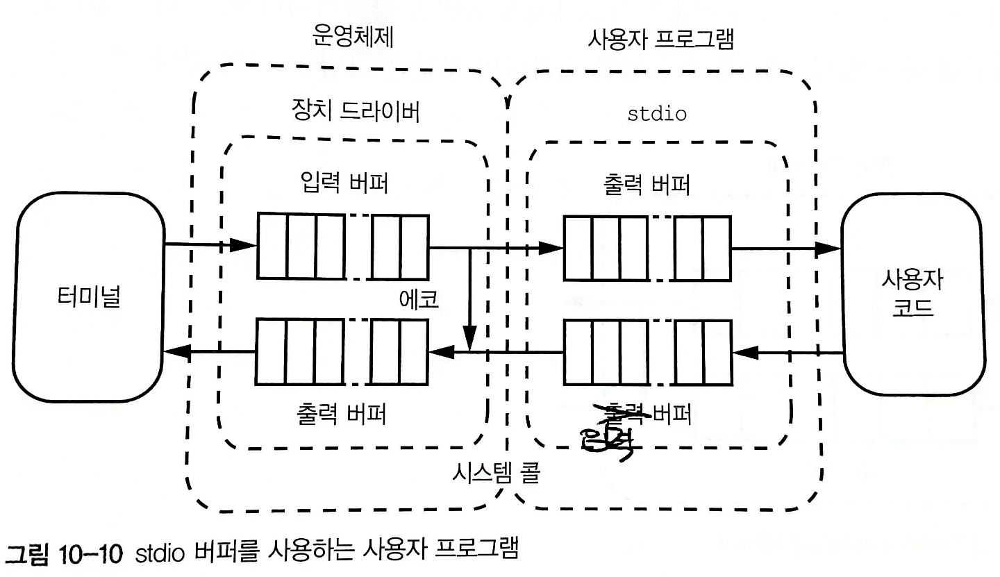

# 시스템 프로그래밍

- [시스템 프로그래밍](#시스템-프로그래밍)
  - [터미널](#터미널)
  - [장치 드라이버](#장치-드라이버)
  - [버퍼](#버퍼)
    - [표준 I/O](#표준-io)
  - [참고 문헌](#참고-문헌)

## 터미널

`C`는 컴파일 언어이기 때문에 소스 코드를 실행 할 수 없다.
소스 코드를 먼저 기계어로 변환해야 한다. 

기계어로 변환이 된 상태를 프로그램이라 부를 수 있겠다.

컴퓨터 시스템은 터미널 애플리케이션 내에 문자를 통한 명령줄 인터페이스를 제공한다.

🤔 사용자 프로그램 내에서 명령줄 인터페이스를 사용하는 경우와
터미널 애플리케이션에서 명령줄 인터페이스를 사용하는 경우가 다른가?

터미널 애플리케이션은 I/O 장치이다.

사용자 프로그램은 직접 I/O 장치와 통신하지 않고, 운영체제가 중간에서 통신을 중재한다.

사용자 프로그램과 운영체제의 통신은 시스템 콜이라고 한다.

## 장치 드라이버

장치 드라이버는 복잡하다.

운영체제가 한 번에 사용자 프로그램을 하나 이상 실행할 수 있기 때문이다.

컴퓨터는 레지스터 집합이 하나뿐이므로 
운영체제는 한 사용자 프로그램을 다른 사용자 프로그램으로 바꿀 때마다  레지스터들을 저장하고, 복구해야 한다. (Context switching: 문맥 전환)

장치 드라이버는 사용자가 사용자 프로그램을 실행하면서 키를 누르는 행위마다 시스템 콜로 간주하여 
운영체제에 잦은 문맥 전환이 일어나기를 바라지 않는다.

이런 경우 문맥 전환 횟수를 최소화하기 위해서 사용자가 특정 키(`Enter`)를 누를 때까지 사용자가 타이핑하는 문자를 버퍼에 저장한다.

이 상태를 슬립 상태라고 한다.

🤔 206p 슬립 상태

때문에, 운영체제는 또 다른 프로그램을 실행하는 등의 다른 동작을 수행할 수 있다.

## 버퍼

버퍼는

      FIFO(i.e 큐) 데이터 구조이다.

### 표준 I/O

교재에 나온 표준 I/O 라이브러리가 만들어진 이유를 정리해보면

사용자가 
- 사용자 프로그램이 시스템 콜을 호출하는 키를 다르게 정의하고 
- 또는 키 마다 시스템 콜을 다회 사용 할 수 있기 때문이라고 생각한다.

표준 I/O 라이브러리(이하 `stdio`)에는 사용자 프로그램이 쓸 수 있는 버퍼 I/O 함수가 들어있다.

`stdio`는 입력 버퍼를 지원한다.

입력 버퍼를 사용하면 시스템 콜을 한 번만 사용해 장치 드라이버에서 읽은 데이터를 버퍼에 넣을 수 있다.

## 참고 문헌
