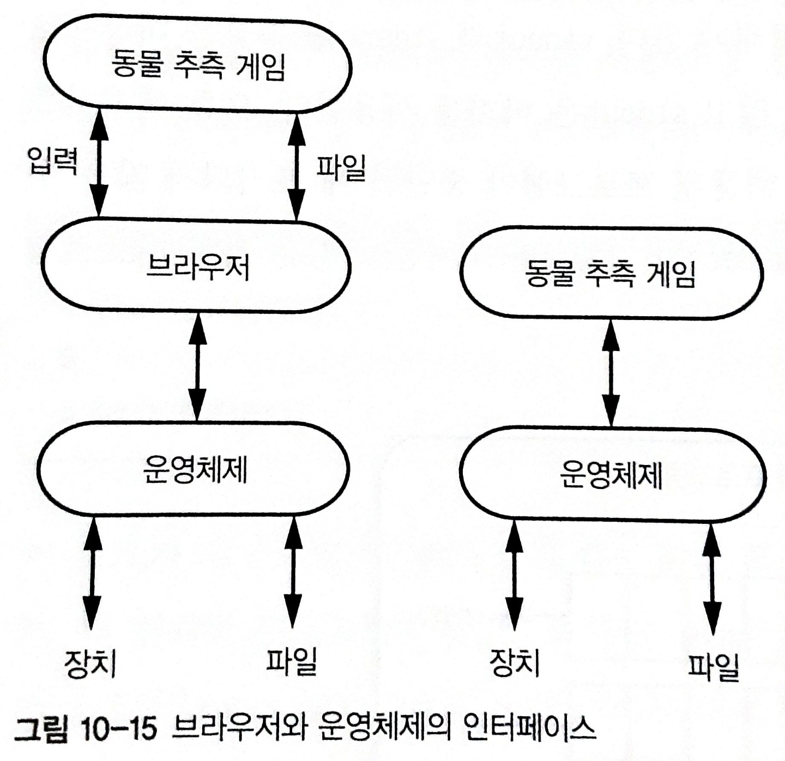

# 시스템 프로그래밍

- [시스템 프로그래밍](#시스템-프로그래밍)
  - [터미널](#터미널)
  - [장치 드라이버](#장치-드라이버)
  - [표준 I/O](#표준-io)
    - [버퍼 오버플로](#버퍼-오버플로)
    - [표준I/O와 장치 드라이버 상호작용](#표준io와-장치-드라이버-상호작용)
    - [파일 추상화](#파일-추상화)
  - [참고 문헌](#참고-문헌)

## 터미널

`C`는 컴파일 언어이기 때문에 소스 코드를 실행 할 수 없다.
소스 코드를 먼저 기계어로 변환해야 한다. 

기계어로 변환이 된 상태를 프로그램이라 부를 수 있겠다.

컴퓨터 시스템은 터미널 애플리케이션(`shell`) 내에 문자를 통한 명령줄 인터페이스(`CLI`)를 제공한다.

터미널 애플리케이션은 I/O 장치이다.

사용자 프로그램(`process`)은 직접 I/O 장치와 통신하지 않고, 운영체제(`kernel`)가 중간에서 통신을 중재한다.

사용자 프로그램과 운영체제의 통신은 시스템 콜이라고 한다.

## 장치 드라이버

장치 드라이버는 복잡하다.

운영체제가 한 번에 사용자 프로그램을 하나 이상 실행할 수 있기 때문이다.

컴퓨터는 레지스터 집합이 하나뿐이므로 
운영체제는 한 사용자 프로그램을 다른 사용자 프로그램으로 바꿀 때마다  레지스터들을 저장하고, 복구해야 한다. (`Context switching: 문맥 전환`)

장치 드라이버는 사용자가 사용자 프로그램을 실행하면서 키를 누르는 행위마다 시스템 콜로 간주하여 
운영체제에 잦은 문맥 전환이 일어나기를 바라지 않는다.

이런 경우 문맥 전환 횟수를 최소화하기 위해서 사용자가 엔터 키를 누를 때까지 사용자가 타이핑하는 문자를 버퍼에 저장한다.

이 상태를 슬립 상태라고 한다. 
이해를 돕기 위해 슬립 상태는 I/O 입터럽트라고 할 수 있겠다.

때문에, 운영체제는 또 다른 프로그램을 실행하는 등의 다른 동작을 수행할 수 있다.

## 표준 I/O

교재에 나온 표준 I/O 라이브러리가 만들어진 이유를 정리해보면

사용자가 
- 사용자 프로그램이 시스템 콜을 호출하는 키를 다르게 정의하고 
- 또는 키 마다 시스템 콜을 다회 사용 할 수 있기 때문이라고 생각한다.

표준 I/O 라이브러리(이하 `stdio`)에는 사용자 프로그램이 쓸 수 있는 버퍼 I/O 함수가 들어있다.

`stdio`에서 사용하는 버퍼는 원형 큐 데이터 구조이다.

      원형 큐 형태는 
      일반적인 큐에서 원소를 제거할 시 n 만큼 자리이동 시켜야하는 한계를 극복한다.

`표준 입력(stdin)`은 입력되는 문자를 입력 버퍼에 저장했다가, 
엔터 키가 입력되면 지정된 변수로 옮긴다.

변수로 옮기는 시점에 버퍼가 비워진다.

`표준 출력(stdout)`은 출력 버퍼에 문자가 저장되었다가 
특정 조건(cf. newline 등)에 의해 버퍼가 비워지면 출력 장치(화면)에 출력된다.

### 버퍼 오버플로

`stdin`을 사용하면서 자주 접하게 된다.

교재는 스택 오버플로를 버퍼 오버플로에 포함시키지만, 조사한 결과 이를 구분하였다.

버퍼 오버플로(buffer overflow)는 

    프로그램이 버퍼에 할당된 메모리 끝(스택이 아닌 힙에 포함)을 초과하여 쓰는 경우 다른 데이터를 덮어쓸 수 있는 경우를 말한다.

    cf. 힙에서 할당된 
        권한에 대한 문자열 변수가 
        패스워드를 저장하는 문자열 버퍼보다 뒤에 있어서
        
        패스워드 문자열 버퍼에 버퍼 오버플로가 일어나면,
        권한에 대한 변수를 침범에 잘못된 권한을 부여할 수 있다.ㅌ

스택 오버플로(Stack overflow)는 

    스택이 예약된 메모리 이상으로 커지는 경우를 말한다. 
    
    cf. 종료 없이 자신을 재귀적으로 호출하는 함수를 호출할 경우 
        각 함수 호출이 새 스택 프레임을 생성하고 
        결국 스택이 예약된 메모리보다 더 많은 메모리를 소비하게 되므로 
        스택 오버플로를 야기할 수 있다.

### 표준I/O와 장치 드라이버 상호작용

누군가를 가리킬 때는 이름을 사용해 가리키면 편하다.

운영체제는 open 시스템 콜을 통해 파일 이름을 참조할 수 있는 `파일 디스크립터`로 바꿔준다. 
close는 이를 해제 하는 시스템 콜이다.

    파일 디스크립터는 공연에 가방을 맡기고 받는 보관증과 비슷하다.

사용자 프로그램의 `fopen / fclose 함수`는 운영체제의 `open / close 시스템 콜`과 대응되어 사용하는데,

파일 디스크립터를 얻을 때 버퍼를 설정하고, 파일 디스크립터를 닫을 때 버퍼를 해제한다는 특징이 있다.
 

파일 디스크립터를 활용해 파일 관리를 하는 설명을 이전 [5주차 스터디의 `FileSystem.md`](https://github.com/cs-study-org/cs-study/blob/a4c2bdd31a8fe1a77716fef74dc376bddef8922e/05/yongki/FileSystem.md#L104-L105)에 다뤄온 바 있다.

> 파일 디스크립터 부터 하드디스크의 블록 단위로 저장되는 구조까지 가리키는 일련의 과정을 한 눈에 확인해볼 수 있다.

### 파일 추상화

`애플리케이션 프로그램`과 `시스템 프로그램`의 시나리오는 다음과 같다.

<table>
  <tr>
    <td>
      
    </td>
    <td>
      
    </td>
  </tr>
</table>

운영체제는 파일과 장치에 대해 똑같은 인터페이스를 제공한다.

`시스템 프로그램`과 브라우저는 파일에서 입력을 받는 코드를

장치에서 입력을 받는 부분에 쓸 수 있다.

하지만 `애플리케이션 프로그램`은 이러한 I/O 인터페이스를 사용할 수 없다. 

`애플리케이션 프로그램`은 I/O 장치에 접근하기 위해 파일 API와 같이 다른 인터페이스를 추가해야한다.

## 참고 문헌

[입출력 버퍼 활용하기](https://dojang.io/mod/page/view.php?id=763) -- 코딩 도장

[What is the difference between a stack overflow and buffer overflow?](https://stackoverflow.com/questions/1120575/what-is-the-difference-between-a-stack-overflow-and-buffer-overflow) -- Stack overflow