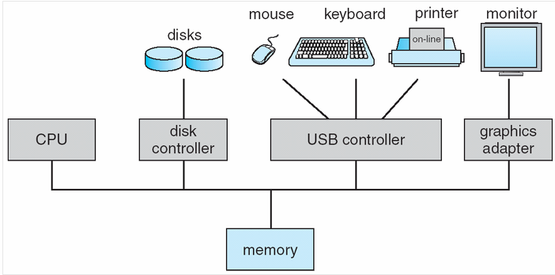

# 컴퓨터 시스템

# 컴퓨터 시스템 구성
일반적으로 **하드웨어**(기본적인 계산에 필요한 자원을 제공), **운영체제**(사용자 시스템간의 인터페이스를 제공), **응용 프로그램**(사용자의 계산 문제를 시스템 자원을 통해 해결하기 위한 정의된 프로그램), 사용자로 누눌수 있다.

## 컴퓨터 시스템 동작(Computer-System Operation)
일반적인 현대의 컴퓨터 시스템은 공유 메모리의 접근을 지원하는 공용 버스(common bus)로 연결된 하나 이상의 프로세서(CPU)와 장치 제어기(Device Controls)들로 구성되어 있다. 프로세서와 장치 제어기들은 메모리 사이클을 얻기 위해 경쟁하면서 병행 실행 될 수 있다.

### 부트스트랩 프로그램(bootstrap program)
- 컴퓨터가 구동을 시작하기 위한 초기 프로그램
- 시스템 초기화
- 운영체제 로딩

부트스트랩이 완료되면 init와 같은 초기 프로세스를 실행한 후 시스템의 이벤트(interrupt)를 기다리는 상태가 된다. **하드웨어**는 시스템 버스를 통해 프로세서(CPU)로 신호를 보내 인터럽트를 발생 시킬 수 있으며 **소프트웨어**는 시스템 콜(System Call)을 통한 특별한 연산으로 인터럽트를 발생시킬 수 있다.

## 저장장치 구조
프로세서(CPU)는 **주기억장치(RAM)**을 통해서만 명령을 읽어들일 수 있으며, 실행 하려고하는 모든 프로그램은 반드시 메모리로 저장되어야 한다. 메모리는 워드(4byte)의 배열을 제공하며, 각 워드는 고유의 주소를 가진다. 기억장치 연산이 실행될 때 **Load는 RAM -> CPU Register** 이며, **Store은 CPU Register -> RAM**이 된다.

Q : 프로그램과 데이터들이 RAM에 저장되지 못하는 이유
A : RAM은 데이터를 저장할 수 있는 용량이 작다.
    RAM은 전원이 끊어지면 내용이 사라지는 **휘발성 메모리**이다.

