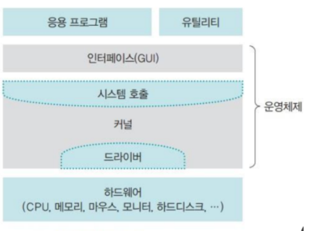
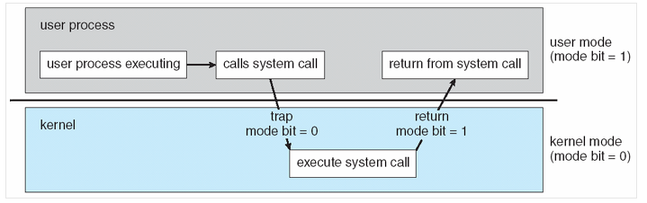

# 운영체제

## 목차
- 운영체제란?
- 운영체제의 역할 -> 운영체제의 목표
- 운영체제가 히는 일
  - 사용자 관점(User View)
  - 시스템 관점(System View)
- 운영체제의 기법
- 운영체제의 구조
  - System Call
    - 시스템 콜의 종류
- 참고문헌

## 운영체제란?
운영체제는 제어 프로그램(Control Program)으로써 **컴퓨터의 부적절할 사용을 막거나, 사용자 프로그램의 실행을 제어**한다. 
ex) window, Mac OS, Linux 등

## 운영체제의 역할 -> 운영체제의 목표
1. 자원관리 -> 효율성
2. 자원보호 -> 안정성
3. 하드웨어 인터페이스 제공 -> 확장성
4. 사용자 인터페이스 제공 -> 편리성

## 운영체제가 히는 일
하드웨어는 중앙처리장치(프로세서, CPU), 메모리 및 입출력(I/O) 장치로 구성되어 사용자에게 자원을 제공한다. 
운영체제는 이러한 자원을 제공하는 하드웨어와 사용자를 연결해주는 인터페이스를 제공하는 역할을 하며, 크게 **사용자 관점**과 **시스템 관점**으로 나눠 생각할 수 있다.

### 사용자 관점(User View)
사용자 관점에서 운영체제는 **서비스 제공자**가 된다. 운영체제는 사용자에게 응용 프로그램, 네트워크 서비스, 계산 및 프린트 등을 제공할 수 있다.

### 시스템 관점(System View)
컴퓨터의 관점에서 운영체제는 컴퓨터<->하드웨어간의 연결을 맺어주는 **자원 할당자**로 볼 수 있다. 운영체제에 대한 또다른 시스템 관점으로 여러 가지 하드웨어 장치와 사용자의 장치를 제어할 필요성 때문에 **제어프로그램**이 될 수 있다.

## 운영체제의 기법
운영체제는 **멀티 프로그래밍**(Multi Programming)[^MultiProgramming] 기법을 사용한다.
여러 개의 프로그램을 동시에 주기억장치(RAM)에 넣고 CPU를 분할 사용한다. = CPU 효율성 증가 
또 운영체제는 **시분할 시스템**(Timesharing)기법을 사용한다. 시분할 시트템은 멀티 프로그래밍의 논리적 확장 개념이다. 프로세서는 다수의 작업을 교대로 실행하지만 **매우 빠른 속도로 교대**가 이루어지기 때문에 실제 사용자는 **모든 작업이 동시에 처리되는 것처럼 느껴진다.** 
= **응답 시간**(Response time) 단축 

[^MultiProgramming]: 하나의 프로세서가 하나의 프로세스를 수행하는 동안 다른 프로세스에 접근할 수 있도록 하는 방법

## 운영체제의 구조
 
- 커널 : 프로세스관리, 메모리 관리, 저장장치 관리와 같은 **운영체제의 핵심적인 기능을 모아놓은 것** 
- System Call : 운영체제의 커널이 제공하는 서비스에 대해, 응용 프로그램의 요청에 따라 커널에 접근하기 위한 인터페이스이다. C나 C++과 같은 고급언어로 작성된 프로그램들은 직접 System Call을 할 수 있기 때문에 고급 API를 통해 시스템 호출에 접근하게 하는 방법이다. 
- 드라이버 : 커널과 하드웨어의 인터페이스를 담당한다.

### System Call
운영체제는 두가지 동작모드를 가진다 = 이중 동작모드 
- 사용자 모드(User Mode)
- 커널 모드(Kernel Mode)

하드웨어에 모드 비트가 존재하는데 0이면 커널 모드, 1이면 사용자 모드이다. 

위에서 사용자 모드에서 응용 프로그램의 요청에 따라 커널에 접근하기 위한 인터페이스라고 정의했다. 

**시스템 콜은 왜 필요할까?** 
커널은 사용자나 응용 프로그램으로부터 컴퓨터 자원을 보호하기 위해 자원에 직접 접근을 차단한다. 
따라서 사용자 모드에서 System Call을 통해 커널 모드로 변환 후 커널의 자원을 사용한다. 

#### 시스템 콜의 종류
- 프로세스 제어(Process Control)
  - 프로세스 생성 및 종료
  - 메모리에 로드, 실행
  - 프로세스 속성 값 확인, 지정
  - wait 이벤트, signal 이벤트
  - 메모리 할당
- 파일 매니지먼트
  - 파일 생성, 파일 삭제
  - 열기, 닫기
  - 읽기, 쓰기, Reposition
  - 파일 속성 값 확인, 지정
- 디바이스 매니지먼트
  - 디바이스 요청 및 해제
  - 읽기, 쓰기, Reposition
  - 디바이스 속성 확인, 지정
  - 비 물리적인 디바이스 해제 및 장착
- 정보 관리
  - 시간 확인, 시간 지정
  - 시스템 데이터 확인, 지정
  - 프로세스, 파일, 디바이스 속성 가져오기
  - 프로세스, 파일, 디바이스 속성 설정하기
- 커뮤니케이션
  - 커뮤니케이션 연결 생성 및 삭제
  - 메시지 송신, 수신
  - 상태 정보 전달
  - remote 디바이스 해제 및 장착
- 보안
  - Permission 획득
  - Permission 설정

## 참고문헌
[운영체제 참고문헌](https://luckyyowu.tistory.com/128?category=751813)