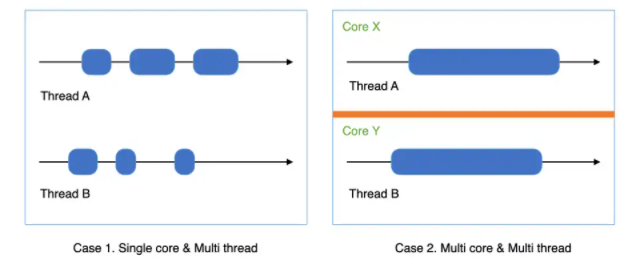
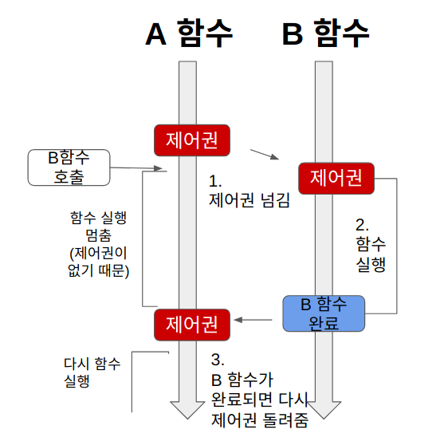
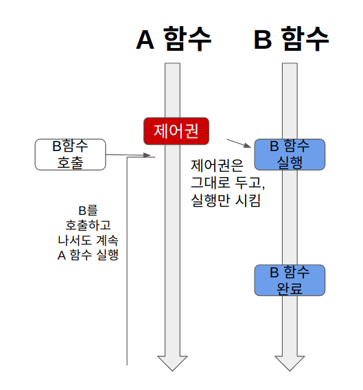
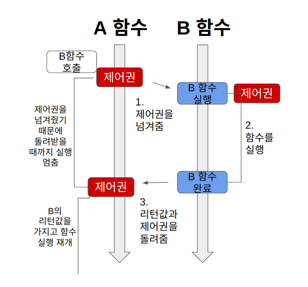
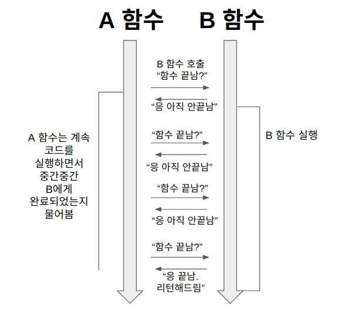
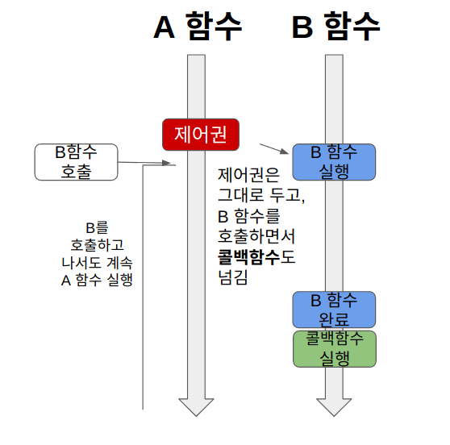
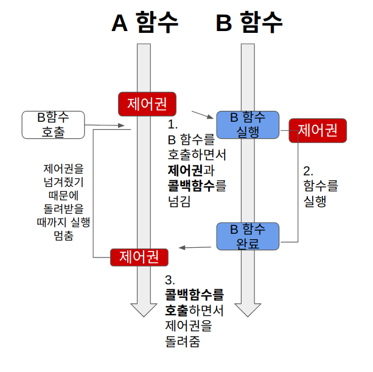

# 병렬성과 비동기성

## 목차
- 동시성(Concurrent) vs 병렬성(Paeallel)
  - 예제 케이스
- Blocking & Non-blocking
  - 사전 지식
  - Blocking
  - Non-Blocking
- Syschornous & Asynchronous
  - Synchornous
  - Asynchronous
- 블로킹과 논블로킹, 동기와 비동기 함께 이해
  - Sync-Blocking(동기 블로킹)
  - Sync-NonBlocking(동기 논블로킹)
  - Async-Nonblocking
  - Async-Blocking
- 참고 문헌

## 동시성(Concurrent) vs 병렬성(Paeallel)

|   동시성    | 병렬성 |
|:-----:|------|
| 동시에 실행되는 것 같이 보이는 것  |  실제로 동시에 여러 작업이 처리되는 것  |
| 싱글 코어에서 멀티 스레드를 동작시키는 방식  | 멀티 코어에서 멀티 스레드를 동작시키는 방식 |
| 한번에 많은 것을 처리 | 한번에 많은 일을 처리   |
| 논리적인 개념  | 물리적인 개념  |
| 병렬성이 만족하면 동시성은 만족한다.  | 동시성이 만족해도 병렬성은 만족하지 않을 수 있다.  |

### 예제 케이스

- Case 1. Single Core & Multi thread
  - 동시성이지만 병렬성은 아니다.
- Case 2. Multi Core & Multi thread
  - 동시성이면서 병렬성이다.

++ 추가 예제 케이스 
각 task 수행되는 시간은 1이라고 가정한다. 

- 싱글코어, 1개의 스레드에서 순차적으로 2개의 task 진행
  - 동시성 x, 병렬성 x, 순차적 작업, 수행시간 2
- 싱글코어, 1개의 스레드에서 2개의 task가 자원을 번갈아가며 사용하며 진행
  - 동시성 o, 병렬성 x, 수행시간 2 + α
- 싱글코어, 2개의 스레드에서 2개의 task가 자원을 번갈아가며 사용하며 진행
  - 동시성 o, 병렬성 x, 수행시간 <2
- 멀티코어, 2개의 스레드에서 2개의 task가 동시에 진행
  - 동시성 o, 병렬성 o, 수행시간 <2

## Blocking & Non-blocking

### 사전 지식
- 제어권 : 자신(함수)의 코드를 실행할 권리, 제어권을 가진 함수는 자신의 코드를 끝까지 실행한 후, 자신을 호출한 함수에게 돌려준다.
- 결과값을 기다린다는 것 : A함수에서 B함수를 호출했을 때, A함수가 B함수의 결과값을 기다리느냐의 여부

블로킹과 논블로킹은 A함수가 B함수를 호출했을 때, **제어권을 어떻게 처리하느냐에 따라 달라진다.** 

### Blocking
**블로킹**은 A함수가 B함수를 호출하면, **제어권을 A가 호출한 B함수에게 넘겨준다.**

### Non-Blocking
**논블로킹**은 A함수가 B함수를 호출해도 **제어권은 그대로 자신이 가지고 있는다.**

## Syschornous & Asynchronous
동기와 비동기의 차이는 **호출되는 함수의 작업 완료 여부를 신경쓰는지의 여부**의 차이이다.

### Synchornous
함수A가 함수B를 호출한 뒤, **함수B의 리턴 값을 계속 확인하면서 신경쓰는 것**

### Asynchronous
함수A가 함수B를 호출할 때 **콜백 함수를 함께 전달**해서, 함수B의 작업이 완료되면 함께 보낸 콜백 함수를 실행한다. 
함수B의 작업완료 여부를 신경쓰지 않음 

## 블로킹과 논블로킹, 동기와 비동기 함께 이해

### Sync-Blocking(동기 블로킹)

### Sync-NonBlocking(동기 논블로킹)

A함수는 B함수를 호출할 때 제어권을 주지않고 코드를 계속 실행한다. 
A함수는 B함수의 리턴값이 필요하기 때문에, 중간중간 B함수의 작업 완료 여부를 물어본다. 

### Async-Nonblocking

### Async-Blocking

## 참고 문헌

[동시성 vs 병렬성 참고문헌](https://vagabond95.me/posts/concurrency_vs_parallelism/)

[블로킹 & 논블로킹, 동기 & 비동기 참고문헌](https://velog.io/@nittre/%EB%B8%94%EB%A1%9C%ED%82%B9-Vs.-%EB%85%BC%EB%B8%94%EB%A1%9C%ED%82%B9-%EB%8F%99%EA%B8%B0-Vs.-%EB%B9%84%EB%8F%99%EA%B8%B0)