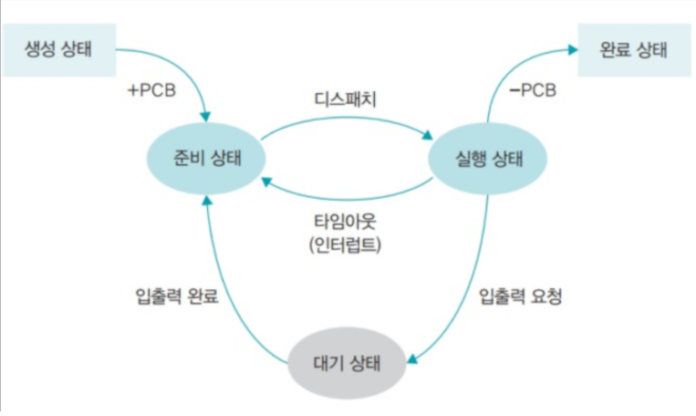
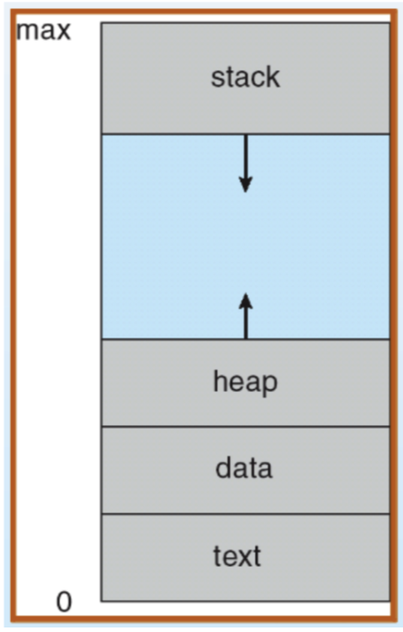
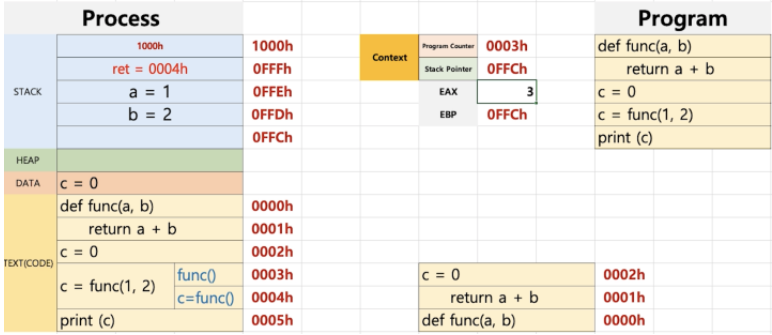

# 프로세스와 스레드
## 목차
- 프로세스
  - 프로세스 작업 방식
  - 프로세스의 상태
  - 프로세스 구조
  - 프로세스와 컴퓨터 구조
    - 함수 실행 예시(컴퓨터 구조)
  - 프로세스 -> 커널
- 스레드
  - 스레드 종류
  - 멀티스레드 모델
    - 사용자 레벨 스레드
    - 커널 레벨 스레드
    - 멀티레벨 스레드
- 프로세스와 스레드 Q&A
- 프로세서(Processor) vs 프로세스(Process)
- CPU vs 프로세서 vs 코어
- 참고 문헌

## 프로세스
### 프로세스 작업 방식
- 일괄 작업 방식
  - 한 작업이 끝나면 다른 작업을 하는 것
- 시분할 방식
  - 시간을 배분하여 여러가지 작업을 동시에 하는 것
  - 현재 방식

 

### 프로세스의 상태

- 생성 상태
  - 프로그램 + PCB 한 상태. 이제 준비상태로 옮겨져 기다림
- 준비 상태
  - 실행을 준비가 된 모든 프로세스가 자기 차례를 기다리는 상태
  - 실행된 프로세스는 CPU 스케줄러에 의해 선택된다.
- 실행 상태
  - 선택된 프로세서가 타임 슬라이스를 얻어 CPU를 사용하는 상태
  - 프로세스 사이의 **context switching** 발생(준비상태 <-> 실행상태)
- 대기 상태
  - 실행 상태에 있는 프로세스가 입출력 요청을 하면 입출력이 완료될 때까지 기다리는 상태
  - 입출력이 완료되면 준비상대로 돌아감
- 완료 상태
  - 프로세스가 종료된 상태(정적인 프로그램으로 돌아간다.)
  - 사용하던 모든 데이터가 정리됨
- 보류 상태
  - 프로세스가 메모리에서 잠시 쫒겨난 상태
  - 보류 상태가 되는 경우
    - 메모리가 꽉 차서 일부 프로세스를 메모리 밖으로 내보낼 때
    - 프로그램 오류가 있을 때
    - 바이러스 같은 공격을 하는 프로세스라고 판단된 때
    - 입출력이 계속 지연될 때(아사현상)

 

### 프로세스 구조

프로세스의 일반적인 구조는 위의 사진과 같다. 

**프로세스의 특징** 
프로세스는 실행이 시작되면, 그 프로세스 만의 **독자적인 주소공간을 형성**한다. 
code, data, stack이라는 독자적인 주소공간으로 구성 

- text(CODE) : 컴파일된 소스 코드가 저장되는 영역
- data : 전역 변수/초기화된 데이터가 저장되는 영역
- stack : 임시 데이터(함수 호출, 로컬 변수 등)가 저장되는 영역
- heap : 코드에서 동적으로 생성되는 데이터가 저장되는 영역

함수를 실행하게 되면 함수의 결과가 리턴될 주소가 스택에 저장되고, 함수의 지역 변수들이 차례로 스택에 쌓이게 된다. 
함수가 다 실행되고 나면 스택에 있던 데이터들이 차례로 삭제되고, 스택에 저장되어 있던 리턴될 주소 또한 지워지면서 그 주소로 이동하게 된다. 
 
이렇듯 스택을 이용하여 만든, 함수를 실행하기 위한 구조를 **스택 프레임**이라고 한다. 

 

### 프로세스와 컴퓨터 구조
- PC(Program Counter) : 코드를 한 줄 한줄 가리키는 주소 레지스터
- SP(Stack Pointer) : 함수가 실행될 때 스택 프레임의 최상단 주소를 가르키는 레지스터

함수가 호출되면 현재 스택 포인터의 최상단 값을 스택에도 저장하고 EBP라는 레지스터에도 저장하게 된다. 
이는 함수 안에서 문제가 있었을 때, 어떤 문제인지를 빠르게 트래킹하기 위한 것이다. 

 

#### 함수 실행 예시(컴퓨터 구조)

- 코드 예시는 파이썬이다. 파이썬은 인터프리터 언어지만 예시에서는 컴파일 언어라고 가정하고 이해한다.
- EAX는 레지스터에서 리턴할 결과값이 담기게 된다.
- 함수를 리턴할 때 스택에 담겨있는 변수들을 차례로 삭제하고, 리턴 주소도 삭제하고, 함수를 실행할 때 스택에 저장된 EBP 레지스터의 값도 삭제가 된다. 그리고 나서 PC가 리턴 주소를 가리키고 다음 코드가 실행된다.
- 이때, c에는 EAX 레지스터에 들어있던 값이 할당되고, DATA에 들어 있는 c의 값도 갱신된다.

 

### 프로세스 -> 커널
각각의 프로세스가 자신의 code영역을 실행하고 있을 때 함수 호출이 이루어지면 자신의 stack영역에서 stack frame을 쌓아 일을 실행하지만, 
프로세스 자체로서 할 수 없는 일은 시스템 콜을 통해 운영체제로 넘겨야한다. 

**사용자 프로세스 -> 커널 프로세스** 
1. 사용자 프로세스 내에서 커널 모드에서 가능한 기능을 수행하기 위해 시스템 콜
2. 시스템 콜이 발생하면 PC는 사용자 프로세스의 주소공간을 가르키는 것이 아니라 커널 프로세스 주소 공간을 가르킨다.
3. 커널 프로세스의 code영역을 실행

커널도 함수들로 구성되어 있다. 커널에서 함수 호출이 이루어지면 stack 영역에 호출된 함수와 관련된 정보들을 쌓는다. 
커널은 여러 프로세스들이 공유하는 코드이다. 어떤 프로세스든 운영체제에게 서비스를 요청하면 커널의 code영역이 실행된다. 
커널이 어떤 프로세스의 시스템 콜을 받고 code영역을 실행 했는지는 매번 다르다. 
그래서 커널의 stack영역에 프로세스 별로 각각의 공간이 구획된다. 

 

## 스레드
하나의 프로세스 내에서 **실행되는 하나 또는 여러개의 작업 단위**이다. 
프로세스가 할당받은 자원을 이용하는 실행의 단위이며, 프로세스의 메모리 구조에서 **스택**(독립적인 실행 가능) 및 **레지스터**(스케줄러에 의한 선점 시 기억)만 따로 할당받고 그 외 영역은 공유한다. 

[스케줄러 참고자료](https://velog.io/@sunil1369/%EC%89%BD%EA%B2%8C-%EB%B0%B0%EC%9A%B0%EB%8A%94-%EC%9A%B4%EC%98%81%EC%B2%B4%EC%A0%9C-4%EC%9E%A5)

 

### 스레드 종류
- 커널 스레드 : 커널이 직접 생성하고 관리하는 스레드
- 사용자 스레드 : 라이브러리에 의해 구현된 일반적인 스레드(개발자가 만들어낸 스레드)

 

### 멀티스레드 모델
#### 사용자 레벨 스레드
사용자 프로세스 내에 여러 개의 스레드가 커널의 스레드 하나와 연결되어 라이브러리가 스케줄링을 하고 작업에 필요한 정보를 처리하기 위해 문맥교환이 필요x(공유 x)

 

#### 커널 레벨 스레드
하나의 스레드가 하나의 커널 스레드에 연결되어 있는 형식 
독립적으로 스케줄링이 되므로 특정 스레드가 대기 상태에 들어가도 다른 스레드는 계속 작업 가능 
문맥교환을 해 느리게 작동 

 

#### 멀티레벨 스레드
최근 os가 사용하는 스레드로 사용자 레벨 스레드와 커널 레벨 스레드를 혼합한 방식 
커널 스레드가 대기 상태에 들어가면 다른 커널 스레드가 대신 작업을 하여 사용자가 레벨 스레드보다 유연하게 작업을 처리 할 수있다.

 

## 프로세스와 스레드 Q&A

Q : 스택을 스레드마다 독립적으로 할당하는 이유 
A : 스택은 함수 호출 시 전달되는 인자, 되돌아갈 주소값 및 함수 내에서 선언하는 변수 등을 저장하기 위해 사용되는 메모리 공간이므로 스택 메모리 공간이 독립적이라는 것은 독립적인 함수 호출이 가능하다는 것이고 이는 독립적인 실행 흐름이 추가되는 것이다. 
**따라서 스레드의 정의에 따라 독립적인 실행 흐름을 추가하기 위한 최소조건으로 독립된 스택을 할당한다.** 

 

Q : PC Register를 스레드마다 독립적으로 할당하는 이유 
A : PC값은 스레드가 명령어의 어디까지 수행하였는지를 나타나게 된다. 스레드는 CPU를 할당 받았다가 스케줄러에 의해 다시 선점당한다. 그렇기 때문에 명령어가 연속적으로 수행되지 못하고 어느 부분까지 수행했는지 기억할 필요가 있다. 이러한 상황을 해결하기 위해 독립적으로 할당 
멀티 스레드는 선점형 멀티테스킹이다.

 

Q : 멀티 프로세스 대신 멀티 스레드를 사용하는 이유 
    쉽게 말해, 프로그램을 여러 개 키는 것보다 하나의 프로그램 안에서 여러 작업을 해결하는 것 
A : 자원의 효율성 증대(시스템 콜이 줄어들어 자원을 효율적으로 관리 가능, 스레드는 프로세스 내의 메모리를 공유하기 때문에 독립적인 프로세스와 달리 스레드 간 데이터를 주고 받는 것이 간단해지기 때문에 자원소모 down) 
    처리 비용 감소 및 응답 시간 단축(스레드는 Stack 영역을 제외한 대부분의 메모리를 공유하기 때문에 프로세스 간의 전환속도보다 스레드간의 전환속도가 빠름)

 

++ 주의할 점 
동기화 문제 : 스레드 간의 자원 공유는 전역 변수(데이터 세그먼트)를 이용하므로 함께 사용할 때 충돌이 발생할 수 있다.

 

> 멀티 스레드 vs 멀티 프로세스 
> 멀티 스레드는 멀티 프로세스보다 적은 메모리 공간을 차지하고 Context Switch이 빠르다는 장점이 있지만,  오류로 인해 하나의 스레드가 종료되면 전체 스레드가 종료될 수 있다는 점과 동기화문제가 있다.

 

## 프로세서(Processor) vs 프로세스(Process)
- 프로세서
  - 하드웨어적인 측면에서 **컴퓨터 내에서 프로그램을 수행하는 하드웨어 유닛**이다. = CPU
  - 소프트웨어적인 측면에서 데이터 포맷을 변환하는 역할을 수행하는 데이터 프로세싱 시스템(데이터 처리 시스템)을 의미하며 출력 가능한 인쇄물을 생성하는 워드프로세서도 프로세서라 부른다.
- 프로세스
  - 사용자가 작성한 프로그램이 운영체제에 의해 메모리 공간을 할당받아 실행 중인 것을 의미
  - 특정 목적을 수행하기 위해 나열된 작업의 목록
  - 프로그램 + PCB = 프로세스

## CPU vs 프로세서 vs 코어
- CPU : 컴퓨터의 구성 단위 중 **기억, 연산, 제어의 3대 기능을 종합하는 장치**이고 컴퓨터에서 가장 중요한 부분
- 프로세서 : 컴퓨터 운영을 위해 기본적인 명령어들을 처리하고 반응하기 위한 **논리회로**. 프로세서란 용어는 CPU라는 용어로 대체되어 왔다.
- 코어 : **각종 연산을 하는 CPU의 핵심요소.** CPU안에서 일하는 부품. 코어 수가 많을수록 병렬 처리 효율 증가

 

정리하자면 CPU = 프로세서 >= 코어정도로 생각하면 좋을 것 같다. 

 

## 참고 문헌
[프로세스 -> 커널 참고문헌](https://timing-bravery.tistory.com/30)

[프로세스 vs 프로세서 참고문헌](https://blogger.pe.kr/422)

[CPU vs 프로세서 vs 코어 참고문헌](https://donghoson.tistory.com/14)
