# 병렬성과 비동기성

- [병렬성과 비동기성](#병렬성과-비동기성)
  - [책 내용](#책-내용)
  - [멀티태스킹](#멀티태스킹)
  - [Javascript의 동시성](#javascript의-동시성)
    - [Javascript와 싱글스레드](#javascript와-싱글스레드)
    - [Javascript 런타임과 비동기](#javascript-런타임과-비동기)
    - [Javascript 런타임에서 비동기 코드 실행 과정](#javascript-런타임에서-비동기-코드-실행-과정)
  - [Node.js의 동시성](#nodejs의-동시성)
    - [Node.js가 싱글스레드 기반인가?](#nodejs가-싱글스레드-기반인가)
    - [Node.js와 비동기](#nodejs와-비동기)
    - [Node.js 이벤트 루프](#nodejs-이벤트-루프)
    - [Node.js 논블로킹 I/O 모델](#nodejs-논블로킹-io-모델)
  - [참고 문헌](#참고-문헌)

## 책 내용

    ...
    
## 멀티태스킹

    ...

그래서 협렵적 멀티태스킹인 이벤트 루프를 알아보자.

## Javascript의 동시성

Javascript는 싱글스레드로 동작하는 언어이다.

싱글스레드는 한 번에 하나의 작업만 수행할 수 있음을 의미한다.

그런데 Javascript의 특징들을 알아보면, 
- `동시성`, 
- `동시성`을 보장하는 `비동기`,
- `동시성`을 보장하는 `논블로킹 I/O`등 상반되는 개념들이 등장한다.

즉, 이 개념들의 포괄적인 개념 `동시성`을 Javascript가 어떻게 가질 수 있었는지 알아보자.

### Javascript와 싱글스레드

Javascript 엔진은 `메모리 힙`과 `콜스택`으로 구성되어있다.

`콜스택`은 

    하나의 메인스레드에서 호출되는 함수들이 스택으로 쌓이는 곳이다.

즉, Javascript가 싱글스레드 기반의 언어라는 말은 

    Javascript가 하나의 메인스레드와 하나의 콜스택을 가지고 있기 때문이다.

### Javascript 런타임과 비동기

Javascript 엔진 자체에서는 비동기와 관련이 없다.

Javascript 런타임에서 비동기와 관련이 있다.



여기서 **Javascript 런타임은 브라우저로 
`Javascript 엔진`, `이벤트 루프`, `태스크 큐`, `브라우저의 Web api`를 아우른다.**

이벤트 루프는

    이벤트 발생 시 호출되는 콜백함수들을 관리하여 태스크 큐에 전달하고,
    태스크 큐에 담겨있는 콜백함수들을 콜스택에 넘겨준다.

태스크 큐는

    Web api에서 비동기 작업들이 실행된 후
    호출되는 콜백함수들이 기다리는 FIFO 공간이다.

Web api는

    브라우저에서 비동기 작업들을 수행할 수 있도록 지원한다.
    cf. DOM, AJAX, Timer

### Javascript 런타임에서 비동기 코드 실행 과정

```js
console.log('동기');

setTimeout( _ => console.log('비동기'), 1000);

console.log('동기');
```
1. `L1`이 콜스택에 쌓이고, 바로 실행(`동기`출력문)되고 제거된다.
2. 비동기 코드(`setTimeout`)가 콜스택에 쌓인 후 실행되면,
   Javascript 엔진은 비동기 작업(`1초`)을 Web api에 위임한다.
   > 위임과 동시에 Web api에 `timer`객체를 생성한다.
3. `L3`이 콜스택에 쌓이고, 바로 실행되고 제거된다.
4. Webapi는 해당 비동기 작업을 수행하고
   콜백 함수(`비동기`출력문)를 이벤트 루프를 통해 태스크 큐에 넘겨주게 된다.
5. 이벤트 루프는 콜스택에 쌓여있는 함수가 없을때,
   태스크 큐에서 대기하고 있던 콜백함수를 콜스택으로 넘겨준다.
6. 콜스택에 쌓인 콜백함수가 실행되고,
   콜스택에서 제거된다.

## Node.js의 동시성

Node.js는 Javascript 런타임으로 브라우저 밖에서도 Javascript를 실행할 수 있기 위해 생겼다.

### Node.js가 싱글스레드 기반인가?

Javascript를 실행하는 스레드는 메인스레드 하나이므로 Node.js 또한 맞는 말이지만,
완전히 싱글스레드 기반으로 동작하지 않는다.

일부 블로킹 작업들을 libuv[^libuv]의 스레드 풀에서 수행하기 때문이다.

[^libuv]: 비동기 I/O를 지원하는 라이브러리

스레드 풀은 

    멀티 스레드로 이루어져 스레드를 늘려 작업을 수행하게 한다.

즉, Node.js는 멀티 스레드로 병렬 실행된다.
libuv가 별도의 코어의 스레드를 사용하기 때문에 병렬이란 말이 나오지 않았나 싶다.

### Node.js와 비동기

다음은 Node.js 다이어그램이다.


Node.js는 `Javascript 엔진`, `Node API`, `이벤트 루프`, `논블로킹 I/O 모델` ... 을 아우른다.

Node API는 `timer 함수(setTimeout())`, `fs`, `http`...이 해당되고, 
모든 API는 작업 완료 시, 완료를 알리거나 완료 이후 작업을 위해 콜백함수가 필요하다.

**비동기 I/O는 모두 Node API로 부터 시작된다.**

이벤트 루프는 프로그래밍 패턴으로, 이를 구현해야한다.

Node.js의 이벤트 루프는 libuv 라이브러리로 구현하였다.

이벤트 루프가 libuv 내에서 실행된다고 해서, Javscript 메인 스레드와 이벤트 루프의 스레드가 별도로 존재하진 않는다.
<br/>

Node.js는 브라우저와 다르다.
대표적으로 이벤트 루프가 다르기 때문이다.

브라우저의 이벤트는

    웹페이지-사용자 상호작용(클릭, 키보드)이고,

Node.js의 이벤트는

    파일 I/O 접근, 네트워크 I/O를 말한다.

이러한 니즈의 차이가 이벤트 루프의 다르게 만들게된 원인이다.

### Node.js 이벤트 루프

Node.js 이벤트 루프는 6개의 페이즈(Phase: 단계)들을 갖고 있으며, **해당 페이즈들은 각자만의 큐(Queue)를 갖는다.**

Node.js 이벤트 루프는 6개의 페이즈를 라운드 로빈 방식으로 순회한다.

🤔 라운드 로빈 방식 OS 자료

순회 과정을 살펴보자.

1. Node.js가 시작되면 스레드가 생기고, 이벤트 루프가 생성된다.
2. `Expired Timer callback Phase`는 timer 함수를 처리하는 곳이다.

        min heap 자료구조에 timer를 오름차순으로 저장하고 
        매 Expired Timer callback Phase마다
        어떤 타이머가 실행할 때가 되었는지 검사한후, 
        실행되어야하는 콜백함수만 큐에 넣는다.

        이 콜백함수의 실행은 다음 루프 때 실행된다.
    🤔 오름 차순인 이유 보충 필요
    
3. `Pending I/O callback Phase`는 이전 루프에서 연기된 I/O 작업의 완료 결과를 받는 곳이다.

        완료된 I/O 작업의 콜백함수들을 `Poll Phase`로 넘겨준다.

4. `Idle, Prepare Phase`는 Node 관리를 위한 곳이다.
5. `Poll Phase`는 I/O 관련 콜백함수를 실행한다.        
6. `Check Phase`는 timer 함수 중 setImmediate()의 콜백함수를 실행한다.
7. `Close callback Phase`는 이벤트에 따른 콜백함수를 실행한다.

        cf. socket.on('close', ...)

🤔 각 Phase마다 가지고 있는 큐가 빌때까지 동기적으로 실행된다면, 블로킹 비동기인가?

각 `Phase`마다 실행되는 2가지 주체가 있다.

`Phase`와 `Phase` 사이의 간격을 `tick`이라고 한다.

2가지 주체는 `Phase` 간격동안 자신이 가지고 있는 콜백함수를 실행하는 역할을 맡고 있다.

- `microTask Queue`는 resolve된 프로미스의 콜백함수를 실행한다.
- `nextTick Queue`는 process.nextTick()의 콜백함수를 실행한다.

### Node.js 논블로킹 I/O 모델

Node.js 논블로킹 I/O 모델은

    http, Database CRUD, third party api, filesystem 과 같이
    블로킹 작업들을 백그라운드에서 수행하고,
    이를 비동기 콜백함수로 이벤트 루프에 전달하는 것을 말한다.

백그라운드는

    OS kernel 또는 libuv의 스레드 풀을 의미한다.

블로킹 작업들은 백그라운드에서 담당한다.

<hr/>

## 참고 문헌

[Javascript 동작원리](https://medium.com/@vdongbin/javascript-작동원리-single-thread-event-loop-asynchronous-e47e07b24d1c?p=e47e07b24d1c) -- vincent

[Node.js 동작원리](https://medium.com/@vdongbin/node-js-동작원리-single-thread-event-driven-non-blocking-i-o-event-loop-ce97e58a8e21) -- vincent

[로우 레벨로 살펴보는 Node.js 이벤트 루프](https://evan-moon.github.io/2019/08/01/nodejs-event-loop-workflow/) -- Evans Library

[An Intro to Node.js That You May Have Missed](https://itnext.io/an-intro-to-node-js-that-you-may-have-missed-b175ef4277f7) -- Andrey Pechkurov

[Event Loop and the Big Picture — NodeJS Event Loop Part 1](https://blog.insiderattack.net/event-loop-and-the-big-picture-nodejs-event-loop-part-1-1cb67a182810) -- Deepal Jayasekara

[JavaScript Event Loop vs Node JS Event Loop](https://blog.insiderattack.net/javascript-event-loop-vs-node-js-event-loop-aea2b1b85f5c) -- Deepal Jayasekara