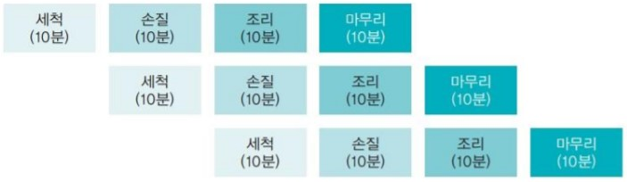
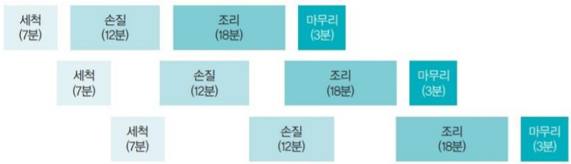

# 병렬성과 비동기성

- [병렬성과 비동기성](#병렬성과-비동기성)
  - [멀티태스킹](#멀티태스킹)
    - [멀티태스킹의 조건](#멀티태스킹의-조건)
    - [선점형 vs 협력적 멀티태스킹](#선점형-vs-협력적-멀티태스킹)
  - [Javascript의 동시성](#javascript의-동시성)
    - [Javascript와 싱글스레드](#javascript와-싱글스레드)
    - [Javascript 런타임과 비동기](#javascript-런타임과-비동기)
  - [Node.js의 동시성](#nodejs의-동시성)
    - [Node.js와 브라우저의 차이](#nodejs와-브라우저의-차이)
    - [Node.js와 멀티스레드](#nodejs와-멀티스레드)
    - [Node.js와 비동기](#nodejs와-비동기)
  - [Node.js 이벤트 루프](#nodejs-이벤트-루프)
    - [Node.js 이벤트 루프 단계](#nodejs-이벤트-루프-단계)
    - [Node.js와 협력적 멀티태스킹](#nodejs와-협력적-멀티태스킹)
  - [참고 문헌](#참고-문헌)

## 멀티태스킹

멀티태스킹을 사용하는 이유는 여러 프로그램을 동시에 사용하기 위해서이다.

원래는 `싱글코어 멀티스레드`로 여러 프로그램이 **동시에 작업되 보이는 것처럼** 동시성을 만족하였다.

이를, 파이프라인 기법이라 한다.

요즘은 `멀티코어` 기반으로 실제 여러 프로그램이 **동시에 작업되어** 병렬성을 만족하였다. 
즉, 병렬성을 포함하는 동시성을 높였다.

이를, 슈퍼스칼라 기법이라 한다.

<details>
<summary><b>파이프라인 기법 vs 슈퍼스칼라 기법</b></summary>
<br/>
스레드의 작업을 명령어 처리라고 하면, 

다음과 같이 명령어 처리의 과정들이 있다.

<table>
    <tr>
        <td>
            
        </td>
        <td>
<pre><code>
1. IF: 다음에 실행할 명령어를 PC에 저장
2. ID: 명령어 해석
3. EX: 해석한 결과를 토대로 명령어 실행
4. WB: 실행된 결과를 메모리에 저장
</code></pre>
        </td>
    </tr>
    <tr>
        <th>파이프라인</th>
        <th>슈퍼스칼라</th>
    </tr>
    <tr>
        <td>
            
        </td>
        <td>
            
        </td>
    </tr>
</table>

</details>

### 멀티태스킹의 조건

멀티태스킹은 처리순서가 중요하다. 

    처리순서에 여러 프로그램이 같은 자원에 동시에 접근하게 될 때, 
    그 자원을 사용하는 순서에 따라 결과가 달라지기 때문이다.

처리순서는 트랜잭션을 통해 보장받을 수 있다.

    트랜잭션은 처리순서가 모두 성공하거나 모두 실패한다.

트랜잭션 간에 자원을 보호하기 위해 boolean 값인 락을 사용한다.

여기서 락이 걸린 작업들을 최소화할 수록 동시성을 높일 수 있다.

<details>
<summary><b>프로세스 vs 스레드 참고자료</b></summary>
<table>
    <tr>
    </tr>
    <tr>
        <td>
            
        </td>
        <td>
<p>
프로세스의 장점은

    프로세스 간 문제에 독립적이라는 것이다.

단점은

    프로세스 간 복제에 비용이 많다.

스레드의 장점은

    스레드 간 복제에 비용이 많지 않다.

단점은

    1. 데이터를 공유하기 때문에 
            cf. 파일 디스크립터의 출력이 동일하다던가

       하나의 스레드에 문제가 생기면, 
       프로세스 자체가 멈춰버린다.

    2. 어떤 스레드가 작업 완료까지 오랜 시간이 걸리면, 
       다른 스레드가 실행되지 못할 수 있다.
</p>
        </td>
    </tr>
</table>
</details>

### 선점형 vs 협력적 멀티태스킹

예시는 파이프라인 기법(싱글코어 멀티스레드)을 들었다.

<table>
    <tr>
        <th>선점형 스레드</th>
        <th>협력적 스레드</th>
    </tr>
    <tr>
        <td>
            
        </td>
        <td>
            
        </td>
    </tr>
    <tr>
        <td>
<p>
장점

    CPU를 나눠쓸 수 있다.

단점

    타임아웃이 있어 언제 뺏길지 모른다.
</p>
        </td>
        <td>
<p>
장점

    내가 명시적으로 쓸만큼 쓰고 직접 제어권을 돌려준다.

단점

    언제 뺏길지 안다.
</p>
        </td>
    </tr>
</table>

더 나아가 **싱글스레드에서 협력적 멀티태스킹**인 이벤트 루프를 알아보자.

## Javascript의 동시성

Javascript는 싱글스레드로 동작하는 언어이다.

싱글스레드는 한 번에 하나의 작업만 수행할 수 있음을 의미한다.

그런데 Javascript의 특징들을 알아보면, 
- `동시성`, 
- `동시성`을 보장하는 `비동기`,
- `동시성`을 보장하는 `논블로킹 I/O`등 상반되는 개념들이 등장한다.

즉, 이 개념들의 포괄적인 개념 `동시성`을 Javascript가 어떻게 가질 수 있었는지 알아보자.

### Javascript와 싱글스레드

Javascript 엔진은 `메모리 힙`과 `콜스택`으로 구성되어있다.

`콜스택`은 

    하나의 메인스레드에서 호출되는 함수들이 스택으로 쌓이는 곳이다.

즉, Javascript가 싱글스레드 기반의 언어라는 말은 

    Javascript가 하나의 메인스레드와 하나의 콜스택을 가지고 있기 때문이다.

이렇듯 Javascript 엔진 자체에서는 동시성과 관련이 없다.

콜스택으로 인한 블로킹을 극복하기 위해 이벤트 루프가 만들어졌다고 생각하고,

이 모두를 아우르는 Javascript 런타임이 동시성과 관련이 있게 된다.

### Javascript 런타임과 비동기

다음은 Javascript 런타임인 브라우저의 다이어그램이다.


여기서 **Javascript 런타임은 `Javascript 엔진`, `이벤트 루프`, `태스크 큐`, `브라우저의 Web api`를 아우른다.**

이벤트 루프는

    이벤트 발생 시 호출되는 콜백함수들을 관리하여 태스크 큐에 전달하고,
    태스크 큐에 담겨있는 콜백함수들을 콜스택에 넘겨준다.

태스크 큐는

    Web api에서 비동기 작업들이 실행된 후
    호출되는 콜백함수들이 기다리는 FIFO 공간이다.

Web api는

    브라우저에서 비동기 작업들을 수행할 수 있도록 지원한다.
        cf. DOM, AJAX, Timer

<details>
<summary>Javascript 런타임에서 비동기 코드 실행 과정</summary>

```js
console.log('동기');
setTimeout( _ => console.log('비동기'), 1000);
console.log('동기');
```
1. `L1`이 콜스택에 쌓이고, 바로 실행(`동기`출력문)되고 제거된다.   
2. 비동기 코드(`setTimeout`)가 콜스택에 쌓인 후 실행되면,
   Javascript 엔진은 비동기 작업(`1초`)을 Web api에 위임한다.
   > 위임과 동시에 Web api에 `timer`객체를 생성한다.
3. `L3`이 콜스택에 쌓이고, 바로 실행되고 제거된다.   
4. Web api는 해당 비동기 작업을 수행하고 완료되면
   콜백함수를 이벤트 루프를 통해 태스크 큐에 넘겨주게 된다.   
5. 이벤트 루프는 콜스택에 쌓여있는 함수가 없을때,
   태스크 큐에서 대기하고 있던 콜백함수를 콜스택으로 넘겨준다.   
6. 콜스택에 쌓인 콜백함수가 실행되고, 콜스택에서 제거된다.
   
</details>

## Node.js의 동시성

Node.js는 Javascript 런타임이다.
Node.js는 브라우저 밖에서도 Javascript를 실행할 수 있기 위해 생겼다.

### Node.js와 브라우저의 차이

Node.js는 브라우저와 다르다.
대표적으로 이벤트 루프가 다르기 때문이다.

브라우저의 이벤트는

    웹페이지-사용자 상호작용(클릭, 키보드)이고,

Node.js의 이벤트는

    파일 I/O 접근, 네트워크 I/O를 말한다.

이러한 니즈의 차이가 이벤트 루프에서 
각자의 이벤트들 간에 무엇을 우선순위로 처리하느냐에서 차이를 만들었다.

### Node.js와 멀티스레드

Javascript를 실행하는 스레드는 메인스레드 하나이므로 Node.js 또한 맞는 말이지만,
완전히 싱글스레드 기반으로 동작하지 않는다.

일부 블로킹 작업들을 백그라운드에서 논블로킹되게 수행하는데,

파일 I/O만 libuv[^libuv]의 스레드 풀을 활용하기 때문이다.

백그라운드는

    OS kernel 또는 libuv의 스레드 풀을 의미한다.

[^libuv]: 커널의 비동기 I/O를 지원하는 라이브러리

블로킹 작업들이란

    cf. http, Database CRUD, third party api, socket    → OS kernel
        filesystem                                      → 스레드 풀

<details>
    <summary><b>논블로킹-비동기 참고자료</b></summary>

> 현재로써 이해는 아래 그림으로 잡혔는데, 지난 스터디에서 그림에 잘못된 부분이 있다고 언급된 적이 있다. 
이를 발표 피드백때 알아봐야겠다.


</details>
<br/>

스레드 풀은 

    스레드를 늘려 작업을 수행하게 한다.    

즉, Node.js는 멀티스레드로 병렬 실행된다.

libuv가 별도의 코어의 스레드를 사용하기 때문에 병렬이란 말이 나오지 않았나 싶다.

    cf. 코어A의 스레드a 만 사용
            → Javascript 엔진, Node API, 이벤트 루프, 

        코어B의 스레드a, b, c, d 사용 (default size: 4)
            → 논블로킹 I/O 모델

Node.js 논블로킹 I/O 모델은

    블로킹 작업들을 백그라운드에서 수행하고, 완료 결과를 비동기 콜백함수로 이벤트 루프에 전달하는 것을 말한다.

    모든 OS에는 백그라운드 → 이벤트 루프로 비동기 콜백함수를 전달하는 인터페이스가 구현되어있다. 
        cf. epoll 함수

### Node.js와 비동기

다음은 Node.js 다이어그램이다.


Node.js는 `Javascript 엔진`, `Node API`, `이벤트 루프`, `논블로킹 I/O 모델` ... 을 아우른다.

Node API는 `timer 함수`, `fs`, `http`같이 비동기 I/O 연산을 지원하는 API들이 해당된다.

모든 Node API는 작업 완료 시, 완료를 알리거나 완료 이후 작업을 위해 콜백함수가 필요하다.

작업 완료란  작업에 대해 성공했는지, 실패했는지를 아우른 말이다.


**즉, 비동기 I/O 연산은 모두 Node API로 부터 시작된다.**

## Node.js 이벤트 루프

Node.js 이벤트 루프는 비동기 I/O 연산을 관리한다.

Node.js 이벤트 루프는 6개의 Phase(단계)들을 갖고 있으며, **해당 페이즈들은 각자의 큐(Queue)를 갖는다.**

    cf. Pending I/O callback Phase → pending queue
        Poll Phase                 → watcher queue
        ...

각 페이즈의 큐에는 페이즈 시점과 무관하게 콜백함수가 쌓이는데,

각 페이즈는 `시스템의 실행 한도`의 영향을 받아 큐의 콜백함수를 처리하다가 포기하고 다음 페이즈로 넘어갈 수 있기 때문이다.

순회 과정을 살펴보자.

### Node.js 이벤트 루프 단계

Node.js 프로세스가 시작되면 스레드가 생기고, 이벤트 루프가 생성된다.    

1. `Expired Timer callback Phase`는 만료된 timer 함수의 콜백함수를 처리하는 곳이다.

        min heap 자료구조에 timer 함수들이 들어온 시점을 기준으로 오름차순으로 저장하고,

            now 18

            Timer A
                registeredTime = 10
                delay = 5

            Timer B
                registeredTime = 10
                delay = 20

            Timer C
                registeredTime = 20 
                delay = 5

        만료된 timer 함수의 콜백함수를 큐에 넣는다.
        오름차순으로 저장했기 떄문에 Timer C 이후는 탐색하지 않아도 된다.
        
            Timer A
                registeredTime = 10
                delay = 5

            Timer B
                registeredTime = 10
                delay = 20

        현재 실행할 수 있으면 콜백함수를 실행한다.

            Timer A = now - registeredTime > delay
                   = 18 - 10 > 5
                   = execute

            Timer B = now - registeredTime > delay
                   = 18 - 10 > 20
                   = next loop execute

2. `Pending I/O callback Phase`는
   - 이전 루프에서 완료됬지만 처리가 지연된 I/O 작업의 콜백함수를 실행한다.

3. `Idle, Prepare Phase`는 Node.js 관리를 위한 곳이다.
     > 정확히 설명한 곳이 없어서 생략하도록 하겠다.   
    
4. `Poll Phase`는   
   - 이번 루프에서 완료된 I/O 작업의 콜백함수를 실행한다. 
    
    콜백함수는 완료됬다는 응답이 왔을 때 실행된다.
   
            cf. db.query('SELECT...", )의 콜백함수
                socket.on('open', )의 콜백함수
                fs.readFile()의 콜백함수
                http 응답의 콜백함수

    완료된 I/O 작업의 응답은 콜백함수를 등록한 순서와 다르기 때문에,

    - I/O 작업의 요청이 일어날 때 열린 소켓에 대한 `File Descriptor`와 
      I/O 작업 여부 변수를 가지는 구조체 배열
    
    - 완료된 I/O 작업의 응답에 대한 콜백함수를 등록한 큐 

    2가지 자료구조로 관리한다.

    구조체 배열을 OS kernel에 전달하면,

    ```c    
    struct epoll_data {
        void    *ptr;
        int      fd;
    }

    struct epoll_event{
        uint32_t     events;
        epoll_Data   data;
    }

    ```
    작업 여부가 대기임을 나타내기 위해 `!epoll_event.events`이라 해두겠다.

        cf. [
                !epoll_event.events,
                !epoll_event.events,
                !epoll_event.events
            ]

    OS kernel이 완료된 I/O 작업의 응답을 구조체 배열로 알려줌으로써

        cf. [
                epoll_event.events,
                !epoll_event.events
                !epoll_event.events
            ]

    구조체 안에 `File Descriptor`와 대응된 콜백함수를 큐에서 실행함으로써 순서를 보장받는다.
    > 이렇듯, 큐의 FIFO 성질을 위반할 수도 있는건지, 이를 위반할 수 있는 큐의 또 다른 종류(`cf. 우선순위 큐)`인 건지 확실히 알 수 없었다.
        
5. `Check callback Phase`는 setImmediate()의 콜백함수를 실행한다.
6. `Close callback Phase`는 이벤트에 따른 콜백함수를 실행한다.

        cf. socket.on('close', handlers)

<details>
<summary>여담으로 지금까지 확인한 순회과정이 구현된 코드는 다음과 같다.
</summary>

```c
r = uv__loop_alive(loop);                   /* 
                                                호출할 콜백함수들이 있는가? 
                                                또는 Pending인 I/O 작업이 있는가? 
                                                를 계속 확인한다.
                                            */
if (!r)
    uv__update_time(loop);

while (r != 0 && loop->stop_flag == 0) {
    uv__update_time(loop);                  // Phase 1을 위해 시간 업데이트
    uv__run_timers(loop);                   // Phase 1
    ran_pending = uv__run_pending(loop);    // Phase 2
    uv__run_idle(loop);                     // Phase 3
    uv__run_prepare(loop);                  // Phase 4

    timeout = 0;
    if ((mode == UV_RUN_ONCE && !ran_pending) || mode == UV_RUN_DEFAULT)
    timeout = uv_backend_timeout(loop);

    uv__io_poll(loop, timeout);             // Phase 5
    uv__run_check(loop);                    // Phase 6
    uv__run_closing_handles(loop);          // Phase 7
    ...
```
</details>

<br/>

또한, 페이즈마다 실행되는 2가지 주체가 있다.

페이즈와 페이즈 사이의 간격을 `tick`이라고 한다.

2가지 주체는 `tick`마다 자신이 가지고 있는 콜백함수를 모두 실행하는 역할을 맡고 있다.

- `microTask Queue`는 resolve된 프로미스의 콜백함수를 실행한다.
- `nextTick Queue`는 `Phase` 결과를 상위 계층(`Application`, `Javascript Engine`)에 전달하는 콜백함수를 실행한다.
    
    또한, process.nextTick()의 콜백함수를 실행한다.

이 2가지 주체는 `시스템의 실행 한도`의 영향을 받지 않는다.

### Node.js와 협력적 멀티태스킹

이렇듯 Node.js 이벤트 루프는 6개의 페이즈를 `시스템의 실행 한도`의 영향을 받아 라운드 로빈 방식[^round-robin]으로 순회한다.

[^round-robin]: A가 할당받은 시간 동안 작업을 하다가 작업을 완료하지 못하면 준비 큐의 맨 뒤에서 자기 차례를 기다리는 방식이다.

때문에, 6개의 페이즈는 선점형이지만, 협력적 성격이 더 강하다.

1. 앞선 목차의 2가지 주체가 `시스템의 실행 한도`의 영향을 받지 않아 협력적이면서 6개의 페이즈보다 처리 우선순위가 높기 때문이다.
2. `Poll Phase`의 블로킹 때문이다.

        cf. 이벤트 루프에 작업이 Expired Timer callback Phase의 timer만 있고
            n초 후 timer가 실행되는 경우라면
            n초 동안 이벤트 루프를 무한루프 돌지 않고 Poll Phase에서 블로킹된다.

    이 블로킹 시간동안 I/O 작업의 완료된 응답을 기다리기도 한다.

이러한 특징들로 이벤트 루프를 협렵적 멀티태스킹이라고 생각한다.

<hr/>

## 참고 문헌

**멀티태스킹**

[「쉽게 배우는 운영체제」](http://www.yes24.com/Product/Goods/62054527) -- 조성호

**Javascript의 동시성**

[Javascript 동작원리](https://medium.com/@vdongbin/javascript-작동원리-single-thread-event-loop-asynchronous-e47e07b24d1c?p=e47e07b24d1c) -- vincent

**Node.js의 동시성**

[Node.js 동작원리](https://medium.com/@vdongbin/node-js-동작원리-single-thread-event-driven-non-blocking-i-o-event-loop-ce97e58a8e21) -- vincent

[JavaScript Event Loop vs Node JS Event Loop](https://blog.insiderattack.net/javascript-event-loop-vs-node-js-event-loop-aea2b1b85f5c) -- Deepal Jayasekara

[Node.js That You May Have Missed](https://itnext.io/an-intro-to-node-js-that-you-may-have-missed-b175ef4277f7) -- Andrey Pechkurov

**Node.js 이벤트 루프**

[Node.js 동작원리 코드](https://sjh836.tistory.com/149) -- 빨간색소년

[로우 레벨로 살펴보는 Node.js 이벤트 루프](https://evan-moon.github.io/2019/08/01/nodejs-event-loop-workflow/) -- Evans Library

[Node.js 이벤트 루프 단계 역할](https://velog.io/@adam2/Node.js-해부학-2-이벤트-루프-phase) -- adam2

[Node.js 이벤트 루프 분석](https://www.korecmblog.com/node-js-event-loop/) -- korecmblog

[epoll 구조체](https://linux.die.net/man/2/epoll_pwait) -- die.net


[NodeJS Event Loop Part 1](https://blog.insiderattack.net/event-loop-and-the-big-picture-nodejs-event-loop-part-1-1cb67a182810) -- Deepal Jayasekara

[NodeJS Event Loop Part 3](https://blog.insiderattack.net/promises-next-ticks-and-immediates-nodejs-event-loop-part-3-9226cbe7a6aa) -- Deepal Jayasekara

[NodeJS Event Loop Part 4](https://blog.insiderattack.net/handling-io-nodejs-event-loop-part-4-418062f917d1) -- Deepal Jayasekara
