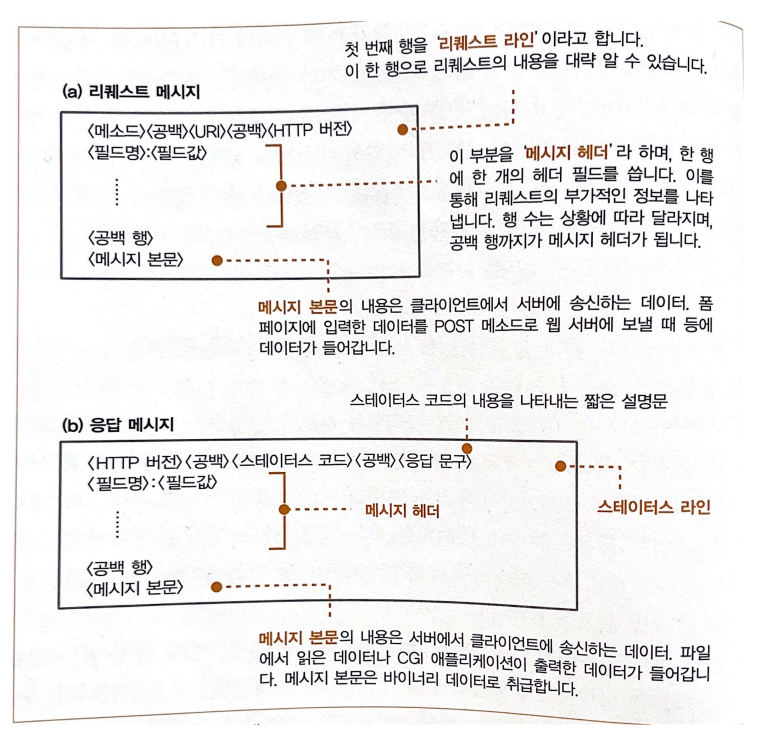

# WebBrowser

## 목차

## 흐름
1. HTTP 리퀘스트 메시지를 작성한다.
2. 웹 서버의 IP 주소를 DNS 서버에 조회한다.
3. 전 세계의 DNS 서버가 연대한다.
4. 프로토콜 스택에 메시지 송신을 의뢰한다.

## URL(Uniform Resource Locator)
정의 : 인터넷에서 **웹 페이지, 이미지, 비디오** 등 리소스의 위치를 가리키는 **문자열**

URL를 쓰는 방법은 다양하지만 하나의 공통점이 있다.
URL의 맨 앞에 있는 문자열, 즉 `http:`, `ftp:`, `file:`, `mailto:` 라는 부분에서 엑세스하는 방법을 나타낸다는 점이다.
해당 맨 앞 문자열들은 엑세스할 때의 **프로토콜 종류**를 나타낸다.

## URL 해독
브라우저가 처음 하는 일은 웹서버에 보내는 리퀘스트 메시지를 작성하기 위해 이 URL을 해독하는 것이다.

ex) `http://www.lab.cyber.co.kr/dir1/file1.html`를 해독한다면
- `http:` : 프로토콜을 기록
- `//` : 다음 이어지는 문자열이 서버의 이름임을 나타냄
- `www.lab.cyber.co.kr` : 웹 서버명
- `/dir1/file1.html` : 데이터 출처(파일)의 경로명//생략 가능
  - `/` : 루트 디렉토리
  - `dir1/` : dir1 디렉토리
  - `file1.html` : file1이라는 html파일

추가로 `/dir1/file1.html`은 생략 가능하다고 했다.
하지만 파일명을 쓰지 않으면 어느 파일에 엑세스해야 할지 모른다.
그래서 파일명을 생략할 때를 대비해서 파일명을 미리 서버측에서 설정해둔다.
대부분 `index.html` 또는 `default.htm`이다.
고로 파일명을 생략하면 `/dir1/index.html` 또는 `dir1/default.htm`이 엑세스 된다.

## HTTP의 기본 개념
HTTP 프로토콜은 클라이언트와 서버가 주고 받는 메시지의 내용이나 순서를 정해논 것
### 리퀘스트 메시지
클라이언트 -> 서버로 보내는 메시지

#### 구성
- 헤더 파일
- 메소드
  - GET : URI로 지정한 정보를 도출
  - POST : 클라이언트에서 서버로 데이터 송신
  - HEAD : GET과 거의 유사, 헤더만 반송
  - PUT : URI로 지정한 서버의 파일을 치환
  - DELETE : URI로 지정한 서버의 파일을 삭제
- URI
  - 페이지 데이터를 저장한 파일의 이름
  - CGI 프로그램[^CGI프로그램]의 파일명
  - http:로 시작하는 URL를 그대로 쓸수도 있다.(포워드 프록시)

[^CGI프로그램]: 웹 서버 소프트웨어에서 프로그램을 호출할 때의 규칙을 정한 것이 CGI이며, CGI의 규칙에 맞게 움직이는 프로그램을 CGI 프로그램이라고 한다.

### 응답 메시지
Status Code : 실행결과가 정상 종료되었는지 또는 이상이 발생했는지를 나타내는 코드

## HTTP 리퀘스트 메시지 구성

## HTTP 응답 메시지 구성
Status Code : 프로그램 등에 실행 결과를 알려줌
응답 문구 : 사람에게 실행결과를 알려줌

### 주요 Status Code
- 1xx : 처리와 경과 상황 등을 통지
- 2xx : 정상 종료
  - 200(성공)
  - 201(작성됨)
- 3xx : 무언가 다른 조치가 필요함을 나타냄, 리다이렉션(다른 페이지 이동)
  - 301(영구 이동)
  - 302(임시 이동)
- 4xx : 클라이언트측의 오류
  - 401(권한 없음)
  - 403(금지됨)
  - 404(찾을 수 없음)
- 5xx : 서버 측의 오류
  - 500(내부 서버 오류)
  - 502(불량 게이트웨이)
  - 503(서비스를 사용할 수 없음)
