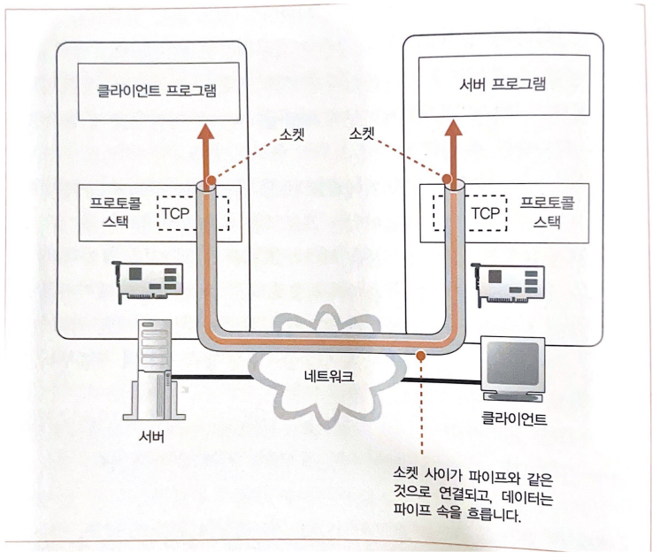

# WebBrowser

## 흐름
1. HTTP 리퀘스트 메시지를 작성한다.
2. 웹 서버의 IP 주소를 DNS 서버에 조회한다.
3. 전 세계의 DNS 서버가 연대한다.
4. 프로토콜 스택에 메시지 송신을 의뢰한다.

# 1. HTTP 리퀘스트 메시지를 작성한다.
## URL(Uniform Resource Locator)
정의 : 인터넷에서 **웹 페이지, 이미지, 비디오** 등 리소스의 위치를 가리키는 **문자열**

URL를 쓰는 방법은 다양하지만 하나의 공통점이 있다. 
URL의 맨 앞에 있는 문자열, 즉 `http:`, `ftp:`, `file:`, `mailto:` 라는 부분에서 엑세스하는 방법을 나타낸다는 점이다. 
해당 맨 앞 문자열들은 엑세스할 때의 **프로토콜 종류**를 나타낸다. 

## URL 해독
브라우저가 처음 하는 일은 웹서버에 보내는 리퀘스트 메시지를 작성하기 위해 이 URL을 해독하는 것이다. 

ex) `http://www.lab.cyber.co.kr/dir1/file1.html`를 해독한다면
- `http:` : 프로토콜을 기록
- `//` : 다음 이어지는 문자열이 서버의 이름임을 나타냄
- `www.lab.cyber.co.kr` : 웹 서버명
- `/dir1/file1.html` : 데이터 출처(파일)의 경로명//생략 가능
  - `/` : 루트 디렉토리
  - `dir1/` : dir1 디렉토리
  - `file1.html` : file1이라는 html파일

추가로 `/dir1/file1.html`은 생략 가능하다고 했다. 
하지만 파일명을 쓰지 않으면 어느 파일에 엑세스해야 할지 모른다. 
그래서 파일명을 생략할 때를 대비해서 파일명을 미리 서버측에서 설정해둔다. 
대부분 `index.html` 또는 `default.htm`이다. 
고로 파일명을 생략하면 `/dir1/index.html` 또는 `dir1/default.htm`이 엑세스 된다. 

## HTTP의 기본 개념
HTTP 프로토콜은 클라이언트와 서버가 주고 받는 메시지의 내용이나 순서를 정해논 것 

### 리퀘스트 메시지
클라이언트 -> 서버로 보내는 메시지

#### 구성
- 헤더 파일
- 메소드
  - GET : URI로 지정한 정보를 도출
  - POST : 클라이언트에서 서버로 데이터 송신
  - HEAD : GET과 거의 유사, 헤더만 반송
  - PUT : URI로 지정한 서버의 파일을 치환
  - DELETE : URI로 지정한 서버의 파일을 삭제
- URI
  - 페이지 데이터를 저장한 파일의 이름
  - CGI 프로그램[^CGI프로그램]의 파일명
  - http:로 시작하는 URL를 그대로 쓸수도 있다.(포워드 프록시)

[^CGI프로그램]: 웹 서버 소프트웨어에서 프로그램을 호출할 때의 규칙을 정한 것이 CGI이며, CGI의 규칙에 맞게 움직이는 프로그램을 CGI 프로그램이라고 한다.

### 응답 메시지
Status Code : 실행결과가 정상 종료되었는지 또는 이상이 발생했는지를 나타내는 코드

## HTTP 리퀘스트 메시지 구성

## HTTP 응답 메시지 구성
Status Code : 프로그램 등에 실행 결과를 알려줌 
응답 문구 : 사람에게 실행결과를 알려줌 

### 주요 Status Code
- 1xx : 처리와 경과 상황 등을 통지
- 2xx : 정상 종료
  - 200(성공)
  - 201(작성됨)
- 3xx : 무언가 다른 조치가 필요함을 나타냄, 리다이렉션(다른 페이지 이동)
  - 301(영구 이동)
  - 302(임시 이동)
- 4xx : 클라이언트측의 오류
  - 401(권한 없음)
  - 403(금지됨)
  - 404(찾을 수 없음)
- 5xx : 서버 측의 오류
  - 500(내부 서버 오류)
  - 502(불량 게이트웨이)
  - 503(서비스를 사용할 수 없음)

# 2. 웹 서버의 IP 주소를 DNS 서버에 조회한다.

## IP 주소의 기본
IP 주소구성 : 네트워크 번호 + 호스트 번호 

### 서브넷
InterNIC에서 할당받은 ip주소중 호스트영역은 해당 기관(학교, 회사, 관공서 등)의 네트워크 관리자들이 내부의 PC에 자유롭게 할당하여 사용 가능하다. 
클래스 A, B는 호스트 영역이 크기 때문에 서브넷으로 나누어 사용 

서브넷 : 허브 + PC 

같은 서브넷끼리는 게이트웨이 필요x :서브넷으로 통신 
다른 서브넷 일때는 게이트웨이 통신 게이트웨이에는 라우트의 포트가 연결되어 있어 통신 가능 

게이트웨이 : 서로다른 네트워크를 연결해주는 역할 

### 넷마스크
네트워크 번호와 호스트 번호를 나눠어주는 정보

### 호스트 번호
호스트 번호 부분의 비트 값이 모두 0 또는 1인경우 특병한 의미를 가짐

- 모두 0 : 서브넷 자체
- 모두 1 : 서브넷에 있는 기기 전체에 패킷을 보내는 **브로드캐스트**

## 도메인명과 IP주소를 구분하는 이유
1. IP주소를 외우는 것이 어렵다.
2. 실행 효율 관점에서 IP 주소는 4바이트에 해당하는 개수 밖에 없지만 도메인명은 최대 255바이트나 있다. 즉 데이터를 많이 옮겨야하므로 속도 문제

## DNS(Domain Name System)

1. naver.com에 접속합니다.
2. 내부적으로 DNS 서버는 클라이언트에게 해당 도메인의 IP주소를 반환
3. 클라이언트는 반환 받은 IP 주소로 본 서버에 접속하게 됨

### 브라우저는 어떻게 해서 DNS서버를 조회할 수 있을까?
결론부터 얘기하면 리졸버하는 것이다. 
리졸버 : Socket 라이브러리 중 하나로, 네임 리졸루션을 실행하는 것 
네임 리졸루션 : **DNS의 원리를 사용하여 IP주소를 조사하는 것** 

#### 리졸버 내부 동작

- **프로토콜 스택** : **OS 내부에 내장된 네트워크 제어용 소프트웨어**, 현재는 리졸버 -> DNS서버로 송, 수신 기능

# 4. 프로토콜 스택에 메시지 송신을 의뢰한다.

**리졸버(Socket) -> DNS서버**로 데이터 송, 수신할 때 OS 내부에 있는 프로토콜 스택에 의뢰하였다. 

**브라우저 -> 웹서버**로 데이터를 송, 수신할 때도 Socket 라이브러리를 이용하여 프로토콜 스택에 의뢰한다. 

이처럼 모든 **네트워크를 이용하는 애플리케이션**은 모두 프로코톨 스택에 의뢰하여 데이터를 송 수신한다. 

## 브라우저 -> 웹서버

여기서 파이프 같은 것이 **소켓 라이브러리**이다. 즉 데이터를 송 수신 하는 컴퓨터 사이에 데이터의 통로 
소켓 : **파이프 양 끝의 출입구** 

소켓 라이브러리는 처음부터 존재하지 않음 
고로 정해진 동작을 통해 소켓 라이브러리를 구축하여 사용한다. 

### 송 수신 동작 4단계 요약
1. 소켓을 만든다.(소켓 작성 단계)
2. 서버측의 소켓에 파이프를 연결한다.(접속 단계)
3. 데이터를 송 수신한다.(송 수신 단계)
4. 파이프를 분리하고 소켓을 말소한다.(연결 끊기 단계)

디스크립터 : **소켓을 식별**하기 위해 사용하는 것으로 소켓에 할당한 번호와 같은 것

- 소켓 작성 단계
  - **socket**이라는 프로그램을 실행해 소켓 생성
  - 생성된 소켓은 디스크립터로 식별
- 접속 단계
  - 서버 측 소켓에 접속하도록 프로토콜 스택에 의뢰하는 단계
  - **connect** 프로그램 실행(디스크립터, 서버의 IP 주소, 포트번호 입력 받음)
    - 디스크립터 : 어떤 소켓으로 서버측의 소켓에 접속할 것인지 소켓 결정
    - IP 주소 : 서버 측 IP 주소
    - 포트 번호 : 상대 소켓 지정 ex) 웹 : 80, 메일 : 25
- 송 수신 단계
  - **write** 프로그램으로 실행
    1. 애플리케이션은 송신 데이터 메모리를 준비(송신 데이터 = 리퀘스트 메시지)
    2. write를 호출할 때 디스크립터와 송신 데이터를 지정
    3. 프로토콜 스택이 송신데이터를 서버에게 송신
    4. 서버는 수신 동작을 실행하여 받은 데이터를 바탕으로 응답 메시지 반송
    5. 응답한 메시지를 수신하기 위해 Socket의 read 프로그램을 실행하여 프로토콜 스택에 수신 동작을 의뢰(응답 메시지를 저장하기 위한 메모리 영역을 지정해야하는데 이것이 바로 수신 버퍼)
    6. 응답 메시지가 돌아올 때 read가 받아 수신 버퍼에 저장
    7. 수신 버퍼에 메시지를 저장한 시점에 메시지를 애플리케이션에 전달
- 연결 끊기 단계
  - **close** 프로그램으로 실행

## 궁금한 것 
IP 주소 클래스로도 IP주소를 계층별로 구분하고 ex) A클래스, B클래스 등 
도메인 주소 역시 계층 별로 구분한다. ex) co, kr, com 등 
결국 도메인을 통해 IP주소를 가져오는 구조인데 
왜 둘다 계층 구조로 구별하는지 궁금합니다. 

## 참고 문헌
[도메인란 무엇인까?](https://github.com/wjdrbs96/Today-I-Learn/blob/master/Network/Application/DNS%EB%9E%80%3F.md)

[송 수신 단계](https://hoyeonkim795.github.io/posts/%EB%8D%B0%EC%9D%B4%ED%84%B0%EC%86%A1%EC%88%98%EC%8B%A0_%ED%94%84%EB%A1%9C%ED%86%A0%EC%BD%9C%EC%8A%A4%ED%83%9D/)

