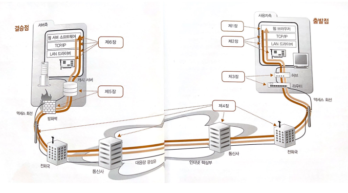

# 성공과 실패를 결정하는 1%의 네트워크 원리

## 목적
1. 네트워크의 전체의 움직임
2. 클라이언트와 서버 간의 전체 영역

## 챕터
1. 웹 브라우저가 메시지를 만든다. *
   - 웹 브라우저
2. TCP/IP의 데이터를 전기 신호로 만들어 보낸다. ***
   - 프로토콜 스택, LAN 어댑터
3. 케이블의 앞은 LAN 기기였다. *
   - 허브, 스위치, 라우터
4. 엑세스 회선을 통해 인터넷의 내부로
   - 엑세스 회선, 프로바이더 
5. 서버측의 LAN에는 무엇이 있는가 **
  - 방화벽, 캐시 서버
6. 웹서버에 도착히여 응답 데이터가 웹 브라우저로 돌아간다. **
   - 웹서버

### 전체 흐름
