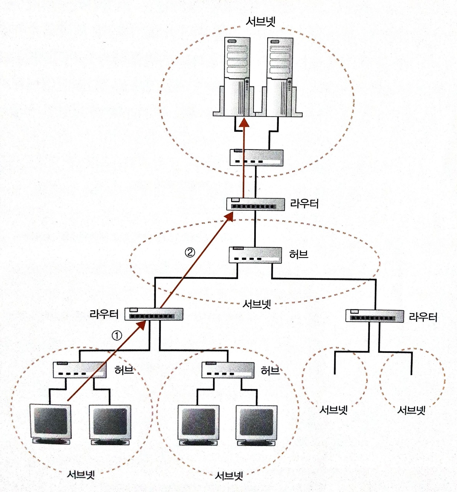

# 웹 브라우저

- [웹 브라우저](#웹-브라우저)
  - [HTTP 조회 메시지를 만든다.](#http-조회-메시지를-만든다)
    - [HTTP 프로토콜](#http-프로토콜)
  - [웹서버의 IP주소를 DNS 서버에 조회한다.](#웹서버의-ip주소를-dns-서버에-조회한다)
    - [전세계의 DNS 서버가 연대한다.](#전세계의-dns-서버가-연대한다)
  - [프로토콜 스택에 메시지 송신을 의뢰한다.](#프로토콜-스택에-메시지-송신을-의뢰한다)
  - [참고문헌](#참고문헌)

## HTTP 조회 메시지를 만든다.

사용자가 URL(`Uniform Resource Locator`)을 입력한다.

URL을 웹 브라우저가 해석한다.

    http:     //    www.naver.com   / + dir + / + file
    프로토콜        웹서버명        URI(Uniform Resource Identifier)

URL을 해석하여 어디에 엑세스해야 하는지가 판명된다.

웹서버에 엑세스한다면,
HTTP 프로토콜을 사용하여 웹서버에 엑세스한다.

HTTP 프로토콜을 통해 HTTP 메시지를 만든다.

### HTTP 프로토콜

HTTP 프로토콜은

    클라이언트와 서버가 주고받는 메시지의 내용이나 순서를 정한 것이다.

**정해진 내용**은 클라이언트에서 서버를 향해 조회 메시지를 보낸 부분만 알아보자.

<table>
    <tr>
        <td>메소드</td>
        <td>URI</td>
        <td>HTTP 버전</td>
    </tr>
    <tr>
        <td colspan="3">메시지 헤더</td>
    </tr>
    <tr>        
        <td colspan="3">메시지 바디</td>
    </tr>
</table>
   
다음과 같은 의미를 갖는다.
    
    어떻게 해서:  메소드          
                        cf. GET, POST...

    무엇을:       URI 
                        cf. 파일명, 프로그램명

    HTTP 버전
    
이때, 조회 메시지에 쓰는 URI는 하나뿐이므로,
복수의 파일을 읽을 때는 웹 서버에 별도의 조회 메시지를 보내야한다.    

이렇듯 `행과 행`, 행 안의 `데이터와 데이터` 간에는 공백으로 구분한다.

**정해진 순서**는 다음과 같다.

    → 요청
    ← 응답

## 웹서버의 IP주소를 DNS 서버에 조회한다.

브라우저는 메시지를 네트워크에 송출하는 기능은 없으므로 OS에 의뢰하여 송신한다.

OS에 송신을 의뢰할 때는 도메인명이 아니라 IP주소로 
메시지를 받을 상대를 지정해야 한다.

도메인명은 사용자들이 기억하기 쉬운 형태이고, IP주소가 실제 통신에 사용되기 때문이다.

<details>
<summary><b>IP주소</b></summary>

IP주소를 PC에 할당하여, 망내에서 PC를 인식한다.
> 인터넷 망, 사설 망(인터넷 망에 연결하지 않아도 되는)

|            동 |   |        번지 |   |        |
|--------------:|:-:|------------:|:-:|-------:|
|        서브넷 |   |          PC |   |        |
| 네트워크 번호 | + | 호스트 번호 | = | IP주소 |
|       10.1.2. |   |           3 |   |        |

<table>
    <tr>
        <td></td>
        <td>
<p>
서브넷은

    허브에 몇 대의 PC가 접속된 것을 의미한다.

라우터는

    서브넷들을 연결하여 네트워크를 완성한다.
</p>
        </td>
    </tr>
</table>

넷마스크는

    네트워크 번호와 호스트 번호의 구분을 나타내는 정보이고, 필요에 따라 IP주소에 덧붙인다.

        cf. 10.1.2.3/24
</details>
<br/>

도메인명에 대응하는 IP주소를 조사해야한다.

IP주소 조사 과정은

    가장 가까운 DNS 서버에 조회 메시지를 보내고, 반송되는 응답 메시지를 확인한다.

그 조사 과정을 면밀히 살펴보면,

OS에 네트워크 기능을 호출하기 위한 Socket 라이브러리의 리졸버라는 프로그램이 있다.

브라우저에서 리졸버를 호출하면 제어가 리졸버의 내부로 넘어간다.

제어가 넘어간다는 의미는
    
    호출한 프로그램(브라우저)이 쉬고 있는 상태가 되며,
    호출된 프로그램(리졸버)가 움직이기 시작하는 상태를 말한다.

제어가 넘어온 리졸버는 조회 **메시지를 만들고**, 이는 HTTP 조회 메시지를 만드는 과정과 유사하다.

DNS 조회 메시지에는 

    이름:       www.naver.com
    클래스:     IN(internet)
    타입:       A(address)

    → 192.0.0.1
    
정보가 포함되고, DNS 서버는 이에 대응하여 응답하는 항목이 등록되어 있다.

**DNS 메시지를 송신하는 동작은** OS의 프로토콜 스택을 호출하여 실행을 의뢰한다.

프로토콜 스택은

    OS에 네트워크 제어용 소프트웨어이다.

제어가 프로토콜 스택으로 넘어간다.

메시지를 송신하는 동작을 LAN 어댑터를 통해 DNS 서버를 향해 송신된다.

웹 서버가 DNS 서버에 등록되어 있다면, 
이후 클라이언트로 돌아오는 과정은 지나온 과정의 역순이다.

    응답 메시지는 네트워크를 통해 클라이언트에게 반송된다.

    ↓

    프로토콜 스택을 경유해서, 리졸버에 제어권을 돌려주고

    ↓

    리졸버가 내용을 해독한 후

    ↓

    IP주소를 추출하여 브라우저에 건네주고, 제어권도 돌아온다.

이때, 브라우저에서 지정한 메모리 영역에 써넣는다.

브라우저는 메모리 영역의 IP주소를 필요할 때마다 사용한다.

### 전세계의 DNS 서버가 연대한다.

인터넷에는 막대한 수의 서버가 있기 때문에
이것을 전부 1대의 DNS 서버에 등록하는 것은 불가능하다.

DNS 서버는 연대되어 어디에 정보가 등록되어 있는지 찾아내는 구조이다.

DNS 서버에 등록한 정보는 도메인명에 따라 계층적 구조를 가진다.


조회 메시지를 받은 나와 가장 가까운 DNS 서버에 정보가 등록되어 있지 않다면,

어느 DNS 서버든 등록되 있는 루트 도메인을 통해 최상위 계층으로 올라가고, 다음과 같이 찾는다.

| /           | com           | naver       | map       |
|-------------|---------------|-------------|-----------|
| 루트 도메인 | 업체용 도메인 | 회사 도메인 | 서버 이름 |

하위의 도메인을 담당하는 DNS 서버의 IP 주소를, 상위의 DNS 서버에 등록했기 때문에 찾기 쉽다.

    map.naver.com 도메인을 담당하는 DNS 서버의 IP 주소를
        naver.com DNS 서버에 등록한다.

교재에 이 과정을 합쳐보라는 내용과 DNS 서버의 캐시 기능을 접목하여 
다음과 같은 다이어그램으로 정리해보았다.


## 프로토콜 스택에 메시지 송신을 의뢰한다.

브라우저로 시작해 송·수신 동작이 마무리되고, 브라우저로 돌아오는 DNS 메시지와 다르게

**HTTP 메시지를 송신하는 동작**은 

Socket 라이브러리가 브라우저와 OS 프로토콜 스택 간의 제어권을 오가게 하는 중개자 역할을 한다.

때문에, 송·수신 동작 도중에 브라우저를 계속 오고 간다.

```c
browser{
    DNS 송·수신 동작

    Socket.socket();    // +++ 프로토콜 스택에서 작업한 뒤 다시 앱으로 돌아온다.
    Socket.connect();   // +++ 프로토콜 스택에서 작업한 뒤 다시 앱으로 돌아온다.
    Socket.write();     // +++ 프로토콜 스택에서 작업한 뒤 다시 앱으로 돌아온다.

    ...
}

```

프로토콜 스택에서 데이터를 송·수신하기 위한 소켓 연결과정을 갖는다.

    파이프는

        데이터를 송·수신하는 PC 사이에 데이터의 통로이다.

    소켓은 

        PC간에 통로를 연결하는 작업이 따르는데, 각 출입구이다.

소켓 연결과정은

1. 서버측에서 소켓을 만들고, 소켓에 클라이언트가 파이프를 연결하기를 기다린다.

2. 클라이언트측에서 소켓을 만들고, 소켓에서 파이프를 늘려 서버측의 소켓에 연결한다.

소켓이 생기면, 디스크립터가 돌아오는데 브라우저는 이를 메모리에 기록한다.

    디스크립터는
        소켓 연결과정 또는 데이터 송·수신 동작이 동시에 이뤄질 시, 
        브라우저 단에서 소켓을 식별하기 위해 사용한다.        

클라이언트에서 파이프 연결 시도 시, `디스크립터`, `서버 IP주소`, `포트 번호`가 필요하다.

서버 IP주소는 어느 컴퓨터인가만 식별하지, 어느 소켓인가는 알 수 없어 포트 번호가 필요하다.

> 이후 부터는 교재 2장에서 자세히 다룬다.

서버에서 클라이언트 측 소켓의 식별은 
    1. 클라이언트 측에서 소켓 생성 시, 프로토콜 스택이 적당한 값을 할당해서
    2. 파이프 연결 시도 시, 서버측에 통지한다.

송신 데이터는 브라우저가 메모리에서 준비해두고,
수신 데이터 또한 메모리에 받는데, 이 영역을 수신 버퍼라고 따로 부른다.

데이터를 전부 보내면 연결된 파이프를 분리한다.

파이프를 분리할 때 웹에서 사용하는 HTTP 프로토콜은 

웹서버에서 HTTP 응답 메시지를 송신 완료 시, 서버측 소켓의 연결 끊기 동작도 수행한다.
연결 끊음이 클라이언트 측에 전달되어 클라이언트 측 소켓의 연결 끊기 동작도 수행한다.

<hr/>

## 참고문헌

[브라우저 주소창에 URL을 치면 일어나는 일들](https://maxkim-j.github.io/posts/packet-travel) ━ *김맥스 기술 블로그*