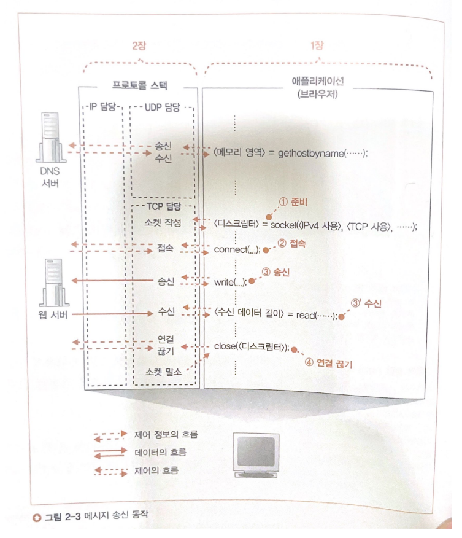
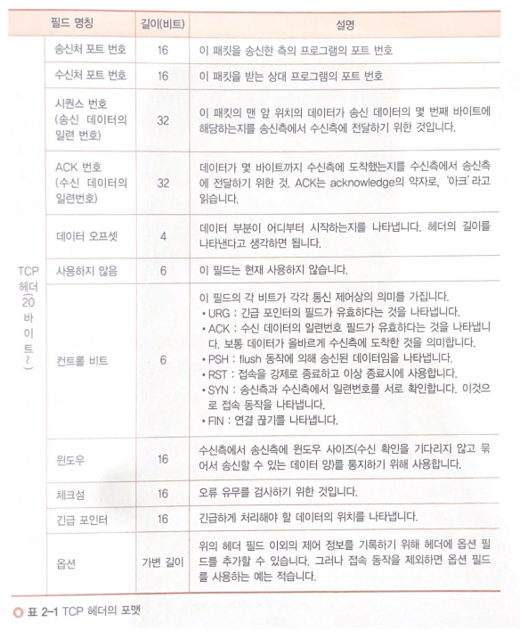

# 프로토콜 스택

## 목차
- 프로토콜 스택 내부 구성
  - TCP와 UDP
- LAN 드라이버
- 소켓의 실체
- 소켓의 동작
  - 준비 동작
  - 접속 동작
    - 제어 정보
    - 접속 동작과정
- 참고문헌

## 프로토콜 스택 내부 구성
- TCP : TCP프로토콜[^TCPprotocol]을 사용하여 데이터 송, 수신 담당
  - 패킷을 **추적 및 관리**하는 역할
- UDP : UDP프로토콜[^UDPprotocol]을 사용하여 데이터 송, 수신 담당
- IP : IP프로토콜을 사용하여 패킷 송, 수신 동작 제어
  - 패킷을 **통신 상대에게 운반**하는 역할
  - ICMP : 패킷을 운반할 때 발생하는 **오류를 통지**하거나 **제어용 메시지를 통지**할때
  - ARP : IP주소에 대응하는 이더넷의 **MAC주소**를 조사할 때
    - [ARP동작과정](https://velog.io/@sunil1369/TCPIP-%EA%B8%B0%EC%B4%88%EC%99%80-JAVAC%EC%9D%84-%ED%99%9C%EC%9A%A9%ED%95%9C-%EB%84%A4%ED%8A%B8%EC%9B%8C%ED%81%AC-%ED%94%84%EB%A1%9C%EA%B7%B8%EB%9E%98%EB%B0%8D-1%EC%9E%A5) 21-2네트워크 수업에서 정리한 부분의 ARP 동작과정이다.

[^TCPprotocol]: 인터넷상에서 데이터를 메세지의 형태로 보내기 위해 IP와 함께 사용하는 프로토콜
[^UDPprotocol]: 데이터를 데이터그램 단위로 처리하는 프로토콜

### TCP와 UDP
**[ TCP 특징 ]**
- 연결형 서비스로 가상 회선 방식을 제공한다.
- 3-way handshakeing과정을 통해 연결을 설정하고 4-way handshaking을 통해 해제한다.
- 흐름 제어[^flowControl] 및 혼잡 제어[^CongestionControl]
- 높은 신뢰성을 보장한다.
- UDP보다 속도가 느리다. -> 데이터의 흐름제어나 혼잡 제어와 같은 기능이 CPU를 사용하기 때문에 속도에 영향을 줌
- 전이중(Full Duplex),점대점(Point to Point) 방식

[^flowControl]: 데이터를 송신하는 곳과 수신하는 곳의 데이터 처리 속도를 조절하여 수신자의 버퍼 오버플로우를 방지하는 것
[^CongestionControl]: 네트워크 내의 패킷 수가 넘치게 증가하지 않도록 방지하는 것

**[ TCP 서버의 특징 ]**
- 서버소켓은 연결만을 담당한다.
- 서버와 클라이언트는 1대1로 연결된다.
- 스트림 전송으로 전송 데이터의 크기가 무제한다.
- 패킷에 대한 응답을 해야하기 때문에(시간 지연, CPU 소모) 성능이 낮다.
- Streaming 서비스에 분리하다.(손실된 경우 재전송을 요청을 하므로)

**[ UDP 특징 ]**
- 비연결형 서비스로 데이터그램 방식을 제공한다.
- 정보를 주고 받을 때 정보를 보내거나 받는다는 신호절차를 거치지 않는다.
- UDP헤더의 CheckSum 필드를 통해 최소한의 오류만을 검출한다.
- 신뢰성이 낮다.
- TCP보다 속도가 빠르다.

**[ UDP 서버의 특징 ]**
- UDP에는 연결 자체가 없어서(connect 함수 불필요) 서버 소켓과 클라이언트 소켓의 구분이 없다.
- 소켓 대신 IP를 기반으로 데이터를 전송
- 서버와 클라이언트는 1대1, 1대N, N대M 등으로 연결될 수 있다.
- 데이터그램(메시지) 단위로 전송되며 그 크기는 65535바이트로, 크기가 초과하면 잘라서 보낸다.
- 흐름 제어(flow control)가 없어서 패킷이 제대로 전송되었는지, 오류가 없는지 확인 불가
- 파일 전송과 같은 신뢰성이 필요한 서비스보다 성능이 중요시 되는 경우에 사용된다.
- DNS서버에서 Domain과 매핑되는 IP주소를 조회시에 사용된다.

| 프로토콜 종류 | TCP | UDP |
|------|-------|---|
| 연결 방식 | 연결형 서비스 | 비연결형 서비스 |
| 패킷 교환 방식 | 가상 회선 방식 | 데이터그램 방식 |
| 전송 순서 | 전송 순서 보장 | 전송 순서가 바뀔 수 있음 |
| 수신 여부 확인 | 수신 여부를 확인함 | 수신 여부를 확인하지 않음 |
| 통신 방식 | 1:1통신 | 1:1 or 1:N or N:N 통신 |
| 신뢰성 | 높다 | 낮다 |
| 속도 | 느림 | 빠름 |

## LAN 드라이버
위 프로토콜 스택을 지나 LAN 드라이버로 온다. 
LAN 드라이버에서는 **LAN 어댑터의 하드웨어를 제어한다.** 

그리고 그 아래 LAN어댑터가 실제 케이블에 대한 신호를 송, 수신한다. 

## 소켓의 실체
소켓의 실체는 제어 정보를 기록한 메모리 영역이라고 할 수 있다. 

프로토콜 스택은 이것을 참조하여 다음에 무엇을 해야하는지 판단한다. 

## 소켓의 동작

### 준비 동작
- 프로토콜 스택이 소켓 한 개 분량의 메모리 영역을 확보한다
- 만들어진 소켓을 가르키는 디스크립터를 애플리케이션에 알려준다.
  - 애플리케이션은 통신 상대의 정보를 디스크립터를 통해 전달 받는다.

### 접속 동작
- 통신 상대와의 **제어 정보**를 주고받아 소켓에 필요한 정보를 기록하고 데이터 송, 수신이 가능한 상태로 만드는 것
- 송, 수신하는 데이터를 일시적으로 저장하는 버퍼 메모리 확보

#### 제어 정보
제어 정보는 크게 2가지 종류로 나눌 수 있다.
1. 헤더에 기입되는 정보
   - 클라이언트와 서버가 서로 연락을 절충하기 위해 주고받는 제어 정보
   - 아래 사진 참고
2. 소켓(프로토콜 스택의 메모리 영역)에 기록되는 정보
   - 애플리케이션에서 통지된 정보, 통신 상대로부터 받은 정보, 송,수신 동작의 진행 상황 등

#### 접속 동작과정
> connect(<디스크립터>, <서버측의 IP주소와 포트 번호>,...)

`<서버측의 IP주소와 포트번호>`를 작성하면 명령이 `프로토콜 스택의 TCP 담당 부분`으로 전달된다.
`TCP 담당 부분`은 `서버의 TCP 담당 부분`과 **제어 정보**를 주고 받는다.

위 자세한 순서는 다음과 같다.
1. `클라이언트의 TCP 담당 부분`에서 데이터 송,수신 동작에 개시를 나타내는 제어 정보를 기록한 **헤더** 생성
  - TCP 헤더의 송신처와 수신처의 포트 번호로 접속하는 소켓을 지정, 컨트롤 비트 SYN = 1로 생성
2. TCP헤더를 `IP 담당 부분`에 건네주어 송신 의뢰
3. `클라이언트의 IP 담당 부분` -> `서버측의 IP 담당 부분` -> `서버측 TCP 담딩 부분`
4. `서버측 TCP 담당 부분`의 접속을 기다리는 소켓 중 TCP 헤더의 수신처 포트 번호와 동일한 번호가 있다면 헤당 소켓에 정보 기록 후 상태변경(기다리는 중 -> 진행중)
5. 위 단계가 성공하면 `서버측 TCP 담당 부분`은 `클라이언트의 TCP 담당 부분`에게 응답을 보낸다.
6. `서버의 TCP 담당 부분`에서 응답을 위한 TCP헤더 생성
   - TCP 헤더의 송신처와 수신처의 포트 번호로 접속하는 소켓을 지정
   - 컨트롤 비트 ACK = 1, SYN = 1로 생성(패킷을 받았다는 것을 알리는 비트)
7. 클라이언트로 전송(위 내용과 동일하게)
8. 소켓에 `접속 완료` 제어 정보 기록
9. `접속 완료`를 알리는 ACK =1인 TCP 헤더를 반송

위 작업을 거친 후 소켓은 데이터를 송, 수신할 수 있는 상태가 된다.

## 참고문헌
[TCP와 UDP 관련 참고문헌](https://mangkyu.tistory.com/15)