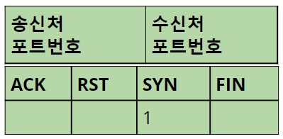

# 프로토콜 스택 ┃ Part 1

- [프로토콜 스택 ┃ Part 1](#프로토콜-스택--part-1)
  - [들어가며](#들어가며)
  - [프로토콜 스택의 의의](#프로토콜-스택의-의의)
  - [프로토콜 스택과 제어 정보](#프로토콜-스택과-제어-정보)
  - [프로토콜 스택의 동작](#프로토콜-스택의-동작)
    - [소켓을 작성한다.](#소켓을-작성한다)
    - [서버에 접속한다.](#서버에-접속한다)

## 들어가며

이전 9주차에서 다음과 같이 글을 종단하였다.

<dl><dt>
14. 클라이언트측에서 소켓을 만드는데...
<br/>
15. 이후 클라이언트측 소켓에서 서버측의 소켓으로 파이프 연결을 시도한다.
</dt></dl>

이 2가지를 10주차에서 자세히 다뤄보고자 한다.

## 프로토콜 스택의 의의

앞선 2가지는 프로토콜 스택과 밀접한 관계가 있다.

이전에 프로토콜 스택을 네트워크 제어용 소프트웨어라고 소개한 바 있다.

맞는 말이지만, 좀 더 이름의 의의에 대한 답변이 아니라고 생각이 됬다.

프로토콜 스택이란 이름이 붙인 이유는

    OSI 7 layer가 마치 스택처럼 쌓여있기 때문이라 생각한다.

    그 중 OS의 내의 구역인 3-4계층을 특정적으로 프로토콜 스택이라 불리는 것 같다.

## 프로토콜 스택과 제어 정보

프로토콜 스택은 2가지의 제어 정보를 참조하며 동작한다.

    1. 헤더에 기입되는 정보
    2. 소켓에 기록되는 정보

헤더에 기입되는 정보에는 송·수신 되는 데이터에 관련된
            
<center>

</center>

소켓에 기록되는 정보에는 송·수신 자체, 즉 통신에 관련하여 들어간다.

```shell
 프로토콜  로컬 주소              외부 주소              상태            PID
  TCP    0.0.0.0:65004          0.0.0.0:0              LISTENING       4604
  TCP    127.0.0.1:1030         127.0.0.1:1031         ESTABLISHED     6068
```

여기서, 이전 9주차에서 정의한 소켓을 풀어서 재정의 할 수 있었다.

    9주차:  데이터 통로 간의 출입구

    10주차: 제어 정보를 기록한 메모리 영역

## 프로토콜 스택의 동작

이전 9주차에서 HTTP 메시지 송·수신 동작으로 다음과 같은 코드를 작성하였다.

```
browser{
    DNS 송·수신 동작

    Socket.socket();  
    Socket.connect(); 
    ...

}
```
애플리케이션 단에서 Socket 라이브러리 호출에 따른 

프로토콜 스택의 내부는 어떻게 동작하는지 알아보자.

### 소켓을 작성한다.

`Socket.socket()`은 소켓을 만드는 단계이다.

1. 프로토콜 스택은 소켓 한 개 분량의 메모리 영역을 확보[^memory-allocate]하고,    
2. 초기 상태임을 나타내는 제어 정보를 기록한다.

[^memory-allocate]: OS의 메모리 관리 모듈에 신청하여 메모리 영역을 할당받는 것을 말한다.

### 서버에 접속한다.

소켓을 만든 뒤, `Socket.connect()`는 서버측 소켓에 접속하는 단계이다.

케이블은 항상 연결되어 있기 때문에 제어 정보를 통해 

통신 상대와 데이터 송·수신이 가능한 상태로 만들어야한다.

이 상태를 만드는 과정을 TCP 3 Way-Handsake 라고 말한다.

각 Way 마다 클라이언트측이냐 서버측이냐 주체만 달라질 뿐 다음과 같은 세부과정이 있다.

1. TCP 에서 TCP 헤더를 만든다.
2. TCP 헤더에 `송신처 포트 번호`에서 `수신처 포트 번호`를 지정한다.
3. TCP 헤더를 만들면 IP에 건네주어 송신을 의뢰한다. 
   IP에서 패킷 송신 동작을 실행하고, 네트워크를 통해 수신처에 도착하면
4. 수신처 IP가 이것을 받고 TCP에 건네준다.
5. 수신처 TCP가 헤더를 조사하여 기록된 `수신처 포트 번호`에 해당하는 소켓을 찾아낸다.
6. 해당 소켓에 접속 동작 진행중이라는 상태로 갱신한다.
7. 수신처 TCP는 응답을 돌려준다.

전체적인 3 Way-Handsake를 [링크](https://slides.com/yongki150/deck-6258c3/embed)로 확인해보자.