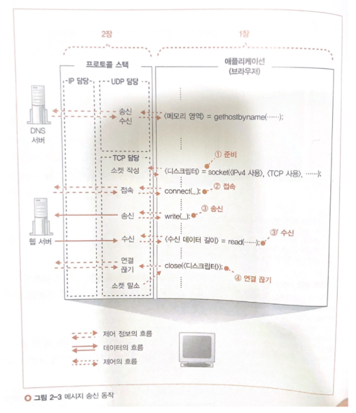

# 프로토콜 스택

## 들어가며

전 장에서 connent를 통해 server와 client를 소켓으로 연결하는 것을 배웠다.

이번 장에서는 write부터 공부하도록 하겠다.

## 데이터를 송, 수신한다.
### 프로토콜 스택에 HTTP 리퀘스트 메시지를 넘긴다.

애플리케이션 -> 프로토콜 스택에 Write() 명령을 통해 전송한다.

**< Write()의 상태 특징 >**

1. 프로토콜 스택은 단지 버퍼 메모리에 저장하기 위해 데이터의 크기는 알지만 세부내용은 알지 못한다.
2. 애플리케션의 종류나 만드는 방법에 따라 분할해서 전송 / 한 번에 전송 크게 2가지 방식으로 나눈다.(프로토콜 스택에서 제어 x)
   - 데이터를 곧바로 보낸다면 작은 패킷을 많이 보내는 경우가 생김(효율↓). 그렇기에 어느 정도 데이터를 저장하고 나서 송, 수신 동작을 한다.

**< 어느 정도까지 저장하고 송신할 지 판단하는 두 가지 요소 >**

1. 한 패킷에 저장할 수 있는 데이터의 크기(MTU)
   - 프로토콜 스택은 MTU라는 매개변수를 바탕으로 판단한다.
   - MTU는 한 패킷이 운반할 수 있는 데이터의 최대 길이
   - 이더넷에서 보통 1,500Byte
   - MTU는 데이터 + 헤더의 범위이고 순수데이터만 포함하는 명칭은 **MSS**
   - 애플리케이션에서 받은 데이터가 MSS를 초과하거나 MSS에 가까운 길이에 이르기까지 데이터를 저장하고 송신한다.
p.121  사진

2. 타이밍
   - 프로토콜 스택은 내부에 타이머가 있어서 일정 시간이 경과하면 MTU 여부에 상관없이 패킷을 전송

|  | MTU | 타이밍  |
|------|-------|---|
| 네트워크 이용 효율 | ▲ | ▼ |
| 버퍼 머문 시간 | 길다 | 짧다 |

결론 : MTU와 타이밍을 절충하여 송신 동작을 실행해야 한다.

그러나 TCP프로토콜에는 절충하는 규정이 없고 프로토콜 스택 개발자의 의해 절충된다. = OS 종류나 버전에 따라 절충

애플케이션 측에서도 송신의 타이밍을 제어 가능(옵션 지정)
- 브라우저와 같은 대화형 어플케이션의 경우는 버퍼에 머무는 만큼 응답 시간이 지연되기 때문에 옵션을 사용하여 바로 보내도록 할 수 있다.

### 데이터가 클 때는 분할 하여 보낸다.
- 폼을 사용한 긴 데이터 등 한 개의 패킷에 들어가지 않는 데이터가 있다.
  - 블로그, 게시판 등에서 긴 문장

1. 송신 버퍼에 저장된 데이터가 MSS의 길이를 초과한 경우
2. 다음 데이터를 기다리지 않고
3. 송신 버퍼에 들어있는 데이터를 맨 앞부터 차례대로 MSS의 크기에 맞게 분할
4. 분할한 조각을 한 개씩 패킷에 넣어 전송

p.123 사진

### ACK 번호를 사용하여 패킷이 도착했는지 확인한다.
TCP에는 송신한 패킷이 상대에게 올바르게 도착했는지 확인하고, 도착하지 않았다면 다시 송신하는 기능이 있으므로 송신한 후 확인 동작으로 넘어간다.

p. 125 사진

1. 데이터를 조각으로 분할할 때 조각이 통신 개시부터 따져서 몇 번째 바이트에 해당하는지 세어둔다.
2. 데이터의 조각을 송신할 때 세어둔 값을 TCP헤더에 기록한다.
  - **시퀀스 번호**라는 항목에 해당한다.
  - 송산하는 데이터의 크기도 전송하는데 이는 `패킷의 전체길이 - 헤더 길이` 이므로 헤더에 따로 작성하진 x
3. 누락이 없는 것을 확인하면 수신측은 그 이전에 수신한 데이터와 합쳐서 데이터를 몇 번째 바이트까지 수신한 것인지 계산하고, 그 값을 TCP 헤더의 ACK 번호에 기록하여 송신 측에 알려준다. 이렇게 ACK 번호를 되돌려주는 동작을 **수신 확인 응답**이라고한다.
   - 송신측은 이것을 통해 상대가 어디까지 수신했는지 파악
4. 실제로 시퀀스 번호는 1부터 시작하지 않고 난수를 바탕으로 산출한 초기값으로 시작한다. 데이터의 송, 수신을 시작하기 전에 초기값을 상대에게 알리게 되어 있다.
   - 악의적인 공격을 피하기 위함
5. TCP는 상대가 데이터를 받았는 지 확인할 때까지 송신한 패킷을 수신용 버퍼 메모리에 보관
   - ACK이 돌아오지 않았을 경우 재전송을 위함(회복 처리)
   - 다른 곳(LAN 어댑터, 버퍼, 라우터)에서 오류를 회복 조치할 필요 x
6. 도중에 케이블이 분리되거나 서버가 다운되는 등의 이유로 TCP가 아무리 재전송을 해도 도착하지 않는 경우가 있다.
   - 이때 한 없이 재전송하는 것이 아니라 TCP는 몇 번 다시 보낸 후 회복의 전망이 없는 것으로 보고 데이터 송신 동작을 강제로 종료하고 애플리케이션에 오류를 통지

**< 접속부터 송,수신까지 >**
1. 클라이언트 -> 서버(SYN : 시퀀스 번호 초기값)
2. 서버 -> 클라이언트(ACK번호, SYN)
3. 클라이언트 -> 서버(ACK)
> 3-Way Handshaking이 위의 1,2,3이다.

4. 클라이언트 -> 서버(SYN, 데이터)
5. 서버 -> 클라이언트(ACK : SYN + 데이터)
...

p129 사진

### 패킷 평균 왕복 시간으로 ACK번호의 대기 시간을 조정한다.
- ACK 번호가 돌아오는 것을 기다리는 시간을 **타임아웃 값**이라고 한다.
- 타임아웃 값을 짧지도 길지도 않은 값으로 설정해야한다.
  - 너무 짧으면 ACK번호가 돌아오기 전에 재전송을 해버린다.(패킷 혼잡)
  - 너무 길면 재전송 시간이 지연되어 성능이 저하된다.
- TCP는 타임아웃 값을 동적으로 변경하는 방법을 사용한다.
  - ACK 번호가 돌아오는 시간을 계측하고 상황에 맞게 동적으로 대기시간 적용

### 윈도우 제어 방식으로 효율적으로 ACK 번호를 관리한다.
p.132
- 위 핑퐁 방식과 같이 ACK 번호가 돌아올 때까지 아무일도 하지 않고 기다리는 것은 시간 낭비이다.
- 그래서 윈도우 제어 방식을 사용한다.
- 윈도우 제어 방식은 한 개의 패킷을 보낸 후 ACK 번호를 기다리지 않고 차례대로 연속해서 복수의 패킷을 보내는 방법이다.
- BUT! ACK번호를 기다리지 않고 차례로 패킷을 보내면 수신측의 능력을 초과하여 패킷을 보내는 사태가 일어날 수 있다.
  - 수신측의 TCP는 패킷을 수신하면 수신용 버퍼 메모리에 저장한다.
  - 수신측에서 ACK번호를 계산하거나 조각을 연결하여 원래 데이터를 복원 후 애플리케이션에 건네주어야한다.
  - 그런데 애플리케이션에 건네주는 속도보다 빠른 속도로 데이터가 도착하면 수신용 버퍼 메모리가 넘친다.
  - 넘친 데이터는 없어져 버리고 오류가 발생한다.
- 위 문제는 수신측에서 송신측에 수신 가능한 데이터 데이터 양을 통지하고, 송신측은 이 양을 초과하지 않도록 송신 동작을 실행하여 해결할 수 있다. 이것이 윈도우 제어 방식의 개념이다.
  - 아래 사진과 같이 동작한다.
  - 수신 버퍼가 빈부분이 생기면 **TCP 헤더의 윈도우 필드**를 통해 송신측에 알린다.
  - 수신 가능한 데이터의 양의 최대값을 **윈도우 사이즈**라고 하고, 보통 수신측의 버퍼 메모리의 크기와 같은 크기가 된다.

p. 133 사진
### ACK 번호와 윈도우를 합승한다.
송, 수신 동작의 **효율성**을 높이기 위해서는 **ACK 번호**와 **윈도우를 통지**하는 **타이밍**을 고려해야한다.

- 윈도우 통지 : 수신측이 수신 버퍼에서 데이터를 추출하여 애플리케이션에 건네 주었을때
- 수신측에서 애플리케이션에 데이터를 건네주고 수신 버퍼의 빈 영역이 늘어났을 때, 이것을 송신 측에 통지하는데 이것이 **윈도우 통지의 타이밍**이다.

- ACK번호는 데이터를 수신한 후 즉시 보낸다.

- ACK번호 통지와 윈도우 통지의 패킷이 따로 따로 송신측에 보내지는 데, 이것은 효율성이 저하된다.
- 수신측은 ACK 번호나 윈도우 통지할 때 소켓을 바로 보내지 않고 잠시 기다렸다가 다음 통지 동작이 일어나면 한 개의 패킷으로 묶어서 보낸다.
- 복수의 ACK 번호 통지가 연속해서 일어나는 경우
  - 최후의 것만 통지하고 도중에 것은 생략해도 상관없다.

### HTTP 응답 메시지를 수신한다.
- 브라우저는 요청 메시지를 송신해 달라고 의뢰하고, 서버에서 돌아오는 응답 메시지를 받기 위해 read 프로그램을 호출한다. read를 경유하여 프로토콜 스택에 제어가 넘어가고, 프르토콜 스택이 움직이기 시작한다.

- 응답 메시지가 도착하면
1. 수신한 데이터 조각과 TCP 헤더의 내용을 조사
2. 문제가 없을 시 ACK번호 반송
3. 데이터 조각을 수신버퍼에 일시 보관하고, 연결된 조각을 복원 후 애플리케이션에 전달
   - 구체적으로는 수신 데이터를 애플리케이션이 지정한 메모리 영역에 옮겨 기록한 후 애플리케이션에 제어를 되돌려준다.
4. 타이밍을 고려해 윈도우 통지

## 서버에서 연결을 끊어 소켓을 말소한다.

