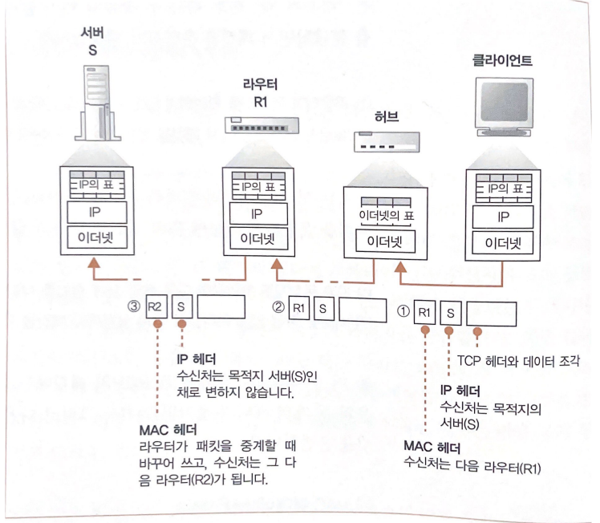
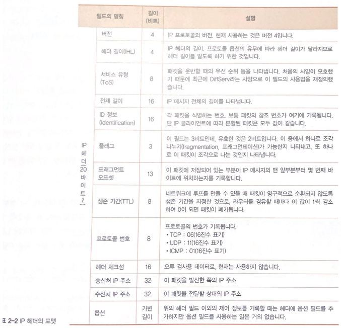
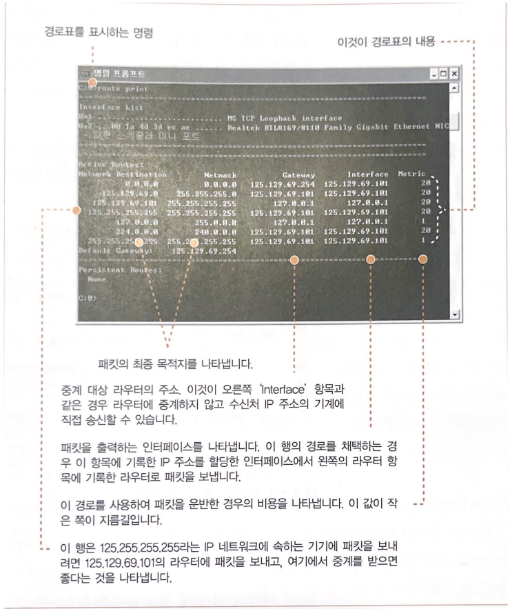
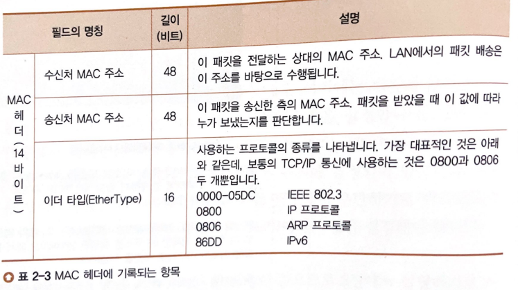
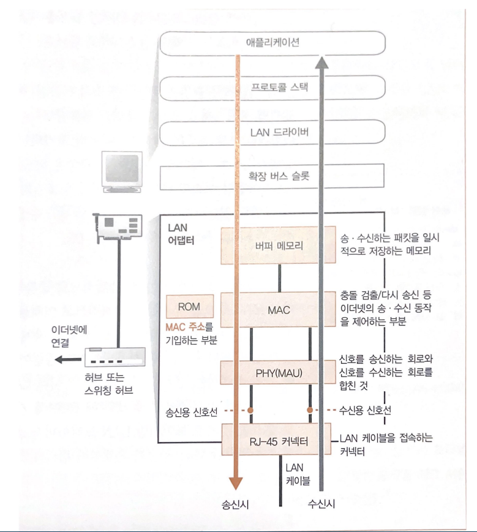
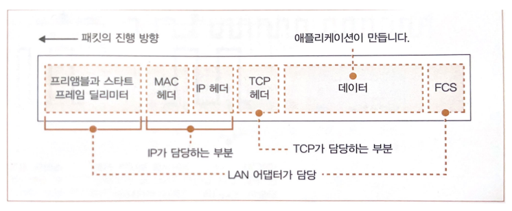

## 목차

## IP와 이더넷의 패킷 송,수신 동작

### 패킷의 기본
IP는 데이터를 패킷의 모습으로 만들어 상대에게 도착한다.

- 패킷
  - 헤더
    - 제어정보
  - 데이터
    - 내용물

### 패킷 중계 장치

- 라우터
  - IP가 목적지를 확인하여 다음 IP의 중계 장치를 나타냄
  - IP 헤더 사용
    - IP주소로 표시된 목적지까지 패킷을 전달할 때 사용하는 제어 정보
- 허브
  - 서브넷 안에 있는 이더넷이 중계 장치까지 패킷을 운반
  - MAC 헤더 사용
    - 이더넷 등의 LAN을 사용하여 가장 가까운 라우터까지 패킷을 운반할 때 사용하는 제어정보

**< 패킷이 목적지까지 가는 순서 >** 

1. 패킷(IP헤더, TCP헤더, 데이터조각)이 목적지(IP) 방향에 있는 다음 라우터를 조사 
2. 이더넷을 통해 알아낸 MAC주소를 패킷의 MAC헤더에 기록
3. 이더넷의 원리에 의해 허브에 도착
4. 허브에 있는 이더넷용 표(?)에 이더넷 헤더의 수신처 정보와 표를 결합해 패킷의 목적지를 판단해 중계
   - 허브가 복수라면 순차적으로 경유해 패킷 진행
5. 라우터로 도착하면 라우터에 있는 IP용 표(?)에 IP헤더의 수신처 정보와 표를 결합해 다음 라우터를 판단
   - 다음 라우터의 MAC주소를 조사해여 MAC헤더에 기록
6. 목적지에 도착할 때까지 아래 과정을 반복

### 수신처 IP주소를 기록한 IP헤더를 만든다.

**< IP 헤더 포멧 >**

- 수신처 IP 주소
  - TCP의 접속 동작을 실행할 때 애플리케이션에서 통지된 IP주소를 그대로 수신처 IP주소로 설정한다.
  - 수신처 IP주소는 IP에서 판단하는 것이라니라 어플리케이션에서 판단한다.
- 송신처 IP 주소  
  - LAN 어댑터가 여러개일 수 있는데 라우터가 결정되면 어느 LAN 어댑터에서 송신할지 판단해여 그 LAN 어댑터의 IP주소로 한다.
- 프로토콜 번호
  - 어디에서 의뢰받은 것인지를 나타내는 값
  - ex) TCP(06), UDP(17)

**< IP용 경로표 >**

> IP용 경로표를 활용하여 다음 라우터를 결정한다. 
> cmd창에 route print로 조회할 수 있다.

- Network Destionation : NewWork Destionation에 있는 항목중에 소켓에 있는 수신처 IP주소와 비교하여 같은 것을 찾아낸다.
- Netmask : IP주소의 네트워크 번호와 호스트 번호의 경계를 결정하는 값
- Gateway : 다음 라우터의 IP주소
- Interface : LAN 어댑터 등의 네트워크용 인터페이스. 해당 LAN 어댑터로 패킷을 보낸다.
- Metric : 이 경로를 사용하여 운반하면 드는 비용

### 이더넷용 MAC 헤더를 만든다.

**< MAC 헤더 포멧 >** 

- 수신처 MAC 주소
  - 패킷을 건네주는 상대의 MAC주소
  - 허나 MAC헤더를 작성하는 시점에서 주소를 모르기 때문에 위 경로표에 `Gateway` 항목에 기록되어있는 IP주소의 MAC주소가 됨(ARP 사용)
- 송신처 MAC 주소
  - LAN 어댑터의 MAC주소(LAN어댑터 ROM에 기록되어있음)
- 이더 타입
  - 사용하는 프로토콜의 종류

**< ARP >** 

주소 결정 프로토콜 : 해당 IP를 그 IP주소에 맞는 물리적인 주소 즉 MAC 주소를 가지고 오는 프로토콜  
LAN환경에서 목적지 호스트(컴퓨터)의 MAC주소(하드웨어주소, 물리주소, 이더넷주소)를 자동으로 얻는 방식 = 링크 계층 주소를 얻음 

**< 동작원리 >** 

1. 송신자는 목적지 물리주소가 필요하므로, 물리주소 요청을 위한 APR요청 패킷을 브로드캐스트 전송
   - 브로드캐스트를 하는 이유는 목적지의 물리 주소를 모르므로 모두에게 요청
   - 요청 패킷에는 수신자가 수신자 주소를 응답할 때 필요한 송신자 주소 포함
2. 모든 호스트와 라우터는 송신자가 보낸 ARP 요청 패킷을 수신
3. 해당되는 수신자만 자신의 논리주소와 물리주소를 넣어 응답 패킷으로 유니 캐스트로 전송

[동작과정 내용 링크](https://velog.io/@sunil1369/TCPIP-%EA%B8%B0%EC%B4%88%EC%99%80-JAVAC%EC%9D%84-%ED%99%9C%EC%9A%A9%ED%95%9C-%EB%84%A4%ED%8A%B8%EC%9B%8C%ED%81%AC-%ED%94%84%EB%A1%9C%EA%B7%B8%EB%9E%98%EB%B0%8D-1%EC%9E%A5)

- ARP 캐시 : ARP 동작으로 알아낸 결과를 저장해놓은 공간
  - 캐시 메모리에서 패킷을 재사용하므로 패킷을 줄일 수 있다.
  - 생존시간 : 몇분

### 이더넷의 기본

**이더넷**은 다수의 컴퓨터가 **여러 상대와 자유롭게 적은 비용**으로 통신하기 위해 고안된 **통신 기술** 

- 스위칭 허브를 이용한 이더넷
  - 스위칭 허브는 수신처 MAC 주소에 따라 목적지를 확인하고 패킷을 중계하므로 신호는 원하는 상대에게만 흐른다.

**< 이더넷 패킷의 송,수신 동작 >**

IP가 만든 패킷은 메모리에 기억된 디지털 데이터이므로 
-> 전기나 빛의 신호로 변환해서 네트워크의 케이블에 송출해야한다.

위 변환 방법에는 두가지 방법이 있는데 리피터 허브를 사용한 `반이중 모드`와 스위칭 허브를 사용한 `전이중 모드`이다. 

**< 반이중 모드 >** 
1. 다른 기기 신호가 흐르는지 조사하고 흐르고 있다면 대기
2. 흐르지 않는다면 동작
3. MAC회로가 프리앰블의 맨 앞부터 1비트씩 데이터 신호를 전기 신호로 변환
4. 이것을 `PHY` 또는 `MAU`라는 송,수신 신호 부분으로 전달
5. PHY회로는 받은 전기 신호를 케이블에 송출되는 형식으로 변환
6. 그리고 송신 신호선으로 보낸다.
7. 여기서 송신 신호선을 하는 동안에서는 수신 신호선에는 신호가 흘러들어오면 안되는데 만약 동시에 송,수신 동작이 일어나면 보낸 신호가 수신 신호선으로 돌아온다. 이를 `충돌`이라고 한다.
10. 충돌이 일어나면 송신을 중단했다가 좀 기다리고 다시 시작!

**< 전이중 모드 >** 
3장에서 할 예정 
충돌x 

**< LAN 어댑터 초기화 >** 

LAN드라이버가 하드웨어를 초기화한다.
- 하드웨어 이상 검사
- 초기 설정
- MAC회로에 MAC주소 설정
  - LAN 어댑터의 ROM에 기록되어있음
  - 전세계에서 유일한 MAC주소

**< LAN 어댑터 패킷 >** 

MAC 회로는 패킷에 앞쪽에 `프리앰블`과 `스타트 프레임 딜리미터` 데이터와 맨 끝에 `프레임 체크 시퀀스(FCS)`라는 오류 검출용 데이터를 부가합니다. 

- 프리엠블 : 비트로 구성하였으며 클록과 합처져 전기 신호를 형성
- 스타트 프레임 딜리미터 : 프레임의 개시 위치
- 프레임 체크 시퀀스(FCS) : 패킷 운반중 잡음 등의 영향으로 데이터가 변한 경우 검출하기 위한 데이터

### 돌아온 패킷을 받는다.

**< 반이중 모드 >** 

1. 수신 신호선을 통해 PHY로 신호다 들어옴
2. PHY(케이블에 맞는 전기 신호) -> MAC회로(공통 전기 신호)
3. MAC회로(공통 전기 신호) -> 버퍼 메모리(디지털 데이터)
4. FCS 검사
5. 인터럽트 구조의 의해 순서를 기다리다가 차례가 오면 LAN 드라이버가 호출되고 프로토콜 스택에 패킷을 건네줌
6. IP 담당부분이 IP헤더 부분을 검사해서 수신처 IP주소와 자신의 주소가 다르면 통신 상대에게 `ICMP`라는 오류 통지
7. IP 프로토콜에는 `조각 나누기`가 있어서 IP 담당부분 내부 메모리에 일시적으로 저장해둠
8. 조각이 다 도착하면 리어셈블링(원래 모습으로 되돌리는 동작)을 함
9. IP담당 부분 -> TCP담당 부분
