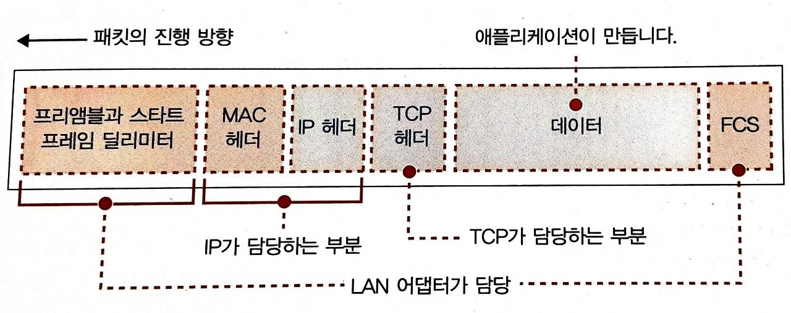

# LAN 어댑터

- [LAN 어댑터](#lan-어댑터)
  - [들어가며](#들어가며)
  - [패킷의 이동 시나리오](#패킷의-이동-시나리오)
  - [참고 문헌](#참고-문헌)

## 들어가며

TCP의 메시지 송·수신 동작의 다음 동작을 다뤄보겠다.

다음 동작을 수행하는 주체들의 역할을 알아보자.

네트워크 계층은 

    TCP에서 받은 패킷에 IP 헤더를 부가한다.

    이더넷을 통해 MAC 주소를 조사하여 MAC 헤더를 부가하고, 
    
    LAN 드라이버에 건네준다.

LAN 드라이버는 

    IP에서 송신 패킷을 받고,

    이것을 LAN 어댑터에 건네주어 송신하도록 지시한다.

LAN 어댑터는

    이더넷이 송신 가능한 상태가 되는 것을 보아서

    송신 패킷을 전기 신호로 변환한 후 케이블에 내보낸다.

이더넷은

    장치의 고유 주소를 가지고 장치 간 데이터를 주고 받을 수 있는 방식이다.

    장치 전원에게 ARP 패킷을 전달함으로써 장치 간 패킷의 목적지를 판단할 수 있다.

    ARP 캐시로 ARP 패킷의 수를 줄일 수 있다.

ARP는 

    IP 주소를 MAC 주소와 매칭 시키기 위한 프로토콜이다.

각 주체들은 이전 주체들의 동작을 신경쓰지 않는다.

이를 통해 주체들의 하드웨어가 **바뀌어도** 유연성을 유지할 수 있고, 이는 거대한 네트워크를 구축하는데 도움을 준다.

## 패킷의 이동 시나리오

송신처의 PC에서 수신처의 PC까지 거치는 라우터와 허브를 `패킷 중계 장치`라고 한다.

라우터의 역할은

    다음 중계 장치를 선정한다.

허브의 역할은

    이더넷을 통해 패킷을 운반한다.

패킷의 이동 시나리오를 [슬라이드](https://slides.com/yongki150/week12/fullscreen)를 통해 알아보자.

```
1. 송신처는 목적지인 수신처 IP 주소를 애플리케이션으로 부터 통지받고,
2. 송신처의 네트워크 계층은 IP 헤더에 수신처 IP 주소를 기록한다.
3. 송신처의 네트워크 계층은 송신처 IP 주소를 송신처의 LAN 어댑터를 판단하여 설정한다.
4. 목적지가 설정됬으니 운반을 맡기기위해서 이더넷의 송·수신처 구조로 바꿔줘야한다.
5. 송신처의 네트워크 계층은 수신처 방향의 라우터(R1)를 ARP로 조사해 알아온 뒤, 송신처의 LAN 어댑터의 ARP 표에 R1의 MAC 주소를 기록해둔다.
6. 송신처의 네트워크 계층은 R1의 MAC 주소를 MAC 헤더의 수신처 MAC 주소로 기록한다.
7. 송신처의 네트워크 계층은 송신처 MAC 주소를 송신처의 LAN 어댑터를 판단하여 MAC 헤더에 설정한다.
8. 송신처의 LAN 드라이버는 패킷을 받아 LAN 어댑터의 버퍼 메모리에 복사한다.
9. 송신처의 LAN 드라이버는 LAN 어댑터의 MAC 회로에게 패킷 송신을 지시한다.
10. 송신처의 MAC 회로는 버퍼 메모리로 부터 패킷을 추출하여 패킷에 데이터를 더한다.
```




    프리앰블:                       송신하는 패킷을 읽을 때 타이밍을 잡는다.
    SFD(Start frame delimiter):     프리앰블 이후 패킷의 개시를 파악한다.
    FCS(Frame check sequence):      잡음으로 인한 오류 검출한다.

```
11.  완성된 패킷은 전기 신호로 변환한 후 케이블에 송출된다.
12.  패킷을 송신하면 같은 서브넷의 허브에 도착한다.
13.  허브의 이더넷 표와 패킷의 MAC 헤더의 수신처 정보를 결합해서 패킷의 목적지를 판단하여 중계한다.
14.  패킷을 송신하여 R1에 도착한다.
15.  라우터의 IP 경로표와 패킷의 IP 헤더의 수신처 정보를 결합하여 패킷을 다음 라우터(R2)로 보낼지 판단하여 중계한다.
16.  R2에 할당된 이더넷의 주소를 조사하고, 그 주소를 MAC 헤더에 기입된 정보에 변경시킨다.
17.  이렇게 허브-라우터-허브를 경유해 목적지인 서버에 패킷이 도착한다.
```

수신 패킷을 받았을 때는 다음과 같다.

```
1. 허브-라우터-허브를 경유해 수신처의 케이블로 신호가 들어온다.
2. 수신처의 파형 계산기는 신호의 프리엠블 & SFD로 패킷으로 변환할 부분을 찾는다.
3. 수신처의 MAC 회로는 패킷으로 변환하여 버퍼 메모리에 저장한다.
4. 수신처의 MAC 회로는 FCS를 검사하여 오류 검출한다.
5. 수신처의 MAC 회로는 자신의 MAC 주소와 패킷의 수신처 MAC 주소를 확인하여 자신에게 오는 패킷인지 판단한다.
6. 수신처의 MAC 회로는 패킷 수신을 인터럽트를 통해 수신처 CPU에게 알려준다.
7. 수신처 CPU는 OS의 인터럽트 처리용 프로그램을 통해 수신처 LAN 드라이버를 호출하고 패킷을 프로토콜 스택에게 전달한다.
8. 수신처의 네트워크 계층은 IP 헤더의 수신처 IP 주소로 자신에게 오는 패킷인지 판단하고, 회신되는 패킷이면 수신처의 MAC 회로에서 MAC 주소를 판단한 여부로 skip 가능하다.
9. 수신처의 네트워크 계층은 송신처의 데이터가 분할된 패킷으로 왔다면 원래의 모습으로 맞춘다. 원래의 모습이 맞춰질 때까지 기다린다.
10. 수신처의 전송 계층은 IP 헤더와 TCP 헤더의 송·수신 정보를 통해 소켓을 찾는다.
11. 수신처의 소켓의 상태를 확인하여 상태에 맞는 다음 동작을 실행한다.
```

## 참고 문헌

[이더넷의 정의](https://handreamnet.tistory.com/496) ━ *한드림넷 블로그*

[MAC 주소 저장 위치](https://aws-hyoh.tistory.com/entry/ARP-쉽게-이해하기) ━ *환영의 블로그*