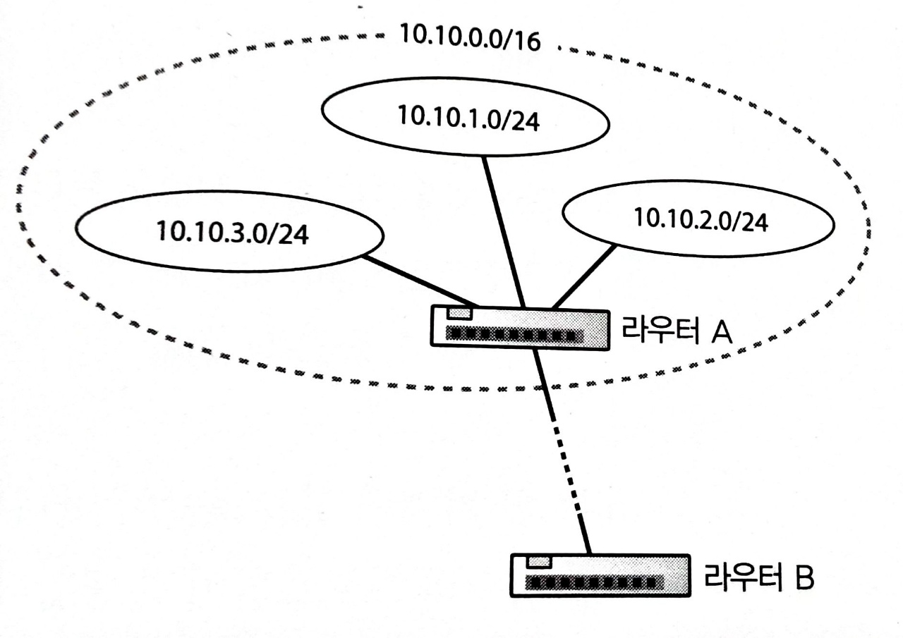

# LAN 기기

- [LAN 기기](#lan-기기)
  - [들어가며](#들어가며)
    - [중계 장치](#중계-장치)
  - [스위칭 허브](#스위칭-허브)
    - [스위칭 허브의 중계 동작](#스위칭-허브의-중계-동작)
  - [라우터](#라우터)
    - [라우터의 역할](#라우터의-역할)
    - [라우터의 중계 동작](#라우터의-중계-동작)
  - [스위칭 허브 vs 라우터](#스위칭-허브-vs-라우터)

## 들어가며

중계의 원리란

    중계 대상을 등록한 표를 보고 패킷을 어디로 중계해야 할지 판단하는 것이다.

이더넷의 규칙이란

    기기의 `포트 부분`의 포트가 수신한 패킷의 MAC 주소에 해당하는 패킷만 수신하고, 
    그 외의 패킷은 폐기한다.

이더넷 vs LAN

    LAN을 구축하는 방법 중 하나가 이더넷이다.

이더넷의 반이중 모드

    케이블에 신호가 흐르지 않는 것을 확인한 후 신호를 송출하며,

    충돌할 경우에는 잠시 기다린 다음에 다시 보낸다.

이더넷의 전이중 모드

    케이블에 신호를 확인하지 않고 그대로 신호를 송신한다.

### 중계 장치

지난 12주차에서 중계 장치를 잠깐 다뤄보았다.

이번 주차에서 이들의 핵심만 정의해보았다.

스위칭 허브의 역할은

    연결 대상들을 기억하면서 패킷을 운반한다.

라우터의 역할은

    다음 중계 대상을 선정한다.

## 스위칭 허브

### 스위칭 허브의 중계 동작

1. 중계 대상을 조사한다.
  스위칭 허브의 `중계 부분`에서 `포트 부분`으로 부터 받은 패킷의 `수신처 MAC 주소`와 

    `중계 대상을 등록한 표`를 대조하여 중계 대상을 판단한다. 

    `중계 대상을 등록한 표`의 `수신처`가 완전히 일치하는지 조사한다.

2. 패킷을 그대로 전송한다. 
  스위칭 허브로 들어온 패킷을 그대로 전송하며, 자신이 송·수신처가 되지 않는다.

## 라우터

### 라우터의 역할

`중계 부분`과 `포트 부분`으로 구성된다.

`중계 부분`은 `중계 대상을 등록한 표`를 말하며,

`포트 부분`은 챕터2에서 다룬 LAN 어댑터와 역할이 유사하다.

라우터의 `포트 부분`의 각 포트에는 MAC 주소와 IP 주소가 할당되어 있다.

하드웨어의 통신 규칙이 이더넷이라면, 라우터의 포트는 이더넷의 송·수신처가 된다.
하드웨어의 통신 규칙이 IP라면, 라우터의 포트에는 ??? 의 송·수신처가 된다.

### 라우터의 중계 동작

1. 패킷을 수신한다.
  라우터의 `포트 부분`의 하드웨어에 통신 규칙에 따라 패킷을 수신한다.

    이때, 통신 규칙은 이더넷을 따른다.

2. 중계 대상을 조사한다.
  라우터의 `중계 부분`에서 `포트`로 부터 받은 패킷의 `수신처 IP 주소`와 

    `중계 대상을 등록한 표`를 대조하여 중계 대상을 판단한다.

    |   수신처   |    넷마스크     | 게이트웨이 | 인터페이스(포트) | 메트릭 |
    | :--------: | :-------------: | :--------: | :--------------: | :----: |
    | 10.10.1.0  |  255.255.255.0  |     -      |        e2        |   1    |
    | 10.10.1.10 | 255.255.255.255 |     -      |        e2        |   1    |

    `중계 대상을 등록한 표`의 `수신처`의 `네트워크 번호`만 일치하는지 조사한다. 
    
    정확한 주소가 아닌 서브넷만 확인한다.

    주소 집약을 따르는 것인데,    
    <table>
      <tr>
        <td width="50%">
          
        </td>
        <td>
          복수의 주소를 서브넷으로, 복수의 서브넷을 하나의 서브넷으로 간주한다.
        </td>
      </tr>
    </table>

    위 표와 같이 중계 대상의 후보가 여러명이라면, 
      1. `네트워크 번호`가 가장 긴 것
      2. `메트릭`이 짧은 것
   
    선별해서 1개의 후보를 중계 대상으로 삼는다.

    중계 대상의 후보가 없다면,

      라우터는 패킷을 폐기하고, 패킷 오류 통지 프로토콜 (ICMP)로 송신처에 통지한다.

3. 중계 대상의 `포트`로 패킷을 옮긴다.
   `중계 대상을 등록한 표`의 `게이트웨이`와 `포트`이 중계 대상을 나타낸다.

    `게이트웨이` 필드가 비어져있다면, 패킷의 IP 헤더의 수신처 IP 주소가 중계 대상이 된다.

    동시에, 패킷의 IP 헤더의 TTL[^TTL] 필드를 갱신한다.

    [^TTL]: 패킷의 생존 기간을 나타내며, 라우터 간에 패킷이 순환되는 현상을 막는다.

4. 패킷을 송신한다.  
  라우터의 `포트 부분`의 하드웨어에 통신 규칙에 따라 패킷을 송신한다.

    이때, 통신 규칙은 이더넷을 따른다.    

    이더넷을 따르되 배선 방식, 지원 속도에 따라 다른 케이블을 사용한다면

    송신시 패킷을 분할해야하는 경우가 생긴다.

        이를 IP 패킷 분할이라고 말한다.

    챕터2의 TCP 데이터 분할과는 다른 매커니즘이다.

        ...

## 스위칭 허브 vs 라우터

- 스위칭 허브는 중계 동작 중에 `중계 대상을 등록한 표`를 등록하거나 갱신한다.
  라우터는 라우팅 프로토콜을 통해 `중계 대상을 등록한 표`를 등록하거나 갱신한다.