# LAN 기기

중계의 원리란

    중계 대상을 등록한 표를 보고 패킷을 어디로 중계해야 할지 판단하는 것이다.

이더넷의 규칙이란

    기기의 `포트 부분`이 수신한 패킷의 MAC 주소에 해당하는 패킷만 수신하고, 그 외의 패킷은 폐기한다.

## 스위칭 허브

- 예외동작 그림자료
  
- 전이중 vs 반이중 모드

### 스위칭 허브의 중계 동작

1. 중계 대상을 조사한다.
  스위칭 허브의 `중계 부분`에서 `포트 부분`으로 부터 받은 패킷의 

    `수신처 MAC 주소`와 `중계 대상을 등록한 표`를 대조하여 중계 대상을 판단한다. 

    `중계 대상을 등록한 표`의 `수신처`가 완전히 일치하는지 조사한다.

2. 패킷을 그대로 전송한다.
  스위칭 허브로 들어온 패킷을 그대로 전송하며, 자신이 송·수신처가 되지 않는다.

## 라우터

### 라우터의 역할

라우터의 포트에는 MAC 주소와 IP 주소가 할당되어 있다.

하드웨어의 통신 규칙이 이더넷이라면, 라우터의 포트는 이더넷의 송·수신처가 된다.
하드웨어의 통신 규칙이 IP라면, 라우터의 포트에는 ??? 의 송·수신처가 된다.

### 라우터의 중계 동작

1. 패킷을 수신한다.
  라우터의 `포트 부분`의 하드웨어에 통신 규칙에 따라 패킷을 수신한다.
  이때, 통신 규칙은 이더넷을 따른다.

2. 중계 대상을 조사한다.
  라우터의 `중계 부분`에서 `포트`로 부터 받은 패킷의 
    `수신처 IP 주소`와 `중계 대상을 등록한 표`를 대조하여 중계 대상을 판단한다.

    |  수신처   |   넷마스크    | 게이트웨이 | 인터페이스(포트) | 메트릭 |
    | :-------: | :-----------: | :--------: | :--------------: | :----: |
    | 10.10.1.0 | 255.255.255.0 |     -      |        e2        |   1    |

    `중계 대상을 등록한 표`의 `수신처`의 `네트워크 번호`만 일치하는지 조사한다. 
    즉, 정확한 주소가 아닌 서브넷만 확인한다.

    주소 집약을 따르는 것인데,

          복수의 주소를 서브넷으로, 복수의 서브넷을 하나의 서브넷으로 간주한다.
      
    

3. `중계 대상`의 `포트`로 패킷을 옮긴다.
   `중계 대상을 등록한 표`의 `게이트웨이`와 `포트`이 중계 대상을 나타낸다.

4. 패킷을 송신한다.  
  이때, 통신 규칙은 이더넷을 따른다.

## 스위칭 허브 vs 라우터

- 스위칭 허브는 중계 동작 중에 `중계 대상을 등록한 표`를 등록하거나 갱신한다.
  라우터는 라우팅 프로토콜을 통해 `중계 대상을 등록한 표`를 등록하거나 갱신한다.