# LAN 기기

- [LAN 기기](#lan-기기)
  - [들어가며](#들어가며)
  - [중계 장치](#중계-장치)
  - [스위칭 허브](#스위칭-허브)
    - [스위칭 허브의 중계 동작](#스위칭-허브의-중계-동작)
  - [라우터](#라우터)
    - [라우터의 중계 동작](#라우터의-중계-동작)
    - [TCP 데이터 분할 vs IP 패킷 분할](#tcp-데이터-분할-vs-ip-패킷-분할)
  - [중계 장치 간 차이점](#중계-장치-간-차이점)
    - [스위칭 허브 vs 라우터](#스위칭-허브-vs-라우터)
  - [참고 문헌](#참고-문헌)

## 들어가며

중계의 원리란

    중계 대상을 등록한 표를 보고 패킷을 어디로 중계해야 할지 판단하는 것이다.

이더넷의 규칙이란

    1. 기기의 포트 부분의 포트가 
        
        수신한 패킷의 수신처 MAC 주소가 기기의 MAC 주소가 동일한 경우에만 패킷을 수신하고, 그 외의 패킷은 폐기한다.

    2. 아무도 송신중이지 않다는 것을 확인한다.
    3. 라우터 간의 패킷 운반을 담당한다.

이더넷 vs LAN

    LAN을 구축하는 방법 중 하나가 이더넷이다.

이더넷의 반이중 모드

    케이블에 신호가 흐르지 않는 것을 확인한 후 신호를 송출하며,

    충돌할 경우에는 재밍 신호를 보내 송신 동작을 중지하고, 
    
    잠시 기다린 다음에 다시 보낸다.

이더넷의 전이중 모드

    케이블에 신호를 확인하지 않고 그대로 신호를 송신한다.

## 중계 장치

스위칭 허브의 역할은

    이더넷을 다루며
    
    연결 대상들을 기억하면서 패킷을 다음 라우터로 운반한다.

라우터의 역할은

    IP를 다루며

    다음 중계 대상을 선정하면서 패킷의 최종 목적지를 가리킨다.

구조를 보면, 스위칭 허브와 라우터는 매우 유사하게 생겼다.

특히 중계 장치의 포트 부분의 역할은 PC의 LAN 어댑터의 역할과 유사하다.

패킷 송·수신 동작이 동일하다는 것인데,

패킷 수신 동작에서

    MAC 회로에서 신호를 디지털 데이터로 변환해서 받는다.
    
    FCS를 대조하여 오류를 검사하여 문제가 없다면 메모리 버퍼에 저장한다.

패킷 송신 동작에는

    이더넷이 송신 가능한 상태가 되는 것을 보아서 패킷을 전기 신호로 변환한 후 케이블에 내보낸다.

## 스위칭 허브

### 스위칭 허브의 중계 동작

1. 패킷을 수신한다.    

2. 중계 대상을 조사한다.
    스위칭 허브의 `중계 부분`에서 `중계 대상을 등록한 표`의 `수신처`와
    
    |     MAC 주소      | 포트  | 제어 정보 |
    | :---------------: | :---: | :-------: |
    | 00-60-97-A5-43-3C |   2   |     -     |

    스위칭 허브의 `포트 부분`의 `포트`로 부터 받은 패킷의 `수신처 MAC 주소`가 완전히 일치하는지 조사한다.

    패킷을 송·수신하는 2가지 행위마다 `중계 대상을 등록한 표`를 갱신한다.    

3. 패킷을 송신한다.    

## 라우터

### 라우터의 중계 동작

> 🤔 통신 규칙을 이더넷이라 말하는데, IP를 다룬다.

1. 패킷을 수신한다.
    라우터의 `포트 부분`의 하드웨어의 통신 규칙에 따라 패킷을 수신한다.

2. 중계 대상을 조사한다.
    라우터의 `중계 부분`에서 `중계 대상을 등록한 표`의 `수신처`의 `네트워크 번호`가
    
    |   수신처   |    넷마스크     | 게이트웨이 | 인터페이스(포트) | 메트릭 |
    | :--------: | :-------------: | :--------: | :--------------: | :----: |
    | 10.10.1.0  |  255.255.255.0  |     -      |        e2        |   1    |
    | 10.10.1.10 | 255.255.255.255 |     -      |        e2        |   1    |
    |  0.0.0.0   |     0.0.0.0     | 192.0.2.1  |        e1        |   1    |
    
    라우터의 `포트 부분`의 `포트`로 부터 받은 패킷의 `수신처 IP 주소`와 일치하는지 조사한다. 
    
    이때, 정확한 주소가 아닌 서브넷만 확인한다.

    주소 집약을 따르는 것인데,    
    <table>
      <tr>
        <td width="50%">
          
        </td>
        <td>
          복수의 주소를 서브넷으로, 복수의 서브넷을 하나의 서브넷으로 간주한다.
        </td>
      </tr>
    </table>

    위 표와 같이 중계 대상의 후보가 여러명이라면, 

       1. 네트워크 번호가 가장 긴 것
       2. 메트릭이 짧은 것
   
    선별해서 1개의 후보를 중계 대상으로 삼는다.

    중계 대상의 후보가 없다면,

       라우터는 패킷을 폐기하고, 패킷 오류 통지 프로토콜 (ICMP)로 송신처에 통지한다.

3. 중계 대상의 `포트`로 패킷을 옮긴다.
    `중계 대상을 등록한 표`의 `게이트웨이`와 `포트`가 중계 대상을 나타낸다.

    `게이트웨이` 필드가 비어져있다면
      
       패킷의 IP 헤더의 수신처 IP 주소가 중계 대상이 된다.

    또한, 패킷의 IP 헤더의 TTL[^TTL] 필드를 갱신한다.

    [^TTL]: 패킷의 생존 기간을 나타내며, 라우터 간에 패킷이 순환되는 현상을 막는다.

    또한, 패킷의 MAC 헤더의 
    
       수신처 MAC 주소에는 중계 대상 라우터의 MAC 주소를
       송신처 MAC 주소에는 현재 라우터 MAC 주소를 기입한다.

       이는 라우터를 거치면서 갱신된다.

4. 패킷을 송신한다.  
    라우터의 `포트 부분`의 하드웨어의 통신 규칙에 따라 패킷을 송신한다.       

    하드웨어의 통신 규칙이 이더넷 외의 LAN을 사용하거나

    이더넷을 따라도 배선 방식, 지원 속도에 따라 다른 케이블을 사용한다면

    송신 시 패킷을 분할해야하는 경우가 생긴다.

### TCP 데이터 분할 vs IP 패킷 분할

검색을 해보니 정확한 용어는 TCP Segmentation vs IP Fragmentation 이다.

TCP의 데이터 분할로 인해 나눠진 데이터의 조각들은 각자의 패킷에 저장된다.

IP 패킷 분할은 이 패킷 하나를 분할하는 것이다.

MTU[^MTU]의 MSS를 기준으로 분할한다.

    MTU----------------------------
                          MSS------
    +---------+----------+--------+
    | IP 헤더 | TCP 헤더 | 데이터 |
    +---------+----------+--------+

[^MTU]: 하나의 패킷이 운반할 수 있는 헤더를 포함한 데이터의 전체 길이

MTU는 라우터의 `포트 부분`의 포트의 종류에 의해 결정되는데, 

MTU에서 헤더를 제외한 MSS와 패킷의 길이를 비교하여 MSS 보다 패킷의 길이가 클 시 분할한다.

## 중계 장치 간 차이점

### 스위칭 허브 vs 라우터

|                            |       스위칭 허브        |                 라우터                 |
| :------------------------: | :----------------------: | :------------------------------------: |
| 중계 대상을 등록한 표 갱신 |      중계 동작 마다      |            라우팅 프로토콜             |
|   포트의 주소 할당 여부    | X[^swithing-hub-address] | MAC 주소 또는 IP 주소[^router-address] |

[^swithing-hub-address]: 자기에게 할당된 패킷을 걸러서 받는 것이 아니라 
  모든 패킷을 수신하기 때문에 자신에게 부여된 MAC 주소가 필요 없다.

[^router-address]: 하드웨어의 통신 규칙이 이더넷이라면, 라우터의 포트는 이더넷의 송·수신처가 된다.
  하드웨어의 통신 규칙이 IP라면, 라우터의 포트에는 IP의 송·수신처가 된다.

## 참고 문헌

[「성공과 실패를 결정하는 1%의 네트워크 원리」 챕터3 요약본 ](https://yjksw.github.io/one-percent-network-5/) ━ *FromCoding*

[Difference between IP fragmentation and TCP segmentation](https://forum.networklessons.com/t/difference-between-ip-fragmentation-and-tcp-segmentation/1815/2) ━ *NetworkLessons*