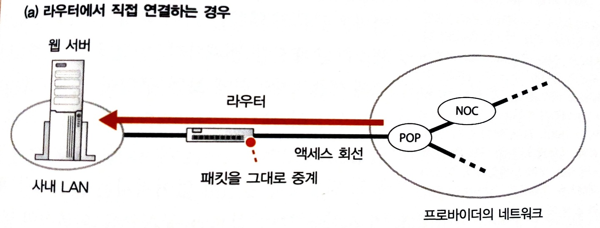
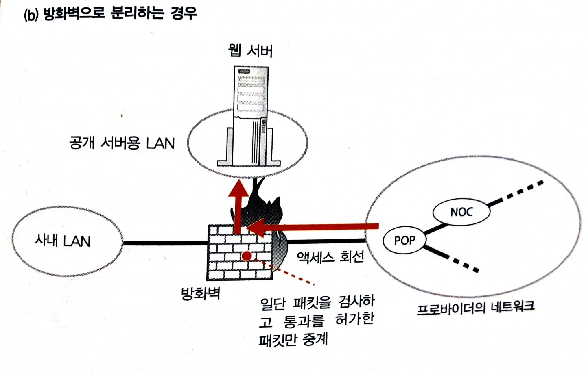

# 방화벽

- [방화벽](#방화벽)
  - [웹 서버의 설치 장소](#웹-서버의-설치-장소)
  - [방화벽의 원리와 동작](#방화벽의-원리와-동작)
  - [참고 문헌](#참고-문헌)

## 웹 서버의 설치 장소

- 사내에 웹 서버를 설치하는 경우

  <table>
    <tr>
      <th colspan="2">사내 LAN에 서버를 설치하고 인터넷에서 직접 엑세스 하는 경우</th>
    </tr>
    <tr>
      <td width="50%">
        
      </td>
      <td>
  

  인터넷에서 들어오는 패킷이 라우터를 통해 그대로 웹 서버에 접근하는데,

  웹 서버의 애플리케이션에 보안 구멍이 있다면 위험하다.
  

      </td>
    </tr>
    <tr>
      <th colspan="2">방화벽을 두는 경우</th>
    </tr>
    <tr>
      <td width="50%">
        
      </td>
      <td>
  

  웹 서버의 애플리케이션에 엑세스 하는 패킷만 통과시키고 나머지는 차단하도록 한다.
  

      </td>
    </tr>
  </table>

- 데이터센터에 웹 서버를 설치하는 경우
  인터넷에서 들어오는 패킷이 데이터센터를 거치고 서버에 도착한다.

  물리적, 운영 관리적으로 안정성이 높다.

## 방화벽의 원리와 동작

방화벽은

    특정 서버와 해당 서버 안의 특정 애플리케이션에 엑세스 하는 패킷만 통과하고 나머지는 차단한다.

    패킷 필터링형 방화벽으로 주로 사용한다.

패킷 필터링형 방화벽은

    패킷의 헤더에 들어있는 제어 정보를 통해 패킷 필터링 조건을 설정한다.

    가령 수신처 IP 주소가 웹 서버의 IP 주소와 일치하는 경우만 패킷을 통과한다.

포트 번호를 조건에 추가하여 보안을 향상시킬 수 있다.

## 참고 문헌

[「성공과 실패를 결정하는 1%의 네트워크 원리」 챕터5 요약본 ](https://yjksw.github.io/one-percent-network-7/) ━ *FromCoding*