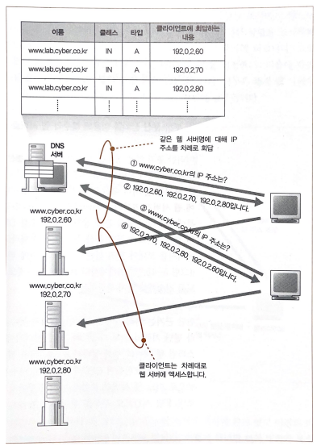
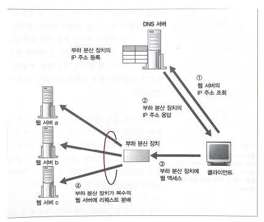
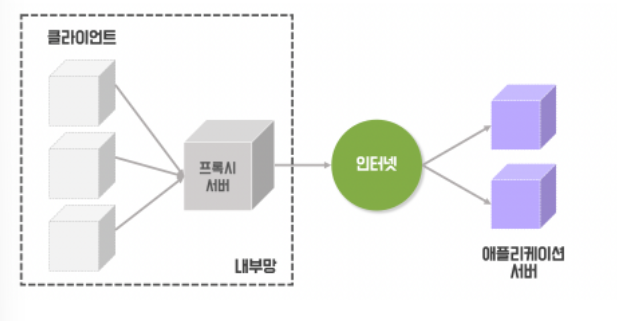
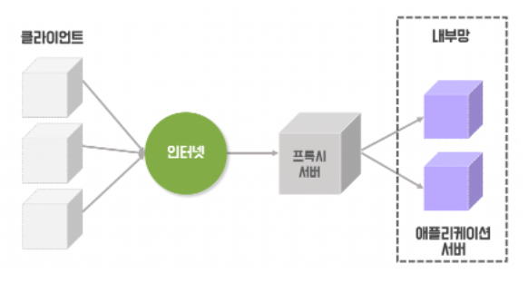
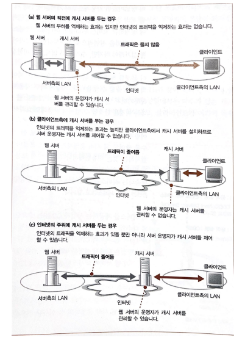

# 목차
- 부하분산
  - 복수서버로 부하 분산
    - 라운드로빈을 이용한 분산처리 방법
    - 부하 분산 장치를 이용한 분산처리 방법
  - 캐시 서버로 부하 분산
    - 캐시 서버의 동작
      - 데이터가 없는 경우
      - 데이터가 있는 경우
  - 포워드 프록시
    - 포워드 프록시 동작 과정
  - 리버스 프록시
  - 포워드 프록시 vs 리버스 프록시
  - 트랜스패어런트 프록시
- 컨텐츠 배포 서비스
  - CDN을 이용한 부하 분산
  - CDN
- 참고 문헌

# 부하분산

> **부하 분산이란?** 
> 부하분산 또는 로드 밸런싱은 컴퓨터 네트워크 기술의 일종으로 둘 혹은 셋이상의 중앙처리장치 혹은 저장장치와 같은 **컴퓨터 자원들에게 작업을 나누는 것**을 의미한다. 
> 이로써 **가용성**과 **응답시간**을 최적화 시킬 수 있다.

## 복수서버로 부하 분산

서버로 대량의 패킷이 들어오면 고속화된 회선을 사용하여 해결한다고 배웠다.

하지만 고속화된 회선으로 패킷이 빨리 들어와도 서버의 처리능력이 못따라갈 수 있다.

이런 경우에 복수의 서버를 두어 작업을 나누는 것을 **분산 처리**라고 한다.

### 라운드 로빈을 이용한 분산처리 방법
1. DNS서버에 IP주소를 같은 이름으로 여러개 등록한다.
2. 서버의 조회가 있을 때마다 라운드 로빈 순서대로 IP주소를 사용한다.

> 라운드 로빈을 이용한 분산처리 방식은 문제가 있다.
> - 웹서버가 많으면 그 중 고장나는 것도 있는데 서버가 고장나도 DNS 서버는 그대로 응답한다.
> - 한 사용자가 여러개의 요청을 보낼 때 라운드 로빈으로 처리하면 다른 서버에서 응답할 수 있어 오류가 발생할 수 있다.

### 부하 분산 장치를 이용한 분산처리 방법
1. DNS 서버에 웹 서버와 대응하는 부하 분산 장치의 IP주소를 등록한다.
2. 클라이언트는 부하 분산 장치를 서버로 인식하고 리퀘스트를 보낸다.
3. 부하 분산 장치에서 복수의 웹서버에 부하가 걸리지 않도록 서버를 선택하여 전송한다.

> **부하 분산 장치가 웹서버를 선정하는 기준** 
> CPU나 메모리의 사용률, 응답 시간 
> 조사 패킷을 통해 정보를 받아오는데 너무 많이 보내면 조사 동작에서 부하가 걸릴 수도 있음 

> **한 클라이언트에서 복수의 패킷을 보내는 경우**
> - 이전 요청과 같은 서버로 요청을 보낸다.
>   - HTTP는 statelss하기 때문에 이전 리퀘스트와 현 리퀘스트의 전후 관계를 알지 못한다.
>   - 전후 관계를 판단하기 위해서는 웹 서버측에서 정보를 위치해야하는데 웹 서버에 부담이 큼
>   - 답은 데이터를 보낼 때 그 안에 전후 관계를 나타내는 정보를 부가 하거나, HTTP 헤더 필드에 정보를 추가해 전송한다.

## 캐시 서버로 부하 분산
캐시 서버는 **프록시**구조를 사용하여 데이터를 캐시에 저장하는 서버이다.

웹서버 <-> 캐시서버 <-> 클라이언트

캐시서버를 중개할 때 받은 데이터를 저장해 두고 같은 요청이 오면 웹서버를 거치지 않고 클라이언트로 바로 응답해준다.

하지만 웹서버의 데이터가 자주 변경 되는 부분은 캐시 서버를 사용할 수 없다.

그래도 변경이 없는 부분은 캐시서버를 사용하면 웹서버의 부하가 줄면서 웹서버의 처리시간을 단축할 수 있다.

### 캐시 서버의 동작
1. 이전에 배웠던 부하 분산 장치처럼 캐시서버도 DNS서버에 캐시서버를 웹서버 대신 등록한다. 즉, 캐시 서버가 웹서버 대신 정보를 받음
2. 수신 동작은 웹 서버의 수신과 동일하다.
   - 접속을 기다리는 패킷을 만들고, 사용자가 접속하면 패킷을 실행하여 리퀘스트 메시지를 받는다.
3. 캐시 서버가 리퀘스트 메시지를 받으면 캐시 서버가 메시지를 조사하고 데이터가 자신에게 저장되어 있는지를 조사한다.

- 여기서 데이터의 유무에 따라 다르게 동작한다.

#### 데이터가 없는 경우
4. `Via`라는 헤더 필드를 추가하여 웹서버에 리퀘스트 메시지를 보낸다.
   - 이때 웹서버가 여러개라면 리퀘스트 메시지의 URI를 보고 어느 웹서버로 갈지 판단한다.
   - 이때 캐시 서버가 클라이언트가 되어 메시지를 보낸다.(캐시서버가 소켓에 접속해 보낸다는 의미)
5. 웹서버는 캐시 서버로 응답을 보낸다.
6. 캐시 서버는 응답 메시지를 클라이언트에게 보낸다.
   - 캐시 서버를 경유했다는 Via 헤더를 부가해 전송한다.
7. 캐시 서버에도 리퀘스트 메시지를 저장한다.
   - 저장한 일시를 추가해서 저장

#### 데이터가 있는 경우
4. 캐시 서버에 데이터가 있는 경우 리퀘스트 메시지에 데이터의 변경 유무 확인을 위한 `If-Modified-Since`라는 헤더 필드를 추가해 웹 서버에 전송
5. 웹 서버에서 변경이 없다면 `304 Not Modified`라는 상태코드를 응답
   - 변경이 있다면 데이터가 있는 경우와 같이 동작

## 포워드 프록시

- 포워드 프록시란 클라이언트 측에 캐시 서버를 두는 것이다.

- 기존에 배운 서버측의 설치한 캐시 서버와 같지만 포워드 프록시는 방화벽을 실현한다는 목적이 있었다.

> 방화벽의 이용 목적 : 인터넷에서의 부정 침입을 막는것

- 또한 프록시는 리퀘스트 메시지를 조사하는 어플리케이션 게이트웨이형 방화벽이기 때문에 특정 사이트에 대한 엑세스를 금지할 수 있다.
- 프록시에서 리퀘스트 메시지를 받아 인터넷으로 전송하면 방화벽에 의해 걸러진 리퀘스트 메시지만 전송된다.
- 이때 프록시에서 캐시를 사용하면 사내 LAN에서 더 빨리 데이터를 얻을 수 있다.

- 포워드 프록시는 브라우저의 설정이 필요한데 이것이 장점이자 단점이다.
  - 장점 : 웹서버 주소를 분할해 작성할 필요가 없다.
  - 단점 : 잘못 작성시 장애가 발생할 수 있다. 번거롭다. 웹서버는 누가 엑세스 했는지 알수 없다. 

### 포워드 프록시 동작 과정
1. 브라우저 설정 항목에 있는 `프록시 서버` 항목에 포워드 프록시 IP주소를 적는다.
2. 리퀘스트 메시지의 URL과 상관없이 리퀘스트 메시지를 모두 포워드 프록시로 전송
3. 이때 리퀘스트 메시지가 변경됨
   - 원래는 URL에서 웹서버의 이름을 제외하고 URI에 데이터 경로를 작성했는데, 포워드 프록시를 설정하면 URL을 그대로 리퀘스트 URI에 작성함
4. 즉, 전송 대상이 URL이기 때문에 서버측 캐시 서버와 같이 정해진 서버로 전송하는 것이 아니라 모든 서버로 전송 가능하다.

## 리버스 프록시

리버스 프록시는 포워드 프록시와 반대 개념이다. 웹 서버의 앞에서 위치하여 클라이언트가 서버에 요청할 때 리버스 프록시를 호출하고, 리버스 프록시가 웹 서버로 응답을 전달받아 다시 클라이언트로 전송하는 역할을 한다.

클라이언트는 웹서버를 직접 호출하는 것이 아니라 리버스 프록시 서버를 통해 호출하기 때문에 리버스 프록시는 웹 서버를 감추는 역활을 한다.

따라서 요청 메시지에 전체 URL이 아닌 URI에 쓰여 있는 디렉토리명과 전송 대상의 웹서버를 대응시켜 전송할 수 있도록 했다. 
=> 이것이 서버측에 설치하는 캐시 서버에 채택하고 있는 방식으로, 리버스 프록시라고 한다.

## 포워드 프록시 vs 리버스 프록시
|  | 포워드 프록시 | 리버스 프록시 |
|------|-------|---|
| 캐시(프록시)서버 위치 | 클라이언트 측  | 웹 서버 측 |
| 숨겨주는 것 | 클라이언트의 IP | 웹서버 IP |
| 특징 | 캐싱, IP우회, 제한 | 로드밸런싱, 보안 |
| 사용되는 곳 | 기업 사내망 | NginX, Apache Web Server |

## 트랜스패어런트 프록시
- 캐시 서버에서 전송 대상을 판단하는 방법
  - 즉, IP헤더의 수신처 IP주소로 엑세스 대상 웹서버를 찾는 방법이다.

- 장점
  - 프워드 프록시처럼 브라우저에 설정할 필요가 없다.
  - 리버스 프록시처럼 전송 대상을 DNS서버에 등록할 필요도 없다.

트랜스패어런트 프록시는 브라우저에서 웹서버로 가는 길목에 설치해야한다. 그 길목이 많다면 길목 마다 다 설치하거나 길을 한길로 수렴해 그 길에 설치해야한다.

# 컨텐츠 배포 서비스

## CDN을 이용한 부하 분산

- 웹서버의 직전에 캐시 서버를 두면 웹서버의 부하는 억제하는 효과는 있지만 인터넷의 트래픽을 억제하는 효과는 없다.
- 반대로 클라이언트 측에 캐시 서버를 두면 트래픽은 억제할 수 있지만 서버 운영자가 캐시 서버를 제어할 수 없어 곤란하다.

- 해결책으로는 프로바이더와 계약하여 웹서버 개발자가 제어할 수 있는 클라이언트 가까이에 있는 캐시 서버를 사용하는 것이다.

하지만 이 방법에도 문제점들이 있다. 
- 인터넷을 공개하는 서버는 인터넷의 어디에서 엑세스하는지 모른다. 
=> 이를 해결하기 위해서는 프로바이더 전체에 캐시 서버를 설치해야한다. 
=> 하지만 모든 프로바이더의 캐시 서버를 설치하는 것은 어렵기 때문에 중요한 프로바이더만 캐시 서버를 설치해 위 문제를 해결한다. 
=> 근데 중요 프로바이더만이지만 서버 개발자가 그런것 까지하는 건 비용이나 노력에서 손해이다. 
=> 그래서 프로바이더와 개약하여 캐시 서버를 설치하고 서버 개발자에게 대출해주는 서비스가 등장한다. 이것이 바로 CDN이다. 

## CDN
CDN은 지리적으로 분산된 여러 개의 캐시 서버이다. 웹 서버를 사용자와 가까운 곳에서 전송함으로써 전송 속도를 높인다. 전 세계 데이터 센터는 파일 복사본을 임시로 저장하는 프로세스인 캐싱을 사용한다. 따라서 사용자는 가까운 서버를 통해 웹 활성화 디바이스 또는 브라우저에서 인터넷 컨텐츠에 빠르게 접속할 수 있다.

CDN은 `은행 ATM`처럼 생각하면 쉽다. 여러 곳에 ATM을 설치해 놓으면 사용자가 빠르고 효율적으로 현금을 찾을 수 있다. 은행에서 긴 줄을 서서 기다릴 필요 없이 가까운 곳에 있는 ATM을 사용하면 된다.

## 피드백

**용어 정리**
- 캐시서버
  - 캐시 서버은 인터넷 서비스 속도를 높이기 위해 사용자와 가까운 곳에 데이터를 임시 저장하여 빠르게 제공해주는 **프록시 서버**를 의미한다.
  - 예시로는 구글 글로벌 캐시, AWS의 클라우트 프론트, 넷플릭스
- 프록시
  - 서버와 클라이언트 사이에 중계기로서 대리로 통신을 수행하는 것을 가리켜 `프록시`
- 프록시 서버
  - 위 프록시의 중계 기능을 하는 것을 프록시 서버라고 한다.

정리하자면 캐시 서버는 인터넷 서비스 속도를 높이기 위해 사용자와 가까운 곳에 데이터를 저장하여 빠르게 제공해주는 프록시 서버의 한 종류이다.

CDN은 위 캐시서버를 여러 개 두고 관리하는 서비스와 같은 것이라고 정의할 수 있다.

# 참고문헌
[포워드 vs 리버스 프록시](https://sujinhope.github.io/2021/06/13/Network-%ED%94%84%EB%A1%9D%EC%8B%9C(Proxy)%EB%9E%80,-Forward-Proxy%EC%99%80-Reverse-Proxy.html)

[CDN 참고문헌](https://www.akamai.com/ko/our-thinking/cdn/what-is-a-cdn)