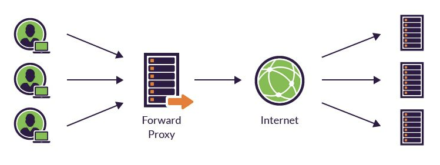
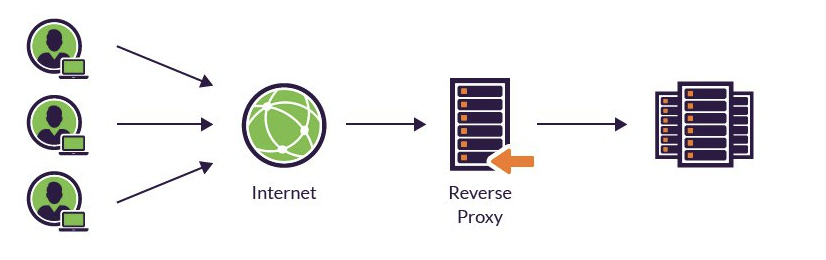

# 부하 분산

- [부하 분산](#부하-분산)
  - [복수 서버와 부하 분산](#복수-서버와-부하-분산)
    - [DNS 서버의 라운드 로빈 방식으로 응답](#dns-서버의-라운드-로빈-방식으로-응답)
    - [부하 분산 장치](#부하-분산-장치)
  - [캐시 서버와 부하 분산](#캐시-서버와-부하-분산)
  - [CDN (콘텐츠 분배 네트워크)](#cdn-콘텐츠-분배-네트워크)
  - [참고 문헌](#참고-문헌)

## 복수 서버와 부하 분산

대량의 패킷이 하나의 서버에 들어오면 처리능력이 부족할 수 있다.

복수의 서버로 처리량을 분산 처리하여 극복할 수 있다.

### DNS 서버의 라운드 로빈 방식으로 응답

1. DNS 서버에 복수의 서버 IP 주소를 같은 이름으로 여러개 등록한다.

2. 클라이언트에서 DNS 서버에 조회 할 때, 라운드 로빈 방식으로 복수의 서버 IP를 차례대로 응답해준다.

이 방식은 2가지 문제가 있다.

a. 특정 서버가 고장났을 때

      DNS 서버는 그대로 클라이언트에게 고장난 서버 IP를 알려주어 정상적인 응답을 받을 수 없다.

b. 하나의 로직이 복수의 요청으로 나눠졌을 때

      복수의 요청이 각자 다른 서버가 응답하면 로직이 이어지지 않을 수 있다.

      cf. Session 방식의 인증 행위  

### 부하 분산 장치

대표적으로 2가지 종류가 있다.

<table>
  <tr>
    <th></th>
    <th>L4 로드밸런서</th>
    <th>L7 로드밸런서</th>
  </tr>
  <tr>
    <td>정의</td>
    <td>
      IP, 포트를 기준으로 스케줄링 알고리즘을 통해 부하 분산한다.
    </td>
    <td>
      <b>IP, 포트 외에도</b> URI, HTTP Header, Cookie를 기준으로 부하 분산한다.
    </td>
  </tr>
  <tr>
    <td>사례</td>
    <td>
<p>
서버의 네트워크 부하 상태

    cf. A, B, C 서버가 존재할 때
        A의 부하 상태를 CPU 사용량으로 체크하여 높을시
        B에 부담

서버의 처리 능력

    cf. 서버 부하 분산 비율이 100% 이고,
        최대 처리 능력이 10일때

        처리 능력이 3인 A, B, C 서버에 각 30%를
        처리 능력이 1인 D 서버에 10%를 할당
</p>
    </td>
    <td>
<p>
서버의 역할

    cf. 결제 담당 서버, 회원가입 담당 서버
</p>
    </td>
  </tr>
  <tr>
    <td rowspan="2">장점</td>
    <td colspan="2">
      <center>무중단 서비스 보장</center>
    </td>
  </tr>
  <tr>
    <td width="30%">
      <center>-</center>
    </td>
    <td width="70%">  
<p>
하나의 로직이 복수의 요청으로 나눠진 경우

Cookie 이용시, 

요청 간 전후 관계 파악해서 같은 서버에 요청을 보낼 수 있다.
</p>
    </td>
  </tr>
  <tr>
    <td>단점</td>
    <td><center>-</center></td>
    <td>
<p>
상위 계층(L7)을 활용하는 장치는 하위 계층(L4)을 활용할 줄 알아야한다.

그럼 모든 장치가 L7을 사용한다면, 면밀한 분석 기능에 대한 비용이 크다.

적절한 상황에 맞게 사용해야한다.
</p>
    </td>
  </tr>
</table>
    
## 캐시 서버와 부하 분산

캐시 서버는 프록시 구조를 사용한다.

프록시는 중개의 의미를 나타낸다.

    중개: 제삼자로서 두 당사자 사이에 서서 일을 주선하다

> 이전 13주차에서 중계 장치의 중계는 "중간에서 이어준다"는 의미이다.

주제에서 다루는 네트워크 프록시는 웹서버와 클라이언트 사이에서 웹서버에 대한 요청을 중개한다.

네트워크 프록시는 2가지 역할을 한다.

1. 캐싱
  
    > 캐싱 동작 과정은 [링크](https://slides.com/yongki150/deck-e6fd5d/fullscreen)를 확인하자.

    > 캐시 서버가 꽉 차면, 자주 사용되지 않는 데이터를 삭제한다.
     삭제 대상 선별은 운영체제의 페이지 교체 알고리즘과 비슷할 것이라 판단한다.

2. 방화벽

    > 방화벽의 동작은 이전 14주차를 참고하자.
      
네트워크 프록시는 2가지 종류가 있다.

<table>
  <tr>
    <th colspan="2"></th>
    <th>포워드 프록시</th>
    <th>리버스 프록시</th>
  </tr>
  <tr>
    <td colspan="2">예시 사진</td>
    <td></td>
    <td></td>
  </tr>
  <tr>
    <td rowspan="4">특징</td>  
    <td>캐싱</td>
    <td colspan="2">컨텐츠들을 캐싱해서 성능 향상에 기여한다.</td>
  <tr>
  </tr>
  <tr>
    <td>익명성</td>
    <td>인터넷에서 클라이언트 주소가 감춰진다.</td>
    <td>인터넷에서 서버 주소가 감춰진다.</td>
  </tr>
  <tr>
    <td>보안</td>
    <td>사내망에서 프록시 서버를 통해 정해진 사이트만 연결 할 수 있도록 설정한다.</td>
    <td>서버 앞단에서 악의적인 요청을 필터링한다.</td>
  </tr>  
</table>

프록시 서버로 부터 익명성을 보장하려면 어떻게 해야할까?

TOR을 사용하면 된다.

TOR은 세 개의 프록시로 구성된 체인을 임의로 선택하여 클라이언트와 서버 사이의 모든 트래픽을 이 체인 상으로 전송한다.

프록시들은 서로 공모하지 않음이 보장된다면, 클라이언트와 서버 간의 통신은 아무도 알지 못한다.

## CDN (콘텐츠 분배 네트워크)

CDN은
    
    분산된 다수의 캐시 서버를 운영하며, 컨텐츠의 복사본을 이들에 저장한다.    

일반화로

    클라이언트는 본사가 아닌 체인점을 이용하는 것이다.

이점으로는

   - Origin 서버와 물리적으로 떨어져있는 클라이언트에게 
    
      클라이언트와 가까운 캐시 서버에서 빠른 응답을 제공한다.

   - Origin 서버에 문제가 생겨도 캐시 서버로 대체를 할 수 있다. 
      즉, 서비스를 무중단할 수 있다.

   - Origin 서버에 집중된 트래픽을 방지할 수 있다. 

클라이언트와 가까운 캐시 서버 선별 방법은 이렇다.

<center></center>

   1. 클라이언트가 서버 도메인에 방문하여, CDN 처리되는 경로에 들어간다.

   2. 클라이언트의 DNS 조회시, `클라이언트측과 가까운 DNS 서버`는 `서버측과 가까운 DNS 서버`로 요청을 전달한다.

   3. `서버측과 가까운 DNS 서버`는 IP 주소 대신 CDN 서버 도메인을 `클라이언트측과 가까운 DNS 서버`에 응답한다.

   4. `클라이언트측과 가까운 DNS 서버`는 CDN DNS 서버에 CDN 서버 도메인을 요청하여 

   5. CDN 서버의 IP를 응답받는다.

      해당 CDN 서버의 IP는 클라이언트측과 가까운 캐시 서버를 의미한다.

      사전에 `서버측과 가까운 DNS 서버`에서 다수의 캐시 서버가 거쳐오는 각 라우터의 경로표를 입수해온다.

      라우터의 경로표들로 어떤 라우터가 `클라이언트측가 가까운 DNS 서버`와 가까운지 대략적인 거리를 알 수 있다고 한다.

      ```bash
      C:\Users\ygflo>tracert "www.youtube.com"

      최대 30홉 이상의
      youtube-ui.l.google.com [142.250.207.14](으)로 가는 경로 추적:

        1    15 ms    24 ms    10 ms  edge.oneqdc.com [192.210.0.1]
        2     2 ms     2 ms     2 ms  210.123.255.3
      ```

   6. `클라이언트측과 가까운 DNS 서버`는 클라이언트에게 CDN 서버의 IP를 알려준다.

캐시 서버에는 캐싱하는 2가지 방법이 있다.

- 정적 캐싱

  캐싱할 요소를 미리 캐시 서버에 가져다 둔다.
  
  정적 컨텐츠를 캐싱하는데,

      cf. 이미지, 동영상 등

- 동적 캐싱

  클라이언트가 요청을 보낼 때 캐시 서버에 있는지 확인 후

  있으면 바로 응답하고, 없으면 Origin 서버에 요청해서 받아온다.

  동적 컨텐츠를 캐싱하는데,

      cf. API 요청의 결과

  캐싱된 요소가 업데이트 된 여부는 
  
      - 컨텐츠의 바이트 단위로 확인하던가,

      - 날씨와 같이 주기적인 업데이트를 하는 방식을 사용한다.

<hr/>

## 참고 문헌

[「성공과 실패를 결정하는 1%의 네트워크 원리」 챕터5 요약본 ](https://yjksw.github.io/one-percent-network-7/) ━ *FromCoding*

[HTTP 요청 헤더 IF-Match, IF-Modified-Since](https://withbundo.blogspot.com/2017/07/http-13-http-iii-if-match-if-modified.html) ━ *IT 엔지니어의 소박한 개인 박물관*

[네트워크 프록시 종류별 특징](https://github.com/NKLCWDT/cs/blob/main/Network/프록시.md) ━ *Github*

[CDN](https://www.youtube.com/watch?v=_kcoeK0ITkQ&ab_channel==얄팍한코딩사전) ━ *얄팍한 코딩사전*

[L4/L4 로드밸런서 차이](https://jaehoney.tistory.com/73) ━ *Jae Honey*

[L4 스위치 쉽게 이해하기](https://aws-hyoh.tistory.com/69) ━ *네트워크 엔지니어 환영의 기술블로그*