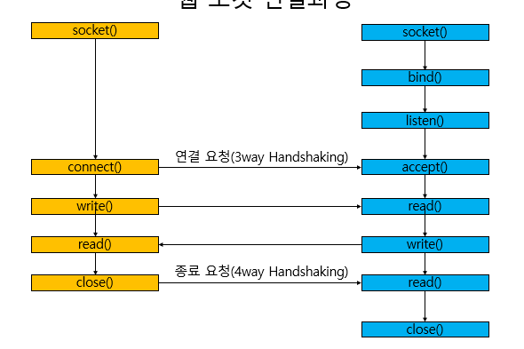

# 서버의 개요

## 목차
- 클라이언트 vs 서버
- 웹 서버의 구조
- 웹 소켓의 포트번호
- 소켓 - 파일 디스크립터
- 서버의 수신 동작
  - 라우터 -> LAN어댑터
- 웹서버의 리퀘스트 메시지 수신
  - CGI 프로그램을 통한 리퀘스트 메시지 수신
- 웹서버 엑세스 제어
- 웹서버 response 메시지 동작
- 참고 문헌

## 클라이언트 vs 서버
- 네트워크에 관한 부분(LAN 어댑터, 프로토콜 스택, Socket 라이브러리)의 기능이 동일하다.
- 서버는 여러개의 클라이언트와 대화하는 구조이다.

## 웹 서버의 구조
웹 서버는 두 부분으로 나눌 수 있다.
1. 서버 프로그램에서 클라이언트의 접속을 기다리는 부분
2. 클라이언트와 대화를 나누는 부분

`1번`은 서버 프로그램이 실행되어 초기화 작업을 마친 상태이다.(클라를 기다리는) 
`2번`은 클라가 접속을 할 때 실행되어 소켓을 건네주고 대화

`2번`은 각 클라이언트와 1대1로 대화를 한다. 즉 대화가 섞이지 x 
- 이유는 서버 OS가 **멀티태크스** 또는 **멀티스레드**라는 기능에 의해 다수의 프로그램을 동시에 작동할 수 있기 때문이다.

> 클라이언트의 데이터 송, 수신 동작
> 1. 소켓을 만듬.(소켓 작성 단계)
> 2. 서버측의 소켓과 파이프로 연결.(접속 단계)
> 3. 데이터를 송, 수신.(송, 수신 단계)
> 4. 파이프를 분리하고 소켓을 말소.(연결 끊기 단계)

> 서버의 데이터 송, 수신 동작
> 1. 소켓을 만듬.(소켓 작성 단계)
> 2. 소켓을 접속 대기 상태로 만듬(접속 대기 상태)
> 3. 접속을 접수(접속 접수 단계)
> 4. 데이터 송, 수신(송, 수신 단계)
> 5. 파이프 분리 후 소켓 말소(연결 끊기 단계)

위와 같이 동작하는데

웹서버가 accept를 통해 클라이언트로부터 소켓을 접수하면

3way-handshaking을 통해 연결을 하고 접속 대기 소켓을 복사하여 독립된 새로운 소켓을 생성한다.

독립된 새로운 소켓은 독립적으로 실행되고

기존의 접속 대기 상태의 소켓은 다시 다른 클라이언트의 connecting을 기다린다.

## 웹 소켓의 포트번호
이전에 학습할 때 이 부분에서 많이 헷갈렸다.

웹에서 포트번호는 80번으로 알고 있는데 그럼 모든 웹은 80번 포트를 사용한다.

그럼 복사된 소켓도 포트번호가 80이기 때문에 소켓을 식별할 수 있는 방법은 무엇인가??

**해결 방법**
- 정보를 조합해서 소켓을 식별한다.
  - 클라이언트의 IP주소
  - 클라이언트의 포트 번호
  - 서버의 IP주소
  - 서버의 포트 번호(80번 고정)

1. 웹서버의 포트 번호는 80번으로 고정이다.
2. 하지만 클라이언트의 포트번호를 아무번호나 할당가능하다.
3. 하지만 다른 클라이언트끼리는 포트 번호가 중복이 날 수 있다.
4. 하지만 각 클라이언트의 IP주소는 다르기 때문에 식별 가능

## 소켓 - 파일 디스크립터
사실 소켓을 식별할 경우 포트번호를 사용하는 것이 아니라 파일 디스크립터를 사용한다. 

파일 디스크립터란 **시스템(운영체제)이 특정 파일에 할당해준 정수값을 의미한다.**

이는 우리가 흔히 알고 있는 파일뿐 아니라 소켓과 같은 자원도 가지고 있는값이다. 

예를 들어 소켓을 생성하는 socket()함수, 연결을 수락하는 accept() 함수 모두 파일 디스크립터 값을 반환한다.

우리가 자주 사용하는 표준 입출력은 이미 파일 디스크립터 값이 할당되어 있으며, 아래와 같다

> stdin(표준입력) : 0 
> stdout(표준출력) : 1 
> stderr(표준에러) : 2 

이야기가 조금 다른곳으로 흘러갔지만 이와 같이 소켓에서는 socket() 함수와 accept() 함수를 통해 파일 디스크립터 값이 할당받아 식별한다.

**소켓을 식별하기 위해 디스크립터를 사용하는 이유** 
- 접속을 대기할 때는 아직 클라이언트 소켓이 지정되지 않았으므로 정보가 x
- 디스크립터라는 한 개의 정보로 식별하는 것이 더 간단하기 때문에

## 서버의 수신 동작
### 라우터 -> LAN어댑터
1. 라우터 또는 스위치 허브에서 LAN어댑터로 전기 신호가 도착한다.
2. 전기 신호 -> 디지털 신호로 바뀐다
   - FCS를 통해 패킷 올 검사
   - MAC헤더의 수신처가 본인인지 확인(ARP와 같은 상황 때문에)
   - 그리고 LAN어댑터 내부의 버퍼 메모리에 저장
3. 버퍼 메모리에 저장되면 CPU에게 패킷이 도착했다는 인터럽트 전송
4. CPU는 LAN드라이버를 동작해 패킷을 추출하여 프로토콜을 판별하고 적합한 프로토콜 처리 소프트웨어 호출(LAN드라이버 -> 프로토콜 스택)

## 웹서버의 리퀘스트 메시지 수신
웹 소켓 동작과정에서 클라이언트가 `write()`하고 웹 서버가 `read()`를 하는 동작에서 웹서버가 리퀘스트 메시지를 수신한 것이다.

`read()`안에는 HTTP 리퀘스트 메시지가 있다. 
리퀘스트 메시지에는 메소드와 URI로 구성되어 있는데 이 내용을 해석하여 response 메시지로 응답한다.

**웹 서버에서 HTTP 리퀘스트 메시지의 데이터는 어디에 있는가?**

정답 : 디스크를 읽고 해석한다.

하지만 URI에 기록된 경로명은 웹서버에서 공개하는 가상의 디렉터리 구조를 사용한다. 
=> 이유는 진짜 디렉토리 파일이 노출되는 것을 막기 위해서

가상의 디렉터리를 읽고 실제 디스크 디렉토리 경로명으로 변환하여 데이터를 읽고 반환한다. 

**만약 브라우저에서 보낸 URI에 파일명이 생략 되어있다면??**

정답 : 파일명이 생략되어 있다면 `index.html`로 표시 된다. 
ex) `http://www.cyber.co.kr/tone/` 이라면 
`http://www.cyber.co.kr/tone/index.html` 이라는 의미이다. 

### CGI 프로그램을 통한 리퀘스트 메시지 수신
이전 상황 : HTML 문서나 화상 데이터의 경우 였다.

**만약 `.cgi`, `.php`와 같은 프로그램 파일 이라면?** 
=> `http://www.cyber.co.kr/tone/beom.php`인 경우 

정답 : 해당 프로그램을 작동시키도록 OS에 의뢰한다.

데이터를 처리 후 출력 데이터를 웹 서버로 돌려준다. 해당 데이터는 보통 HTML 태그를 내장한 문서이므로 이것을 응답 메시지로 클라이언트에게 반환한다.

## 웹서버 엑세스 제어
웹 서버에서는 데이터를 특정 조건에 따라 엑세스르 제어 가능하다.

**엑세스 조건** 
- 클라이언트 주소
  - accept로 접근했을 때 클라이언트 IP주소를 검증한다.
- 클라이언트 도메인명
  - DNS서버로 요청을 보내 도메인명 조사
  - 해당 도메인명의 IP가 클라이언트의 송신처 IP와 검증
- 사용자명과 패스워드
  - 사용자명과 패스워드가 이미 서버에 내장되어 있는 데이터와 같은지 검증

## 웹서버 response 메시지 동작
1. 웹서버가 소켓 라이브러리의 `write()` 함수를 호출하여 response 메시지를 프로토콜 스택으로 전달
2. 디스크립터를 사용하여 상태 클라이언트의 소켓 지정
3. 상태 클라이언트로 전송

## 참고 문헌
[내용 이해 관련 참고문헌](https://yjksw.github.io/one-percent-network-9/)

[웹 소켓 연결과정 참고문헌](https://velog.io/@emplam27/CS-%EA%B7%B8%EB%A6%BC%EC%9C%BC%EB%A1%9C-%EC%95%8C%EC%95%84%EB%B3%B4%EB%8A%94-%EB%84%A4%ED%8A%B8%EC%9B%8C%ED%81%AC-%EC%86%8C%EC%BC%93-%ED%94%84%EB%A1%9C%EA%B7%B8%EB%9E%98%EB%B0%8D%EA%B3%BC-Handshaking)

[파일 디스크립터관련 참고문헌](https://velog.io/@minji/%EC%86%8C%EC%BC%93-%ED%94%84%EB%A1%9C%EA%B7%B8%EB%9E%98%EB%B0%8D-%ED%8C%8C%EC%9D%BC-%EB%94%94%EC%8A%A4%ED%81%AC%EB%A6%BD%ED%84%B0)

